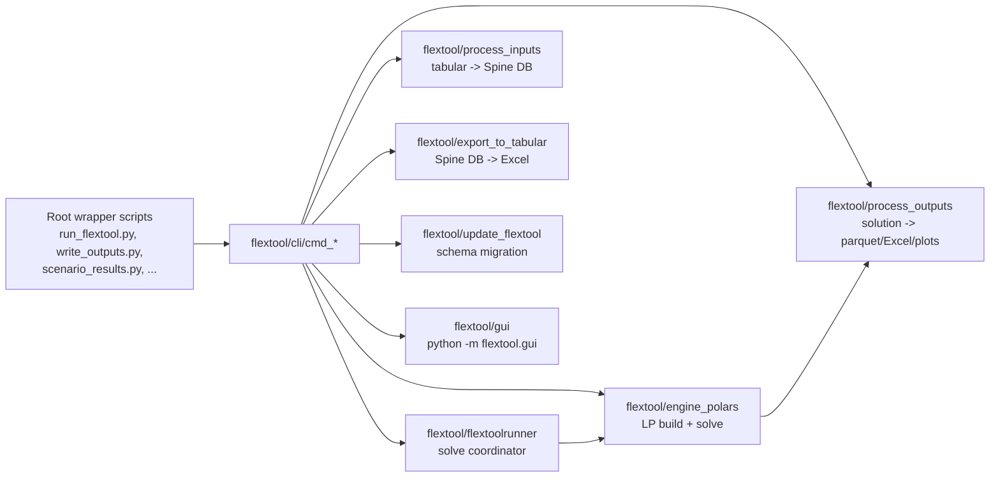
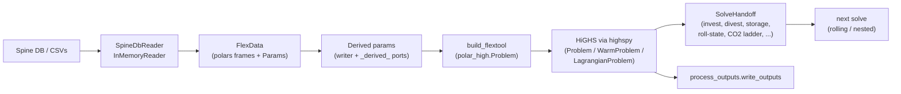
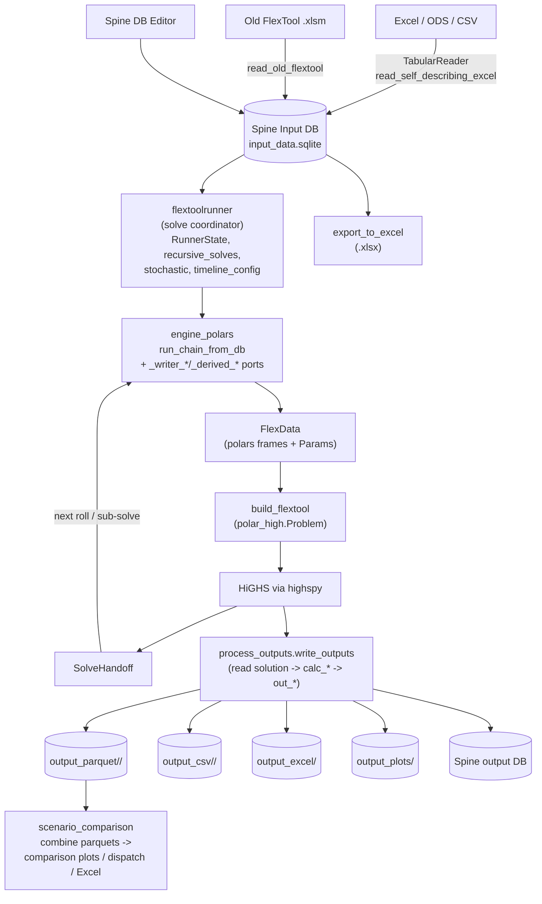

# FlexTool Architecture

## Project Purpose

FlexTool is an energy and power systems optimization model (IRENA FlexTool). It reads input data from a Spine database, builds a linear programming (LP) model in memory using polars, solves it with HiGHS via `highspy`, and writes results to parquet, Excel, CSV, and plots. Input databases can be populated from tabular input files (Excel, ODS, CSV) or imported from old FlexTool v2 formats. A Tkinter GUI and Spine Toolbox integration provide user interfaces.

!!! note "Engine swap (3.33+)"
    The old `flextoolrunner → flextool.mod → glpsol` pipeline has been retired.
    LP build, solve, and post-solve handoff now live in `flextool/engine_polars/`.
    `flextool/flextoolrunner/` is now a thin solve-coordinator for rolling /
    nested / stochastic structures on top of that engine.

## CLI and module map



Each `cmd_*.py` is a thin argparse wrapper; the work happens in the linked
packages below.

## Repository Layout

```
flextool/                          Python package (core library)
├── __init__.py                    Re-exports: FlexToolRunner, write_outputs, migrate_database,
│                                    initialize_database, update_flextool
├── cli/                           CLI entry points (argparse + delegation)
├── engine_polars/                 Optimization engine: FlexData → LP (polars) → HiGHS
├── flextoolrunner/                Solve coordinator (rolling / nested / stochastic)
├── process_inputs/                Read tabular/Excel/old-format data → Spine DB
├── process_outputs/               Read solver outputs → post-process → write results
├── plot_outputs/                  Generate line/bar/stacked-area plots
├── scenario_comparison/           Multi-scenario analysis and dispatch plots
├── export_to_tabular/             Export Spine DB → Excel (.xlsx)
├── update_flextool/               DB schema migration, GitHub update, DB init
├── gui/                           Tkinter GUI application
├── helpers/                       Debugging/analysis utilities
└── import_excel_input.json        Excel import specification

Root scripts (backward compat with Spine Toolbox):
├── run_flextool.py                → flextool.cli.cmd_run_flextool:main
├── write_outputs.py               → flextool.cli.cmd_write_outputs:main
├── scenario_results.py            → flextool.cli.cmd_scenario_results:main
├── migrate_database.py            → flextool.cli.cmd_migrate_database:main
├── read_tabular_input.py          → flextool.cli.cmd_read_tabular_input:main
├── execute_flextool_workflow.py   → flextool.cli.cmd_execute_flextool_workflow:main
└── update_flextool.py             → flextool.cli.cmd_update_flextool:main

bin/                               Solver binaries (HiGHS standalone; the
├── highs / highs.exe                main solve path uses highspy in-process)
├── highs.opt                      HiGHS solver options
└── *.dll                          Windows runtime dependencies

templates/                         Example databases and configuration
├── examples.sqlite                Pre-populated example database
├── time_settings_only.sqlite      Minimal template with time settings
├── example_input_template.xlsx    Excel input template
├── default_plots.yaml             Default plot configuration
└── default_comparison_plots.yaml  Default comparison plot configuration

schemas/                           Database schema templates (JSON)
├── spinedb_schema.json            Master template for new input DBs
├── pre_v26/flextool_template_*.json  Pre-v26 schema migration step templates
├── output_settings_template.json  Output settings DB template
├── output_info_template.json      Output info DB template
└── comparison_settings_template.json  Comparison settings template

plot_settings/                     Plot configuration presets
├── single_dataset/default_result_plots.json
└── multiple_datasets/default_result_plots.json

test/                              Integration tests (scenario execution)
├── conftest.py                    Pytest fixtures
├── db_utils.py                    Test database utilities
├── test_scenarios.py              Scenario execution tests
├── scenarios.yaml                 Test scenario definitions
├── expected/                      Expected output CSVs per scenario
└── fixtures/tests.json            Test fixture data

tests/                             Unit and feature tests
├── test_bar_layout.py             Plot bar layout tests
├── test_comparison_excel.py       Excel comparison tests
├── test_export_to_tabular.py      Excel export tests
├── test_gui_startup.py            GUI startup tests
├── test_plot_results.py           Plot generation tests
├── test_self_describing_reader.py Self-describing Excel reader tests
├── test_xlsx_workflow.py          Excel input workflow tests
└── run_scenarios_tests.py         Scenario runner

execution_tests/                   Spine Toolbox execution tests
├── test_execution.py              Toolbox workflow execution tests
└── tool.py                        Test tool wrapper

docs/                              MkDocs documentation site
├── index.md                       Introduction
├── tutorial.md                    Getting started tutorial
├── reference.md                   Model parameters reference
├── results.md                     Model outputs documentation
├── how_to.md                      How-to guides
├── flextool_gui_interface.md      GUI documentation
├── spine_toolbox.md               Spine Toolbox interface docs
├── spine_database.md              Spine data editor docs
├── install_toolbox.md             Installation guide
├── interface_overview.md          Interface overview
├── browser_interface.md           Web interface docs (deprecated)
├── install_web_interface.md       Web interface install (deprecated)
└── *.png, *.pdf                   Screenshots and theory slides

.spinetoolbox/                     Spine Toolbox project integration
├── project.json                   Project configuration
└── specifications/                Tool/Importer/Exporter/Transformer specs

.github/workflows/                 CI/CD
└── toolbox-flextool-bundle.yml    Toolbox bundle workflow

Other root files:
├── pyproject.toml                 Build config, dependencies, entry points
├── mkdocs.yml                     Documentation site config
├── CITATION.cff                   Citation metadata
├── LICENSE.txt                    License (Apache 2.0)
├── README.md                      Project readme
└── RELEASE.md                     Release notes
```

## Module Details

### flextool/cli/ — CLI Entry Points

Each `cmd_*.py` file defines a `main()` function using argparse.

| File | Purpose |
|------|---------|
| `cmd_run_flextool.py` | Run FlexToolRunner + write_outputs for a scenario |
| `cmd_write_outputs.py` | Read solver CSV outputs → post-process → write parquet/Excel/plots |
| `cmd_scenario_results.py` | Load multiple scenario parquets → comparison plots/Excel |
| `cmd_read_tabular_input.py` | Parse specification + Excel/CSV → write Spine DB |
| `cmd_read_self_describing_tabular_input.py` | Read self-describing Excel with embedded metadata → Spine DB |
| `cmd_read_old_flextool.py` | Import old FlexTool v2 .xlsm files → Spine DB |
| `cmd_export_to_tabular.py` | Export Spine DB → Excel (.xlsx) |
| `cmd_execute_flextool_workflow.py` | Three-phase workflow: input → solve → output (subprocess) |
| `cmd_migrate_database.py` | Upgrade DB schema to latest version |
| `cmd_update_flextool.py` | Git pull + project migration |

### flextool/engine_polars/ — Optimization Engine

The dominant package. An in-memory, polars-based LP builder that consumes a
single `FlexData` dataclass and emits a `polar_high.Problem` (a thin eDSL on
top of `highspy`), solves it, and hands the solution off to the next solve
or to `process_outputs`. Replaces the retired `flextool.mod → glpsol → MPS
→ HiGHS → CSV` pipeline that lived in `flextoolrunner/` through 3.32.



#### Public API

Exported from `flextool.engine_polars` (see `__init__.py`):

| Symbol | Purpose |
|---|---|
| `FlexData` | The single input dataclass — polars frames + `polar_high.Param`s. Naming: sets unprefixed, parameters `p_*`. See `_param_shapes.py` for the full inventory. |
| `load_flextool(source)` | Build `FlexData` from an on-disk `input/` + `solve_data/` workdir, or (in the live cascade) from a workdir whose cascade-input Provider serves every read in-memory. |
| `load_flextool_source_only(...)` | Fast-load shortcut that skips most preprocessing for single-solve scenarios; raises `FastLoadError` if a feature requires the full path. |
| `build_flextool(m, d, ...)` | Add all variables, constraints, and the objective to a `Problem` (or `WarmProblem`) from `FlexData`. Feature-conditional — see table below. |
| `run_chain(steps, ...)` / `run_chain_from_db(...)` | Run a sequence of `ChainStep`s, threading `SolveHandoff` between them. |
| `run_orchestration(state, work_folder, ...)` | The native coordinator: reads `RunnerState` (built by `flextoolrunner`), drives the cascade of solves, returns one `OrchestrationStep` per solve. |
| `run_single_solve_from_db(...)` | Surgical fast path for a single solve. |
| `SolveHandoff` | Per-solve output carrier (invest, divest, storage, roll-state, CO2 ladder, commodity ladder, cumulative sim-hours, history sets). |
| `capture_post_solve(state, name)` | Extracts a `SolveHandoff` from the just-solved problem. |
| `write_fix_storage_files_from_handoff(...)` | Materialises the three `fix_storage_*` CSVs from a handoff. |
| `SpineDbReader` / `InMemoryReader` / `CsvSource` / `FlexInputSource` | Pluggable readers — Spine DB, in-memory test fixture, or CSV workdir. |

#### Feature blocks in `build_flextool`

The LP is built feature-by-feature; each block runs only when its switch
field on `FlexData` is populated. The required-field lists are declared as
module-level tuples in `model.py`:

| Constant | Switch field | Adds |
|---|---|---|
| `ALWAYS` | (floor) | `vq_state_up/down`, `nodeBalance_eq`, the slack-only objective. |
| `PROCESSES` | `process_source_sink` | `v_flow`, `maxToSink`, source/sink contributions to `nodeBalance_eq`, commodity buy. |
| `INDIRECT` | `process_indirect` | `conversion_indirect_eq` for multi-flow processes (CHP). |
| `CO2_PRICE` | `flow_from_co2_priced` | CO2 emission term in the objective. |
| `CO2_CAP` | `flow_from_co2_capped` / `group_d_co2_capped` | Per-period CO2 cap constraint. |
| `USER_CSTR` | `flow_constraint_idx` | User-defined `process_constraint_{eq,le,ge}` rows. |
| `PROFILES` | `process_profile_{upper,lower,fixed}` | Profile bounds on `v_flow`. |
| `STORAGE` | `nodeState` | `v_state`, storage transition, fix-start / fix-storage, end-state binding. |
| `ONLINE` | `process_online` | `v_online`, min-load, uptime / downtime windows. |
| `RAMP` | any `process_source_sink_ramp_limit_*` | Ramp-up / ramp-down constraints per arc side. |
| `INVEST` / `DIVEST` | `pd_invest_set` / `pd_divest_set` (or `nd_*`) | `v_invest` / `v_divest`, cumulative caps, lifetime cost. |
| `STARTUP_COST_*` | `pdt_online_{linear,integer}` | Startup-cost objective term. |
| `MINLOAD_EFF` | `process_min_load_eff` | min_load_efficiency reformulation. |

The check is fail-fast: if a switch is set but a required field is missing,
`build_flextool` raises `ValueError` rather than silently degrading.

#### Solve modes

The same `build_flextool` body backs three solver wrappers from `polar_high`:

- **Monolithic** — `polar_high.Problem`. One LP per call. Used for plain
  single-shot solves.
- **Warm-start cascade** — `polar_high.WarmProblem`. Rolling-horizon and
  nested solves rebuild the same LP shell once and then mutate marked Params
  (`_apply_warm_updates` in `_solve_handoff.py`) between rolls. Avoids the
  per-roll polars-to-HiGHS round-trip.
- **Lagrangian** — `polar_high.LagrangianProblem` driven by
  `engine_polars._lagrangian.solve_lagrangian`. Slices `FlexData` by region
  via `_region_filter`, builds one sub-problem per region, and couples
  half-flow pairs with subgradient-updated multipliers. See
  [decomposition.md](decomposition.md).

#### Writer ports

Roughly 150 sets and calculated parameters that used to be `param := ...`
declarations in `flextool.mod` are now produced in Python by the
`_writer_*.py` and `_derived_*.py` modules (Writer Phases 1-4 in
`RELEASE.md`). Examples: `_derived_npv.py` for the annualized investment /
divestment carriers, `_writer_pdt_params.py` for the `pdt*` per-step
parameter family, `_writer_arc_unions.py` for the arc set algebra,
`_writer_co2_accumulators.py` for the cumulative-CO2 ladder. These run
during `load_flextool` and populate the optional fields of `FlexData`.

#### Auto-scaling

`scaling.py` walks the loaded cost / flow / unitsize / penalty Param
families and recommends row scaling + objective scaling; `scaling_report.py`
writes the per-solve human-readable report. See [scaling.md](scaling.md).

#### File map (most important)

```
__init__.py                       Public re-exports (table above)
input.py                          FlexData dataclass + loader from CSV workdir
model.py                          build_flextool — LP build, feature blocks
chain.py                          run_chain + ChainStep dataclass
_orchestration.py                 run_orchestration / run_chain_from_db
                                  / run_single_solve_from_db, native cascade
_solve_handoff.py                 SolveHandoff carrier + capture_post_solve
_fast_load.py                     load_flextool_source_only + FastLoadError
_lagrangian.py                    solve_lagrangian + Coupling/Result
_warm.py                          WarmProblem update routine
_param_shapes.py                  Canonical shape per FlexData field
_spinedb_reader.py                Spine DB → FlexData (slow path)
_inmemory_reader.py               In-memory test fixture loader
_input_source.py                  FlexInputSource / CsvSource / InputSource
_recursive_solve.py               Rolling / nested solve tree builder
_stochastic.py                    Stochastic branch handler
_timeline.py                      Timeline / timeset construction
_block_layout.py                  Multi-resolution period-block layout
scaling.py / scaling_report.py    Auto-scaling pipeline
_derived_*.py                     Calculated-parameter ports (existing,
                                  NPV, branch, walks, profile, block, etc.)
_writer_*.py                      Set/parameter writer ports (period_params,
                                  arc_unions, calc_params, co2_accumulators,
                                  pdt_params, reserve, leaf_sets, mid_sets,
                                  inflow_scaling, lp_scaling, ...)
_native_input_writer.py           Optional CSV dump of FlexData (debugging)
_native_run_model.py              Self-contained run helper used by tests
_dump_csvs.py                     Diagnostic dumps of intermediate frames
_output_writer.py                 Solution → output_raw parquet bridge
```

### flextool/flextoolrunner/ — Solve Coordinator

Pre-3.33 this was the optimization engine itself. Post-3.33 it is a thin
coordinator: it parses the Spine DB into `RunnerState` / `SolveConfig` /
`TimelineConfig`, expands the solve list for rolling / nested / stochastic
structures, then hands each step to `engine_polars.run_orchestration` (or
`run_chain_from_db`) for the actual LP build, solve, and handoff. The LP
model file `flextool.mod` and the `glpsol` invocation are gone.

```
FlexToolRunner (flextoolrunner.py)    Main class: .write_input(), .run_model()
├── runner_state.py                   RunnerState, PathConfig dataclasses
├── db_reader.py                      Read spinedb_api: check_version, entities_to_dict, params_to_dict
├── input_writer.py                   Write input/ CSV files from DB data
├── orchestration.py                  Solve-list dispatch (delegates to engine_polars)
├── recursive_solves.py               Rolling/nested/recursive solve structure builder
├── stochastic.py                     Stochastic branch handling
├── solve_config.py                   SolveConfig: all solve-level parameters from DB
├── timeline_config.py                TimelineConfig: timeline definitions and timeset mappings
├── solve_writers.py                  Write solve_data/ CSV files for each solve step
└── solver_runner.py                  Solver invocation surface (now mostly a thin shim)
```

### flextool/process_inputs/ — Input Data Handling

Reads tabular data and writes to Spine DB format.

| File | Public API | Purpose |
|------|-----------|---------|
| `read_tabular_with_specification.py` | `TabularReader` | Reads Excel/ODS/CSV using JSON specification |
| `read_self_describing_excel.py` | — | Reads self-describing Excel with embedded metadata |
| `read_old_flextool.py` | — | Parses old FlexTool v2 .xlsm files → OldFlexToolData |
| `write_to_input_db.py` | `write_to_flextool_input_db` | Writes parsed tabular data to Spine DB |
| `write_self_describing_to_db.py` | — | Writes self-describing Excel data to DB |
| `write_old_flextool_to_db.py` | — | Writes old FlexTool data to DB |

### flextool/process_outputs/ — Output Processing

Three-layer architecture: I/O → calculations → output formatting.

```
I/O Layer:
  read_variables.py              Reads v_*.csv → SimpleNamespace v
  read_parameters.py             Reads p_*.csv → SimpleNamespace par
  read_sets.py                   Reads s_*.csv → SimpleNamespace s
  read_flextool_outputs.py       Backward-compat shim
  read_highs_solution.py         Direct HiGHS → parquet extractor
                                 (bypass for variable/dual CSV writes —
                                 see "Solver outputs" section below)

Post-processing Calculations:
  drop_levels.py                 Strips 'solve' level from time-indexed objects
  calc_capacity_flows.py         Capacity, online status, flow_dt, ramps
  calc_connections.py            Connection flows and losses
  calc_storage_vre.py            Storage state changes and VRE potential
  calc_slacks.py                 Reserve, slack, and inertia quantities
  calc_costs.py                  All cost aggregates
  calc_group_flows.py            Group-level flow aggregations
  process_results.py             Coordinator: calls all calc_* in order

Output Functions:
  out_capacity.py                Unit/connection/node capacity tables
  out_flows.py                   Unit flow, capacity-factor, VRE, ramp outputs
  out_group.py                   NodeGroup flow, inflow, VRE-share, indicator outputs
  out_node.py                    Node summary and additional-results outputs
  out_costs.py                   Cost summary, CO2, and generic outputs
  out_ancillary.py               Connection, reserve, inertia, slack, dual outputs
  write_outputs.py               ALL_OUTPUTS list + orchestrator
  result_writer.py               Backward-compat shim
  to_spine_db.py                 Writes result DataFrames to Spine DB
```

### flextool/plot_outputs/ — Visualization

Generates time-series line plots, bar charts, and stacked-area diagrams.

```
orchestrator.py                  plot_dict_of_dataframes() entry point
config.py                        PlotConfig dataclass, DIMENSION_RULES, PLOT_FIELD_NAMES
plot_lines.py                    Line/stacked-area plots
plot_bars.py                     Bar chart orchestration
plot_bars_detail.py              Bar rendering (grouped, stacked, simple)
axis_helpers.py                  Axis formatting, smart xticks
legend_helpers.py                Legend sizing, label formatting
subplot_helpers.py               Grid layout, data slicing
format_helpers.py                Value formatters, filename generation
perf.py                          Timing utilities
plot_functions.py                Backward-compat shim
```

### flextool/scenario_comparison/ — Multi-Scenario Analysis

Loads parquet files from multiple scenario folders, combines, and generates comparison plots.

```
data_models.py                   TimeSeriesResults, DispatchMappings dataclasses
db_reader.py                     Load scenario parquet files → TimeSeriesResults
dispatch_mappings.py             Load dispatch mapping parquets → DispatchMappings
config_io.py                     Parse/write dispatch config.yaml
config_builder.py                Build/update dispatch config from data
dispatch_data.py                 Prepare per-scenario dispatch DataFrames
dispatch_plots.py                Render dispatch stacked area plots
constants.py                     Colors and special column name lists
orchestrator.py                  Top-level run() function
scenario_comparison.py           Backward-compat shim
```

### flextool/export_to_tabular/ — Excel Export

Exports a Spine DB to Excel (.xlsx) in self-describing v2 or original v1 format.

| File | Purpose |
|------|---------|
| `export_to_excel.py` | Main orchestrator; v1 vs v2 format selection |
| `db_reader.py` | `DatabaseContents` dataclass and `read_database()` |
| `sheet_config.py` | `SheetSpec`, `build_sheet_specs()` — sheet specifications |
| `excel_writer.py` | Sheet writing functions (periodic, timeseries, etc.) |
| `formatting.py` | Cell formatting and data type conversions |
| `export_settings.yaml` | Export configuration |

### flextool/gui/ — Tkinter GUI

Desktop application for project management, scenario execution, and output visualization.

```
__main__.py                      Entry point → MainWindow
main_window.py                   MainWindow (tkinter.Tk root)
project_utils.py                 Create/list/rename projects
settings_io.py                   Load/save GlobalSettings, ProjectSettings
data_models.py                   GlobalSettings, ProjectSettings, ScenarioInfo dataclasses
input_sources.py                 InputSourceManager (file selection)
scenario_lists.py                AvailableScenarioManager, ExecutedScenarioManager
execution_manager.py             ExecutionManager (threaded subprocess execution)
execution_window.py              ExecutionWindow (progress tracking)
output_actions.py                OutputActionManager (plot/export actions)
output_log_window.py             OutputLogWindow (log display)
db_editor_integration.py         DbEditorManager (Spine DB editor)
db_version_check.py              Database version validation
error_handling.py                safe_callback decorator
platform_utils.py                Platform-specific file/app opening
config_parser.py                 Configuration parsing
dialogs/
├── add_dialog.py                Add project/scenario dialogs
├── plot_dialog.py               Plot configuration dialog
├── project_dialog.py            Project settings dialog
└── file_picker.py               File selection dialog
```

### flextool/update_flextool/ — Updates and Migration

| File | Public API | Purpose |
|------|-----------|---------|
| `self_update.py` | `update_flextool` | Git pull + project migration |
| `db_migration.py` | `migrate_database` | Upgrade DB schema using version/ templates |
| `initialize_database.py` | `initialize_database` | Create new DB from JSON template |

### flextool/helpers/ — Utilities

| File | Public API | Purpose |
|------|-----------|---------|
| `compare_files.py` | `compare_files` | CSV file comparison |
| `find_coefficients.py` | `find_largest_numbers` | LP coefficient analysis |
| `mps_matrix_to_csv.py` | `parse_mps_to_matrices` | MPS matrix parsing |
| `transform_toolbox_schema.py` | `convert_schema` | Spine Toolbox schema conversion |

## Installed Entry Points

From `pyproject.toml`:

| Command | Entry point |
|---------|------------|
| `flextool-gui` | `flextool.gui.__main__:main` |
| `flextool-read-old` | `flextool.cli.cmd_read_old_flextool:main` |

## Public APIs

```python
from flextool import FlexToolRunner, write_outputs, migrate_database, initialize_database, update_flextool
from flextool.process_outputs import write_outputs, read_variables, read_parameters, read_sets, post_process_results
from flextool.scenario_comparison import get_scenario_results
from flextool.plot_outputs import plot_dict_of_dataframes
from flextool.process_inputs import TabularReader, write_to_flextool_input_db
from flextool.export_to_tabular import export_to_excel
from flextool.update_flextool import migrate_database, initialize_database, update_flextool
from flextool.helpers import compare_files, find_largest_numbers, parse_mps_to_matrices, convert_schema
```

## Data Flow



## Solver outputs: folder layout

A scenario run lays files out under the work folder like this:

| Folder | Cadence | Producer | Contents |
|---|---|---|---|
| `input/` | once per run | `flextoolrunner.input_writer` | Entity / set / parameter CSVs that do not change across sub-solves. |
| `solve_data/<solve>/` | per sub-solve | `engine_polars._orchestration` + handoff writers | Per-solve preprocessing inputs, the `SolveHandoff` carriers (`fix_storage_*`, `p_entity_period_existing_capacity`, `p_entity_divested`, `p_roll_continue_state`, ladder CSVs), and `scaling_analysis.json` / `scaling_report.txt`. |
| `output_parquet/<scenario>/` | end of run | `process_outputs.write_outputs` | Canonical results — one parquet per output type. |
| `output_csv/<scenario>/` | end of run, optional | `process_outputs.write_outputs` | CSV mirror of the parquet outputs. |
| `output_excel/` | end of run, optional | `process_outputs.write_outputs` | Summary workbook. |
| `output_plots/` | end of run, optional | `plot_outputs` | PNG / SVG plots driven by `default_plots.yaml`. |

!!! note "`output_raw/` is retired"
    The transitional `output_raw/` folder that held the GLPSOL phase-3 CSVs
    no longer exists. Solver outputs are extracted directly from the live
    `highspy.Highs` instance by the writer ports in `engine_polars/` and
    `process_outputs/`, then written straight to `output_parquet/`.

### Solve-to-solve handoff

When a solve is part of a rolling-horizon, nested, or sub-solve chain, the
just-solved problem produces a `SolveHandoff` (in
`engine_polars/_solve_handoff.py`) that seeds the next solve's
preprocessing. The carriers are kept in memory between solves; mirrored
CSVs in `solve_data/<solve>/` are written by
`write_fix_storage_files_from_handoff` and the writer ports for downstream
tooling and debugging.

| Carrier (`SolveHandoff` field) | Mirror file (under `solve_data/<solve>/`) | Meaning |
|---|---|---|
| `realized_invest` | `p_entity_period_existing_capacity.csv` (period column) | New capacity built this solve, in absolute units. |
| `realized_existing` | `p_entity_period_existing_capacity.csv` (existing column) | Cumulative existing capacity history per `(entity, period)`. |
| `divest_cumulative` | `p_entity_divested.csv` | Cumulative divest per entity carried forward. |
| `roll_end_state` | `p_roll_continue_state.csv` | `v_state` at the end of the realized window, pinning the next roll's first timestep. |
| `fix_storage` | `fix_storage_{quantity,price,usage}.csv` | Parent-imposed storage quota at the boundary (any subset of the three metrics). |
| `fix_storage_timesteps` | `fix_storage_timesteps.csv` | Index set of `(period, step)` where `fix_storage` applies. |
| `cumulative_co2` | `co2_cum_realized_tonnes.csv` | Running CO2 totals across rolls (cumulative cap). |
| `cumulative_commodity` | `commodity_ladder_cumulative.csv` | Per-tier commodity consumption (ladder pricing). |
| `cum_sim_hours` | `ladder_cum_sim_hours.csv` | Running simulated-hour total per period. |
| `ed_history_realized_first` / `edd_history` | `ed_history_realized_first.csv` / `edd_history.csv` | Cross-solve invest-period history feeding `p_entity_previously_invested_capacity`. |

`capture_post_solve(state, solve_name)` populates a `SolveHandoff` from the
just-solved problem; the next iteration of `run_chain_from_db` /
`run_orchestration` reads it back through `_overlay_handoff` in
`input.py`.

### Solution extraction

Variables and duals are extracted directly from the live `highspy.Highs`
instance. `process_outputs.read_highs_solution.VARIABLE_SPECS` declares
which variables, row duals, and column duals to harvest (`v_flow`,
`v_state`, `v_invest`, `v_divest`, `vq_*`, all the period / total /
cumulative invest-cap duals, the `co2_max_*` duals, the inflation-adjusted
`v_dual_node_balance`, etc.). The downstream `process_outputs` pipeline
reads these parquets, runs `calc_*`, and writes the user-facing outputs.

To add a new variable or dual to the parquet pipeline, append a
`VariableSpec` to `VARIABLE_SPECS` — no other changes required.

## Numerical scaling

FlexTool's LP/MIP can accumulate coefficients spanning many decades when
users combine entities of different physical scale (e.g., a 10 kW building
heat pump alongside a 10 GW continental grid).  Left unchecked this
causes HiGHS to miss symmetry, presolve aggressively on the wrong rows,
slow down, or raise false-infeasibility warnings.  The scaling pipeline
runs on every solve and is layered so each mechanism targets one source
of spread.

### Layers (bottom up)

1. **Unitsize column normalisation (user convention).**  Every variable
   `v_flow`, `v_state`, `v_reserve`, `v_invest`, etc. is written in
   units of `p_entity_unitsize` per entity, so the raw values stay
   near O(1).  Predates the scaling project — this is the single
   biggest contributor to well-conditioned inputs.
2. **Single-variable slack convention** (see [slack_convention.md](slack_convention.md)).
   Every `vq_*` is a single non-negative variable, relative to its
   row-scaler where one applies.  The user-supplied penalty coefficient
   is the only valve: high enough to keep the slack quiescent on
   well-posed inputs, low enough that the solver will absorb
   pathological input rather than returning false infeasibility.  An
   earlier primary+escape two-tier design was reverted after profiling
   showed the second tier was redundant and its twin columns caused
   degeneracy.
3. **Row scaling (opt-in, `solve.use_row_scaling`).**  Node-balance
   and group-balance constraint rows get multiplied by
   `node_capacity_for_scaling` / `group_capacity_for_scaling` derived
   from the unitsizes of connected entities, rounded to powers of 10
   to preserve HiGHS symmetry detection.  Agent 5 added the flag and
   the formulas; the hardcoded `node_capacity_for_scaling := 1`
   stays active until the user opts in.
4. **Precision cleanup (always on, `--precision-digits`).**  Every
   numeric CSV cell is rounded to 10 significant figures before
   write.  Removes benign precision artifacts that would otherwise
   trip the near-duplicate detector and waste HiGHS scaling passes.
5. **ScaleAnalyzer (`flextool/engine_polars/scaling.py`).**  After
   the input CSVs are written but before the solver runs, a pure-
   stdlib analyzer walks the cost / flow / unitsize / penalty CSV
   families, computes per-family log10 spread stats, and recommends:
   * `use_row_scaling = "yes"` when unitsize spread > 3 decades;
   * `scale_the_objective = 10 ** -round(log10(rough_obj_estimate))`,
     clamped to `[1e-12, 1e0]`.
   Output: `solve_data/scaling_analysis.json`.
6. **`--auto-scale` application.**  When the `--auto-scale` CLI
   flag is set (or `FLEXTOOL_AUTO_SCALE=1`), the analyzer's row-
   scaling recommendation is applied if and only if the user has not
   explicitly set `solve.use_row_scaling`.  The objective scalar
   recommendation is not auto-applied (user-controlled only).
7. **Output un-scaling (`flextool/process_outputs/read_highs_solution.py`).**
   Every `VariableSpec` carries a `unscale_by` field; slack parquets,
   node-balance duals, and reserve-balance duals are multiplied back
   into the user's absolute units before parquet / CSV write.
   Downstream consumers see no change regardless of whether row
   scaling was active.
8. **Diagnostic report (`flextool/engine_polars/scaling_report.py`).**
   After the solve, `scaling_report.txt` is written next to the
   solve's `scaling_analysis.json`.  Nine sections (header, decisions,
   family ranges, bimodal detection, composite-scale mismatch,
   near-duplicate clusters, escape-tier slack activity, HiGHS matrix
   ranges, summary verdict).  A 3-10 line echo goes to stdout so the
   verdict is visible without opening the file.

### What the user sees

- On every solve: `scaling_analysis.json` + `scaling_report.txt` in
  `<work_folder>/solve_data/`.  A short stdout echo summarising the
  verdict (`well-scaled`, `acceptably`, or `poorly scaled`).
- On pathological inputs (composite-scale mismatch, bimodal cost
  family, escape-slack activity): the stdout echo expands to include
  the load-bearing diagnostic and its recommendation.
- Per-solve caching is keyed on the solve name — rolling-window
  solves reuse the cached ScaleTable with no CSV re-read.

### Where to look

- **User-facing guide**: [scaling.md](scaling.md).
- **Slack implementation reference**: [slack_convention.md](slack_convention.md).
- **Benchmark harness + validation**: `benchmarks/scaling/README.md`
  and `benchmarks/scaling/VALIDATION_REPORT.md`.
- **Design memo**:
  `~/.claude/projects/-home-jkiviluo-sources-flextool/memory/project_lp_scaling_2026-04.md`.

## Key Architectural Patterns

- **CLI → Core delegation**: All user-facing entry points (CLI scripts, GUI) delegate to core library modules.
- **State containers**: `RunnerState`, `SolveConfig`, `TimelineConfig`, `PathConfig` bundle related data for the solver pipeline.
- **Backward-compat shims**: `plot_functions.py`, `result_writer.py`, `read_flextool_outputs.py`, `scenario_comparison.py` re-export from refactored modules.
- **Dataclass-driven data flow**: `DatabaseContents`, `TimeSeriesResults`, `DispatchMappings`, `SheetSpec` define data shapes at module boundaries.
- **Multi-format I/O**: Inputs (CSV, Excel, ODS, old .xlsm), outputs (CSV, parquet, Excel, PNG/SVG), multiple solver backends.
- **GUI as subprocess orchestrator**: The Tkinter GUI spawns CLI commands as subprocesses rather than calling library functions directly.
