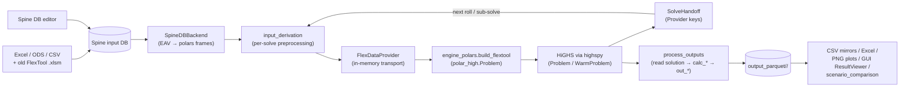
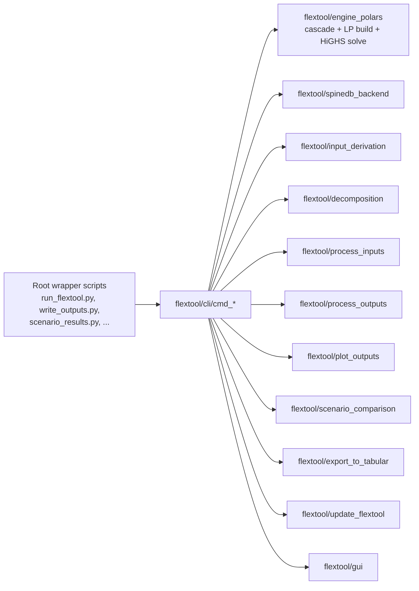

# FlexTool Architecture

## Project Purpose

IRENA FlexTool is an energy and power systems optimization model. It reads
input data from a Spine database, derives per-solve preprocessing tables in
polars, builds a linear/MIP program in memory via `polar_high`, solves it
with HiGHS in-process via `highspy`, and writes results to parquet (with
optional CSV, Excel, and plot renderings on top of the parquets).
Inputs can be authored directly in the Spine database, populated from
tabular input files (Excel / ODS / CSV), or imported from old FlexTool v2
`.xlsm` files. A Tkinter desktop application and a Spine Toolbox workflow
provide the two user-facing GUIs.

## Top-level data flow



Key invariants:

- **One backend.** `SpineDBBackend` is the only input backend. Everything
  upstream (Excel, ODS, CSV, old `.xlsm`) is converted to a Spine DB
  before the engine sees it.
- **Lazy polars, in-memory.** Frames stay as `LazyFrame` until they reach
  `polar_high`, which assembles the HiGHS matrix. Solver variables / duals
  are read back from the live `highspy.Highs` instance — no intermediate
  solver files.
- **Parquet is the canonical output.** CSV / Excel / PNG / GUI plots all
  read from the parquets the cascade just wrote. Scenario comparison loads
  multi-scenario parquet sets and emits combined renderings.

## CLI surface



Each `cmd_*.py` is a thin argparse wrapper; the work lives in the linked
packages. Every CLI command also has an installed entry point in
`pyproject.toml` (the `flextool-*` names).

| CLI module | Entry point | Purpose |
|---|---|---|
| `cmd_run_flextool` | `flextool-run` | Run the cascade (`run_chain_from_db` / `run_orchestration`) plus output processing for a scenario. |
| `cmd_write_outputs` | `flextool-write-outputs` | Replay `process_outputs.write_outputs` over an existing parquet folder. |
| `cmd_scenario_results` | `flextool-scenario-results` | Combine parquets from multiple scenario folders into comparison plots / Excel. |
| `cmd_read_tabular_input` | `flextool-read-tabular-input` | Parse Excel / ODS / CSV via JSON spec → Spine DB. |
| `cmd_read_self_describing_tabular_input` | `flextool-read-self-describing-tabular-input` | Self-describing Excel (embedded metadata) → Spine DB. |
| `cmd_read_old_flextool` | `flextool-read-old` | Import old FlexTool v2 `.xlsm` files → Spine DB. |
| `cmd_read_matpower` | `flextool-read-matpower` | Import a MATPOWER case → Spine DB. |
| `cmd_import_sensitivities` | `flextool-import-sensitivities` | Import FlexTool v2 sensitivity scenarios. |
| `cmd_export_to_tabular` | `flextool-export-to-tabular` | Export Spine DB → Excel (`.xlsx`). |
| `cmd_execute_flextool_workflow` | `flextool-execute-workflow` | Two-phase workflow runner: optional input-prep (auto-triggered by `--tabular-file-path` / `--csv-directory-path`) followed by the fused model-run + output-write phase. |
| `cmd_migrate_database` | `flextool-migrate-database` | Upgrade an input DB to the current schema version. |
| `cmd_update_flextool` | `flextool-update` | `git pull` + project-side migration in one step. |
| `cmd_gui` (via `flextool.gui.__main__`) | `flextool-gui` | Launch the Tkinter desktop application. |

## Repository layout

```
flextool/                          The installed Python package
├── __init__.py                    Public re-exports: write_outputs,
│                                    migrate_database, initialize_database,
│                                    update_flextool
├── cli/                           Argparse wrappers (cmd_*.py) +
│                                    cli/_timing.py (TimingRecorder)
├── spinedb_backend/               Spine DB → polars frames (the input API).
│                                    SpineDBBackend.find_entities /
│                                    parameter_values / default_values.
├── input_derivation/              Per-solve preprocessing computations
│                                    (the live successor to the retired
│                                    flextoolrunner/preprocessing).
├── engine_polars/                 Optimization engine + cascade coordinator:
│                                    FlexData, FlexDataProvider, derived
│                                    parameter / set emitters (_emit_*.py),
│                                    build_flextool, run_orchestration /
│                                    run_chain_from_db, SolveHandoff,
│                                    auto-scaling.
├── decomposition/                 Region decomposition + region filter
│                                    (Benders sub-problems).
├── common_utils/                  Cross-package helpers (precision rounding).
├── process_inputs/                Tabular / Excel / old-format readers →
│                                    Spine DB writers.
├── process_outputs/               Solution → parquet + downstream CSV /
│                                    Excel rendering pipeline.
├── plot_outputs/                  PNG / SVG plot rendering + plot-plan
│                                    persistence (the viewer-readable
│                                    parquet plans).
├── scenario_comparison/           Multi-scenario parquet load + dispatch
│                                    & summary comparison rendering.
├── export_to_tabular/             Spine DB → Excel (.xlsx) exporter.
├── update_flextool/               DB schema migration chain, canonical-DB
│                                    generation, settings-DB initialisation,
│                                    repo self-update.
├── model_builder/                 Synthetic / mock-up scenario generator.
├── representative_periods/        Greedy convex-hull representative-period
│                                    clustering.
├── gui/                           Tkinter desktop application (main_window,
│                                    result_viewer, plot_canvas,
│                                    network_graph, check_tree, dialogs/...).
├── helpers/                       Small standalone diagnostic utilities
│                                    (file compare, LP coefficient inspector,
│                                    schema converters).
├── solver_config/                 Solver options templates (HiGHS + the
│                                    commercial solvers; shipped in the
│                                    wheel as *.opt.template, seeded into
│                                    the project-root solver_config/ on
│                                    first run).
├── schemas/                       Schema JSONs, YAML templates,
│                                    canonical-database JSONs, pre-v26
│                                    migration snapshots.
└── lean_parquet.py                Tiny parquet loader used by the GUI
                                     ResultViewer.

Root wrapper scripts (kept for Spine Toolbox workflow compatibility):
  run_flextool.py, write_outputs.py, scenario_results.py,
  migrate_database.py, read_tabular_input.py,
  execute_flextool_workflow.py, update_flextool.py

solver_config/                     Project-root user-editable solver options
                                     (highs.opt + gurobi/cplex/xpress/copt.opt
                                     — all gitignored; each seeded from its
                                     bundled *.opt.template on first run).

templates/                         Example databases and project assets
                                     (examples.sqlite, input templates).

migration_artifacts/               (none — the migration scratchpad was
                                     retired with the GMPL pipeline.)

tests/                             Test suite (single root):
  tests/                             — top-level unit & integration tests
  tests/engine_polars/               — engine-internal unit tests (cluster,
                                       constraints, scaling, perturbation, ...)
  tests/spinedb_backend/             — backend unit tests
  tests/model/                       — model-level end-to-end suites
  tests/gui/                         — GUI startup tests
  tests/decomposition/               — Benders / region-filter tests
  tests/fixtures/*.json              — single authoritative source for all
                                       test data; sqlite DBs are built on
                                       demand
  tests/scenarios.yaml + tests/expected/  — the scenario integration suite
  tests/conftest.py                  — shared top-level fixtures
  tests/engine_polars/conftest.py    — engine-internal fixtures
                                       (scenario_workdir, ...)

execution_tests/                   Spine Toolbox subprocess execution tests.

docs/                              MkDocs documentation site:
  docs/dev/                          — developer reference (this file,
                                       decomposition, scaling, slack convention)
  docs/*.md + assets                 — user-facing tutorials and reference.

.spinetoolbox/                     Spine Toolbox project integration.
.github/workflows/                 CI/CD (tests + verify hooks).
pyproject.toml, mkdocs.yml,        Build config, doc config, citation,
CITATION.cff, LICENSE.txt,         license, readme, release notes.
README.md, CHANGELOG.md
```

## Module details

### `flextool/spinedb_backend/` — the input API

`SpineDBBackend` is the sole materialiser between the Spine database and
the rest of the engine. It owns the EAV-to-tabular transformation: every
method returns a canonical-schema `polars.DataFrame`, and no method writes
to disk. The caller stack is:

```
SpineDB → SpineDBBackend → input_derivation → FlexDataProvider → cascade
```

Key surface:

- `SpineDBBackend.find_entities(entity_class, ...)` — entity rows.
- `SpineDBBackend.parameter_values(entity_class, parameter, ...)` —
  parameter rows with parsed values (Map / time-series / array / scalar).
- `SpineDBBackend.default_values(...)` — default-value lookups for
  cascade fallbacks.

A handful of small caching layers (parameter-value row cache, parsed-value
eviction, chunked accumulators) keep peak RSS bounded on continental-scale
inputs.

### `flextool/input_derivation/` — per-solve preprocessing

The per-solve derivation pipeline. Each module is a focused port of a
self-contained preprocessing step (commodity ladder, DC power flow, process
methods, period sets, ...). The package's `__init__.py` orchestrates the
three-step pattern:

1. Spec-driven entity / parameter spec loops over the backend.
2. Derivation helpers project the raw rows into FlexData fields.
3. Validators sanity-check shape / dtype invariants before handoff.

Output is an in-memory `FlexData` augmented with derived fields, exposed to
the engine through `FlexDataProvider`.

### `flextool/engine_polars/` — the optimization engine

The dominant package. Builds a `polar_high.Problem` from `FlexData`, solves
it with HiGHS, and threads cross-solve state through `SolveHandoff` (in
memory; CSVs only emitted under `csv_dump=True` for debugging).

#### Public surface

Exported from `flextool.engine_polars` (`__init__.py`):

| Symbol | Purpose |
|---|---|
| `FlexData` | Input dataclass — polars frames + `polar_high.Param`s. Sets unprefixed, parameters `p_*`. Full inventory in `_param_shapes.py`. |
| `FlexDataProvider` | In-memory transport surface. Keys are declared in `_provider_keys.py` (no `.csv` suffix). All cross-phase data moves through it. |
| `load_flextool(source)` | Build `FlexData` from a workdir (CSV layout) or from a Provider-backed source. |
| `build_flextool(m, d, ...)` | Feature-conditional LP/MIP construction on a `Problem` / `WarmProblem`. |
| `run_chain(...)` / `run_chain_from_db(...)` | Run a sequence of `ChainStep`s, threading `SolveHandoff` between them. |
| `run_orchestration(state, work_folder, ...)` | Native cascade coordinator: reads `RunnerState`, drives the rolling / nested / stochastic cascade, returns one `OrchestrationStep` per solve. |
| `SolveHandoff` | Cross-solve carrier (invest / divest / storage / roll-state / CO2 ladder / commodity ladder / cumulative sim-hours / history sets). |
| `SpineDbReader` / `InMemoryReader` / `CsvSource` / `FlexInputSource` | Input adapters — production Spine DB, in-memory test fixture, or workdir CSVs. |

#### Solve modes

Same `build_flextool` body, three wrappers from `polar_high`:

- **Monolithic** — `polar_high.Problem`. One LP per call.
- **Warm-start cascade** — `polar_high.WarmProblem`. Rebuilds the LP shell
  once, then mutates marked Params (`_apply_warm_updates` in
  `_solve_handoff.py`) between rolls. The optimisation room for the future
  rolling-overlap work (only update changing coefficients) lives here.
- **Benders (regional)** — `engine_polars._benders.solve_benders` driven by
  the orchestrator. Slices `FlexData` by region via `_region_filter`, then
  runs a **Benders decomposition**: a coordinating *master* (a persistent
  `polar_high.WarmProblem`) holds the inter-regional trade flows and the
  trade-connection investment plus one recourse variable `η_r` per region;
  each region is an operational *subproblem* solved with the master's trade
  pinned, returning duals that the master accumulates as optimality
  **cuts** (`WarmProblem.add_cut_row` / `add_recourse_col`). The master
  objective is a **valid lower bound** and the loop converges on the
  optimality gap. This replaces the earlier dual-subgradient scheme, which
  collapsed greenfield cross-region trade to autarky with an *invalid*
  bound. See [decomposition.md](decomposition.md).

#### Feature blocks in `build_flextool`

LP construction is feature-by-feature; each block runs only when its switch
field on `FlexData` is populated. Required-field lists are module-level
tuples in `model.py`:

| Constant | Switch field | Adds |
|---|---|---|
| `ALWAYS` | (floor) | `vq_state_up/down`, `nodeBalance_eq`, slack-only objective. |
| `PROCESSES` | `process_source_sink` | `v_flow`, source/sink contributions to `nodeBalance_eq`, commodity buy. |
| `INDIRECT` | `process_indirect` | `conversion_indirect_eq` for multi-flow processes. |
| `CO2_PRICE` | `flow_from_co2_priced` | CO2 emission term in the objective. |
| `CO2_CAP` | `flow_from_co2_capped` / `group_d_co2_capped` | Per-period CO2 cap constraint. |
| `USER_CSTR` | `flow_constraint_idx` | User-defined `process_constraint_{eq,le,ge}` rows. |
| `PROFILES` | `process_profile_{upper,lower,fixed}` | Profile bounds on `v_flow`. |
| `STORAGE` | `nodeState` | `v_state`, storage transition, fix-start / fix-storage, end-state binding. |
| `ONLINE` | `process_online` | `v_online`, min-load, uptime / downtime windows. |
| `RAMP` | any `process_source_sink_ramp_limit_*` | Ramp-up / ramp-down constraints. |
| `INVEST` / `DIVEST` | `pd_invest_set` / `pd_divest_set` (or `nd_*`) | `v_invest` / `v_divest`, cumulative caps, lifetime cost. |
| `STARTUP_COST_*` | `pdt_online_{linear,integer}` | Startup-cost objective term. |
| `MINLOAD_EFF` | `process_min_load_eff` | min_load_efficiency reformulation. |
| `RP_BLENDED_WEIGHTS` | `nodeState_rp` family | Representative-period inter-period state coupling. |

If a switch is set but a required field is missing, `build_flextool` raises
`ValueError` rather than silently degrading.

#### Block-COO dense-axis contract

`build_flextool` declares FlexTool's dense trailing axes once, up front, via
`m.declare_dense_axes(("d", "t"))` — `(period, timestep)`. This is an
unconditional call requiring **polar-high>=2.4.0** (the interim `hasattr`
capability guard has been dropped; the pin lives in `pyproject.toml`). With the
axes declared, polar-high's canonical-matrix build slices the pre-sorted dense
axis as contiguous numpy blocks and multiplies coefficient factors with ufuncs
(the block-COO slice path) instead of wide relational joins. `Sum`-wrapped
chains — FlexTool's `Sum`-heavy families (nodeBalance, reserves, co2) — evaluate
in one pass via a captured `SumBlockMeta` recipe with a relabel fast-path. The
block-COO output is bit-identical to the legacy polars path; the win is purely
the peak-memory and wall-time of the build.

#### Cross-solve state (Provider keys + `SolveHandoff`)

Inside the cascade everything moves through `FlexDataProvider`. The
relevant key families are declared in `engine_polars/_provider_keys.py`:

- `HANDOFF_*` — quantities the just-solved problem produces for the next
  iteration (`fix_storage_quantity/price/usage`, `roll_end_state`,
  `realized_invest`, `realized_existing`, `divest_cumulative`,
  `cumulative_co2`, `commodity_ladder_cumulative`, `cum_sim_hours`,
  `ed_history_realized_first`, `edd_history`).
- `INPUT_*` — backend-derived rows the cascade re-reads each iteration.
- `SOLVE_DATA_*` — per-solve sets and parameters that the derivation
  layer produces.

The Provider is the contract. Disk-side CSV mirrors in `solve_data/<solve>/`
exist only when `csv_dump=True` (a debug toggle) and are not load-bearing
for any downstream phase.

#### File map (most important)

```
__init__.py                       Public re-exports (table above)
model.py                          build_flextool — LP build, feature blocks
input.py                          FlexData dataclass + loader entry point
chain.py                          run_chain + ChainStep dataclass
_orchestration.py                 run_orchestration / run_chain_from_db,
                                  native cascade
_solve_state.py                   RunnerState, PathConfig, SolveConfig,
                                  TimelineConfig dataclasses
_solve_handoff.py                 SolveHandoff carrier + capture wiring
_benders.py                       solve_benders + Coupling / BendersResult
                                  (master + multi-cut loop)
_region_filter.py                 region slicing + half-flow injection
_warm.py                          WarmProblem update routine
_provider_keys.py                 Canonical key names for FlexDataProvider
_flex_data_provider.py            In-memory transport surface
_param_shapes.py                  Canonical shape per FlexData field
_spinedb_reader.py                Spine DB → FlexData
_inmemory_reader.py               In-memory test-fixture loader
_input_source.py                  FlexInputSource / CsvSource / InputSource
_db_loader.py                     FlexToolRunner: DB-side state loader
_db_reader.py                     Spine DB read helpers
_recursive_solve.py               Rolling / nested solve tree builder
_stochastic.py                    Stochastic branch handler
_timeline.py                      Timeline / timeset construction
_block_layout.py / _blocks.py     Multi-resolution period-block layout
_solver_base.py                   Solver invocation surface
autoscale/                        Auto-scaling pipeline + YAML audit report
_derived_*.py                     Calculated-parameter helpers (NPV, branch,
                                  walks, profile, block, ...)
_emit_*.py                        Set/parameter emitters (period_params,
                                  arc_unions, calc_params, co2_accumulators,
                                  pdt_params, reserve, leaf_sets, mid_sets,
                                  inflow_scaling, lp_scaling, ...)
_native_run_model.py              Per-solve run helper (cascade-internal)
_output_writer.py                 Solution → output_parquet bridge
```

#### Parameter shapes & `(d,t)` broadcasting

`_param_shapes.py` is the authoritative resolver for how a DB-authored
parameter maps onto the model axes. **Never detect a parameter's
period / time axis by column name.** Spine writes a Map's index column
under the author's `index_name`, defaulting to the silent `"x"` when
unset — so a column-name check like `("t","time","step")` misclassifies
a time series as a scalar and broadcasts it with a `how="cross"`
Cartesian product against the full `(d,t)` grid. On long timelines that
overflows polars' 2³² row index; on short ones it silently flattens the
time variation via a downstream `unique([...])`. Both bit us (the
`p_slope` blow-up). Route every param→`(d,t)` broadcast through
`resolve_param_shape` (DB-metadata shape + value-domain probing) →
`broadcast_to_period_time` (keeps the Param at its authored shape, no
cross-product) → `promote_param_to_dt` (narrowing inner-join on the
carried axis). A new parameter that needs this must be added to
`PARAM_ALLOWED_SHAPES`.

`_param_shapes` is the **I/O contract only** — it validates user-authored
DB shapes and errors to the user on mismatch. Model-internal axes (e.g.
the rolling-solve `roll` axis) are deliberately excluded; they are never
DB-authored, never reach the resolver, and a stray one already fails
loudly via `_UnrecognisedIndex`. Document such internal axes in
`schemas/flextool_axis_contract.json`, not in the resolver's allow-lists.

##### Silent-default `"x"` index — readers outside the resolver

Not every DB read goes through `resolve_param_shape`. The **per-entity
cascades** in `_derived_params.py` / `_derived_existing.py` /
`_derived_npv.py` read raw entity params (`source.parameter(...)`) and
must detect the period axis themselves. The failure mode is identical to
the resolver's: Spine names a Map's index column with the author's
`index_name`, whose spinedb_api *default is the literal string `"x"`*
(not empty — real 2-D maps carry `index_name='x'`, see
`_spinedb_reader._discover_index_cols`). So a `if "period" in cols`
gate misfires on the common `"x"`-indexed map and the code either drops
the row or collapses it via a downstream `.unique(subset=["e"],
keep="last")` — for a *retiring* `existing` map (nameplate → 0 at expiry)
that keeps the last period's `0`, defaulting `unitsize` to `1000` and
turning `existing_count = existing/unitsize` into a spurious fraction
(caps continuous online below 1; forbids integer online entirely).

**Safe idioms** (use one of these for any raw per-entity map read):

- period-agnostic aggregate — `group_by("e").agg(pl.col("value").max())`
  (used by `_entity_unitsize_lf`: the cascade only needs "non-zero", and
  the per-period MAX is non-zero iff any period is);
- explicit dual check — `period_col = "period" if "period" in cols else
  "x"` / `for cand in ("period","x")` (used by
  `_ed_explicit_period_param`, `_per_solve_sets`);
- per-row scalar detection — treat any single non-`name`/`value` column
  as the period dim and classify scalar-vs-map by that column's
  *per-row* null-ness, so a constant value sharing a class with period-Map
  siblings (surfaces as `x = null`) broadcasts instead of zeroing (used by
  `_per_entity_param_lf` in both the `existing` and `npv` mirrors).

**Audited state** (see the coverage test
`tests/engine_polars/test_silent_default_index_pdt.py`):

- *Safe* — `availability`, `inflow`, `other_operational_cost`,
  `reservation` (resolver-routed); the `existing`/`lifetime`/
  `virtual_unitsize` per-period chains (`_per_entity_param_lf`,
  hardened); `_ed_explicit_period_param`, `_per_solve_sets`; `profile`
  in real solves (reads the engine-written canonical `pt_profile.csv` /
  `pbt_profile`, not the raw Map).
- *Residual, latent* — the `_derived_profile.py` **raw-Spine fallback**
  readers (`_profile_time_lf` matches only `t`/`i`/`time`;
  `_profile_period_time_lf` / `_profile_period_only_lf` gate on literal
  `"period"`). An `"x"`-indexed profile Map read via these returns empty
  (silent zero profile). Only reachable when the averaged-CSV primary
  path is absent (tests / runner bypass), so not a live-solve bug —
  harden if that path ever becomes load-bearing.
- *Guarded by schema* — `invest_max_total` and `virtual_unitsize` are
  declared `float`-only in `parameter_types` (no `map` row), so the
  `keep="last"` collapse in `_e_explicit_param` and in the
  `virtual_unitsize` sub-branch of `_entity_unitsize_lf` can only bite if
  a param is authored against its declared type. Value-type enforcement
  is not yet strict, so these are latent-until-misauthored, not safe by
  construction.
- *Separate gap* — `min_load` is declared map-capable (`map,1` / `map,3`)
  but `p_min_load_from_source` reads it as a scalar `Param(("p",))`, and
  `minFlow_minload` consumes only that scalar. A period/time-varying
  `min_load` is therefore flattened regardless of the index name — an
  engine "consumes scalar only" gap, not just an `"x"`-detection one.
  Route through the resolver if per-period `min_load` is ever wired.

### `flextool/process_inputs/` — tabular → Spine DB

Reads tabular data and writes Spine DB. The output of this package is the
Spine DB the engine consumes.

| File | Purpose |
|---|---|
| `read_tabular_with_specification.py` (`TabularReader`) | JSON-spec-driven reader for Excel / ODS / CSV. |
| `read_self_describing_excel.py` | Self-describing Excel with embedded metadata. |
| `read_old_flextool.py` | Parse old FlexTool v2 `.xlsm` → `OldFlexToolData`. |
| `read_matpower.py` | MATPOWER case → import structure. |
| `write_to_input_db.py` (`write_to_flextool_input_db`) | Tabular → Spine DB. |
| `write_self_describing_to_db.py` | Self-describing Excel → Spine DB. |
| `write_old_flextool_to_db.py` | Old FlexTool data → Spine DB. |
| `import_old_excel_input.json` / `import_excel_input.json` | Excel import specifications. |

### `flextool/process_outputs/` — solution → parquet → downstream

Three-layer architecture:

```
Solution extraction (in-memory, from highspy.Highs):
  read_highs_solution.py         VARIABLE_SPECS — variables, row duals,
                                 column duals harvested directly from
                                 the live solver instance.

Post-processing (parquet-backed calculations):
  drop_levels.py                 Strip 'solve' level from time-indexed objects.
  calc_capacity_flows.py         Capacity, online status, flow_dt, ramps.
  calc_connections.py            Connection flows and losses.
  calc_storage_vre.py            Storage state changes and VRE potential.
  calc_slacks.py                 Reserve, slack, inertia quantities.
  calc_costs.py                  All cost aggregates.
  calc_group_flows.py            Group-level flow aggregations.
  process_results.py             Coordinator: calls calc_* in order.
  handoff_writers.py             SolveHandoff CSV mirrors (csv_dump only).
  solve_order.py                 Solve-sequence reconstruction.

Output formatting:
  out_capacity.py                Unit / connection / node capacity tables.
  out_flows.py                   Unit flow, capacity-factor, VRE, ramp.
  out_group.py / out_flowgroup.py NodeGroup flow, inflow, VRE-share, indicators.
  out_node.py                    Node summary and additional-results outputs.
  out_costs.py                   Cost summary, CO2, generic outputs.
  out_ancillary.py               Connection, reserve, inertia, slack, dual.
  write_outputs.py               ALL_OUTPUTS list + orchestrator.
  to_spine_db.py                 Result DataFrames → Spine output DB.
```

The cascade produces `output_parquet/<scenario>/`. CSV / Excel / plot
renderers all consume those parquets — no separate solver-output
extraction step.

### `flextool/plot_outputs/` — PNG / SVG plots and plot plans

Static plots (lines, bars, stacked area) plus a persistence layer that
saves precomputed *plot plans* (one parquet per result key) so the GUI's
`ResultViewer` can re-render without recomputing pivots / pagination.

| File | Purpose |
|---|---|
| `orchestrator.py` | `plot_dict_of_dataframes`, `prepare_plot_data`, `compute_all_plot_plans`. |
| `config.py` | `PlotConfig`, `DIMENSION_RULES`, `PLOT_FIELD_NAMES`. |
| `plan.py` | `compute_plot_plans_for_result`, `save_plot_plan`, `load_plot_plan` (with `schema_version` invalidation). |
| `plot_lines.py` | Line and stacked-area rendering. |
| `plot_bars.py` / `plot_bars_detail.py` | Bar chart orchestration and rendering. |
| `axis_helpers.py`, `legend_helpers.py`, `subplot_helpers.py`, `format_helpers.py` | Layout, formatting, filename generation. |
| `color_template.py` | Stable color assignment across scenarios. |
| `shared_manifest.py`, `plan_union.py` | Per-scenario plan availability + cross-scenario union. |
| `perf.py` | Internal timing. |

### `flextool/scenario_comparison/` — multi-scenario analysis

Loads parquets from multiple scenario folders, builds combined views, and
renders comparison plots.

| File | Purpose |
|---|---|
| `data_models.py` | `TimeSeriesResults`, `DispatchMappings`. |
| `db_reader.py` | Load scenario parquet files into `TimeSeriesResults`. |
| `dispatch_mappings.py` | Load dispatch-mapping parquets. |
| `config_builder.py` | Discover dispatch entity/scenario names + assign palette colors (seeded into `plot_settings.yaml`). |
| `dispatch_data.py` / `dispatch_plots.py` | Per-scenario dispatch DataFrame prep and stacked-area rendering. |
| `constants.py` | Colors and special column-name lists. |
| `orchestrator.py` | Top-level `run()` function. |

### `flextool/export_to_tabular/` — Spine DB → Excel

Exports a Spine input DB to `.xlsx` in self-describing v2 or original v1.

| File | Purpose |
|---|---|
| `export_to_excel.py` | Orchestrator; v1 vs v2 format selection. |
| `db_reader.py` | `DatabaseContents` + `read_database()`. |
| `sheet_config.py` | `SheetSpec`, `build_sheet_specs()`. |
| `excel_writer.py` | Sheet writers (periodic, time-series, ...). |
| `formatting.py` | Cell formatting / type conversion. |
| `export_settings.yaml` | Export configuration. |

### `flextool/gui/` — Tkinter desktop application

Spawns CLI commands as subprocesses; never imports the engine directly.

```
__main__.py                      Entry point → MainWindow.
main_window.py                   MainWindow (tkinter.Tk root).
project_utils.py                 Create / list / rename projects.
settings_io.py                   Load / save GlobalSettings + ProjectSettings.
data_models.py                   Settings + ScenarioInfo dataclasses.
input_sources.py                 InputSourceManager (file selection).
scenario_lists.py                Available / executed scenario managers.
execution_manager.py             ExecutionManager (threaded subprocess pool).
execution_window.py              ExecutionWindow (progress).
output_actions.py                Plot / export action wiring.
output_log_window.py             Log display.
db_editor_integration.py         Spine DB editor launcher.
db_version_check.py              Input-DB version validation + auto-upgrade.
error_handling.py                safe_callback decorator.
platform_utils.py                Platform-specific file/app opening.
result_viewer.py                 ResultViewer (parquet → plot canvas).
plot_canvas.py                   Matplotlib canvas with downsampling.
plot_cache.py                    Plot cache.
plot_config_reader.py            Plot-config YAML parser.
network_graph.py                 Network-topology figure builder.
check_tree.py                    CheckTreeController.
hover_tooltip.py / tree_reorder.py / downsampling.py / cli_format.py / scenario_key.py / config_parser.py
dialogs/                         Add / project / plot / file-picker dialogs.
```

### `flextool/update_flextool/` — migration and updates

| File | Purpose |
|---|---|
| `self_update.py` (`update_flextool`) | `git pull` + project-side migration. |
| `db_migration.py` (`migrate_database`) | Walk the version chain to the current `FLEXTOOL_DB_VERSION`. |
| `initialize_database.py` (`initialize_database`) | Create new DB from JSON template. |
| `ensure_settings_db.py` | Idempotent settings-DB creation. |
| `test_fixtures.py` | Migrate `tests/fixtures/*.json` to current schema. |
| `canonical_databases.py` | Materialise / migrate canonical example DBs from JSON. |
| `generate_canonical.py` | Project authoritative fixtures into derived canonical DBs. |
| `extend_tests_fixture.py` | Agent-friendly YAML-delta workflow for append-only fixture additions. |

CI-enforced verify chain (`tests.yml::template-check`):

- `sync_master_json_template --verify` — schema parity.
- `test_fixtures verify` — `tests/fixtures/*.json` at current schema.
- `generate_canonical --verify` — generated canonical files in sync.
- `canonical_databases verify` — authoritative canonical files at current schema.

### `flextool/decomposition/` — Benders region helpers

`region_decomposition.py` and `region_filter.py` slice `FlexData` by region
group and prepare sub-problems for the Benders solve mode (the filter-only
`--region` CLI entry point that materialises one region's standalone input
directory). The in-engine slicer used by the live Benders driver lives at
`engine_polars/_region_filter.py`; the master + cut loop is in
`engine_polars/_benders.py`.

### `flextool/model_builder/` and `flextool/representative_periods/`

- **`model_builder`** — synthetic scenario generator used for benchmarking
  and stress-testing the engine. `build_model.py` is the entry point;
  `encoding.py`, `names.py`, `profiles.py` are helpers.
- **`representative_periods`** — greedy convex-hull clustering used at the
  input-preparation stage to pick representative weeks / days.
  `preprocess.preprocess_representative_periods` is the entry point.

## Public API surface

```python
from flextool import (
    write_outputs,
    migrate_database,
    initialize_database,
    update_flextool,
)
from flextool.engine_polars import (
    FlexData,
    FlexDataProvider,
    SolveHandoff,
    build_flextool,
    load_flextool,
    run_chain_from_db,
    run_orchestration,
)
from flextool.engine_polars._db_loader import FlexToolRunner
from flextool.spinedb_backend import SpineDBBackend
from flextool.process_inputs import TabularReader, write_to_flextool_input_db
from flextool.process_outputs import write_outputs, post_process_results
from flextool.plot_outputs import plot_dict_of_dataframes
from flextool.scenario_comparison import get_scenario_results
from flextool.export_to_tabular import export_to_excel
from flextool.update_flextool import (
    migrate_database,
    initialize_database,
    update_flextool,
)
from flextool.helpers import (
    compare_files,
    find_largest_numbers,
    parse_mps_to_matrices,
    convert_schema,
)
```

## Solver layout

HiGHS is a regular Python dependency (`highspy`); FlexTool no longer
bundles solver binaries. The only solver-config artefact is the HiGHS
options file:

| Path | Tracked? | Role |
|---|---|---|
| `flextool/solver_config/highs.opt.template` | Yes (package data) | Template that ships in the wheel. |
| `solver_config/highs.opt` | No (gitignored) | User-editable runtime copy; seeded from the template on first run. |

`flextool._resources.package_data_path("solver_config/highs.opt.template")`
returns the template; the runtime layer copies it to
`solver_config/highs.opt` on first run if absent. Users edit the runtime
copy; `_orchestration._finalise_highs_options` reads it and applies any
CLI overrides (`--user-bound-scale`, `--presolve`, `--highs-threads`).

`--save-memory` (or `FLEXTOOL_SAVE_MEMORY=1`) is an opt-in peak-RSS
strategy that disables warm-start and round-trips each sub-solve through
an on-disk MPS file, trading ~5-10 GB peak RSS for slower per-solve
build time. The orchestrator emits a one-time warning when it disables
warm-start because of this flag.

## Solver outputs: folder layout

```
work_folder/
├── solve_data/<solve>/        Debug-only mirrors of cascade state
│                                (csv_dump=True path). Not load-bearing.
├── output_parquet/<scenario>/ Canonical results — one parquet per output.
├── output_csv/<scenario>/     Optional CSV mirror of the parquets.
├── output_excel/              Optional summary workbook.
└── output_plots/              Optional PNG / SVG plots (default_plots.yaml).
```

Cross-solve state moves through `FlexDataProvider` keys; the `solve_data/`
CSVs exist only as a debugging aid.

## Solve-to-solve handoff

When a solve is part of a rolling-horizon, nested, or sub-solve chain, the
just-solved problem produces a `SolveHandoff` (typed in-memory carrier).
Inside the cascade it's transported via the `HANDOFF_*` Provider keys —
zero disk round-trips. The `csv_dump=True` mirror files retain the same
names as before for debug inspection:

| Carrier (`SolveHandoff` field) | Debug-mirror file | Meaning |
|---|---|---|
| `realized_invest` | `p_entity_period_existing_capacity.csv` (period column) | New capacity built this solve, in absolute units. |
| `realized_existing` | `p_entity_period_existing_capacity.csv` (existing column) | Cumulative existing capacity history per `(entity, period)`. |
| `divest_cumulative` | `p_entity_divested.csv` | Cumulative divest per entity carried forward. |
| `roll_end_state` / `upward_roll_end_state` | `p_roll_continue_state.csv` | `v_state` at the end of the realized window; pins the next roll's first timestep. |
| `fix_storage_quantity / price / usage` | `fix_storage_*.csv` | Parent-imposed storage quota at the boundary (any subset of the three metrics — each carries its own `(node, period, step)` index, so a separate timesteps carrier is not needed). |
| `cumulative_co2` | `co2_cum_realized_tonnes.csv` | Running CO2 totals across rolls. |
| `cumulative_commodity` | `commodity_ladder_cumulative.csv` | Per-tier commodity consumption (ladder pricing). |
| `cum_sim_hours` | `ladder_cum_sim_hours.csv` | Running simulated-hour total per period. |

`fix_storage_timesteps`, `ed_history_realized_first`, and `edd_history`
used to be `SolveHandoff` fields too, populated only by the now-removed
`capture_post_solve()` disk-read constructor. They were retired when the
cascade fell through to Provider/CSV reads in all production paths; see
the docstring of `_solve_handoff.py` for the history.

## Solution extraction

`process_outputs.read_highs_solution.VARIABLE_SPECS` declares every
variable and dual to harvest from the live `highspy.Highs` instance:
`v_flow`, `v_state`, `v_invest`, `v_divest`, `vq_*`, period / total /
cumulative invest-cap duals, `co2_max_*` duals, the inflation-adjusted
`v_dual_node_balance`, and so on. Each `VariableSpec` carries an
`unscale_by` field so row / objective scaling is undone before the parquet
is written.

To add a new variable or dual: append a `VariableSpec` to `VARIABLE_SPECS`.
No other changes required.

## Numerical scaling

FlexTool's LP/MIP can accumulate coefficients spanning many decades when
users combine entities of different physical scale (10 kW heat pump
alongside 10 GW continental grid). The scaling pipeline is layered so each
mechanism targets one source of spread; see [scaling.md](scaling.md) for
the user-facing guide and [slack_convention.md](slack_convention.md) for
slack semantics.

### Layers (bottom up)

1. **Unitsize column normalisation.** Every variable is written in units
   of `p_entity_unitsize` per entity, so the raw values stay near `O(1)`.
2. **Single-variable slack convention.** Every `vq_*` is a single
   non-negative variable, relative to its row-scaler where one applies.
   See [slack_convention.md](slack_convention.md).
3. **Row scaling (opt-in, `--scaling` CLI flag / `FLEXTOOL_SCALING`).**
   Node-balance and
   group-balance constraint rows get multiplied by
   `node_capacity_for_scaling` / `group_capacity_for_scaling` derived
   from connected-entity unitsizes; rounded to powers of 10 to preserve
   HiGHS symmetry detection.
4. **Precision cleanup (`--precision-digits`).** Every numeric value is
   rounded to 10 significant figures so benign precision artifacts don't
   trip near-duplicate detection.
5. **Autoscale package** (`engine_polars/autoscale/`). Three layers,
   on by default (gate via `--scaling=off` / `FLEXTOOL_SCALING=off`;
   intermediate modes are `solver_only`, `basic`, `full`):
   - **Layer 1 — detect** (`_ranges.py`). Walks the assembled LP and
     computes matrix / cost / bound / RHS log10 ranges plus a
     cross-group max-ratio. Always emitted to the YAML audit; the
     `trigger` flag tells the orchestrator whether Layers 2/3 should
     run. The range readout routes through polar-high's
     `bounded_coefficient_walk` (requires polar-high>=2.4.0): the
     constraint / column spine is iterated in fixed row-batches and the
     `(rid/col_id, coef)` product is rebuilt per batch, so the wide
     coefficient product is never materialised to read its min/max. The
     former size-blind family-row cap (`POLAR_HIGH_RANGES_MAX_FAMILY_ROWS`
     / `_skip_unbounded_over_cap`) is gone — every family's range is now
     bounded and folded into the report, so no shape is silently dropped.
   - **Layer 2 — semantic per-type scaling** (`_layer2.py`,
     `_quantity_types.py`). Buckets matrix columns by quantity-type
     (energy, capacity, monetary, …) and applies a power-of-2 scaler
     per type to compress the median-of-type onto O(1). Has structural
     limits: cannot compress within-type spread, and the Rivendell
     guard prevents over-shrinking columns with mixed-magnitude
     coefficients on a single row. Like Layer 1, the magnitude-bucketing
     readout walks the spine in bounded row-batches via
     `bounded_coefficient_walk` (the log2-magnitude histogram reducer)
     rather than collecting the wide product — and with the family-row
     cap retired, every family's magnitudes are folded into the scaling
     decision (no silent coverage gap).

     **Registry contract — read this before adding any `add_var` /
     `add_cstr` / parameter.** Layer 2 looks up the quantity-type of every
     variable (`VARIABLE_FAMILIES`), constraint (`CONSTRAINT_FAMILIES`
     via `lookup_cstr`) and parameter (`PARAMETER_TYPES`) in
     `_layer2_types.py` / `_quantity_types.py`. These registries refuse
     to default — an unregistered name raises `KeyError` in
     `bucket_coefficients`. That `KeyError` is **caught** in
     `_orchestration._autoscale_apply_layer2_pre_solve` and the solve
     silently reverts to an **un-scaled LP** ("autoscale Layer 2 apply
     failed … reverting"), so a missing registration does not crash — it
     quietly disables autoscaling. So: every new `add_var(...)` /
     `add_cstr(...)` literal and every new schema parameter MUST get a
     registry entry (flags / `yes_no` gates → `DIMENSIONLESS`).
     `lookup_cstr` resolves dynamic (f-string) constraint names by
     exact-match → `_linear`/`_integer`/`_p`/`_n` suffix strip → longest
     prefix; dynamic names are invisible to the static-literal grep in
     `test_registry_coverage`, so pin them in
     `test_dynamic_constraint_names_resolve`. Run autoscale-exercising
     tests with `FLEXTOOL_AUTOSCALE_STRICT=1` to turn the silent degrade
     into a loud failure (off in production so a gap never blocks a user
     solve).
   - **Layer 3 — HiGHS native + bound-scale folding** (`_layer3.py`).
     Picks an integer `user_bound_scale` exponent (within HiGHS's safe
     range) and folds D's escape-tier valve into the same pass, so the
     LP arriving at HiGHS is comfortably within the solver's
     conditioning sweet spot.
6. **YAML audit** (`engine_polars/autoscale/_report.py`). After every
   solve, writes `solve_data/autoscale_<solve>.yaml` covering Layer 1
   ranges, the Layer 2 plan (per-type exponents + post-L2 ranges),
   and the Layer 3 plan (`user_bound_scale`, escape-tier).
   A 1-line console summary echoes via `format_console_summary`; the
   non-optimal hint (`format_nonoptimal_hint`) fires only when HiGHS
   returns non-optimal on a poorly-scaled LP.
7. **Manual override.** `--user-bound-scale N` (or DB
   `solve.user_bound_scale`) pins Layer 3's bound-scale exponent and
   disables the auto-pick. Useful when the audit hints at a value the
   recommender did not lock in.
8. **Output un-scaling** (`process_outputs/read_highs_solution.py`).
   Every `VariableSpec` carries an `unscale_by` field; the Layer 2 +
   Layer 3 reverse maps are applied in the writer so downstream
   consumers see absolute units regardless of which layers fired.

## Test layout and fixture architecture

### JSON-fixture single source of truth

`tests/fixtures/*.json` is the only authoritative source for test data and
canonical example databases. Schema migration covers them via
`flextool.update_flextool.test_fixtures.migrate_all`, and the CI verify
chain enforces drift detection.

**No test reads a checked-in `.sqlite`.** A test that needs a DB builds
one from its JSON / schema source under `tmp_path_factory` at session
start (e.g. `json_to_db(...)` for fixtures, or the `schema_db_url`
fixture which runs `initialize_database` on `spinedb_schema.json` once
per session). Checked-in DBs (`templates/*.sqlite`) are user-facing and
go stale between regenerations: a registry-coverage test that read
`templates/input_data_template.sqlite` stayed green through the v56
`is_enabled` add because the on-disk template lagged the schema. Build
from the source of truth so a schema change is caught the moment it
lands — and never mutate a user-facing DB from a test. Some downstream JSONs (e.g.
`templates_examples.json`, `howto_stochastics.json`) are *generated
projections* of authoritative fixtures via
`flextool.update_flextool.generate_canonical`; the remaining `howto_*.json`
files are individually authoritative.

For append-only edits to fixtures (entities / alternatives / scalar
parameter values / scenarios), use
`flextool.update_flextool.extend_tests_fixture` — it validates against
`spinedb_schema.json` with did-you-mean suggestions and rejects edits to
existing entries.

### Test directory layout

```
tests/
├── conftest.py                  Shared fixtures (scenario_workdir, ...).
├── fixtures/                    Authoritative JSON fixtures.
├── scenarios.yaml               Integration-suite scenario definitions.
├── expected/                    Golden CSVs (per-scenario, regenerated
│                                  when the suite genuinely changes).
├── engine_polars/               Engine-internal unit tests.
├── spinedb_backend/             Backend unit tests.
├── model/                       Model-level end-to-end suites.
├── gui/                         GUI startup tests.
├── decomposition/               Benders / region-filter tests.
└── test_*.py                    Top-level unit & integration tests.
```

`scenario_workdir(scenario_name, db_fixture="main")` (defined in
`tests/engine_polars/conftest.py`) is a session-scoped fixture that
builds a per-scenario workdir on demand by running the full cascade with
`csv_dump=True`. It replaced the historical bulky CSV snapshot pattern
that previously sat under `tests/engine_polars/data/work_*/` (~521 MB
gitignored); the directories that remain contain only a single
`golden_obj.json` golden file each. Tests do not depend on pre-built
fixture directories.

### Three-tier gate

- **Inner loop** — module-specific tests, run after every edit
  (typically `tests/engine_polars/<area>/`).
- **Broader gate** — `tests/engine_polars/` full sweep, once per commit
  batch.
- **Activation truth** — full `tests/` including the integration scenario
  suite, run rarely (overnight / release).

## Key architectural patterns

- **CLI → core delegation.** Every user-facing entry point (CLI script or
  GUI) is a thin wrapper that delegates to a core library module. The
  Tkinter GUI is special: it spawns CLI commands as subprocesses rather
  than calling library functions directly, so user runs stay isolated.
- **State containers.** `RunnerState`, `SolveConfig`, `TimelineConfig`,
  `PathConfig` bundle related state for the cascade. The Provider is the
  transport surface between phases.
- **Dataclass-driven module boundaries.** `FlexData`, `SolveHandoff`,
  `DatabaseContents`, `TimeSeriesResults`, `DispatchMappings`, `SheetSpec`
  define data shapes where packages meet.
- **Multi-format I/O at the edges only.** Inputs (Excel / ODS / CSV / old
  `.xlsm` / MATPOWER) convert to Spine DB; outputs render from parquets.
  The engine itself is single-source / single-sink.
- **Verify hooks instead of conventions.** CI verifies that schemas,
  canonical DBs, and test fixtures stay in sync — drift is a failed
  workflow, not a code-review catch.
