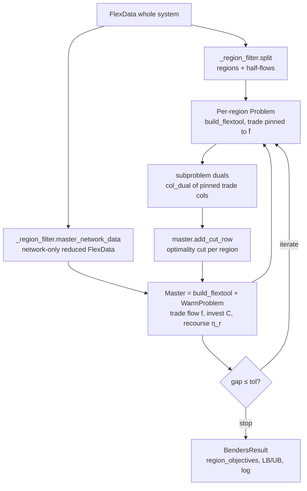
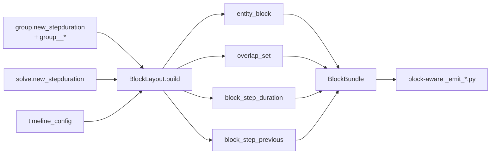

# Decomposition

Decomposition in FlexTool means splitting a monolithic LP into smaller
solvable pieces, then recombining their solutions. FlexTool supports
three independent flavours, all implemented natively in
`engine_polars`:

- **Spatial / Benders** — partition the network into regions joined
  only by the inter-regional trade flows; a coordinating master holds
  those trade flows plus the trade-connection investment, and each
  region is an operational subproblem whose duals become optimality
  cuts the master accumulates until the optimality gap closes. Selected
  **per solve** from the database (`solve.decomposition = benders`); see
  [§2.8](#28-selecting-the-scheme-per-solve).
- **Flex-temporal** — let different parts of the same solve run at
  different timestep resolutions (hourly power, daily hydrogen, …) in
  one LP. Configured per-entity via `group.new_stepduration`.
- **Sequential / rolling / nested** — split a long horizon into
  overlapping windows (rolling) or into an outer long-horizon solve
  whose decisions feed an inner short-horizon solve (nested). The user
  configuration is in `solve.solve_mode` / `solve.contains_solves`; the
  engine wiring is in `_recursive_solve.py` + `_solve_handoff.py`.

Spatial and flex-temporal are LP-level decompositions (one solve, many
sub-problems). Rolling / nested is a *meta*-level decomposition (one
chain of solves, each with its own LP). They compose, with one
exception noted in [§6](#6-where-they-compose).

The engine-side overview of the per-solve pipeline and warm-start /
Benders / cascade solve modes lives in
[engine_polars.md](engine_polars.md); this page focuses on the
decomposition mechanics themselves.

## 1. Picking a decomposition

| Symptom | Use |
|---|---|
| Monolithic LP slow, but the system has clear regional structure (multi-country grid, sparse interconnections) | Spatial / Benders |
| Power demand needs hourly resolution but some commodities (long-duration storage, hydrogen, district heat) only need daily / weekly resolution | Flex-temporal |
| Long horizon (decades, full reanalysis years) that does not fit one solve | Rolling |
| Long-term storage needs a multi-year view, but dispatch needs intra-week resolution | Nested |
| Capacity-expansion at coarse resolution + intra-week dispatch at fine resolution | Nested |
| Multiple operational scenarios sharing the same realised path | Nested + stochastic branches |

The three flavours are **orthogonal in intent** (a decomposition along
the geography axis, the time-resolution axis, and the horizon axis).
[§6](#6-where-they-compose) covers which combinations are actually
wired today.

## 2. Spatial / Benders decomposition

### 2.1 Concept

Benders decomposition splits the LP into a coordinating **master** and a
set of operational **subproblems**, one per region. The complicating
decisions — the inter-regional trade flows and the trade-connection
investment — live in the master; everything inside a region (its own
network, generators, storage, demand) is a subproblem solved with the
master's trade schedule **pinned**. Each subproblem returns the duals of
its pinned trade columns; the master accumulates those as **optimality
cuts** and re-solves. The master objective is a **valid lower bound** on
the true optimum; the incumbent feasible cost is the upper bound; the loop
stops when the optimality gap `(UB − LB) / |UB|` drops below tolerance.

This **replaces** the earlier dual-subgradient (Lagrangian) scheme, which
severed each cross-region arc into invest-less half-flows bounded near zero
and collapsed greenfield trade to an autarkic solution with an *invalid*
bound above the true optimum. Benders puts the trade investment and the
trade flow / capacity coupling in the master, feeds each region the
master's chosen flow as a pinned boundary injection, and returns a
certified lower bound and the true optimum.

The master is built by `build_flextool` over a **network-only reduced
`FlexData`** (`_region_filter.master_network_data`) — the SAME emit the
monolith uses — so the master picks up the trade `maxFlow` capacity
coupling, the invest annuity, and the connection flow cost natively and
**RP-weight-consistently**: the master's trade flow cost and the regions'
recourse costs are both weighted by the same representative-period /
timestep weights `build_flextool` applies everywhere, so summing them is
arithmetically the monolithic objective (no hand-rolled annuity, no
weight mismatch). One **recourse** variable `η_r` per region carries that
region's operational cost in the master objective.



### 2.2 Region declaration

Regions are `group` entities whose `decomposition_method` parameter
equals the string ``benders_regional``. The group's
`group__node` / `group__unit` / `group__connection` memberships list
the entities belonging to that region. The coordinator requires at
least two such groups in the active scenario; one is treated as an
error (use the monolithic path instead).

```python
# Spine input DB fixture sketch.
entities += [("group", "region_A"), ("group", "region_B")]
parameter_values += [
    ("group", "region_A", "decomposition_method", "benders_regional", ALT),
    ("group", "region_B", "decomposition_method", "benders_regional", ALT),
]
for r in ("A", "B"):
    for node in [f"elec_{r}", f"h2_{r}", f"battery_{r}"]:
        entities.append(("group__node", (f"region_{r}", node)))
```

The reference catalogue entry is `group.decomposition_method` in
[reference.md](../reference.md); the only accepted value is
`benders_regional` (the `_region` suffix makes the geographic flavour
explicit, leaving naming room for any future temporal variant). The
source of truth is
`flextool/engine_polars/_region_filter.py:load_decomposition_method`.

### 2.3 Half-flow rewriting

Every connection whose endpoints straddle two region groups is
rewritten into a pair of **import / export half-flows** through a
virtual commodity node, one per region:

```
hf_<pipe>__export__<region_A>     (in region A, virtual sink node)
hf_<pipe>__import__<region_B>     (in region B, virtual source node)
```

Inside a region's standalone LP each half-flow is an ordinary `v_flow`
column. The export and import sides of an arc carry the **same flow** at
optimality. In the Benders scheme that consensus is enforced by the
master: each iteration **pins** every region's forward cross-region
half-flow to the master's current `f̄` per `(d, t)` (reverse pinned to 0)
before solving the region. The cut slope for `(arc, d, t)` is then the
reduced cost of the pinned forward column
(`Solution.col_dual[pin_col_id]` = `∂cost_r / ∂f̄`, basis-correct, no
monolith reference). The rewriter / half-flow metadata structure is in
`_region_filter` (`HalfFlow`, `Coupling`, `split`); the arc / pin
bookkeeping for the master lives in `_benders._build_arcs`.

Star topologies (more than two regions sharing one pipeline) are not
supported; the rewriter asserts bilateral arcs only.

### 2.4 Algorithm — master + multi-cut Benders loop

The master is a single `polar_high.Problem` wrapped in a
`polar_high.WarmProblem`, built ONCE and grown by appended optimality cut
rows. The loop:

1. **Bootstrap** `f̄ = 0`, solve every region, harvest the first cuts.
2. **Master solve** → new trade schedule `f̄` and invest `C`; the master
   objective is the lower bound `LB` (a *valid* global under-estimate —
   the whole point versus the old scheme).
3. **Subproblems**: pin each region's forward trade columns to `f̄`,
   solve, read `col_dual` of the pinned columns.
4. **Cuts**: append one optimality cut per region via
   `WarmProblem.add_cut_row`, bounding that region's recourse `η_r`.
5. **Upper bound**: `UB = master invest cost(C) + Σ_r cost_r(f̄)`;
   incumbent = best (min) `UB`.
6. Repeat from 2 until `gap = (best_UB − LB) / |best_UB| ≤ tol` or the
   iteration cap is hit.

The recourse vars and cut rows are appended through the polar-high
primitives `WarmProblem.add_recourse_col` and `WarmProblem.add_cut_row`;
each region subproblem is solved with `WarmProblem.solve(retry_on_unknown=
…)` so a transient HiGHS `kUnknown` is retried rather than aborting the
run. Each `η_r` is lower-bounded by a large-NEGATIVE finite floor (NOT a
hard `η ≥ 0`): FlexTool region costs can be negative, so a blind zero floor
could cut off the optimum; the finite floor is a provably valid global
under-estimate that keeps the cut-less iter-0 master optimal.

The two knobs:

| DB parameter (`solve` entity) | Default | Meaning |
|---|---|---|
| `benders_max_iter` | `50` | Outer-loop iteration cap |
| `benders_tolerance` | `1e-3` | Relative optimality-gap threshold (gap normalised by the incumbent UB) |

They are resolved per solve by `SolveConfig.benders_config_for`; a solve
that authors neither falls back to these defaults.

### 2.5 Existing vs investable trade capacity

The master handles existing and investable trade connections in ONE
build. An existing-only arc (`existing > 0`, no `invest_method`) carries
no invest variable; its flow is bounded by `existing / unitsize` through
the FlexTool `maxFlow` RHS (`p_flow_upper_existing`). An investable arc
gets a `v_invest` var and its capacity is bounded by `existing +
invested`. A greenfield arc (`existing = 0`) is unchanged — all its trade
capacity is invested `C`. Because the master is the SAME emit as the
monolith, the existing-capacity term and the invest annuity drop in with
no rescale, and the per-region half-flows are left **uncapped**
(`benders_uncap_cross_region=True`) so a positive master pin is always
feasible in the region.

### 2.6 Validity guard

A monolith-free **sandwich guard** is always on: `LB ≤ optimum ≤ best_UB`
must hold (`best_UB` is itself an upper bound on the optimum). An
`LB > best_UB` is the genuine invalid-lower-bound pathology — exactly the
bug this scheme fixes — and raises `RuntimeError` rather than reporting a
wrong-but-plausible optimum. No external big-`M` is needed.

### 2.7 Diagnostics

Every outer iteration logs the iteration index, the master `LB`, the
incumbent `UB`, and the current gap; the orchestrator also prints a final
convergence + LB/UB sandwich summary. The same data is available on the
returned `BendersResult`:

- `BendersResult.iteration_log` — per-iteration dicts (LB / UB / gap
  trajectory)
- `BendersResult.lower_bound` / `upper_bound` / `gap` — final values
- `BendersResult.region_objectives` — per-region recourse cost at the
  incumbent
- `BendersResult.converged` — True iff the gap dropped below `tol`
  before the iteration cap

Look for:

- the gap closing monotonically (LB rising, UB falling toward each
  other); a stalled gap usually means `benders_max_iter` is too low or
  the cut slopes are degenerate (a region whose pinned trade column is
  basic returns a zero reduced cost)
- region objectives broadly similar magnitude — one region dominating
  often means the cut placement is wrong (a major load centre ended
  up in a region with too little generation)

### 2.8 Selecting the scheme per solve

Decomposition is chosen **per solve, from the database** — there is no
CLI flag. Set `solve.decomposition = benders` on the solve(s) you
want decomposed, optionally overriding the two `benders_*` knobs:

| `solve` parameter | Value list / type | Default | Effect |
|---|---|---|---|
| `decomposition` | `decomposition_schemes` = {`none`, `benders`} | `none` | `benders` routes this solve through `solve_benders`; `none` solves it monolithically |
| `benders_max_iter` | float | `50` | Outer-loop iteration cap |
| `benders_tolerance` | float | `1e-3` | Relative optimality-gap threshold |

Because the decision is per solve, a single chain can mix schemes — for
example a Benders investment solve followed by a monolithic
full-resolution dispatch solve. The orchestrator
(`engine_polars._orchestration`) reads each solve's resolved
`decomposition` value as it iterates `model.solves`. This is distinct
from the group-level `group.decomposition_method`
(`none` / `benders_regional`), which declares *which groups are
regions*; `solve.decomposition` declares *whether a given solve
decomposes*. Benders still requires at least two `benders_regional`
groups.

**Invest → dispatch handoff.** A Benders investment solve assembles the
owner-selected invested trade + in-region capacity into a whole-system
`SolveHandoff` (the TIER-1 invest→dispatch chain) so a downstream rolling
or monolithic dispatch solve consumes the realised capacity exactly as it
would after any other invest solve. The orchestrator records which Benders
solves produced an invest handoff and threads it forward; a downstream
solve that would consume a Benders solve which produced none is rejected
loudly rather than silently dropping the link.

The `--region <GROUP_NAME>` flag is a separate, filter-only entry
point that emits a per-region input directory and exits without
solving — useful for inspecting how the rewriter sees a given region.

### 2.9 Reference implementation

| Symbol | Module |
|---|---|
| `solve_benders(data, *, ...)` — top-level entry | `flextool/engine_polars/_benders.py` |
| `BendersResult` — return type | same |
| `Coupling`, `_build_arcs`, the master + cut loop | same |
| `master_network_data` (network-only reduced FlexData for the master) | `flextool/engine_polars/_region_filter.py` |
| `RegionSplit`, `HalfFlow`, `split` | same |
| `load_decomposition_method` (reads ``decomposition_method`` from solve_data) | same |
| `WarmProblem.add_cut_row` / `add_recourse_col` / `solve(retry_on_unknown=…)` | `polar_high` (external) |

The per-solve routing lives in `flextool/engine_polars/_orchestration.py`
(`_PolarHighCascadeSolver._run_benders_solve`, driven by
`SolveConfig.decomposition_for`). The Benders path is also surfaced
as a "Solve modes" entry in
[engine_polars.md § Solve modes](engine_polars.md#solve-modes).

## 3. Flex-temporal decomposition

### 3.1 Concept

Mixed-resolution scheduling: some entities (power demand, VRE
generation, batteries) need fine timesteps; others (long-duration
storage, hydrogen, district heat) only need coarser steps for their
dynamics to be well-represented. A monolithic LP at the fine
resolution wastes solve time on the slow entities. Flex-temporal
decomposition lets a single LP carry both — every entity runs on the
block resolution it needs, joined by overlap-set aggregation across
the LP's constraints.

This is structurally different from the Benders path: there is one
LP, one HiGHS run, no outer loop. The decomposition lives in the LP
*structure* (which `(entity, block)` rows the `_emit_*` modules produce).

### 3.2 Schema surface

| Parameter | Entity | Effect |
|---|---|---|
| `solve.new_stepduration` | `solve` | Solve-wide default block duration (existing parameter, predates the multi-block work) |
| `group.new_stepduration` | `group` | Override: members of this group operate at this step duration |
| `group.decomposition_method` | `group` | Tag a group as a *resolution group*. Used together with `new_stepduration`. |
| `group__node` / `group__unit` / `group__connection` | (relation) | Membership lists for the resolution group |

Validation in `BlockLayout.validate_group_membership`:

- every entity may belong to at most one resolution-group (otherwise
  block assignment is ambiguous)
- every entity may belong to at most one decomposition-group (the
  Benders region groups counted here too)
- reserve participants must NOT sit in any resolution-group (reserve
  blocks are V1 only — preserved compatibility quirk)

Violations raise `FlexToolConfigError` at solve setup.

### 3.3 BlockLayout

`BlockLayout.build` (in `_block_layout.py`) is called once per solve
and produces, in one pass, every per-solve block-related frame:

- `entity_block_frame` — `(entity, block)`
- `process_side_block_frame` — `(process, side, block)`
- `process_block_frame` — `(process, block)` (process-unified)
- `block_step_duration_frame` — `(block, period, step, step_duration)`
- `overlap_set_frame` —
  `(period, block_coarse, step_coarse, block_fine, step_fine, fraction)`
- `block_step_previous_frame` — per-block predecessor 7-tuples
- `block_period_time_first_frame` / `block_period_time_last_frame` —
  per-block period boundaries

The `DEFAULT_BLOCK` block always exists and inherits
`solve.new_stepduration` (or the bare timeline if unset). Every
resolution group becomes one additional named block at its own step
duration.



`BlockBundle` (in `_derived_block.py`) wraps the `BlockLayout` with
cached lazy-frame join helpers (`block_compat_frame`,
`process_side_block_lf`, …) that the `_emit_*` modules use to filter and
re-project their rows.

### 3.4 Overlap-set aggregation

The `overlap_set` is the cross-block aggregation key. For each
`(period, block_coarse, step_coarse)` row there are one or more
`(block_fine, step_fine, fraction)` rows whose `fraction` sums to 1.
The constraint generators use this to project fine-block decision
variables onto coarse-block constraints (and vice versa).

Concretely, when a coarse-block (e.g. daily hydrogen) node balance
joins an hourly arc, the hourly `v_flow` rows are aggregated to the
daily key via `arc_sink_block_dt` / `arc_source_block_dt`
(`_derived_block.py`), weighted by `block_step_duration`. The other
direction — a fine-block constraint reading a coarse-block variable —
projects the coarse value onto each fine step at fraction 1
(piecewise-constant).

Two structural assumptions:

- **Two-block-deep limit** — one resolution-group block plus the
  natural default fine block. Lifting it is a model-design question.
- **Aligned subsets only** — every coarse step must align with an
  integer number of fine steps. Non-aligned configurations raise
  `NotImplementedError` from `_build_overlap_set`.

### 3.5 Block-aware emitters

The `_emit_*.py` modules in `engine_polars` (formerly `_writer_*.py`,
renamed in the writer→emitter Phases 1–5; see
[engine_polars.md § Emitters](engine_polars.md#emitters-formerly-writer-ports))
are block-aware. The major touch points:

- **Node balance** — built on the block of the node, joined with
  per-side arcs through `overlap_set` (loss-aware when the arc
  efficiency depends on flow direction).
- **Storage transition** — `v_state` ties at block boundaries; the
  `block_step_previous_frame` provides the per-block predecessor
  lookup so storage state continuity is enforced on the block
  granularity, not the fine granularity.
- **Ramp / minimum-load** — block-aware: ramps use the block's step
  duration, not the underlying timeline's.
- **Reserves** — V1-only-on-default-block; reserves cannot ride a
  coarse block (the validation rule above guarantees this).

### 3.6 Output expansion

Coarse-block decision variables are expanded back onto the fine
timeline before the `_emit_*` modules write results, using the same
`overlap_set` (read in reverse). Per-fraction attribution stays
consistent across the solve / write boundary; downstream tooling sees
the same fine-grained output regardless of which entities ran on
which block.

This expansion is the reason that `output_node_state_t`,
`output_node_balance_t`, etc. emit one row per `(period, fine_step)`
even for entities on a coarse block.

### 3.7 Caveats

- `representative_period_weights` interacts with block durations via
  the per-period normalisation in `TimelineConfig.timeset_weights`;
  picking arbitrary block durations on top of an RP-clustered timeset
  is supported but requires the block step duration to divide the RP
  period length evenly.
- Block-aware reserves are not implemented; if you tag a reserve
  participant into a resolution group, the validator refuses the
  scenario.

The engine-side overview of flex-temporal lives in
[engine_polars.md § Flex-temporal decomposition](engine_polars.md#flex-temporal-decomposition).

## 4. Rolling / nested solves

These are user-facing patterns documented in
[how_to.md](../how_to.md); this section covers the engine wiring.

### 4.1 Rolling

A long horizon is split into overlapping optimisation windows. Each
window ("roll") is its own LP; the next window starts at the previous
window's "jump" point with the storage state at that point fixed.

Schema:

- `solve.solve_mode = rolling_window`
- `solve.rolling_solve_jump` — interval between roll start points
  (also the output interval per roll)
- `solve.rolling_solve_horizon` — length of the roll's optimisation
  horizon (`> jump`; the overlap is `horizon - jump`)
- `solve.rolling_duration` — optional total horizon length;
  ``-1`` (or unset) means "until the active time list is exhausted"

Engine wiring:

- `RecursiveSolveBuilder.create_rolling_solves` in
  `_recursive_solve.py` expands the parent solve into a sequence
  ``solve_roll_0, solve_roll_1, …`` with per-roll active-time and
  realized-time lists.
- Per-roll storage carry-over rides
  `SolveHandoff.roll_end_state` (`_solve_handoff.py`).
- The cascade reuses the same LP shell via `polar_high.WarmProblem`
  when consecutive rolls' `FlexData` fingerprints match; otherwise
  cold-rebuild. See
  [engine_polars.md § Warm-start cascade](engine_polars.md#warm-start-cascade-polar_highwarmproblem).

### 4.2 Nested

An outer long-horizon solve fixes long-term decisions (capacity, long-
term storage state at chosen anchor periods); an inner short-horizon
solve dispatches within those decisions.

Schema:

- `solve.contains_solves` — array of child solves run after the parent
  using the parent's realised data
- `solve.fix_storage_periods` — periods where the parent's last
  storage value becomes a target for the child
- `node.storage_nested_fix_method` — how the child handles the
  fix-storage target (`fix_quantity` / `fix_price` / etc.; `fix_price`
  requires `storage_state_reference_price`)

Engine wiring:

- The `RecursiveSolveBuilder` walks the solve tree at
  ``define_solve_recursive`` time and threads `ParentSolveInfo` into
  nested children.
- The parent's realised capacity / storage state rides
  `SolveHandoff.realized_invest` / `realized_existing` /
  `fix_storage` / `fix_storage_timesteps`.
- The child's preprocessing reads from `state.handoffs[parent_name]`
  (in-memory by default) or from the legacy
  `solve_data_<parent>/fix_storage_*.csv` (fallback).

The single-matching-period rename quirk: when a child solve's period
set intersects its parent's by exactly one period, the child is
renamed ``solve + "_" + period`` and `duplicate_solve` carbon-copies
the parent's lockstep dicts under the new name. Preserved verbatim
from the legacy preprocessor.

### 4.3 Stochastic branches

Each branch is itself a sub-solve in the chain. `solve.stochastic_branches`
is a 4-D map that decorates affected periods with branch-suffixed
clones (`y2025` → `y2025`, `y2025_low`, `y2025_high`). Only the
realised branch contributes to `realized_time_lists` and
`fix_storage_time_lists`; the other branches' LP variables exist for
the optimisation but do not enter the realised outputs.

The wiring lives in `_stochastic.StochasticSolver` (called from
`RecursiveSolveBuilder`); non-anticipativity constraints are emitted
by `_add_non_anticipativity_constraints` in `model.py`. See
[engine_polars.md § Stochastic branches](engine_polars.md#stochastic-branches).

## 5. RELEASE notes context

The 3.29.0–3.33.0 release cycle is the relevant window for these
features. Quick map (full text in
[release.md](../release.md) or `CHANGELOG.md`):

- **3.29.0** — Flex-temporal decomposition lands. `v50` migration
  moves `new_stepduration` from `timeset` to `solve`. `v51` adds
  group-level `new_stepduration` + `decomposition_method`.
- **3.30.0–3.32.0** — Block-aware emitters complete (then known as writer ports); output
  expansion stabilises.
- **4.0.0 (`v60` migration)** — spatial decomposition becomes DB-driven
  and per-solve: `solve.decomposition` plus per-solve knobs. The global
  `--decomposition` CLI flags are removed; the orchestrator routes each
  solve from its DB value.
- **4.0.0 (`v62` migration)** — the spatial scheme switches from the
  dual-subgradient (Lagrangian) coordinator to **Benders**. The
  `decomposition_schemes` value `lagrangian` → `benders` and the group
  method `lagrangian_region` → `benders_regional`; the old
  `lagrangian_alpha` / `lagrangian_max_iter` / `lagrangian_tolerance`
  knobs are dropped and replaced by `benders_max_iter` (50) /
  `benders_tolerance` (1e-3). Existing DBs are auto-migrated (breaking
  schema change, DB version 62). The Benders invest solve threads its
  realised capacity into a downstream dispatch solve (TIER-1
  invest→dispatch handoff).

## 6. Where they compose

| Combination | Supported | Notes |
|---|---|---|
| Benders + flex-temporal | Yes | Each region's `build_flextool` runs through the block-aware `_emit_*` modules unchanged. |
| Benders + rolling | No | One Benders solve is the unit of work for the outer rolling loop. Not currently wired; would require per-roll cut warm-start. The TIER-1 invest→dispatch handoff threads a Benders *invest* solve into a downstream *rolling dispatch* solve, which is the supported pattern. |
| Benders + nested | Partial | The outer (parent) solve can be Benders, but the parent's handoff to children propagates only the invest→dispatch capacity, not per-region operational state. Treat as untested beyond the invest→dispatch chain. |
| Flex-temporal + rolling | Yes | The rolling jump is on the fine timeline; coarse blocks honour the jump boundary inside each window. |
| Flex-temporal + nested | Yes | Each parent / child solve carries its own `BlockLayout`. |
| Flex-temporal + stochastic | Yes | Branches enter the active-time lists at the fine resolution; coarse-block constraints pick up the relevant branch-suffixed steps via the same overlap set. |
| Rolling + nested | Yes | The legacy "more than one solve in a rolling solve" raise still trips for unsupported sibling-rolling-children patterns. |
| Rolling + stochastic | Yes | Each roll can carry branches; the realised branch chains forward. |

## 7. See also

- [engine_polars.md](engine_polars.md) — the engine guide; Solve modes
  section covers monolithic / warm / Benders and Flex-temporal
  decomposition section covers the BlockLayout shape.
- [architecture.md](architecture.md) — top-level architecture; how the
  decomposition pieces fit into the larger pipeline.
- [scaling.md](scaling.md) — auto-scaling pipeline; runs per
  sub-problem, so each region / each roll / each block gets its own
  scaling pass.
- [reference.md](../reference.md) — the parameters touched here:
  `solve.solve_mode`, `solve.rolling_solve_jump`,
  `solve.rolling_solve_horizon`, `solve.contains_solves`,
  `solve.fix_storage_periods`, `solve.stochastic_branches`,
  `solve.new_stepduration`, `group.new_stepduration`,
  `group.decomposition_method`, `node.storage_nested_fix_method`.
- [how_to.md](../how_to.md) — practical recipes for setting up
  Benders regions, rolling windows, nested solves, and stochastic
  branches.
