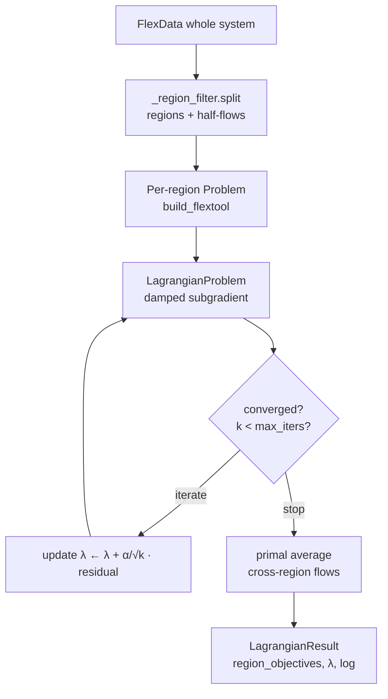
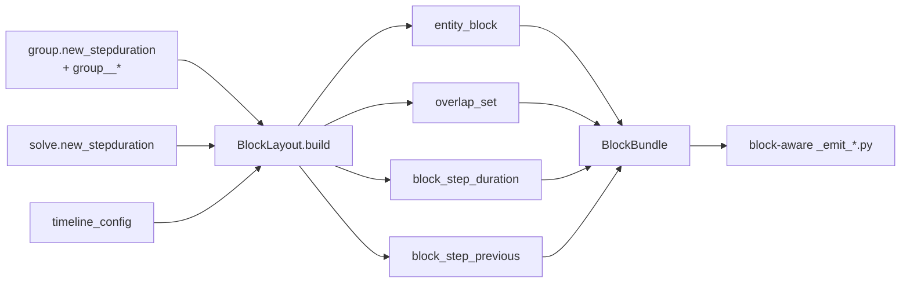

# Decomposition

Decomposition in FlexTool means splitting a monolithic LP into smaller
solvable pieces, then recombining their solutions. FlexTool supports
three independent flavours, all implemented natively in
`engine_polars`:

- **Spatial / Lagrangian** — partition the network into regions joined
  only by priced coupling flows; iterate dual prices until the regions
  agree. CLI flag `--decomposition lagrangian`.
- **Flex-temporal** — let different parts of the same solve run at
  different timestep resolutions (hourly power, daily hydrogen, …) in
  one LP. Configured per-entity via `group.new_stepduration`.
- **Sequential / rolling / nested** — split a long horizon into
  overlapping windows (rolling) or into an outer long-horizon solve
  whose decisions feed an inner short-horizon solve (nested). The user
  configuration is in `solve.solve_mode` / `solve.contains_solves`; the
  engine wiring is in `_recursive_solve.py` + `_solve_handoff.py`.

Spatial and flex-temporal are LP-level decompositions (one solve, many
sub-problems). Rolling / nested is a *meta*-level decomposition (one
chain of solves, each with its own LP). They compose, with one
exception noted in [§6](#6-where-they-compose).

The engine-side overview of the per-solve pipeline and warm-start /
Lagrangian / cascade solve modes lives in
[engine_polars.md](engine_polars.md); this page focuses on the
decomposition mechanics themselves.

## 1. Picking a decomposition

| Symptom | Use |
|---|---|
| Monolithic LP slow, but the system has clear regional structure (multi-country grid, sparse interconnections) | Spatial / Lagrangian |
| Power demand needs hourly resolution but some commodities (long-duration storage, hydrogen, district heat) only need daily / weekly resolution | Flex-temporal |
| Long horizon (decades, full reanalysis years) that does not fit one solve | Rolling |
| Long-term storage needs a multi-year view, but dispatch needs intra-week resolution | Nested |
| Capacity-expansion at coarse resolution + intra-week dispatch at fine resolution | Nested |
| Multiple operational scenarios sharing the same realised path | Nested + stochastic branches |

The three flavours are **orthogonal in intent** (a decomposition along
the geography axis, the time-resolution axis, and the horizon axis).
[§6](#6-where-they-compose) covers which combinations are actually
wired today.

## 2. Spatial / Lagrangian decomposition

### 2.1 Concept

Lagrangian decomposition splits the LP along *coupling constraints* and
prices the violation of those constraints in the objective. In FlexTool
the coupling constraints are the cross-region pipeline / transmission
flows: a connection whose source endpoint lies in one region and sink
endpoint lies in another. Each region becomes a self-contained
sub-problem (its own network, generators, storage, demand); the
coordinator iterates a Lagrange multiplier λ per coupling cell until
the regions' chosen flows agree.

The outer loop is a damped subgradient method (Bertsekas-style):

- iteration *k* solves every region's LP given the current λ
- the residual is the per-cell imbalance between paired export and
  import flows
- λ updates by a damped step ``α / √k`` along the imbalance
- after `max_iters` outer iterations or once the tail-averaged
  imbalance drops below `tol`, the coordinator runs a final
  **primal-average** pass: average each cell's export/import over the
  tail of iterations, fix those flows, and re-solve every region.



### 2.2 Region declaration

Regions are `group` entities whose `decomposition_method` parameter
equals the string ``lagrangian_region``. The group's
`group__node` / `group__unit` / `group__connection` memberships list
the entities belonging to that region. The coordinator requires at
least two such groups in the active scenario; one is treated as an
error (use the monolithic path instead).

```python
# Spine input DB fixture sketch.
entities += [("group", "region_A"), ("group", "region_B")]
parameter_values += [
    ("group", "region_A", "decomposition_method", "lagrangian_region", ALT),
    ("group", "region_B", "decomposition_method", "lagrangian_region", ALT),
]
for r in ("A", "B"):
    for node in [f"elec_{r}", f"h2_{r}", f"battery_{r}"]:
        entities.append(("group__node", (f"region_{r}", node)))
```

The reference catalogue entry is `group.decomposition_method` in
[reference.md](../reference.md); the only accepted value is
`lagrangian_region` (the `_region` suffix makes the geographic flavour
explicit, leaving naming room for any future temporal Lagrangian
variant). The source of truth is
`flextool/engine_polars/_region_filter.py:load_decomposition_method`.

### 2.3 Half-flow rewriting

Every connection whose endpoints straddle two region groups is
rewritten into a pair of **import / export half-flows** through a
virtual commodity node, one per region:

```
hf_<pipe>__export__<region_A>     (in region A, virtual sink node)
hf_<pipe>__import__<region_B>     (in region B, virtual source node)
```

The coupling spec is the consensus constraint

```
+ v_flow[hf_<pipe>__export__<region_A>, d, t]
- v_flow[hf_<pipe>__import__<region_B>, d, t]   =   0           (per cell)
```

with one λ per `(d, t)` cell. The rewriter and the consensus spec
builder both live in `_lagrangian.py`
(`_identify_coupling_cols` and `_build_coupling_specs`); the half-flow
metadata structure is in `_region_filter.HalfFlow`.

Star topologies (more than two regions sharing one pipeline) collapse
to a single λ per pipe across all sharing regions; the rewriter
asserts bilateral arcs only.

### 2.4 Algorithm — damped subgradient

The outer loop is implemented in `polar_high.LagrangianProblem`; the
FlexTool side just translates `Coupling` objects into `CouplingSpec`s
and delegates. The relevant knobs:

| Field on `solve_lagrangian` | CLI flag | Meaning |
|---|---|---|
| `alpha` (float, default `1e-3` in code; `0.1` from CLI) | `--lagrangian-alpha` | Base step size; per-iter step is ``α / √k`` |
| `max_iters` (default `200` in code; `80` from CLI) | `--lagrangian-max-iter` | Outer-loop cap |
| `tol` (default `1.0`) | `--lagrangian-tolerance` | Tail-averaged primal residual threshold |
| `min_iters` | — | Force at least this many outer iterations |
| `initial_lambda` | — | Warm-start λ value (default 0) |
| `primal_tail` | — | How many iterations to tail-average for primal recovery (None = solver default) |

The CLI defaults are deliberately wider than the function defaults —
the CLI is tuned for typical multi-region runs (`α = 0.1`,
`max_iters = 80`), while the function defaults are conservative for
tests.

### 2.5 Primal recovery

After the outer loop exits, every coupling-flow column is fixed to its
tail-averaged value across the last `primal_tail` iterations, costs
are reset to zero, and every region is re-solved. The summed
sub-problem objective is `LagrangianResult.total_objective`.

For pure LP sub-problems the primal-averaged objective converges to
the monolithic optimum within a small residual gap (typically
0.5–2 %). The gap is bounded by:

- subgradient step decay (``α / √k`` does not shrink fast enough to
  eliminate the last trace of bang-bang oscillation in the coupling
  flows);
- efficiency mismatches when the half-flow formulation does not
  propagate the original pipeline's loss coefficient (the default
  injection sets `efficiency = 1.0` on the virtual half-flow).

For MIP sub-problems (unit commitment) the duality gap is intrinsic
and cannot be closed by a Lagrangian outer loop alone; a follow-up
bundle / branch-and-bound layer would be required and is not currently
implemented.

### 2.6 Practical pointers

- Typical convergence is in 5–50 outer iterations for well-decomposable
  systems. Each iteration is cheaper than the monolithic LP (smaller
  HiGHS instance per region), so total wall-clock beats monolithic when
  the regions are loosely coupled.
- Systems with many tight cross-region couplings (e.g. dense
  interconnection plus shared reserve groups) see slow convergence;
  the dual loop's residual oscillates before averaging in. If you can
  reshape the regions to push more flow inside a region and less
  across boundaries, do.
- The coordinator builds each region's `polar_high.Problem` once and
  re-uses it across iterations via `polar_high.WarmProblem`; only the
  coupling columns' objective costs change per iteration.

### 2.7 Diagnostics

Every outer iteration logs a row with `iter`, `alpha_k`,
`max_abs_imbalance`, `total_obj`, and the per-pipe mean λ. The same
data is available on the returned object:

- `LagrangianResult.iteration_log` — list of per-iteration dicts
  (plot λ trajectories and primal residuals from here)
- `LagrangianResult.final_lambdas` — final λ mean per pipeline key
- `LagrangianResult.region_objectives` — per-region sub-problem
  objective at the primal recovery pass
- `LagrangianResult.converged` — True iff the tail-averaged residual
  dropped below `tol` before `max_iters` was hit

Look for:

- residual monotone-ish decay (a noisy zig-zag is normal; a monotone
  *increase* means α is too large for the system)
- λ values stabilising — a still-drifting λ at the cap usually means
  `max_iters` is too low or the residual tolerance is too tight
- region objectives broadly similar magnitude — one region dominating
  often means the cut placement is wrong (a major load centre ended
  up in a region with too little generation)

### 2.8 CLI invocation

```bash
python -m flextool.cli.cmd_run_flextool \
    sqlite:///inputs.sqlite \
    sqlite:///outputs.sqlite \
    --scenario-name multi_region \
    --decomposition lagrangian \
    --lagrangian-alpha 0.1 \
    --lagrangian-max-iter 80 \
    --lagrangian-tolerance 1.0 \
    --work-folder /tmp/lag_run
```

The `--region <GROUP_NAME>` flag is a separate, filter-only entry
point that emits a per-region input directory and exits without
solving — useful for inspecting how the rewriter sees a given region.

### 2.9 Reference implementation

| Symbol | Module |
|---|---|
| `solve_lagrangian(data, *, ...)` — top-level entry | `flextool/engine_polars/_lagrangian.py` |
| `LagrangianResult` — return type | same |
| `Coupling`, `_identify_coupling_cols`, `_build_coupling_specs` | same |
| `RegionSplit`, `HalfFlow`, `split` | `flextool/engine_polars/_region_filter.py` |
| `load_decomposition_method` (reads ``decomposition_method`` from solve_data) | same |
| `LagrangianProblem`, `CouplingSpec`, `CouplingEntry` | `polar_high` (external) |

The CLI surface is in `flextool/cli/cmd_run_flextool.py` (search for
``--decomposition``). The Lagrangian path is also surfaced as a
"Solve modes" entry in
[engine_polars.md § Solve modes](engine_polars.md#solve-modes).

## 3. Flex-temporal decomposition

### 3.1 Concept

Mixed-resolution scheduling: some entities (power demand, VRE
generation, batteries) need fine timesteps; others (long-duration
storage, hydrogen, district heat) only need coarser steps for their
dynamics to be well-represented. A monolithic LP at the fine
resolution wastes solve time on the slow entities. Flex-temporal
decomposition lets a single LP carry both — every entity runs on the
block resolution it needs, joined by overlap-set aggregation across
the LP's constraints.

This is structurally different from the Lagrangian path: there is one
LP, one HiGHS run, no outer loop. The decomposition lives in the LP
*structure* (which `(entity, block)` rows the `_emit_*` modules produce).

### 3.2 Schema surface

| Parameter | Entity | Effect |
|---|---|---|
| `solve.new_stepduration` | `solve` | Solve-wide default block duration (existing parameter, predates the multi-block work) |
| `group.new_stepduration` | `group` | Override: members of this group operate at this step duration |
| `group.decomposition_method` | `group` | Tag a group as a *resolution group*. Used together with `new_stepduration`. |
| `group__node` / `group__unit` / `group__connection` | (relation) | Membership lists for the resolution group |

Validation in `BlockLayout.validate_group_membership`:

- every entity may belong to at most one resolution-group (otherwise
  block assignment is ambiguous)
- every entity may belong to at most one decomposition-group (the
  Lagrangian region groups counted here too)
- reserve participants must NOT sit in any resolution-group (reserve
  blocks are V1 only — preserved compatibility quirk)

Violations raise `FlexToolConfigError` at solve setup.

### 3.3 BlockLayout

`BlockLayout.build` (in `_block_layout.py`) is called once per solve
and produces, in one pass, every per-solve block-related frame:

- `entity_block_frame` — `(entity, block)`
- `process_side_block_frame` — `(process, side, block)`
- `process_block_frame` — `(process, block)` (process-unified)
- `block_step_duration_frame` — `(block, period, step, step_duration)`
- `overlap_set_frame` —
  `(period, block_coarse, step_coarse, block_fine, step_fine, fraction)`
- `block_step_previous_frame` — per-block predecessor 7-tuples
- `block_period_time_first_frame` / `block_period_time_last_frame` —
  per-block period boundaries

The `DEFAULT_BLOCK` block always exists and inherits
`solve.new_stepduration` (or the bare timeline if unset). Every
resolution group becomes one additional named block at its own step
duration.



`BlockBundle` (in `_derived_block.py`) wraps the `BlockLayout` with
cached lazy-frame join helpers (`block_compat_frame`,
`process_side_block_lf`, …) that the `_emit_*` modules use to filter and
re-project their rows.

### 3.4 Overlap-set aggregation

The `overlap_set` is the cross-block aggregation key. For each
`(period, block_coarse, step_coarse)` row there are one or more
`(block_fine, step_fine, fraction)` rows whose `fraction` sums to 1.
The constraint generators use this to project fine-block decision
variables onto coarse-block constraints (and vice versa).

Concretely, when a coarse-block (e.g. daily hydrogen) node balance
joins an hourly arc, the hourly `v_flow` rows are aggregated to the
daily key via `arc_sink_block_dt` / `arc_source_block_dt`
(`_derived_block.py`), weighted by `block_step_duration`. The other
direction — a fine-block constraint reading a coarse-block variable —
projects the coarse value onto each fine step at fraction 1
(piecewise-constant).

Two structural assumptions:

- **Two-block-deep limit** — one resolution-group block plus the
  natural default fine block. Lifting it is a model-design question.
- **Aligned subsets only** — every coarse step must align with an
  integer number of fine steps. Non-aligned configurations raise
  `NotImplementedError` from `_build_overlap_set`.

### 3.5 Block-aware emitters

The `_emit_*.py` modules in `engine_polars` (formerly `_writer_*.py`,
renamed in the writer→emitter Phases 1–5; see
[engine_polars.md § Emitters](engine_polars.md#emitters-formerly-writer-ports))
are block-aware. The major touch points:

- **Node balance** — built on the block of the node, joined with
  per-side arcs through `overlap_set` (loss-aware when the arc
  efficiency depends on flow direction).
- **Storage transition** — `v_state` ties at block boundaries; the
  `block_step_previous_frame` provides the per-block predecessor
  lookup so storage state continuity is enforced on the block
  granularity, not the fine granularity.
- **Ramp / minimum-load** — block-aware: ramps use the block's step
  duration, not the underlying timeline's.
- **Reserves** — V1-only-on-default-block; reserves cannot ride a
  coarse block (the validation rule above guarantees this).

### 3.6 Output expansion

Coarse-block decision variables are expanded back onto the fine
timeline before the `_emit_*` modules write results, using the same
`overlap_set` (read in reverse). Per-fraction attribution stays
consistent across the solve / write boundary; downstream tooling sees
the same fine-grained output regardless of which entities ran on
which block.

This expansion is the reason that `output_node_state_t`,
`output_node_balance_t`, etc. emit one row per `(period, fine_step)`
even for entities on a coarse block.

### 3.7 Caveats

- `representative_period_weights` interacts with block durations via
  the per-period normalisation in `TimelineConfig.timeset_weights`;
  picking arbitrary block durations on top of an RP-clustered timeset
  is supported but requires the block step duration to divide the RP
  period length evenly.
- Block-aware reserves are not implemented; if you tag a reserve
  participant into a resolution group, the validator refuses the
  scenario.

The engine-side overview of flex-temporal lives in
[engine_polars.md § Flex-temporal decomposition](engine_polars.md#flex-temporal-decomposition).

## 4. Rolling / nested solves

These are user-facing patterns documented in
[how_to.md](../how_to.md); this section covers the engine wiring.

### 4.1 Rolling

A long horizon is split into overlapping optimisation windows. Each
window ("roll") is its own LP; the next window starts at the previous
window's "jump" point with the storage state at that point fixed.

Schema:

- `solve.solve_mode = rolling_window`
- `solve.rolling_solve_jump` — interval between roll start points
  (also the output interval per roll)
- `solve.rolling_solve_horizon` — length of the roll's optimisation
  horizon (`> jump`; the overlap is `horizon - jump`)
- `solve.rolling_duration` — optional total horizon length;
  ``-1`` (or unset) means "until the active time list is exhausted"

Engine wiring:

- `RecursiveSolveBuilder.create_rolling_solves` in
  `_recursive_solve.py` expands the parent solve into a sequence
  ``solve_roll_0, solve_roll_1, …`` with per-roll active-time and
  realized-time lists.
- Per-roll storage carry-over rides
  `SolveHandoff.roll_end_state` (`_solve_handoff.py`).
- The cascade reuses the same LP shell via `polar_high.WarmProblem`
  when consecutive rolls' `FlexData` fingerprints match; otherwise
  cold-rebuild. See
  [engine_polars.md § Warm-start cascade](engine_polars.md#warm-start-cascade-polar_highwarmproblem).

### 4.2 Nested

An outer long-horizon solve fixes long-term decisions (capacity, long-
term storage state at chosen anchor periods); an inner short-horizon
solve dispatches within those decisions.

Schema:

- `solve.contains_solves` — array of child solves run after the parent
  using the parent's realised data
- `solve.fix_storage_periods` — periods where the parent's last
  storage value becomes a target for the child
- `node.storage_nested_fix_method` — how the child handles the
  fix-storage target (`fix_quantity` / `fix_price` / etc.; `fix_price`
  requires `storage_state_reference_price`)

Engine wiring:

- The `RecursiveSolveBuilder` walks the solve tree at
  ``define_solve_recursive`` time and threads `ParentSolveInfo` into
  nested children.
- The parent's realised capacity / storage state rides
  `SolveHandoff.realized_invest` / `realized_existing` /
  `fix_storage` / `fix_storage_timesteps`.
- The child's preprocessing reads from `state.handoffs[parent_name]`
  (in-memory by default) or from the legacy
  `solve_data_<parent>/fix_storage_*.csv` (fallback).

The single-matching-period rename quirk: when a child solve's period
set intersects its parent's by exactly one period, the child is
renamed ``solve + "_" + period`` and `duplicate_solve` carbon-copies
the parent's lockstep dicts under the new name. Preserved verbatim
from the legacy preprocessor.

### 4.3 Stochastic branches

Each branch is itself a sub-solve in the chain. `solve.stochastic_branches`
is a 4-D map that decorates affected periods with branch-suffixed
clones (`y2025` → `y2025`, `y2025_low`, `y2025_high`). Only the
realised branch contributes to `realized_time_lists` and
`fix_storage_time_lists`; the other branches' LP variables exist for
the optimisation but do not enter the realised outputs.

The wiring lives in `_stochastic.StochasticSolver` (called from
`RecursiveSolveBuilder`); non-anticipativity constraints are emitted
by `_add_non_anticipativity_constraints` in `model.py`. See
[engine_polars.md § Stochastic branches](engine_polars.md#stochastic-branches).

## 5. RELEASE notes context

The 3.29.0–3.33.0 release cycle is the relevant window for these
features. Quick map (full text in
[release.md](../release.md) or `RELEASE.md`):

- **3.29.0** — Flex-temporal decomposition lands. `v50` migration
  moves `new_stepduration` from `timeset` to `solve`. `v51` adds
  group-level `new_stepduration` + `decomposition_method`.
- **3.30.0–3.32.0** — Block-aware emitters complete (then known as writer ports); output
  expansion stabilises.
- **3.33.0** — `--decomposition lagrangian` rewired onto the polars
  coordinator (`engine_polars._lagrangian`).

## 6. Where they compose

| Combination | Supported | Notes |
|---|---|---|
| Lagrangian + flex-temporal | Yes | Each region's `build_flextool` runs through the block-aware `_emit_*` modules unchanged. |
| Lagrangian + rolling | No | One Lagrangian solve is the unit of work for the outer rolling loop. Not currently wired and not on the roadmap; would require per-roll dual warm-start. |
| Lagrangian + nested | Partial | The outer (parent) solve can be Lagrangian, but the parent's handoff to children does not currently propagate per-region state. Treat as untested. |
| Flex-temporal + rolling | Yes | The rolling jump is on the fine timeline; coarse blocks honour the jump boundary inside each window. |
| Flex-temporal + nested | Yes | Each parent / child solve carries its own `BlockLayout`. |
| Flex-temporal + stochastic | Yes | Branches enter the active-time lists at the fine resolution; coarse-block constraints pick up the relevant branch-suffixed steps via the same overlap set. |
| Rolling + nested | Yes | The legacy "more than one solve in a rolling solve" raise still trips for unsupported sibling-rolling-children patterns. |
| Rolling + stochastic | Yes | Each roll can carry branches; the realised branch chains forward. |

## 7. See also

- [engine_polars.md](engine_polars.md) — the engine guide; Solve modes
  section covers monolithic / warm / Lagrangian and Flex-temporal
  decomposition section covers the BlockLayout shape.
- [architecture.md](architecture.md) — top-level architecture; how the
  decomposition pieces fit into the larger pipeline.
- [scaling.md](scaling.md) — auto-scaling pipeline; runs per
  sub-problem, so each region / each roll / each block gets its own
  scaling pass.
- [reference.md](../reference.md) — the parameters touched here:
  `solve.solve_mode`, `solve.rolling_solve_jump`,
  `solve.rolling_solve_horizon`, `solve.contains_solves`,
  `solve.fix_storage_periods`, `solve.stochastic_branches`,
  `solve.new_stepduration`, `group.new_stepduration`,
  `group.decomposition_method`, `node.storage_nested_fix_method`.
- [how_to.md](../how_to.md) — practical recipes for setting up
  Lagrangian regions, rolling windows, nested solves, and stochastic
  branches.
