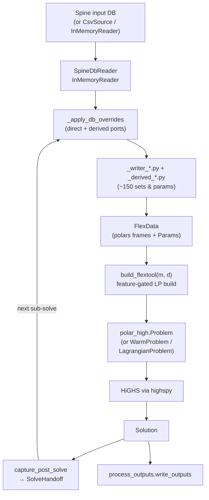

# The engine_polars pipeline

`flextool/engine_polars/` is FlexTool's in-memory optimization engine. It
reads a Spine input DB (or a CSV workdir, or an in-memory test fixture)
into a single typed dataclass, runs ~150 derived-parameter ports to
populate the rest of the dataclass, builds an LP feature-by-feature on
top of the upstream `polar_high` eDSL, and hands the HiGHS-via-`highspy`
solution off to either the next solve in a cascade or to
`process_outputs`. It replaced the retired `flextool.mod → glpsol → MPS
→ HiGHS → CSV` pipeline that lived in `flextoolrunner/` through 3.32.

This page is the developer-side deep dive — the file map and feature
table are on [architecture.md](architecture.md); here we walk the
pipeline in the order a bug or extension actually traverses it.

!!! note "Two repositories"
    `polar_high` is the standalone LP eDSL — sets, parameters,
    variables, lazy constraint composition, warm-LP machinery,
    Lagrangian driver. `engine_polars` is the FlexTool-side glue:
    it knows the on-disk layout of the input/ + solve_data/ CSVs
    and the shape of FlexTool's optimization model. `polar_high`
    knows nothing of FlexTool.

## Per-solve pipeline



Side-paths off this trunk:

- **Rolling-horizon / nested**: every iteration loops back through
  `overlay` carrying a `SolveHandoff`. When the LP shape is unchanged
  the cascade re-uses the live `WarmProblem`; when it isn't, the
  cascade cold-rebuilds.
- **Stochastic branches**: `_stochastic.py` decorates per-solve
  active-time lists with branch-suffixed periods before `overlay`
  sees them. Branched periods get LP variables; only the realized
  branch contributes to handoff carriers.
- **Spatial Lagrangian**: `_lagrangian.solve_lagrangian` slices a
  single `FlexData` into per-region copies via `_region_filter`,
  builds one sub-problem per region, and couples cross-region
  half-flow pairs with subgradient-updated multipliers.
- **Fast single-solve**: `_fast_load.load_flextool_source_only`
  bypasses the override chain and the CSV writers for a single
  solve fixture with no rolling / nested / stochastic / Lagrangian
  features.

## FlexData — the central data carrier

`FlexData` (in `input.py`) is a `@dataclass` of roughly 220 fields. Five
fields are positional and always present (the time / weighting / node
floor); every other field defaults to `None` and is filled in only when
the scenario exercises the corresponding feature.

The naming convention is documented on the class:

- Sets — index frames, `pl.DataFrame`, no prefix. Example:
  `nodeBalance`, `process_source_sink`, `pss_dt`, `nodeState`,
  `cdt_eq`, `dtttdt`.
- Parameters — numeric `polar_high.Param`, `p_*` prefix. Example:
  `p_inflow`, `p_unitsize`, `p_commodity_price`, `p_step_duration`.
- Variables created later by `build_flextool` are `v_*` for primal
  and `vq_*` for slack.

The contract carried throughout the engine is simple: **a field is
either populated with a non-empty frame / Param, or it is `None`**.
Populating with an *empty* frame is legal — that signals "this feature
class is enabled, but no rows in this partition" (e.g.
`process_source_sink_noEff` empty because every process is in the eff
partition). `None` always means "loader didn't touch this field".

### Data sources

The loaders are stacked on two protocols defined in `_input_source.py`:

| Source | Implementation | When used |
|---|---|---|
| `CsvSource` | `_input_source.py` | Loads from an on-disk `input/` + `solve_data/` workdir. The legacy reader path; still used by tests and by `load_flextool(path_or_csv_source)`. |
| `SpineDbSource` | `_spinedb_source.py` | Materialises a Spine DB to a tempdir CSV workdir via FlexTool's preprocessing pipeline (the "slow path"), then hands the workdir to `CsvSource`. |
| `SpineDbReader` | `_spinedb_reader.py` | The DB-direct reader — returns one polars frame per `(entity_class, parameter_name)` pair, no CSV roundtrip. Consumed by the override chain in `_apply_db_overrides` and by `_fast_load.load_flextool_source_only`. |
| `InMemoryReader` | `_inmemory_reader.py` | Same `InputSource` protocol as `SpineDbReader`, but driven by an in-memory dict-of-frames fixture. The vehicle for fast unit tests under `tests/engine_polars/`. |

`FlexInputSource` (CSV-shaped) and `InputSource` (per-parameter frame)
are deliberately two protocols, not one: the legacy CSV reader path
walks directories, the DB-direct path requests one parameter at a time.
They coexist — `load_flextool` accepts either, and a Spine DB load
typically uses both (CSV side for the bulky pre-computed sets, DB side
for the parameters the override chain owns).

### Per-field shapes

The shape registry lives in `_param_shapes.py`. Every parameter known
to the engine has an entry in `PARAM_ALLOWED_SHAPES` listing the
shapes FlexTool's preprocessing is allowed to emit (scalar,
`1d_map[period]`, `1d_map[time]`, `2d_map[period,time]`,
`2d_map[time,period]`, …). The resolver
(`resolve_param_shape`) reads the actual nesting depth and per-level
`index_name` labels from the DB, validates against the allow-list, and
raises `FlexToolConfigError` on a mismatch.

This DB-driven validation matters because a 2D parameter authored as
`Map[time, period]` versus `Map[period, time]` has the same column
*names* in polars but the opposite axis semantics. Column-shape
detection misses the difference; the per-level `index_name` doesn't.

## Feature-conditional LP build

`build_flextool(m, d)` is the heart of the engine. It walks a fixed
list of feature blocks and adds variables, constraints, and objective
terms to the `polar_high.Problem` `m` only when the corresponding
fields of `FlexData` `d` are populated.

The feature requirements are declared as module-level tuples at the
top of `model.py`:

```python
ALWAYS = ("dt", "nodeBalance", "nodeBalance_dt",
          "p_step_duration", "p_rp_cost_weight", "p_inflation_op",
          "p_period_share", "p_inflow", "p_penalty_up", "p_penalty_down")
PROCESSES = ("process_source_sink", "process_source_sink_eff",
             "process_source_sink_noEff", "pss_dt", "flow_to_n",
             "flow_from_commodity_eff", "flow_from_commodity_noEff",
             "p_unitsize", "p_flow_upper", "p_slope", "p_commodity_price")
STORAGE = ("nodeState", "nodeState_dt", "dtttdt",
           "p_state_upper", "p_state_unitsize")
ONLINE = ("process_online", "p_online_dt", "p_min_load",
          "dtttdt", "p_process_existing_count")
# ... INDIRECT, CO2_PRICE, CO2_CAP, USER_CSTR, PROFILES,
#     MINLOAD_EFF, STARTUP_COST_LINEAR, STARTUP_COST_INTEGER,
#     RAMP, INVEST, DIVEST
```

`build_flextool` first runs `_check(d, ALWAYS, "always")` to assert the
floor, then inspects each block's switch field (e.g. `nodeState` for
storage, `process_indirect` for CHP) and calls `_check(d, BLOCK,
"name")` when the switch is set. The check is **fail-fast**: if the
switch is set but a required field is `None`, it raises `ValueError`.
No silent degradation.

After validation the body of `build_flextool` becomes a long
straight-line sequence of `if has_<feature>: ...` clauses. Each clause
adds its variables, equation constraints, and objective contributions
in one place. This shape is the **key invariant for extending the
engine**: to add a new feature, declare its required-field tuple,
populate those fields in the loader / writer ports, and gate every
model element you add on the `has_<feature>` boolean.

### Worked example: STORAGE

The storage block is a representative case:

1. Required fields: `nodeState`, `nodeState_dt`, `dtttdt`,
   `p_state_upper`, `p_state_unitsize`.
2. Variable added: `v_state` indexed by `nodeState_dt = (n, d, t)`,
   upper-bounded by `p_state_upper * p_state_unitsize`.
3. Constraints added: the storage transition rule keyed on `dtttdt`
   (the predecessor-lookup frame from `_timeline.py`), the start-of-
   horizon `storage_fix_start`, and the end-state binding when
   `storage_use_reference_value` is populated.
4. Objective contribution: none directly — slack penalties only.

A bug report like "storage transition wrong at the period boundary"
walks straight back to one of those four fields: most often `dtttdt`
or `storage_bind_forward_only`, both populated by the loader and
inspected here.

## Writer ports

About 150 sets and calculated parameters that used to be `param := ...`
declarations in the retired `flextool.mod` are now produced in Python
by the `_writer_*.py` and `_derived_*.py` modules (Writer Phases 1–4
in `RELEASE.md`). They all share a common shape:

- Input: a `FlexData` populated with the prior phases' fields, plus a
  source plugin (`InputSource` or workdir path).
- Output: one or more fields of `FlexData`, written back in place.
- Purity: every helper either fully populates its target fields or
  leaves them at `None` — no half-populated state.

The split between `_derived_*` and `_writer_*` is historical, not
semantic. The `_writer_*` family ported the modules that wrote
`solve_data/*.csv` in the legacy preprocessing; the `_derived_*`
family ported the modules that produced computed parameters
in-process. Both are now just Python functions.

Representative entries:

| Module | Produces |
|---|---|
| `_derived_block.py` | `BlockLayout` fan-out — per-entity blocks, overlap sets, block step durations. |
| `_derived_branch.py` | `period_branch`, `pdt_branch_weight`, `pd_branch_weight` — stochastic branch weighting. |
| `_derived_existing.py` | `p_entity_all_existing`, `p_entity_previously_invested_capacity` — cross-solve existing-capacity composition. |
| `_derived_npv.py` | Annualized investment / divestment carriers feeding the objective. |
| `_derived_profile.py` | `p_profile_value` and the `p_process_existing_count` factor used by profile-bound constraints. |
| `_derived_walks.py` | Backward / forward step lookups (`dtttdt`, `dtttdt_forward_only`, the block-interior variant). |
| `_writer_arc_unions.py` | Arc set algebra: `flow_to_n`, `flow_from_n`, the commodity-flow joins, the reverse-arc additions for connections. |
| `_writer_calc_params.py` | The `pdtX` / `pdX` per-step parameter cascade. |
| `_writer_co2_accumulators.py` | Cumulative-CO2 ladder feeding the CO2-cap constraint. |
| `_writer_pdt_params.py` | The full `pdt_*` family (online indices, varCost frames, …). |
| `_writer_period_calc.py` | `p_period_share`, `complete_period_share_of_year`, `p_timeline_duration_in_years`. |
| `_writer_reserve.py` | Reserve-up / reserve-down set machinery for `_reserve.py`. |

### Topological ordering

Writer ports have dependencies — `_derived_existing` reads
`realized_invest` from prior solves' handoffs and `pd_invest_set`
from `_writer_period_params`; `_derived_npv` reads
`ed_lifetime_fixed_cost` which depends on `p_entity_all_existing`;
`_derived_block`'s overlap sets feed the arc-side block aggregation
in `_writer_arc_unions`.

The runner does not compute the order. It is encoded in the call
order of `_apply_db_overrides` (in `input.py`) and the legacy CSV
load sequence in `load_flextool`. Adding a new derived field
typically means appending one call to the right phase.

## Solve modes

The same `build_flextool` body backs three solver wrappers exported by
`polar_high`. They differ only in what they do *between* solves.

### Monolithic — `polar_high.Problem`

The default. One LP, one HiGHS run. Used for every single-shot solve
and for the cold rebuild path inside a cascade. The
`include_existing_fixed_cost` flag on `build_flextool` toggles the
inclusion of the §8.1 objective constant; default `False` to match
the parquet writer (see the docstring on `build_flextool`).

### Warm-start cascade — `polar_high.WarmProblem`

Rolling-horizon and nested solves rebuild the same LP shell once and
then mutate marked Params between iterations. `_warm.py` carries the
machinery:

- `_STRUCTURAL_FIELDS` — the tuple of `FlexData` fields whose shape
  defines the LP structure. Two consecutive solves are "warm-
  compatible" iff `_fingerprint(d_prev) == _fingerprint(d_next)`.
- `_WARM_PARAMS` — Params that the warm path knows how to push into
  the live HiGHS instance via `changeRowsBounds` /
  `changeColsCost` / per-cell coefficient writes.
- `_MUTABLE_PARAMS` — Params declared mutable on the WarmProblem
  itself; the WarmProblem rebuilds the affected rows on its own.
- `_apply_warm_updates(prev, next, wp)` — the actual update routine.
  Raises `_IncompatibleUpdate` when a Param outside the warm set
  changed, which the cascade catches and falls back to a cold rebuild.

The `OrchestrationStep.warm_used` boolean reports whether each
sub-solve actually warm-updated or cold-rebuilt.

### Spatial Lagrangian — `polar_high.LagrangianProblem`

`_lagrangian.solve_lagrangian` slices `FlexData` by region using
`_region_filter.split_by_region`, which returns a list of
`RegionSplit` (one per region) plus the `HalfFlow` metadata that
describes cross-region arcs. Each region gets its own
`polar_high.Problem`; cross-region half-flow pairs are wrapped in
`CouplingSpec`s and fed to `LagrangianProblem`, which runs the
dual-subgradient iteration.

The FlexTool wrapper handles the FlexTool-side concerns: regional
unitsize, regional profiles, regional handoff state. The actual
multiplier update lives in `polar_high.lagrangian`. See
[decomposition.md](decomposition.md) for the user-facing story and the
parameters that gate this path.

### Fast single-solve — `_fast_load.load_flextool_source_only`

A surgical bypass for single-solve fixtures with no rolling, no
nested, no stochastic, no Lagrangian, and no decomposition. It builds
an empty `FlexData` stub, runs the DB-direct override chain to
populate ~80% of the fields directly from the source, patches in the
remaining topology fields (`process_source_sink`, `pss_dt`,
`flow_to_n` / `flow_from_n`, `nodeBalance_dt`, the commodity-flow
joins, …), and returns. No CSV writers, no preprocessing tempdir, no
handoff plumbing.

The fast path is **non-production**: any helper that demands a
workdir CSV raises `FastLoadError` with the field name and the
missing helper, and the operator either teaches the helper or falls
back to the slow path (`run_chain_from_db`). It exists to amortise
the heavy preprocessing on simple workloads (the motivating fixture
was `test_24h_shipping`).

## Solve-to-solve handoff

When a solve is part of a cascade (rolling-window, nested, or stochastic
sub-solves), each completed solve produces a `SolveHandoff` that seeds
the next solve's preprocessing. The dataclass is in
`_solve_handoff.py`. Its carriers (eleven fields, all optional):

| Field | Shape | Meaning |
|---|---|---|
| `realized_invest` | `[entity, period, value]` | Capacity built in *this* solve, in absolute units. |
| `realized_existing` | `[entity, period, value]` | Resolved existing-capacity history per `(entity, period)`. Captures pre-existing decay + divest that `realized_invest` doesn't. |
| `divest_cumulative` | `[entity, value]` | Cumulative divest per entity. |
| `roll_end_state` | `[node, value]` | `v_state` at the end of this roll, pinning the next roll's first timestep. |
| `fix_storage` | `[node, period, time, quantity, price, usage]` | Parent-imposed storage quota at a boundary. The three metrics ride one wide frame; NULL columns mark inactive metrics. |
| `fix_storage_timesteps` | `[period, step]` | Index set for `fix_storage`. |
| `cumulative_co2` | `[group, period, value]` | Running CO2 totals across rolls. |
| `cumulative_commodity` | `[commodity, tier, period, mwh]` | Per-tier commodity consumption ladder. |
| `cum_sim_hours` | `[period, value]` | Running simulated-hour total per period. |
| `ed_history_realized_first` | `[entity, period_h]` | Cross-solve invest history (first-realized periods). |
| `edd_history` | `[entity, period_history, period]` | Period-period invest history matrix feeding `p_entity_previously_invested_capacity`. |

`capture_post_solve(state, solve_name)` populates one `SolveHandoff`
from the just-completed solve. Each carrier reads the corresponding
`solve_data/<solve>/*.csv` mirror if present and otherwise leaves the
slot at `None`. The CSV mirrors are *still written* by the legacy
post-solve writers — the handoff records the same data in memory for
in-memory consumers but does not retire the file path.

The handoff flows back into the next solve through
`_apply_db_overrides` in `input.py`, which translates the carriers
into the next `FlexData`'s `p_entity_*` parameters and
`dtt_timeline_matching` / `n_fix_storage_quantity` /
`p_fix_storage_quantity` sets.

### Fix-storage semantics

The three `fix_storage_*` mirrors translate into a hard equality on
the child solve's `v_state` at the boundary timesteps:

- `quantity` pins `v_state[n, d_upper, t_upper] * p_state_unitsize[n]`
  to the parent's realized state.
- `price` and `usage` are dual carriers used by parent solves to value
  the quota without imposing it as hard equality. They surface on the
  child as objective terms, not as equality constraints.

`fix_storage_timesteps` is the `(d, t)` index set; without it the
constraint is dormant even if `fix_storage` rows exist.

## Per-solve sets and PDT lookup

A FlexTool scenario may have several solves with overlapping but
distinct time / entity scopes. The per-solve scoping machinery lives
in two places:

- `_per_solve_sets.py` — produces per-active-solve aggregates directly
  from `InputSource`: `period_in_use`, `dt_complete`,
  `period__timeline`, `p_timeline_duration_in_years`,
  `complete_period_share_of_year`. These are the sets that decide
  *which* timesteps and periods the next LP build will see. They are
  computed once per `load_flextool` / per orchestration step and
  reused throughout.
- `_pdt_lookup.py` — the period × time-instant lookup family.
  `PdLookup`, `PdtLookup`, and `PdtLookupPerSide` implement the
  legacy 4-branch / 7-branch / 6-branch fallback cascades that the
  retired `entity_period_calc_params` module used (period-only
  defaults, period+time defaults, per-side defaults, class-level
  defaults). The cascade is encoded as a layered `dict[tuple, float]`
  rather than a polars join chain — at the small fixture sizes used
  by these writers it is significantly faster, and the legacy
  branching semantics are easier to read in dict form.

Together these two modules are how "logical model time" (period
identifiers like `y2025`, branch suffixes like `y2025_low`) is
resolved against the "physical timeline" — the ordered-by-step
timeline that HiGHS sees through `polar_high`.

## Flex-temporal decomposition

`_block_layout.py` and `_derived_block.py` carry the multi-resolution
period-block layout that lets one solve run hourly power dispatch
alongside daily hydrogen dispatch in the same LP. The public surface
is `BlockLayout` — a dataclass produced once per solve, carrying:

- `entity_block` — `(entity, block)` membership.
- `process_side_block` — `(process, side, block)`.
- `block_step_duration` — `(block, period, step, step_duration)`.
- `overlap_set` — `(period, block_coarse, step_coarse, block_fine,
  step_fine, fraction)` — the cross-block aggregation key.
- `block_step_previous` — per-block predecessor 7-tuples (the
  storage-transition lookup, block-aware).
- `block_period_time_first` / `block_period_time_last` — per-block
  period boundaries.

Writer ports become block-aware by joining their output through
`overlap_set` and weighting by `block_step_duration`. Concretely:
the node balance constraint is built on the *daily* block when the
node is hydrogen, but each contributing arc on the *hourly* block
projects its hourly `v_flow` rows up to the daily key via
`arc_sink_block_dt` / `arc_source_block_dt` and the
`p_arc_sink_weight` / `p_arc_source_weight` weights.

Post-solve, every coarse-block variable is expanded back onto the
fine timeline before the writer ports emit results. The expansion
uses the same `overlap_set` (read in reverse) so per-fraction
attribution stays consistent across the solve / write boundary.

The algorithm is a 1:1 port of `flextool/flextoolrunner/blocks.py`
and preserves the original's quirks — including the two-block-deep
limit and the aligned-subsets-only assumption. Both are model-design
choices, not engine bugs.

## Stochastic branches

`_stochastic.StochasticSolver` reads `solve.stochastic_branches` from
the source DB and decorates each affected period with branch-suffixed
clones (`y2025` becomes `y2025`, `y2025_low`, `y2025_high`, …).
Branches enter the active-time lists and get LP variables; only the
realized branch contributes to `realized_time_lists` and
`fix_storage_time_lists`.

A handful of behavioural quirks preserved verbatim from the legacy
preprocessor:

- **Zero-weight branches**: excluded from `new_active_time_list` but
  still appear in `solve_branch__time_branch_lists` under certain
  three-way conditions on `branch != period` and the realized flag.
- **Sticky branch suffixes across periods**: when a roll's jump
  exceeds a period length, branches continue into subsequent periods
  reusing the same `period + "_" + branch` naming.
- **Single realized branch per period** (otherwise loud failure).
- **R-O6 invariant**: branches do NOT enter `invest_periods`.
  Investment stays realized-only; recourse-invest is a future
  capability requiring a deeper refactor.

The non-anticipativity constraints (`_add_non_anticipativity_constraints`
in `model.py`) close the LP back together at the anchor period across
sibling branches — there are four families covering `v_state`,
`v_online`, `v_reserve`, and `v_flow`. The implementation pins the
sibling-branch variables via Var renaming (`d → b`) so the engine's
join routes the same Var through two key columns at once.

## Auto-scaling and the slack convention

FlexTool's LP can accumulate coefficients spanning many decades —
think a 10 kW heat pump alongside a 10 GW grid. The scaling pipeline
runs on every solve and is documented end-to-end in
[scaling.md](scaling.md); the slack-variable side is documented in
[slack_convention.md](slack_convention.md). One-line summary:

- `scaling.ScaleAnalyzer` reads cost / flow / unitsize / penalty
  Param families, computes log10 spread stats, recommends row
  scaling and an objective scalar.
- `--auto-scale` (or `FLEXTOOL_AUTO_SCALE=1`) applies the row-scaling
  recommendation when the user hasn't pinned
  `solve.use_row_scaling`. Objective scalar is user-controlled only.
- `scaling_report.py` writes `solve_data/<solve>/scaling_report.txt`
  next to `scaling_analysis.json` after each solve.
- Output un-scaling happens in
  `flextool/process_outputs/read_highs_solution.py` via the
  `unscale_by` field on each `VariableSpec`. Downstream consumers see
  user units regardless of whether row scaling was active.

The scaling pipeline never changes the LP optimum — every transform
is reversible and the reverse is wired into the output writer.

## Public API

`flextool.engine_polars`'s public surface (see `__init__.py`) is
small. Repeating the table from
[architecture.md](architecture.md) with deeper notes:

| Symbol | Notes |
|---|---|
| `FlexData` | The single input dataclass. Everything else either produces it, consumes it, or transforms it in place. Modifying its field list is the cardinal extension act. |
| `load_flextool(source, ...)` | CSV-shaped loader. Source may be a `Path`, a `str`, a `CsvSource`, or a `SpineDbSource`. Accepts an optional `InputSource` override for migrated parameters. |
| `load_flextool_from_db(db_url, ...)` | DB-shaped loader. Constructs a `SpineDbReader` and runs the override chain. The standard production loader for Spine-DB-driven runs. |
| `load_flextool_source_only(reader, ...)` | Fast path. Raises `FastLoadError` on any feature it can't synthesise. |
| `build_flextool(m, d, *, include_existing_fixed_cost=False, scale_the_objective=1.0)` | The model build. `m` is a fresh `Problem` / `WarmProblem`; `d` is the populated `FlexData`. Returns `None`; mutates `m` in place. |
| `run_chain(steps, ...)` | Thin compat shim around `run_chain_from_db`. Kept for callers that still hand-construct `ChainStep` lists. |
| `run_chain_from_db(db_url, work_folder, ...)` | The canonical multi-solve driver. Walks the solve list, calls `_drive_cascade` per solve, threads `SolveHandoff` between iterations. |
| `run_orchestration(state, work_folder, ...)` | One layer below `run_chain_from_db`. Takes a pre-built `RunnerState` (with `SolveConfig` and `TimelineConfig` already resolved) and drives the cascade. The intended entry point from the GUI / Spine Toolbox layer. |
| `run_single_solve_from_db(...)` | Surgical fast path. Pairs with `load_flextool_source_only`. |
| `SolveHandoff` | The carrier dataclass. Eleven fields, all optional. `is_empty()` returns True when nothing fired. |
| `capture_post_solve(state, solve_name)` | Populates `state.handoffs[solve_name]` from the just-completed solve's CSV mirrors. No-op when `state.handoffs is None` (the opt-in flag is off). |
| `write_fix_storage_files_from_handoff(...)` | Materialises the three `fix_storage_*.csv` files from a handoff for downstream tooling that still reads the legacy file layout. |
| `OrchestrationStep` | Per-solve result. Carries `solve_name`, `solution`, `handoff`, `warm_used`. |
| `ChainStep` | Per-sub-solve result of the compat shim. Same shape as `OrchestrationStep`. |
| `FlexInputSource` / `CsvSource` / `SpineDbSource` | The CSV-shaped source protocol family. |
| `InputSource` / `SpineDbReader` / `InMemoryReader` | The per-parameter-frame source protocol family. |
| `FastLoadError` | Raised by the fast path when it can't synthesise a required field. |

## Where to start when…

| You want to… | Start at | Then read |
|---|---|---|
| Add a constraint that uses only existing parameters | `model.py` `build_flextool` body | The closest existing feature block. Wrap your additions in `if has_<feature>:` and skip a new requirement tuple. |
| Add a new input parameter | `_param_shapes.py` `PARAM_ALLOWED_SHAPES` | Add the parameter's entry, then populate it in `_direct_params.py` (trivial DB read) or a new `_derived_*.py` (computed). Add the field to `FlexData`. Add it to the relevant feature's required-field tuple in `model.py`. |
| Add a new pre-solve set / index | `_per_solve_sets.py` if it's per-active-solve; a new `_writer_*.py` otherwise | Wire the new function into `_apply_db_overrides` in `input.py` (slow path) and the topology patch in `_fast_load.py` (fast path, if applicable). |
| Add a new feature block | `model.py` requirement tuples | Declare your `MY_FEATURE = (...)` tuple. Inspect a switch field via `has_my_feature = d.<switch> is not None and d.<switch>.height > 0`. Wrap the variable / constraint / objective additions in `if has_my_feature:`. Add a `_check(d, MY_FEATURE, "my_feature")` call alongside the existing ones. |
| Trace a numerical issue | `solve_data/<solve>/scaling_report.txt` | The diagnostic verdict points at the offending family. If row scaling is active and the issue is in node balance, check `p_node_capacity_for_scaling`. Cross-link: [scaling.md](scaling.md). |
| Trace a feasibility issue | `vq_*` outputs in `output_parquet/` | Slack activity localises the infeasibility to a row family. Cross-link: [slack_convention.md](slack_convention.md). |
| Add a new decomposition mode | `_lagrangian.py` for spatial, `_warm.py` + `_orchestration.py` `_drive_cascade` for temporal | Each carries the FlexTool-side glue around a `polar_high` driver. Read [decomposition.md](decomposition.md) first. |
| Speed up a single-solve scenario | `_fast_load.load_flextool_source_only` | If `FastLoadError` fires, either teach the missing helper to read directly from `InputSource`, or fall back to `run_chain_from_db`. |
| Trace a wrong-period bug in rolling horizon | `_apply_db_overrides` in `input.py` | The handoff translation site. Cross-check against the `SolveHandoff` fields populated by `capture_post_solve`. |
| Trace a warm-LP divergence | `_warm._STRUCTURAL_FIELDS`, `_warm._WARM_PARAMS` | A divergence usually means a structural field changed (add it to `_STRUCTURAL_FIELDS`) or a Param outside the warm set was mutated (add it to `_WARM_PARAMS` and write the `_apply_warm_updates` clause). |
| Add a new variable / dual to the parquet output | `flextool/process_outputs/read_highs_solution.VARIABLE_SPECS` | Append one `VariableSpec`. No engine-side change required. |

## Conventions worth knowing

A few cross-cutting conventions that aren't obvious from a single
file:

- **Lazy at the rim, eager at the boundary.** Internal frames are
  `pl.LazyFrame`; helpers `.collect()` once at the function boundary.
  This is the pattern documented at the top of `_derived_params.py`
  and `_per_solve_sets.py`.
- **None-skip is canonical.** A field at `None` means "feature not
  active" and is the recommended way to opt out. Empty frames mean
  "active but no rows". Helpers that downstream this distinction
  should never silently coerce `None` into an empty frame.
- **Workdir CSVs are still authoritative on the slow path.** The
  legacy CSV writers are not retired — they remain the source of
  truth for the canonical slow path. `engine_polars` reads them
  through `_read_csv_file` in `_input_source.py`, gated through a
  single funnel so the per-solve cache hits memory.
- **One funnel per source.** All workdir CSV reads inside
  `engine_polars` go through `_input_source._read_csv_file`. All
  Spine DB reads go through `SpineDbReader.parameter()`. Adding a
  new reader site is a smell; route through the existing funnel.
- **Fail loud on schema surprises.** The codebase prefers
  `FlexToolConfigError` / `ValueError` / `NotImplementedError` over
  silent fallbacks. The retired preprocessor was full of defensive
  branches that masked bugs; the engine_polars port deliberately
  walks back to the input the moment a shape doesn't match.

## Cross-references

- [architecture.md](architecture.md) — the higher-level package map
  and the cross-package data-flow diagram.
- [scaling.md](scaling.md) — the full scaling pipeline.
- [slack_convention.md](slack_convention.md) — the `vq_*` convention.
- [decomposition.md](decomposition.md) — spatial and temporal
  decomposition.
- [db_schema.md](db_schema.md) — the Spine input DB schema.
- [testing.md](testing.md) — how the engine_polars unit and parity
  tests are organised.
