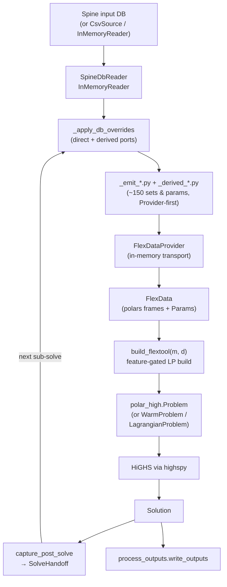

# The engine_polars pipeline

`flextool/engine_polars/` is FlexTool's in-memory optimization engine. It
reads a Spine input DB (or a CSV workdir, or an in-memory test fixture)
into a single typed dataclass, runs ~150 derived-parameter helpers to
populate the rest of the dataclass, builds an LP feature-by-feature on
top of the upstream `polar_high` eDSL, and hands the HiGHS-via-`highspy`
solution off to either the next solve in a cascade or to
`process_outputs`.

This page is the developer-side deep dive — the file map and feature
table are on [architecture.md](architecture.md); here we walk the
pipeline in the order a bug or extension actually traverses it.

!!! note "Two repositories"
    `polar_high` is the standalone LP eDSL — sets, parameters,
    variables, lazy constraint composition, warm-LP machinery,
    Lagrangian driver. `engine_polars` is the FlexTool-side glue:
    it knows the on-disk layout of the input/ + solve_data/ CSVs
    and the shape of FlexTool's optimization model. `polar_high`
    knows nothing of FlexTool.

## Per-solve pipeline



Side-paths off this trunk:

- **Rolling-horizon / nested**: every iteration loops back through
  `overlay` carrying a `SolveHandoff`. When the LP shape is unchanged
  the cascade re-uses the live `WarmProblem`; when it isn't, the
  cascade cold-rebuilds.
- **Stochastic branches**: `_stochastic.py` decorates per-solve
  active-time lists with branch-suffixed periods before `overlay`
  sees them. Branched periods get LP variables; only the realized
  branch contributes to handoff carriers.
- **Spatial Lagrangian**: `_lagrangian.solve_lagrangian` slices a
  single `FlexData` into per-region copies via `_region_filter`,
  builds one sub-problem per region, and couples cross-region
  half-flow pairs with subgradient-updated multipliers.
- **Fast single-solve**: `_fast_load.load_flextool_source_only`
  bypasses the override chain and the CSV writers for a single
  solve fixture with no rolling / nested / stochastic / Lagrangian
  features.

## FlexData — the central data carrier

`FlexData` (in `input.py`) is a `@dataclass` of roughly 220 fields. Five
fields are positional and always present (the time / weighting / node
floor); every other field defaults to `None` and is filled in only when
the scenario exercises the corresponding feature.

The naming convention is documented on the class:

- Sets — index frames, `pl.DataFrame`, no prefix. Example:
  `nodeBalance`, `process_source_sink`, `pss_dt`, `nodeState`,
  `cdt_eq`, `dtttdt`.
- Parameters — numeric `polar_high.Param`, `p_*` prefix. Example:
  `p_inflow`, `p_unitsize`, `p_commodity_price`, `p_step_duration`.
- Variables created later by `build_flextool` are `v_*` for primal
  and `vq_*` for slack.

The contract carried throughout the engine is simple: **a field is
either populated with a non-empty frame / Param, or it is `None`**.
Populating with an *empty* frame is legal — that signals "this feature
class is enabled, but no rows in this partition" (e.g.
`process_source_sink_noEff` empty because every process is in the eff
partition). `None` always means "loader didn't touch this field".

### Data sources

The loaders are stacked on two protocols defined in `_input_source.py`:

| Source | Implementation | When used |
|---|---|---|
| `CsvSource` | `_input_source.py` | Loads from an on-disk `input/` + `solve_data/` workdir. Used by tests and by `load_flextool(path_or_csv_source)` against pre-built fixture workdirs. |
| `SpineDbReader` | `_spinedb_reader.py` | The DB-direct reader — returns one polars frame per `(entity_class, parameter_name)` pair, no CSV roundtrip. Consumed by the override chain in `_apply_db_overrides`, by `_fast_load.load_flextool_source_only`, and by the live cascade entry point `run_chain_from_db`. |
| `InMemoryReader` | `_inmemory_reader.py` | Same `InputSource` protocol as `SpineDbReader`, but driven by an in-memory dict-of-frames fixture. The vehicle for fast unit tests under `tests/engine_polars/`. |

`FlexInputSource` (CSV-shaped) and `InputSource` (per-parameter frame)
are deliberately two protocols, not one: the legacy CSV reader path
walks directories, the DB-direct path requests one parameter at a time.
They coexist — `load_flextool` accepts either, and a Spine DB load
typically uses both (CSV side for the bulky pre-computed sets, DB side
for the parameters the override chain owns).

### Per-field shapes

The shape registry lives in `_param_shapes.py`. Every parameter known
to the engine has an entry in `PARAM_ALLOWED_SHAPES` listing the
shapes FlexTool's preprocessing is allowed to emit (scalar,
`1d_map[period]`, `1d_map[time]`, `2d_map[period,time]`,
`2d_map[time,period]`, …). The resolver
(`resolve_param_shape`) reads the actual nesting depth and per-level
`index_name` labels from the DB, validates against the allow-list, and
raises `FlexToolConfigError` on a mismatch.

This DB-driven validation matters because a 2D parameter authored as
`Map[time, period]` versus `Map[period, time]` has the same column
*names* in polars but the opposite axis semantics. Column-shape
detection misses the difference; the per-level `index_name` doesn't.

## Feature-conditional LP build

`build_flextool(m, d)` is the heart of the engine. It walks a fixed
list of feature blocks and adds variables, constraints, and objective
terms to the `polar_high.Problem` `m` only when the corresponding
fields of `FlexData` `d` are populated.

The feature requirements are declared as module-level tuples at the
top of `model.py`:

```python
ALWAYS = ("dt", "nodeBalance", "nodeBalance_dt",
          "p_step_duration", "p_rp_cost_weight", "p_inflation_op",
          "p_period_share", "p_inflow", "p_penalty_up", "p_penalty_down")
PROCESSES = ("process_source_sink", "process_source_sink_eff",
             "process_source_sink_noEff", "pss_dt", "flow_to_n",
             "flow_from_commodity_eff", "flow_from_commodity_noEff",
             "p_unitsize", "p_flow_upper", "p_slope", "p_commodity_price")
STORAGE = ("nodeState", "nodeState_dt", "dtttdt",
           "p_state_upper", "p_state_unitsize")
ONLINE = ("process_online", "p_online_dt", "p_min_load",
          "dtttdt", "p_process_existing_count")
# ... INDIRECT, CO2_PRICE, CO2_CAP, USER_CSTR, PROFILES,
#     MINLOAD_EFF, STARTUP_COST_LINEAR, STARTUP_COST_INTEGER,
#     RAMP, INVEST, DIVEST
```

`build_flextool` first runs `_check(d, ALWAYS, "always")` to assert the
floor, then inspects each block's switch field (e.g. `nodeState` for
storage, `process_indirect` for CHP) and calls `_check(d, BLOCK,
"name")` when the switch is set. The check is **fail-fast**: if the
switch is set but a required field is `None`, it raises `ValueError`.
No silent degradation.

After validation the body of `build_flextool` becomes a long
straight-line sequence of `if has_<feature>: ...` clauses. Each clause
adds its variables, equation constraints, and objective contributions
in one place. This shape is the **key invariant for extending the
engine**: to add a new feature, declare its required-field tuple,
populate those fields in the loader / writer ports, and gate every
model element you add on the `has_<feature>` boolean.

Before the first feature block, `build_flextool` declares FlexTool's
dense trailing axes once with `m.declare_dense_axes(("d", "t"))` —
`(period, timestep)`. This is an unconditional call requiring
**polar-high>=2.4.0** (the interim `hasattr` capability guard has been
dropped; the version pin lives in `pyproject.toml`). Declaring the dense
axes lets polar-high build the canonical matrix via the block-COO slice
path: the pre-sorted dense axis is sliced as contiguous numpy blocks and
the coefficient factors are multiplied with ufuncs, instead of wide
relational joins. `Sum`-wrapped chains (FlexTool's `Sum`-heavy
nodeBalance / reserves / co2 families) evaluate in a single pass via a
captured `SumBlockMeta` recipe with a relabel fast-path. The block-COO
output is bit-identical to the legacy polars path — the gain is the LP
build's peak memory and wall time, not the LP itself.

### Worked example: STORAGE

The storage block is a representative case:

1. Required fields: `nodeState`, `nodeState_dt`, `dtttdt`,
   `p_state_upper`, `p_state_unitsize`.
2. Variable added: `v_state` indexed by `nodeState_dt = (n, d, t)`,
   upper-bounded by `p_state_upper * p_state_unitsize`.
3. Constraints added: the storage transition rule keyed on `dtttdt`
   (the predecessor-lookup frame from `_timeline.py`), the start-of-
   horizon `storage_fix_start`, and the end-state binding when
   `storage_use_reference_value` is populated.
4. Objective contribution: none directly — slack penalties only.

A bug report like "storage transition wrong at the period boundary"
walks straight back to one of those four fields: most often `dtttdt`
or `storage_bind_forward_only`, both populated by the loader and
inspected here.

### RP-blended-weights inter-period coupling

The `RP_BLENDED_WEIGHTS` feature block (gated on
`d.nodeState_rp.height > 0`, the union of nodes whose
`storage_binding_method` selects one of the blended-weights variants)
adds the variables and constraints that close representative-period
storage state across base periods. The block is structurally an
extension of `STORAGE` and shares the `v_state` declaration; it adds
on top:

| Element | Module | Role |
|---|---|---|
| `v_state_inter[n, b]` | `model.py` | Long-run state at base-period boundaries, free per `(n, b)`. |
| `v_state_rp_start[n, d, t]` | `model.py` | Free starting state at the first step of each RP block. |
| `nodeState_rp_dt` | `_pdt_join.compute_nodeState_rp_dt` | The `(n, d, t)` join used to project `v_state` rows onto the RP cohort. |
| `nodeState_rp_block_first_dt` | `_pdt_join.compute_nodeState_rp_block_first_dt` | Index set for `v_state_rp_start` — RP-block-first `(d, t)` tuples per RP node. |
| `state_change_rp_interior` / `state_change_rp_start` | `model.py` `nodeBalance_eq` terms | Intra-period state-change. Interior steps use the ordinary within-timeset lag; the first step of each RP block replaces the lag with `v_state_rp_start` so each block starts free. |
| `rp_inter_period_balance` | `model.py` | Inter-period balance over `(n, b, b_prev) ∈ nodeState_rp × rp_base_chain`, summing the per-RP-block drift weighted by `p_rp_weight[b, r]` and `p_state_unitsize[n]`. |
| `rp_inter_period_cyclic` | `model.py` | End-to-start closure for the within-solve / within-period variants, indexed over `nodeState_rp × rp_base_first × rp_base_last`. The forward-only variant skips this constraint. |
| `rp_inter_period_max_state` | `model.py` | Capacity bound on `v_state_inter[n, b]` over `(n, b, d) ∈ nodeState_rp × rp_base_period × period_in_use`, tightened by cumulative invest/divest exactly as the ordinary `maxState`. |
| `maxState_rp_start` | `model.py` | Sibling capacity bound on `v_state_rp_start[n, d, t]` over `rp_block_first`. The RP variables don't get per-row `Var.upper` — both bounds are lifted into sibling constraints because `polar_high` doesn't yet support per-row variable bounds. |

The three blended-weights methods that activate the block —
`bind_within_solve_blended_weights`, `bind_within_period_blended_weights`,
and `bind_forward_only_blended_weights` — are projected from the user-side
`storage_binding_method` value list by
`storage_bind_within_solve_blended_weights` /
`storage_bind_within_period_blended_weights` /
`storage_bind_forward_only_blended_weights` in `_projection_params.py`,
which populate the corresponding `FlexData` fields. `nodeState_rp` is
the union (the inter-period constraints all share it); the cyclic
constraint further filters back to the within-solve / within-period
subset because the forward-only variant deliberately leaves the chain
open.

The on-disk `rp_weights` carrier is authored as a flat triple
`(base_start, rep_start, weight)` and decoded by
`_timeline._decode_rp_weights`, which accepts both the nested Map
shape and the flattened list-of-Maps shape Spine produces depending on
import path. Both decode to the same nested
`{base: {rep: weight}}` dict that
`_emit_solve_writers.derive_rp_weights` converts into the per-solve
`rp_weights.csv` frame and that `_emit_solve_writers` derives the
`rp_base_chain`, `rp_base_first`, `rp_base_last`, and `rp_base__rep`
companion sets from. See architecture.md
[Feature blocks in `build_flextool`](architecture.md#feature-blocks-in-build_flextool)
for the entry in the gating table.

## Emitters (formerly writer ports)

About 150 sets and calculated parameters that used to be `param := ...`
declarations in the retired `flextool.mod` are now produced in Python
by the `_emit_*.py` and `_derived_*.py` modules. They all share a
common shape:

- Input: a `FlexData` populated with the prior phases' fields, plus a
  source plugin (`InputSource` or `FlexDataProvider`).
- Output: one or more frames published to `FlexDataProvider` under the
  canonical key declared in `_provider_keys.py`; downstream consumers
  read by key.
- Purity: every helper either fully populates its target keys or
  leaves them absent — no half-populated state.

The split between `_derived_*` and `_emit_*` is historical, not
semantic. The `_emit_*` family ported the modules that wrote
`solve_data/*.csv` in the legacy preprocessing; the `_derived_*`
family ported the modules that produced computed parameters
in-process. Both are now just Python functions writing into the
Provider.

Representative entries:

| Module | Produces |
|---|---|
| `_derived_block.py` | `BlockLayout` fan-out — per-entity blocks, overlap sets, block step durations. |
| `_derived_branch.py` | `period_branch`, `pdt_branch_weight`, `pd_branch_weight` — stochastic branch weighting. |
| `_derived_existing.py` | `p_entity_all_existing`, `p_entity_previously_invested_capacity` — cross-solve existing-capacity composition. |
| `_derived_npv.py` | Annualized investment / divestment carriers feeding the objective. |
| `_derived_profile.py` | `p_profile_value` and the `p_process_existing_count` factor used by profile-bound constraints. |
| `_derived_walks.py` | Backward / forward step lookups (`dtttdt`, `dtttdt_forward_only`, the block-interior variant). |
| `_emit_arc_unions.py` | Arc set algebra: `flow_to_n`, `flow_from_n`, the commodity-flow joins, the reverse-arc additions for connections. |
| `_emit_calc_params.py` | The `pdtX` / `pdX` per-step parameter cascade. |
| `_emit_co2_accumulators.py` | Cumulative-CO2 ladder feeding the CO2-cap constraint. |
| `_emit_pdt_params.py` | The full `pdt_*` family (online indices, varCost frames, …). |
| `_emit_period_calc.py` | `p_period_share`, `complete_period_share_of_year`, `p_timeline_duration_in_years`. |
| `_emit_reserve.py` | Reserve-up / reserve-down set machinery for `_reserve.py`. |
| `_emit_provider_io.py` | The single Provider-funnel (`_emit`, `_provider_key`, `_provider_open`) every emitter routes through. |
| `_vectorize.py` | Shared per-roll vectorize helpers: the entity × dt and entity × period grids (carrying `__eo` / `__to` / `__po` order keys), the dict→lookup lift, the stochastic / parent-period fold, and the `repr()`-based value rendering. |

### Vectorized per-roll emit

The heavy per-step parameter families — `pdtProcess`, `pdtNode`, the
`pdtProcess_{source,sink}` per-side variants, `pdtCommodity`,
`pdtGroup`, and friends — each produce a dense `(entity × dt)` (or
`(entity × period)`) frame. They are derived with vectorized polars,
once per roll, over that roll's own window: there is no cache and no
full-domain frame.

The recipe is the same for every family. First build the dense grid
for the roll with `build_entity_dt_grid` (or `build_entity_period_grid`
for the period-only families) from `_vectorize.py`. The grid is the
cross-product of the entity list and the roll's `(period, time)` list,
and it carries integer order keys (`__eo` for the entity position,
`__to` / `__po` for the time or period position) so that a final
`.sort` on those keys reproduces the intended entity-major,
time-within-entity row order. Next, lift each parameter source into a
small polars lookup frame with `lift_dict_to_lookup` and left-join it
onto the grid. Where a family also has stochastic or parent-period
terms, `build_fold_frame` computes those as a group-by-sum and joins
the result in as one more candidate column. Then `coalesce_value`
picks the first non-null candidate across the cascade branches in
priority order, and `collect_value_frame` collects the graph to a
single Float64 value column, sorts by the order keys, and renders each
value to a string. `derive_pdtProcess_vectorized` in
`_emit_pdt_params.py` is a representative example, and `emit_pdtProcess`
simply publishes its output to the Provider.

Two rules keep the rendered output exact:

- **Render values with the `repr()` loop, never `.cast(Utf8)`.**
  `_render_value_column` walks the value column and emits `repr(v)`
  per cell. A polars `.cast(Utf8)` diverges from `repr` on
  scientific-notation exponent padding and on `NaN`/`nan`, which would
  silently corrupt the emitted text.
- **Lift lookups from the de-duplicated parameter dict, not raw CSV.**
  The parameter dicts the family already builds are last-wins-deduped.
  Lifting a lookup frame straight from the raw CSV would re-introduce
  duplicate join keys and explode the left-join (one grid row matching
  many lookup rows). Always lift from the dict.

### Writer → emitter rename (Phases 1–5)

Every module that used to be `flextool/engine_polars/_writer_*.py`
is now `_emit_*.py`. The accompanying function-level rename moved
`write_X(workdir, ...)` to `emit_X(provider, ...)` — emitters publish
to `FlexDataProvider` first, and any CSV mirror is a side-effect of
`csv_dump=True` rather than the canonical path. The retired surfaces
include the `capture_frames` snapshot helper, the `_PATCH_MODULES`
indirection used by older parity tests, and the transitional
`write_*` aliases that wrapped `emit_*` during the migration; the
`emit_*(provider, ...)` signature is now the only call shape and the
meta-test
`tests/engine_polars/test_meta_provider_invariants.py` forbids disk
reads from any cascade module.

The architectural consequence is that there is no longer a disk-side
hand-off path *inside* the cascade. The Provider is the contract:
emitters `put` under a canonical key, consumers `get` by the same key,
and the workdir CSVs that used to mediate cross-phase data flow are
purely a debug artefact. See architecture.md
[engine_polars/ — the optimization engine](architecture.md#flextoolengine_polars--the-optimization-engine)
for the public-surface narrative and
[Cross-solve state (Provider keys + SolveHandoff)](architecture.md#cross-solve-state-provider-keys--solvehandoff)
for the handoff-key family.

### Topological ordering

Emitters have dependencies — `_derived_existing` reads
`realized_invest` from prior solves' handoffs and `pd_invest_set`
from `_emit_period_params`; `_derived_npv` reads
`ed_lifetime_fixed_cost` which depends on `p_entity_all_existing`;
`_derived_block`'s overlap sets feed the arc-side block aggregation
in `_emit_arc_unions`.

The runner does not compute the order. It is encoded in the call
order of `_apply_db_overrides` (in `input.py`) and the legacy
load sequence in `load_flextool`. Adding a new derived field
typically means appending one call to the right phase.

## FlexDataProvider and override translator

`FlexDataProvider` (`flextool/engine_polars/_flex_data_provider.py`)
is the in-memory dict-of-frames that every cascade module reads from
and writes to. Keys are declared in `_provider_keys.py`; the
convention is `<parent>/<basename>` (e.g. `solve_data/foo`,
`input/bar`, `handoff/realized_invest`). Bare-basename consumer
lookups are resolved against the parent-qualified key, so a single
`put` registers the frame under one canonical name.

Three key families:

| Prefix | Purpose |
|---|---|
| `INPUT_*` | Backend-derived rows the cascade re-reads each iteration (CSV-shaped, populated from the input DB). |
| `SOLVE_DATA_*` | Per-solve sets and parameters that the derivation layer produces (the bulk of the `_emit_*` output). |
| `HANDOFF_*` / `OVERRIDE_*` | Cross-solve handoff carriers and their override siblings; see below. |

### Override translator

`_provider_translators.py` carries two small layers that let the
orchestrator inject external state into the live Provider without
re-running the emit pipeline:

- `translate_handoff_to_provider(handoff, provider)` writes one
  `HANDOFF_*` key per field of a `SolveHandoff`. Empty fields land as
  header-only frames so consumers can use a single
  `provider.get(K.HANDOFF_X).height > 0` check.
- `translate_overrides_to_provider(overrides, provider)` takes a
  caller-supplied `{K.HANDOFF_X: pl.DataFrame, ...}` dict and writes
  each frame under the corresponding `OVERRIDE_X` key. Unknown keys
  are rejected with `ValueError` so the override surface stays
  explicit.

Consumers go through `read_handoff_frame(provider, K.HANDOFF_X)`,
which checks the `OVERRIDE_X` slot first and falls back to the natural
`HANDOFF_X` carrier. A non-empty override shadows the cascade-produced
handoff for that key; an empty override frame falls through cleanly,
so the override layer is opt-in per key.

### Source-tagging and audit dump

`FlexDataProvider.put(key, frame, *, source=None)` accepts an optional
free-form `source` tag retained alongside the frame and surfaced via
`get_source(key)`. Natural-cascade emits leave `source` at the default
`None`; only the override translator currently tags its writes
(`source="external_override"`). Untagged writes carry no entry in the
source map, so the audit surface stays minimal.

`dump_provider_sources(provider, path, solve_name)` iterates every
Provider key whose `get_source(...)` returns non-`None` and appends one
tab-separated line per `(solve_name, key, source)` to the dump path.
The orchestrator invokes it at the end of per-iteration preprocessing
when `FLEXTOOL_AUDIT_SOURCES=1` is set; the log lands at
`<work_folder>/audit_sources.log` and accumulates across sub-solves.
This is the recommended trail for answering "who set this value?" on
override-driven cascades.

## Enum-dtype axis convention

Identity columns in `FlexData` (entity, source, sink, period, time,
group, commodity, …) carry the `pl.Enum` dtype rather than `pl.Utf8`.
The Enum vocabulary is built at the `SpineDBBackend` and
`SpineDbReader` emit boundaries and propagated through the cascade by
`_axis_enums.cast_flexdata_axes` / `cast_value_axes`.

Three column-axis helpers in `_axis_enums.py` make the Enum
preservation mechanical at the call sites where polars would otherwise
drop back to `Utf8`:

- `rename_to_axis(frame, mapping)` — rename columns AND cast to the
  matching axis Enum in one call. Any rename that introduces a
  canonical axis column (`"n"`, `"p"`, `"e"`, `"source"`, `"sink"`,
  `"period"`, …) takes ownership of the dim-column dtype at the rename
  target.
- `alias_to_axis(source, target_axis)` — the sibling for
  `select()`/`with_columns()` projections that rename via alias instead
  of `.rename(...)`. Accepts either a string column name or an
  arbitrary `pl.Expr`.
- `lit_axis(value, axis)` — `pl.lit(value)` that emits the canonical
  axis Enum dtype, so literal tokens injected into axis-aware columns
  don't `SchemaError` against neighbouring Enum frames.

For empty-frame fallbacks the same module exports
`schema_dtype(enums, axis)`, which returns the Enum dtype if a live
vocabulary is set and `pl.Utf8` otherwise. Every site that previously
hard-coded `schema={"e": pl.Utf8, "d": pl.Utf8}` now uses
`schema_dtype(_enums, "e")` so empty frames carry the canonical dtype
without each helper threading the enum dict through.

### Entity-union axis

Mixed-vocab dimension columns (`"source"`, `"sink"`, and anywhere a
join needs to land both sides of a heterogeneous arc) resolve through
the axis-synonym table to the canonical axis `"e"`, a union enum that
covers every entity vocabulary. The convention is: when joining frames
whose dim columns hold different vocabulary subsets, use the union
axis named `"entity"` and cast against the union enum. Never mix
`Enum` and `Utf8` columns in the same join — the polars caster nulls
out the mismatched side silently. The `_axis_enums.align_join_dtypes`
helper normalises both sides before the join in cases where the call
site cannot use one of the rename helpers.

Cross-link: every parameter known to the engine has its expected
shape declared in `_param_shapes.py`, and the axis vocabulary the
parameter's dim columns must satisfy is implicit in the `dims=` tuple
its loader passes to `polar_high.Param`. The two registries together
are the schema contract that the emitters obey and the meta-tests
verify.

## Solve modes

The same `build_flextool` body backs three solver wrappers exported by
`polar_high`. They differ only in what they do *between* solves.

### Monolithic — `polar_high.Problem`

The default. One LP, one HiGHS run. Used for every single-shot solve
and for the cold rebuild path inside a cascade. The
`include_existing_fixed_cost` flag on `build_flextool` toggles the
inclusion of the §8.1 objective constant; default `False` to match
the parquet writer (see the docstring on `build_flextool`).

### Warm-start cascade — `polar_high.WarmProblem`

Rolling-horizon and nested solves rebuild the same LP shell once and
then mutate marked Params between iterations. `_warm.py` carries the
machinery:

- `_STRUCTURAL_FIELDS` — the tuple of `FlexData` fields whose shape
  defines the LP structure. Two consecutive solves are "warm-
  compatible" iff `_fingerprint(d_prev) == _fingerprint(d_next)`.
- `_WARM_PARAMS` — Params that the warm path knows how to push into
  the live HiGHS instance via `changeRowsBounds` /
  `changeColsCost` / per-cell coefficient writes.
- `_MUTABLE_PARAMS` — Params declared mutable on the WarmProblem
  itself; the WarmProblem rebuilds the affected rows on its own.
- `_apply_warm_updates(prev, next, wp)` — the actual update routine.
  Raises `_IncompatibleUpdate` when a Param outside the warm set
  changed, which the cascade catches and falls back to a cold rebuild.

The `OrchestrationStep.warm_used` boolean reports whether each
sub-solve actually warm-updated or cold-rebuilt.

### Spatial Lagrangian — `polar_high.LagrangianProblem`

`_lagrangian.solve_lagrangian` slices `FlexData` by region using
`_region_filter.split_by_region`, which returns a list of
`RegionSplit` (one per region) plus the `HalfFlow` metadata that
describes cross-region arcs. Each region gets its own
`polar_high.Problem`; cross-region half-flow pairs are wrapped in
`CouplingSpec`s and fed to `LagrangianProblem`, which runs the
dual-subgradient iteration.

The FlexTool wrapper handles the FlexTool-side concerns: regional
unitsize, regional profiles, regional handoff state. The actual
multiplier update lives in `polar_high.lagrangian`. See
[decomposition.md](decomposition.md) for the user-facing story and the
parameters that gate this path.

### Fast single-solve — `_fast_load.load_flextool_source_only`

A surgical bypass for single-solve fixtures with no rolling, no
nested, no stochastic, no Lagrangian, and no decomposition. It builds
an empty `FlexData` stub, runs the DB-direct override chain to
populate ~80% of the fields directly from the source, patches in the
remaining topology fields (`process_source_sink`, `pss_dt`,
`flow_to_n` / `flow_from_n`, `nodeBalance_dt`, the commodity-flow
joins, …), and returns. No CSV writers, no preprocessing tempdir, no
handoff plumbing.

The fast path is **non-production**: any helper that demands a
workdir CSV raises `FastLoadError` with the field name and the
missing helper, and the operator either teaches the helper or falls
back to the slow path (`run_chain_from_db`). It exists to amortise
the heavy preprocessing on simple workloads (the motivating fixture
was `test_24h_shipping`).

## Solve-to-solve handoff

When a solve is part of a cascade (rolling-window, nested, or stochastic
sub-solves), each completed solve produces a `SolveHandoff` that seeds
the next solve's preprocessing. The dataclass is in
`_solve_handoff.py`; its eleven optional carriers are all
`pl.DataFrame | None`:

| Field | Shape | Meaning |
|---|---|---|
| `realized_invest` | `[entity, period, value]` | Capacity built in *this* solve, in absolute units. |
| `realized_existing` | `[entity, period, value]` | Resolved existing-capacity history per `(entity, period)`. Captures pre-existing decay + divest that `realized_invest` doesn't. |
| `divest_cumulative` | `[entity, value]` | Cumulative divest per entity. |
| `roll_end_state` | `[node, value]` | `v_state` at the end of this roll, pinning the next roll's first timestep. |
| `upward_roll_end_state` | `[node, value]` | Same shape as `roll_end_state`; dispatch→storage upward feedback in nested cascades. |
| `fix_storage_quantity` | `[node, period, step, p_fix_storage_quantity]` | Parent-imposed storage quota (hard equality). |
| `fix_storage_price` | `[node, period, step, p_fix_storage_price]` | Parent's storage dual fed into `p_storage_state_reference_price`. |
| `fix_storage_usage` | `[node, period, step, p_fix_storage_usage]` | Parent's realized-usage allowance bound on the child via `node_storage_usage_fix_le`. |
| `cumulative_co2` | `[group, period, value]` | Running CO2 totals across rolls. |
| `cumulative_commodity` | `[commodity, tier, period, mwh]` | Per-tier commodity consumption ladder. |
| `cum_sim_hours` | `[period, value]` | Running simulated-hour total per period. |

`build_handoff_from_solution(sol, work_folder, solve_name, ...)` in
`input.py` populates one `SolveHandoff` from the just-completed
solve's `polar_high` Solution plus the per-solve metadata in
`solve_data/`. The cascade transports the carriers through the
Provider's `HANDOFF_*` keys (see
[FlexDataProvider and override translator](#flexdataprovider-and-override-translator));
the `solve_data/<solve>/*.csv` mirrors only exist under
`csv_dump=True` and are not load-bearing for any downstream phase.

The handoff flows back into the next solve through the override
translator + `_apply_db_overrides` chain in `input.py`, which reads
the `HANDOFF_*` Provider keys and translates each carrier into the
next `FlexData`'s `p_entity_*` parameters and the corresponding
`n_*` / `ndt_*` / `p_*` sets (`p_fix_storage_quantity`,
`p_fix_storage_usage`, `p_storage_state_reference_price`, …).

### Fix-storage semantics (Deferred-B wiring)

The three `fix_storage_*` carriers translate into distinct LP wirings
on the child solve:

- `fix_storage_quantity` pins
  `v_state[n, d_upper, t_upper] * p_state_unitsize[n]` to the parent's
  realized state — a hard equality at the boundary timesteps. The
  `node_storage_fix` constraint family is gated on
  `p_fix_storage_quantity` being populated; the supporting sets
  `n_fix_storage_quantity` and `ndt_fix_storage_quantity` are derived
  from the Param frame at load time.
- `fix_storage_price` arrives on the child as a dual carrier folded
  into `p_storage_state_reference_price`. The objective term added by
  `use_reference_price` (model.py §10.1) values `v_state` at the last
  step of every `period_last` by that reference price, so the parent's
  shadow price on storage at the boundary becomes the child's
  end-of-period valuation:

      − Σ_{n ∈ nodeState, (d, t) ∈ period__time_last : d ∈ period_last}
            p_storage_state_reference_price[n, d]
            · v_state[n, d, t] · unitsize[n]
            · rp_cost_weight[d, t] · inflation_op[d] / period_share[d]
            · pdt_branch_weight[d, t]

  The same parameter is also populated for any node whose
  `storage_binding_method` is `use_reference_price`, so the routing is
  unified and the dual carrier merely supplies values for the existing
  term.
- `fix_storage_usage` adds the `node_storage_usage_fix_le` constraint
  (`model.py`, gated on `n_fix_storage_usage` / `ndt_fix_storage_usage`
  / `p_fix_storage_usage` all being populated). The constraint pins
  cumulative realized usage at `nodeState_last_dt` to be at most the
  parent's allowance, indexed over the n_fix_storage_usage subset of
  nodes.

`build_handoff_from_solution` (in `input.py`, formerly
`build_handoff_from_flexpy`) is the producer side: it extracts the
three metrics from the just-completed solution and packs them into the
`SolveHandoff` carrier. Each metric is sourced independently —
quantity from `v_state` at fix-storage timesteps, price from the
`fix_storage_*` row duals, usage from the realised flow integrals —
so a fixture exercising one metric doesn't force the others to be
populated. The HANDOFF carriers
(`HANDOFF_FIX_STORAGE_QUANTITY` / `_PRICE` / `_USAGE` in
`_provider_keys.py`) are the cross-solve transport surface; the
`OVERRIDE_*` siblings let the orchestrator inject parent-imposed
values without re-solving the parent.

### Upward dispatch→storage feedback

The original `SolveHandoff` carried a single `roll_end_state` that
flowed forward in time within one solve's roll chain. In a nested
invest+dispatch cascade the dispatch sub-solve also needs to push its
realised end-of-horizon `v_state` *upward* to the parent storage
solve's next roll — otherwise the parent keeps running on its own
previously-predicted state rather than the dispatch sub-solve's
realised state.

`upward_roll_end_state` (`SolveHandoff` field added by `bb35cd54`) is
the explicit carrier for that path. The producer at
`build_handoff_from_solution` copies the same end-of-horizon `v_state`
into both `roll_end_state` and `upward_roll_end_state` for every
solve; the consumer in `input.py` reads
`HANDOFF_UPWARD_ROLL_END_STATE` first and falls back to
`HANDOFF_ROLL_END_STATE` when the upward key is empty. The carrier is
always-on for any storage→dispatch nesting; no opt-in flag. See
architecture.md
[Solve-to-solve handoff](architecture.md#solve-to-solve-handoff)
for the carrier table.

## Output-writer shape adaptation

The Phase E.1 work made the post-solve output writers in
`flextool/process_outputs/read_parameters.py` shape-aware. The
preprocessing helper `broadcast_to_period_time` returns Params whose
dims match the *authored* Spine shape — `SCALAR` → `(entity,)`,
`MAP_PERIOD` → `(entity, d)`, `MAP_PERIOD_TIME` → `(entity, d, t)`.
`polar_high` broadcasts the lower-dim Params lazily at constraint
emission so the LP doesn't care, but the parquet writers used to
assume the canonical `(entity, d, t)` shape and would crash on any
scalar / period-map authoring.

The fix routes through `_param_shapes.promote_param_to_dt`: every
writer that pivots a Param checks `param.dims` for the presence of
`"d"` and `"t"`, and when either is missing it promotes the Param
against `flex_data.dt` before the pivot. Empty Params take the same
empty-frame fallback as before.

The same shape-tolerance idea shows up in the loader-side
`_node_unitsize_lf` helper (`_derived_params.py`): a node parameter
authored as a Spine `Map` carries the Map's `index_name` on the data
column, which Spine defaults to `x` rather than `period`. The helper
treats any non-`(name, value)` column as the period axis and
`group_by("n").agg(max)` collapses it to one row per node, so a
user-renamed `Map.index_name` works without code changes. The same
pattern reappears in `p_entity_all_existing_from_source` for the
existing-capacity loader.

## Per-solve sets and PDT lookup

A FlexTool scenario may have several solves with overlapping but
distinct time / entity scopes. The per-solve scoping machinery lives
in two places:

- `_per_solve_sets.py` — produces per-active-solve aggregates directly
  from `InputSource`: `period_in_use`, `dt_complete`,
  `period__timeline`, `p_timeline_duration_in_years`,
  `complete_period_share_of_year`. These are the sets that decide
  *which* timesteps and periods the next LP build will see. They are
  computed once per `load_flextool` / per orchestration step and
  reused throughout.
- `_pdt_lookup.py` — the period × time-instant parameter family
  (`pdtProcess`, `pdtNode`, the per-side variants, …). For each
  parameter there is a priority cascade: a period+time default falls
  back to a period default, then a time default, then a class-level
  default, with stochastic and parent-period folds layered on top. The
  derive that actually produces these frames is vectorized and runs
  per roll over the roll's own window — see
  [Vectorized per-roll emit](#vectorized-per-roll-emit) under
  Emitters for how the cascade is evaluated with polars left-joins and
  `coalesce` rather than a per-cell scalar loop.

Together these two modules are how "logical model time" (period
identifiers like `y2025`, branch suffixes like `y2025_low`) is
resolved against the "physical timeline" — the ordered-by-step
timeline that HiGHS sees through `polar_high`.

## Flex-temporal decomposition

`_block_layout.py` and `_derived_block.py` carry the multi-resolution
period-block layout that lets one solve run hourly power dispatch
alongside daily hydrogen dispatch in the same LP. The public surface
is `BlockLayout` — a dataclass produced once per solve, carrying:

- `entity_block` — `(entity, block)` membership.
- `process_side_block` — `(process, side, block)`.
- `block_step_duration` — `(block, period, step, step_duration)`.
- `overlap_set` — `(period, block_coarse, step_coarse, block_fine,
  step_fine, fraction)` — the cross-block aggregation key.
- `block_step_previous` — per-block predecessor 7-tuples (the
  storage-transition lookup, block-aware).
- `block_period_time_first` / `block_period_time_last` — per-block
  period boundaries.

Writer ports become block-aware by joining their output through
`overlap_set` and weighting by `block_step_duration`. Concretely:
the node balance constraint is built on the *daily* block when the
node is hydrogen, but each contributing arc on the *hourly* block
projects its hourly `v_flow` rows up to the daily key via
`arc_sink_block_dt` / `arc_source_block_dt` and the
`p_arc_sink_weight` / `p_arc_source_weight` weights.

Post-solve, every coarse-block variable is expanded back onto the
fine timeline before the writer ports emit results. The expansion
uses the same `overlap_set` (read in reverse) so per-fraction
attribution stays consistent across the solve / write boundary.

The block algorithm has two model-design constraints (not engine
bugs): a two-block-deep limit and an aligned-subsets-only assumption
on the block hierarchy.

## Stochastic branches

`_stochastic.StochasticSolver` reads `solve.stochastic_branches` from
the source DB and decorates each affected period with branch-suffixed
clones (`y2025` becomes `y2025`, `y2025_low`, `y2025_high`, …).
Branches enter the active-time lists and get LP variables; only the
realized branch contributes to `realized_time_lists` and
`fix_storage_time_lists`.

A handful of behavioural quirks preserved verbatim from the legacy
preprocessor:

- **Zero-weight branches**: excluded from `new_active_time_list` but
  still appear in `solve_branch__time_branch_lists` under certain
  three-way conditions on `branch != period` and the realized flag.
- **Sticky branch suffixes across periods**: when a roll's jump
  exceeds a period length, branches continue into subsequent periods
  reusing the same `period + "_" + branch` naming.
- **Single realized branch per period** (otherwise loud failure).
- **R-O6 invariant**: branches do NOT enter `invest_periods`.
  Investment stays realized-only; recourse-invest is a future
  capability requiring a deeper refactor.

The non-anticipativity constraints (`_add_non_anticipativity_constraints`
in `model.py`) close the LP back together at the anchor period across
sibling branches — there are four families covering `v_state`,
`v_online`, `v_reserve`, and `v_flow`. The implementation pins the
sibling-branch variables via Var renaming (`d → b`) so the engine's
join routes the same Var through two key columns at once.

## Auto-scaling and the slack convention

FlexTool's LP can accumulate coefficients spanning many decades —
think a 10 kW heat pump alongside a 10 GW grid. The scaling pipeline
runs on every solve and is documented end-to-end in
[scaling.md](scaling.md); the slack-variable side is documented in
[slack_convention.md](slack_convention.md). One-line summary:

- `autoscale._ranges.compute_ranges` (Layer 1) walks the assembled
  LP and reports matrix / cost / bound / RHS log10 ranges and the
  cross-group max-ratio that gates whether Layers 2/3 fire. The range
  readout routes through polar-high's `bounded_coefficient_walk`
  (requires polar-high>=2.4.0): it iterates the constraint / column
  spine in fixed row-batches and never materialises the wide coefficient
  product to read its min/max. The former size-blind family-row cap is
  retired, so every family's range is bounded and folded into the report.
- `autoscale._layer2.apply_layer2` (Layer 2) applies per-quantity-type
  power-of-2 column scalers; its magnitude-bucketing readout also walks
  the spine in bounded row-batches via `bounded_coefficient_walk` (the
  log2-magnitude histogram reducer) instead of collecting the wide
  product, and with the cap gone every family's magnitudes feed the
  scaling decision (no silent coverage gap). `autoscale._layer3.apply_layer3`
  (Layer 3) folds the HiGHS-native `user_bound_scale` and the escape
  valve in a single pass.
- `--scaling={off,solver_only,basic,full}` (or `FLEXTOOL_SCALING=<mode>`)
  selects the autoscale strategy; `off` disables the whole package
  (default is `full`). `--user-bound-scale N` pins Layer 3 manually.
- `autoscale._report.write_report` writes
  `solve_data/autoscale_<solve>.yaml` after each solve; the same
  module's `format_console_summary` prints a one-liner verdict and
  `format_nonoptimal_hint` triggers only on HiGHS non-optimal.
- Output un-scaling happens in
  `flextool/process_outputs/read_highs_solution.py` via the
  `unscale_by` field on each `VariableSpec`, applying both the
  Layer 2 and Layer 3 reverse maps.

The scaling pipeline never changes the LP optimum — every transform
is reversible and the reverse is wired into the output writer.

## Public API

`flextool.engine_polars`'s public surface (see `__init__.py`) is
small. Repeating the table from
[architecture.md](architecture.md) with deeper notes:

| Symbol | Notes |
|---|---|
| `FlexData` | The single input dataclass. Everything else either produces it, consumes it, or transforms it in place. Modifying its field list is the cardinal extension act. |
| `load_flextool(source, ...)` | CSV-shaped loader. Source may be a `Path`, a `str`, or a `CsvSource`. Accepts an optional `InputSource` override for migrated parameters. In the live cascade it is driven by `_drive_cascade` against a pre-built workdir whose Provider serves every read in-memory. |
| `load_flextool_source_only(reader, ...)` | Fast path. Raises `FastLoadError` on any feature it can't synthesise. |
| `build_flextool(m, d, *, include_existing_fixed_cost=False, scale_the_objective=1.0)` | The model build. `m` is a fresh `Problem` / `WarmProblem`; `d` is the populated `FlexData`. Returns `None`; mutates `m` in place. |
| `run_chain(steps, ...)` | Thin compat shim around `run_chain_from_db`. Kept for callers that still hand-construct `ChainStep` lists. |
| `run_chain_from_db(db_url, work_folder, ...)` | The canonical multi-solve driver. Walks the solve list, calls `_drive_cascade` per solve, threads `SolveHandoff` between iterations. |
| `run_orchestration(state, work_folder, ...)` | One layer below `run_chain_from_db`. Takes a pre-built `RunnerState` (with `SolveConfig` and `TimelineConfig` already resolved) and drives the cascade. The intended entry point from the GUI / Spine Toolbox layer. |
| `run_single_solve_from_db(...)` | Surgical fast path. Pairs with `load_flextool_source_only`. |
| `SolveHandoff` | The carrier dataclass. Optional fields covering invest / divest / fix-storage / cumulative ladders / roll-end state (incl. the upward variant). `is_empty()` returns True when nothing fired. Populated by `build_handoff_from_solution` (in `input.py`); the older disk-read `capture_post_solve` constructor was retired when the cascade fell through to Provider/CSV reads in all production paths. |
| `OrchestrationStep` | Per-solve result. Carries `solve_name`, `solution`, `handoff`, `warm_used`. |
| `ChainStep` | Per-sub-solve result of the compat shim. Same shape as `OrchestrationStep`. |
| `FlexInputSource` / `CsvSource` | The CSV-shaped source protocol family. |
| `InputSource` / `SpineDbReader` / `InMemoryReader` | The per-parameter-frame source protocol family. |
| `FastLoadError` | Raised by the fast path when it can't synthesise a required field. |

## Where to start when…

| You want to… | Start at | Then read |
|---|---|---|
| Add a constraint that uses only existing parameters | `model.py` `build_flextool` body | The closest existing feature block. Wrap your additions in `if has_<feature>:` and skip a new requirement tuple. |
| Add a new input parameter | `_param_shapes.py` `PARAM_ALLOWED_SHAPES` | Add the parameter's entry, then populate it in `_direct_params.py` (trivial DB read) or a new `_derived_*.py` (computed). Add the field to `FlexData`. Add it to the relevant feature's required-field tuple in `model.py`. |
| Add a new pre-solve set / index | `_per_solve_sets.py` if it's per-active-solve; a new `_emit_*.py` otherwise | Wire the new function into `_apply_db_overrides` in `input.py` (slow path) and the topology patch in `_fast_load.py` (fast path, if applicable). |
| Add a new feature block | `model.py` requirement tuples | Declare your `MY_FEATURE = (...)` tuple. Inspect a switch field via `has_my_feature = d.<switch> is not None and d.<switch>.height > 0`. Wrap the variable / constraint / objective additions in `if has_my_feature:`. Add a `_check(d, MY_FEATURE, "my_feature")` call alongside the existing ones. |
| Trace a numerical issue | `solve_data/autoscale_<solve>.yaml` | The Layer 1 ranges + Layer 2/3 plans show which families are wide and which scalers fired. Cross-link: [scaling.md](scaling.md). |
| Trace a feasibility issue | `vq_*` outputs in `output_parquet/` | Slack activity localises the infeasibility to a row family. Cross-link: [slack_convention.md](slack_convention.md). |
| Add a new decomposition mode | `_lagrangian.py` for spatial, `_warm.py` + `_orchestration.py` `_drive_cascade` for temporal | Each carries the FlexTool-side glue around a `polar_high` driver. Read [decomposition.md](decomposition.md) first. |
| Speed up a single-solve scenario | `_fast_load.load_flextool_source_only` | If `FastLoadError` fires, either teach the missing helper to read directly from `InputSource`, or fall back to `run_chain_from_db`. |
| Trace a wrong-period bug in rolling horizon | `_apply_db_overrides` in `input.py` | The handoff translation site. Cross-check against the `SolveHandoff` fields populated by `capture_post_solve`. |
| Trace a warm-LP divergence | `_warm._STRUCTURAL_FIELDS`, `_warm._WARM_PARAMS` | A divergence usually means a structural field changed (add it to `_STRUCTURAL_FIELDS`) or a Param outside the warm set was mutated (add it to `_WARM_PARAMS` and write the `_apply_warm_updates` clause). |
| Add a new variable / dual to the parquet output | `flextool/process_outputs/read_highs_solution.VARIABLE_SPECS` | Append one `VariableSpec`. No engine-side change required. |

## Conventions worth knowing

A few cross-cutting conventions that aren't obvious from a single
file:

- **Lazy at the rim, eager at the boundary.** Internal frames are
  `pl.LazyFrame`; helpers `.collect()` once at the function boundary.
  This is the pattern documented at the top of `_derived_params.py`
  and `_per_solve_sets.py`.
- **None-skip is canonical.** A field at `None` means "feature not
  active" and is the recommended way to opt out. Empty frames mean
  "active but no rows". Helpers that downstream this distinction
  should never silently coerce `None` into an empty frame.
- **Provider is authoritative; CSVs are debug-only.** Cross-phase
  data inside the cascade moves through `FlexDataProvider`. The
  `solve_data/<solve>/*.csv` mirrors only exist under `csv_dump=True`
  and are not load-bearing — the meta-test
  `tests/engine_polars/test_meta_provider_invariants.py` forbids
  disk reads from any cascade module.
- **One funnel per source.** All Provider reads inside emitter
  modules go through `_emit_provider_io._provider_open` /
  `_provider_key`. All Spine DB reads go through
  `SpineDbReader.parameter()`. Adding a new reader site is a smell;
  route through the existing funnel.
- **Fail loud on schema surprises.** The codebase prefers
  `FlexToolConfigError` / `ValueError` / `NotImplementedError` over
  silent fallbacks. The retired preprocessor was full of defensive
  branches that masked bugs; the engine_polars port deliberately
  walks back to the input the moment a shape doesn't match.

## Cross-references

- [architecture.md](architecture.md) — the higher-level package map
  and the cross-package data-flow diagram.
- [scaling.md](scaling.md) — the full scaling pipeline.
- [slack_convention.md](slack_convention.md) — the `vq_*` convention.
- [decomposition.md](decomposition.md) — spatial and temporal
  decomposition.
- [db_schema.md](db_schema.md) — the Spine input DB schema.
- [testing.md](testing.md) — how the engine_polars unit and parity
  tests are organised.
