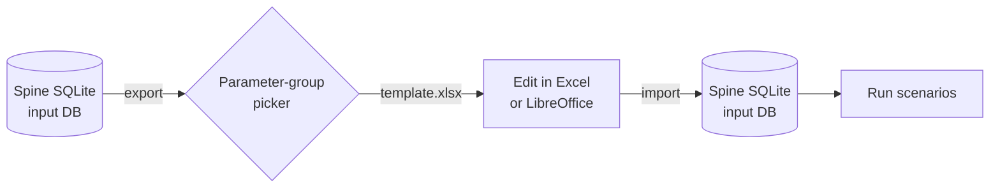

# Excel as input/output

FlexTool stores its data in Spine SQLite databases. The default editor is the
[Spine database editor](spine_database.md), but the same data can also be
round-tripped through a single Excel (`.xlsx`) workbook. The *modelling
content* is identical regardless of which editor you use — only the editing
UX changes. The same workbook can be exported, edited, and re-imported any
number of times.

!!! note "Excel is a stand-in for any compatible spreadsheet"
    Everywhere this page says "Excel", LibreOffice Calc works the same way.
    FlexTool reads and writes the OpenXML `.xlsx` format directly via
    `openpyxl`; no Microsoft Office installation is required at any step.

## When to choose Excel over the database editor

- You like to keep your scenario data in spreadsheets.
- You want a single, self-contained file for review and
  for sharing.
- You are doing bulk edits — copy/paste, fill-down, find-and-replace — that
  are awkward in the relational editor (although you can copy paste from
  spreadsheet to the Spine DB editor)
- You need to hand the file to a collaborator who does not have Spine Toolbox
  installed.

If none of these apply, stay in the Spine database editor: edits are
type-checked and committed directly to the DB, with no export/import step.

## The export, edit, import loop



Exporting produces a workbook whose every sheet carries the metadata needed
to read it back later (the *v2 self-describing* format). Edit the file in
any spreadsheet, then import it into a fresh or existing Spine DB. Sheets
that were dropped during export — for example because their parameter group
was unchecked — simply remain absent from the workbook and are not touched
on import.

## Exporting an Excel template

### From the FlexTool GUI

In the **Add input source** dialog, choose **Add empty FlexTool input
Excel**. The GUI initialises a temporary template DB from the master JSON
template, reads its parameter groups, and opens the **group picker**:

- The picker is **DB-driven** — the checkbox list is built from the input
  DB's actual schema, so it always matches the parameters the running
  FlexTool version knows about.
- The **required** groups for a functioning model — `timeline`, `model`,
  `solve_basics`, `basics` — are pinned to the top, highlighted, and
  pre-checked. A hover tooltip explains why they are recommended.
- Bulk buttons let you switch between **Select all**, **Required only**, and
  **Clear all**.
- Colours follow the active ttk theme, so the picker stays readable in
  both light and dark modes.

!!! tip "Smaller is usually better"
    Unchecking groups you don't intend to edit produces a slimmer workbook
    with fewer sheets to navigate. You can always re-export with more
    groups later — the underlying DB is unchanged.

After clicking **OK**, the workbook is saved into your project's
`input_sources` directory.

### From the terminal

The same export is available without the GUI:

```bash
python -m flextool.cli.cmd_export_to_tabular \
    sqlite:///input_data.sqlite \
    input_template.xlsx
```

Useful flags:

| Flag | Effect |
|------|--------|
| `--groups timeline,model,solve_basics,basics` | Restrict to the listed parameter groups (same semantics as the GUI picker). Sheets that lose all their columns are dropped, unless listed in `always_include_with_groups` in `export_settings.yaml`. |
| `--include-advanced` | Include advanced sheets (solve sequences, periods available, stochastic data) even when empty. |
| `--old-format` | Emit the legacy v1 layout instead of v2 self-describing — only needed for tooling pinned to the older format. |

A realistic minimal-template export:

```bash
python -m flextool.cli.cmd_export_to_tabular \
    sqlite:///input_data.sqlite \
    starter.xlsx \
    --groups timeline,model,solve_basics,basics
```

## Editing in Excel or LibreOffice

The exported workbook uses the **v2 self-describing** format. Each sheet
embeds its own header describing what it contains:

- A **definition row** labels each column (`alternative`, `entity: node`,
  `parameter: ...`, `index: ...`, etc.).
- A **definition column** labels metadata rows (`description`,
  `data type`, `parameter`, ...).
- Their intersection — the **crossing point** — is auto-discovered by the
  reader, so adding rows or columns above the data block is safe as long
  as the header keywords stay intact.

A few practical notes:

- Sheets whose parameter group was not selected at export time are simply
  absent. Re-export later if you decide to start editing them.
- When **any** parameter on a sheet carries a database default, a
  **default-value row** is rendered above the data. `Map`- and `Array`-
  typed defaults are stringified for display; you should not normally need
  to edit this row.
- A `navigate` sheet acts as an index/table of contents and the schema
  version is recorded there as well. The importer skips `navigate` and
  `version` on read.
- Tab colours mirror the navigate groups configured in
  `export_settings.yaml`, which makes related sheets easy to spot.

!!! warning "Locale and scientific notation"
    LibreOffice and Excel can disagree on number locale (comma vs. dot)
    and on whether very large or very small numbers are rendered in
    scientific notation. If you exchange files across both tools, lock the
    spreadsheet locale to one convention (typically English/US) and the
    column format to plain `Number` for data columns.

## Importing edited data back

### From the FlexTool GUI

Add the edited `.xlsx` as an input source via the **Add input source**
dialog. The GUI treats a workbook the same way it treats a Spine DB input
— when a scenario runs, FlexTool reads the workbook and feeds the merged
data to the engine. If you prefer a persistent DB, use the **Convert**
action to materialise the workbook into a Spine SQLite file once, then
keep editing the DB directly.

### From the terminal

For v2 (self-describing) workbooks — the canonical format going forward:

```bash
python -m flextool.cli.cmd_read_self_describing_tabular_input \
    edited.xlsx \
    sqlite:///input_data.sqlite
```

For v1 specification-driven workbooks — kept for backwards compatibility:

```bash
python -m flextool.cli.cmd_read_tabular_input \
    sqlite:///input_data.sqlite \
    --tabular-file-path edited.xlsx
```

!!! note "v2 is the canonical format"
    New code paths and the GUI's **Add empty FlexTool input Excel** action
    always produce v2 workbooks. The v1 reader stays available for files
    produced before the self-describing layout was introduced, and a
    separate reader handles legacy `.xlsm` files from very old FlexTool
    releases — but no new features are being added to either of them.

## Round-trip and version control

On a well-formed DB, **export followed by re-import is idempotent** at the
modelling-content level: only the edits you actually make should show up
as a meaningful diff. That makes Excel a reasonable medium for PR-based
review of model data — reviewers can open the workbook, flip through the
sheets, and compare two checked-in versions side by side.

## Limitations

- Very large time-series sheets (tens of thousands of rows) render slowly
  in both Excel and LibreOffice. Consider editing them as CSV or keeping
  them in the database when bulk data is involved.
- The `--groups` flag drops sheets whose columns are *all* filtered out;
  if you need a structural sheet to stay around even when empty, add it
  to `always_include_with_groups` in `export_settings.yaml`.
- Multi-dimensional parameters (`2d_map`, `3d_map`, `4d_map`) are laid out
  with extra index columns; reshape these with care, and re-export if you
  want a clean baseline.
- Excel and LibreOffice may disagree on number locale and scientific
  notation — see the warning above.

## See also

- [Spine database editor](spine_database.md) — the default alternative
  editor.
- [FlexTool GUI](flextool_gui_interface.md) — where the Excel-related
  actions live.
- [Terminal / CLI](terminal_workflow.md) — for scripted export and import.
- [Choosing an interface](interface_overview.md) — high-level comparison.
