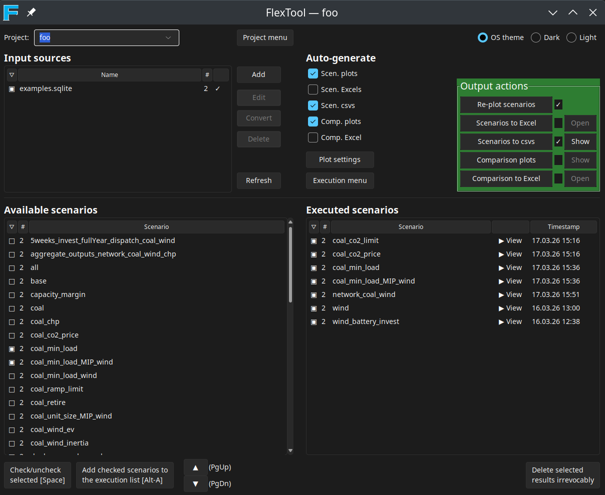

# FlexTool GUI

The FlexTool GUI is a standalone graphical user interface for managing input data, executing scenarios, and generating outputs (plots, Excel files, CSVs). It provides a single-window workflow for the most common FlexTool tasks.

## Starting the GUI

After installing FlexTool (see [installation instructions](install_toolbox.md)), start the GUI from the FlexTool directory:

```
python -m flextool.gui
```

## Overview



The GUI window is divided into the following areas:

### Project

The top bar contains the **Project** selector. Each project has its own input sources, execution history, and settings. Use the **Project menu** to create, rename, or delete projects. Projects are stored in the `projects/` directory under the FlexTool installation.

### Input sources

The **Input sources** panel lists the data files (`.sqlite` or `.xlsx`) in the project's `input_sources/` directory. Each input source can contain one or more scenarios.

- **Add**: Add a new input source file to the project.
- **Edit**: Open the selected input source for editing. Double-clicking a row does the same. SQLite files open in the Spine database editor; Excel files open in the default spreadsheet application.
- **Convert**: Convert an Excel input source to a SQLite database.
- **Delete**: Remove the selected input source from the project.

Use the checkboxes to filter which input sources contribute scenarios to the **Available scenarios** list.

### Available scenarios

Lists all scenarios found in the checked input sources. Check the scenarios you want to run and press **Add checked scenarios to the execution list** (or Alt-A) to queue them for execution. Scenarios already pending or running in the execution list will be skipped.

### Executed scenarios

Shows scenarios that have been executed, along with their timestamps. Click **View** to open the scenario's plot directory. Use the checkboxes to select scenarios for output actions.

### Auto-generate

Select which outputs to generate automatically after each scenario execution completes: plots, Excel files, CSVs, comparison plots, and comparison Excel.

### Output actions

Manually trigger output generation for the checked executed scenarios:

- **Re-plot scenarios**: Regenerate plots for the selected scenarios.
- **Scenarios to Excel / CSVs**: Export results to Excel or CSV files.
- **Comparison plots**: Generate cross-scenario comparison plots.
- **Comparison to Excel**: Export comparison data to Excel.

The **Show** and **Open** buttons next to each action open the most recent output.

### Plot settings

Click **Plot settings** to configure plot generation for both single-scenario and comparison plots:

- **Start timestep** and **Duration**: Control the time range to plot.
- **Plot config file**: Select a YAML configuration file that defines which plots to generate and how.
- **Dispatch plots** (comparison only): Toggle whether dispatch time-series plots are included in comparisons.
- **Active configs**: Choose which named configurations from the config file are active.

### Execution menu

Click **Execution menu** to open the execution window, which shows the status of all queued and completed jobs. From there you can pause, resume, kill, reorder, or remove jobs.

## Theme

Use the **OS theme / Dark / Light** radio buttons in the top-right corner to switch between colour themes.
