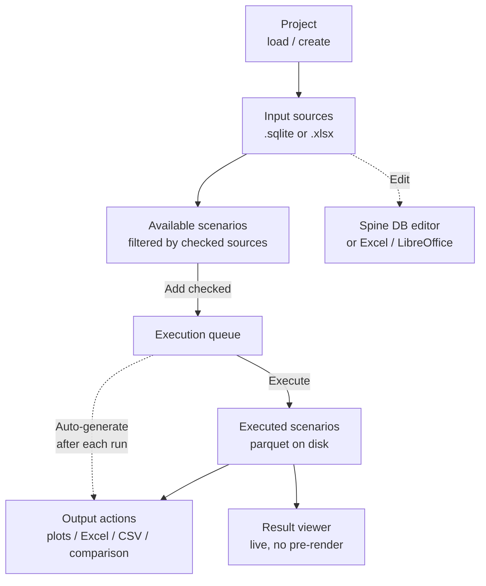

# FlexTool GUI

The FlexTool GUI is a standalone Tkinter application and the **primary** way to use FlexTool. It manages projects, input sources, scenario execution, and output generation in a single window. Start it from the FlexTool installation directory with:

```
python -m flextool.gui
```

[Spine Toolbox](spine_toolbox.md) is the supported alternative interface (workflow-oriented), and [Excel / LibreOffice](excel_interface.md) is the parallel data editor for the same input sources.


## Workflow at a glance



The two side-paths matter: editing an input source jumps out to the Spine database editor or a spreadsheet app, and **Auto-generate** runs selected output actions automatically after each execution.

## Top bar: Project

Each project lives in `projects/<name>/` and owns its own input sources, execution history, and `settings.yaml`. The **Project** drop-down switches between projects; **Project menu** opens the project dialog for create / rename / delete. F2 or double-click on the drop-down renames the current project. The most recently used project is reopened on the next launch.

The **OS / Dark / Light** radio buttons on the top right select the theme. A theme change takes effect on the next launch.

## Input sources

The **Input sources** panel lists every `.sqlite` and `.xlsx` file in the project's `input_sources/` directory. Each input source contributes one or more scenarios.

| Action | Effect |
| --- | --- |
| Add | Add a new `.xlsx` or `.sqlite` source. Imports are migrated to the current FlexTool DB version automatically. |
| Edit | SQLite opens in the Spine database editor; Excel opens in the OS default spreadsheet app. Double-click does the same. |
| Convert | Convert an `.xlsx` input source to a SQLite database. |
| Delete | Remove the selected source from the project. |
| Refresh | Rescan `input_sources/` on disk. |

The **checkbox** next to each source decides whether its scenarios appear in **Available scenarios**. Right-click a row for the same actions as the buttons. Column headers sort the list; the active sort direction is shown by a small arrow.

Excel input is described in [Excel interface](excel_interface.md); the Spine database editor is described in [Spine database](spine_database.md).

### Add empty FlexTool input Excel

When you choose **Add → empty Excel**, the **parameter-group picker** dialog opens. Every parameter group from the FlexTool template is listed as a checkbox row. Required groups (currently `timeline`, `model`, `solve_basics`, `basics`) are highlighted at the top of the list with a yellow tint and a hover tooltip explaining that they are required for a functioning model, but can still be unchecked when assembling a model from several input sources. Bulk-action buttons select all, select required only, or clear all. The highlight colour adapts to the active dark / light theme.

See [Excel interface](excel_interface.md) for the resulting file structure.

## Available scenarios `[V]`

Lists every scenario found in the **checked** input sources. The header text `[V]` is the keyboard shortcut: press **V** to focus the list.

| Key | Action |
| --- | --- |
| V | Focus the Available scenarios list |
| A | Select all rows |
| Space | Check / uncheck the selected rows |
| Alt-A | Add checked scenarios to the execution queue |
| F9 | Same as Alt-A |
| Click column header | Sort by that column |
| Right-click | Check selected / Add selected to execution jobs |

The **Add checked scenarios to the execution list** button queues every checked row. Scenarios already pending or running are skipped.

## Executed scenarios `[X]`

A row appears here as soon as a scenario produces a parquet result tree under `output_parquet/<scenario>/`. Parquet is the canonical result format — every other output is derived from it.

| Key | Action |
| --- | --- |
| X | Focus the Executed scenarios list |
| E | Check / uncheck all rows |
| Space | Check / uncheck the selected rows |
| Right-click | Check selected / View results / Delete irrevocably |
| Click the **View** column | Open the scenario's plot directory |

The **Delete selected results irrevocably** button removes the parquet (and any derived plots / Excel / CSV) from disk.

## Auto-generate

The **Auto-generate** checkboxes pick which derived outputs are produced after **each** successful execution:

- Scenario plots
- Scenario Excels
- Scenario csvs
- Comparison plots
- Comparison Excel

!!! note "Parquet is always written"
    Parquet output is always written for an executed scenario, regardless of Auto-generate settings. Auto-generate only controls the derived artefacts. Png / Excel / CSV outputs can always be (re-)generated later from the parquet files via **Output actions**.

## Output actions

The **Output actions** box runs the same generators on demand, for the **checked** executed scenarios. A green tint on the frame signals at least one generator is currently running.

| Button | What it does | Helper |
| --- | --- | --- |
| Re-plot scenarios | Regenerate scenario plots from parquet | Show plot folder |
| Scenarios to Excel | Export each scenario's results to `output_excel/<scenario>.xlsx` | Show latest Excel |
| Scenarios to csvs | Export each scenario's results to `output_csv/<scenario>/` | Show CSV folder |
| Comparison pngs | Cross-scenario comparison plots into `output_plot_comparisons/` | Show folder |
| Comparison to Excel | Cross-scenario comparison workbook | Open file |
| Results viewer | Open the Result viewer (see below) | — |

Status conventions next to each row: blank = not run, **spinner** = running, **✓** = produced this session, **⊘** = produced but the file is missing.

## Png settings

**Png settings** (top-right of the central column) opens the plot configuration dialog, with separate sections for **scenario** and **scenario-comparison** plots:

- **Start timestep** — first timestep to include in the plot range.
- **Duration** — number of timesteps to plot (0 = until the end of the data).
- **Plot config file** — YAML config defining what plots to render and how. The shipped defaults live under `templates/`.
- **Active configs** — checkbox list of named configurations from the chosen file. Only checked configs are rendered.
- **Dispatch plots** *(comparison section only)* — toggle whether dispatch time-series plots are included in comparisons. The companion **Edit dispatch plots…** button opens a YAML editor for the dispatch config.

The dialog is purely a configuration step; rendering happens via **Output actions → Re-plot scenarios** (or automatically through **Auto-generate**).

## Execution jobs

The **Execution jobs** button opens a separate execution window dedicated to queue management.

### Resource controls

Three numeric controls cap the watchdog's behaviour. The hover tooltips on the spinboxes are the canonical descriptions:

- **Memory budget/job (GB, 0 = auto)** — soft target. Jobs are allowed to exceed it when memory is available, and the watchdog only enforces it when memory pressure forces a choice. In **auto** mode, every successful run records its measured peak ×1.5 as the budget for the next run, persisted to the project's `settings.yaml`. First-run fallback is `(system memory − reserve) ÷ max parallel jobs`.
- **Min free RAM (GB)** — floor for system free memory. The watchdog acts only when this floor is breached **and** the swap allowance is exhausted; as long as free RAM stays above this threshold, no job is killed.
- **Allow swap (GB)** — how much swap **growth** to tolerate (measured since FlexTool started; pre-existing system swap is ignored). When both the free-RAM floor is breached and this allowance is used up, the watchdog kills whichever running job is most over its budget. `0` means no swap headroom.

Together these settings let FlexTool absorb oversized-scenario pressure without taking the host system down.

### Queue controls

The **Max. parallel executions** and **Cores per job** spinboxes sit on the same toolbar. The jobs table on the left lists every queued, running, finished, or killed job. Per-job actions:

- **▲ / ▼ (PgUp / PgDn)** — reorder pending jobs.
- **Kill selected** — terminate selected running or pending jobs.
- **Remove selected** — drop finished or killed rows from the list.
- **Pause executions / Continue executions** — pause the scheduler so already-running jobs finish but no new ones start.
- **Kill all** — terminate everything that is running or pending.

A live progress pane on the right shows log output from the currently selected job.

## Result viewer

The **Result viewer** is its own window. It reads scenarios directly from parquet, so navigation is live and is **not** constrained by the Png settings (start timestep, duration, etc.); png plot settings only affect pre-rendered PNG output.

| Key | Action |
| --- | --- |
| S | Focus the Scenarios list |
| P | Focus the Plots list |
| V | Switch to single-scenario view |
| X | Switch to comparison view |
| ↑ / ↓ | Navigate scenarios / plots |
| ← / → | Previous / next variant in the current plot |
| PgUp / PgDn | Previous / next variant (alias) |
| Ctrl-A | Select all comparison rows |
| Alt-↑ / Alt-↓ | Reorder comparison rows |
| Tab | Cycle focus between the three panes |

Click the **Results viewer** button under Output actions, or **View results** in the right-click menu of an executed scenario, to open it. Closing the main window also closes the viewer.

## Where things live on disk

- `projects/<project>/input_sources/` — `.xlsx` and `.sqlite` input files.
- `projects/<project>/settings.yaml` — project settings, including learned memory budgets and active plot configs.
- `output_parquet/<scenario>/` — canonical results (always written).
- `output_plots/<scenario>/` — PNGs from scenario plots.
- `output_excel/<scenario>.xlsx` — Excel export of one scenario.
- `output_csv/<scenario>/` — CSV export of one scenario.
- `output_plot_comparisons/` — comparison plots and Excel workbook.
- `output_parquet_comparison/` — parquet feeding the comparison plots and viewer.

## See also

- [Installing the GUI](install_gui.md)
- [Interface overview](interface_overview.md) — which interface to pick
- [Excel interface](excel_interface.md) — the parallel spreadsheet editor
- [Spine database](spine_database.md) — the SQLite input format
- [Spine Toolbox](spine_toolbox.md) — the workflow alternative
- [Architecture](dev/architecture.md) — what runs under the hood
