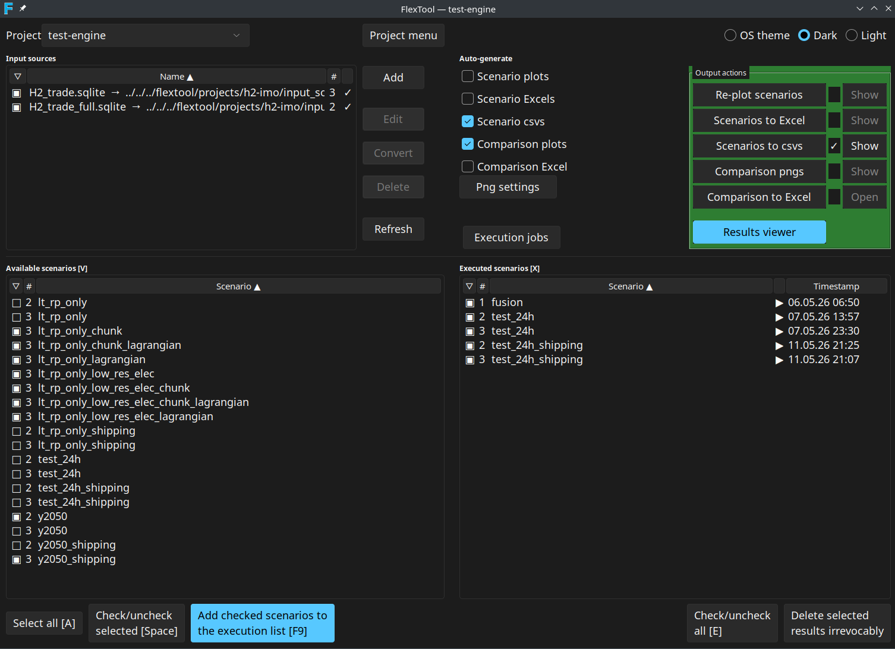

# FlexTool GUI

The FlexTool GUI is a standalone Tkinter application and the **primary** way to use FlexTool. It manages projects, input sources, scenario execution, and output generation in a single window. Start it from the FlexTool installation directory with:

```
python -m flextool.gui
```

See [Install with FlexTool GUI](install_gui.md) for installation, and [Architecture](dev/architecture.md) for what the GUI does under the hood. [Spine Toolbox](spine_toolbox.md) is the workflow-oriented alternative interface, and [Excel / LibreOffice](excel_interface.md) is the parallel spreadsheet editor for the same input sources. For headless / CI use see the [Terminal CLI](terminal_workflow.md).



## Workflow at a glance


Editing an input source jumps out to the Spine database editor or a spreadsheet application. The **Auto-gen** column on the Outputs table controls which derived artefacts are produced automatically after each successful execution.

## Top bar: Project

Each project lives in `projects/<name>/` and owns its own input sources, execution history, and `settings.yaml`. The **Project** drop-down switches between projects; **Project menu** opens a popup with:

- **Manage projects…** — create / rename / delete projects.
- **UI font size** — radio choices (9, 10, 11, 12, 14 pt) plus **Custom…** to enter any integer between 6 and 32. The chosen size is applied live to every named Tk font (body / menu / heading / tooltip / fixed) and persisted to `projects/projects.yaml`. See [Display and fonts](#display-and-fonts).
- **Reset window layout** — clears saved window sizes and sash positions for the result viewer and execution window. Any open viewer or execution window is closed; their defaults apply the next time they open.

F2 or double-click on the drop-down renames the current project. The most recently used project is reopened on the next launch.

## Input sources

The **Input sources** panel lists every `.sqlite` and `.xlsx` file in the project's `input_sources/` directory plus any registered external references. Each input source contributes one or more scenarios.

| Action | Effect |
| --- | --- |
| Add | Add a new `.xlsx` or `.sqlite` source. Imports are migrated to the current FlexTool DB version automatically. |
| Edit | SQLite opens in the Spine database editor; Excel opens in the OS default spreadsheet app. Double-click does the same. |
| Convert | Convert an `.xlsx` input source to a SQLite database. |
| Delete | Remove the selected source from the project. External references unlink the reference; the file on disk is untouched. |
| Refresh | Rescan `input_sources/` on disk. |

The **checkbox** column decides whether the source's scenarios appear in **Available scenarios**. The **#** column is the source's persistent number — it is assigned the first time the source is seen and stored in `settings.yaml` (`input_source_numbers`). When a source is deleted its number is freed only when no executed-scenario folder on disk still references it; the next new source picks the lowest free number, so a deleted slot is reused once its outputs are also cleaned up. Hovering over a row with an error, empty, or "editing" status shows a Toplevel tooltip explaining the status; external references show their POSIX path relative to the project root and a reminder that **Delete** only removes the reference.

Right-click a row for the same actions as the buttons. Column headers sort the list; the active sort direction is shown by a small arrow.

Excel input is described in [Excel interface](excel_interface.md); the Spine database editor is described in [Spine database](spine_database.md).

### Add empty FlexTool input Excel

When you choose **Add → empty Excel**, the **parameter-group picker** dialog opens. Every parameter group from the FlexTool template is listed as a checkbox row. Required groups (currently `timeline`, `model`, `solve_basics`, `basics`) are highlighted at the top of the list with a yellow tint and a hover tooltip explaining that they are required for a functioning model, but can still be unchecked when assembling a model from several input sources. Bulk-action buttons select all, select required only, or clear all. The highlight colour adapts to the active dark / light theme.

See [Excel interface](excel_interface.md) for the resulting file structure.

## Available scenarios `[V]`

Lists every scenario found in the **checked** input sources. The header text `[V]` is the keyboard shortcut: press **V** to focus the list.

| Key | Action |
| --- | --- |
| V | Focus the Available scenarios list |
| A | Select all rows |
| Space | Check / uncheck the selected rows |
| Alt-A | Add checked scenarios to the execution queue |
| F9 | Same as Alt-A |
| Click column header | Sort by that column |
| Right-click | Check selected / Add selected to execution jobs |

The **Add checked scenarios to the execution list** button queues every checked row. Scenarios already pending or running are skipped.

## Executed scenarios `[X]`

A row appears here as soon as a scenario produces a parquet result tree under `output_parquet/<scenario>_<src#>/`. Parquet is the canonical result format — every other output is derived from it.

| Key | Action |
| --- | --- |
| X | Focus the Executed scenarios list |
| E | Check / uncheck all rows |
| Space | Check / uncheck the selected rows |
| Right-click | Check selected / View results / Delete irrevocably |
| Click the **View** column | Open the scenario's plot directory |

Rows whose `#` (source number) no longer matches any current input source are shown greyed (foreground `#888888`) and tagged **orphan**. The row stays so the outputs are visible and can be deleted explicitly with **Delete selected results irrevocably**.

## Outputs (unified table)

The **Outputs** table replaces the older *Auto-generate* checkbox group and *Output actions* button column with a single bordered widget. Each row covers one derived artefact:

| Column | Meaning |
| --- | --- |
| **Output** | Display name (Scenario pngs, Scenario Excels, Scenario csvs, Comparison pngs, Comparison Excel). |
| **Auto-gen** | Checkbox: produce this output automatically after every successful scenario run. Persisted to `settings.yaml`. |
| **Status** | Clickable cell. Blank = not run, **✓** = produced, **⊘** = last attempt failed, animated spinner = currently running. Clicking the cell (re-)generates the output for the **checked** executed scenarios. |
| **Action** | **Show** opens the output folder in the system file manager; for **Comparison Excel** the label is **Open** because the target is a single file. |

Parquet is always written for an executed scenario, regardless of any Auto-gen tick. Auto-gen only controls the derived artefacts; png / Excel / CSV outputs can always be (re-)generated later by clicking the Status cell of the relevant row.

## Side menu

The narrow column to the left of the Outputs table holds five user-tunable controls. It is split into a top group and a bottom group by a flexible spacer:

- **Save memory** — checkbox that passes `--save-memory` to scenario runs. After the LP is built, polar-high's polars / numpy LP source is dropped, the LP is written to a temp MPS file, and HiGHS solves it in a separate subprocess (via `cmd_solve_mps`) so the solver's working set lives outside the FlexTool address space. Trades ~+90 s I/O per sub-solve for ~5–10 GB lower peak RSS. Also disables warm-LP reuse across cascade iterations (every sub-solve cold-rebuilds).
- **Debug** — checkbox that passes `--debug --csv-dump` to scenario runs. `--debug` turns on verbose engine logging; `--csv-dump` writes the cascade's processed inputs to disk after the last sub-solve for inspection.
- **OS theme / Dark / Light** — theme radio buttons. Takes effect on the next launch and is persisted to `projects/projects.yaml`.
- **Png settings** — opens the plot configuration dialog (see [Png settings](#png-settings)).
- **Execution jobs** — opens the [Execution jobs](#execution-jobs) window.
- **Results viewer** — opens the [Result viewer](#result-viewer). When the viewer is already open the button relabels to **Update view scenarios**.

### Png settings

The **Png settings** dialog has separate sections for **scenario** and **scenario-comparison** plots:

- **Start timestep** — first timestep to include in the plot range.
- **Duration** — number of timesteps to plot (0 = until the end of the data).
- **Plot config file** — YAML config defining what plots to render and how. The shipped defaults live under `templates/`.
- **Active configs** — checkbox list of named configurations from the chosen file. Only checked configs are rendered.
- **Dispatch plots** *(comparison section only)* — toggle whether dispatch time-series plots are included in comparisons. The companion **Edit dispatch plots…** button opens a YAML editor for the dispatch config.

The dialog is purely a configuration step; rendering happens via the Status cell of the relevant Outputs row (or automatically through Auto-gen).

## Execution jobs

The **Execution jobs** window is a separate `Toplevel` dedicated to queue management. It coexists with the main window — actions in the main window keep working while the jobs window is open.

### Resource controls

The top row of the window holds five spinboxes; each is a per-project setting persisted to `settings.yaml`. Their defaults are deliberately conservative — one job at a time, one HiGHS thread, auto-budget — so the GUI never starves the host machine by default:

| Control | Default | Meaning |
| --- | --- | --- |
| Max. parallel executions | **1** | Number of scenario subprocesses that may run concurrently. |
| Cores per job | **1** | Passed to each subprocess as `--highs-threads`. |
| Memory budget/job (GB, 0=auto) | **0.0** (auto) | Soft target. Jobs are allowed to exceed it when memory is available. Only enforced when free RAM drops below the reserve **and** swap growth reaches the allowance — the watchdog then kills whichever running job is most over its budget. In **auto** mode, every successful run records its measured peak × 1.5 as the budget for the next run, persisted under `scenario_resource_history`. First-run fallback is `(system memory − reserve) ÷ max parallel jobs`. |
| Min free RAM (GB) | **0.5** | Floor for system free memory. The watchdog acts only when this floor is breached **and** the swap allowance is exhausted. |
| Allow swap (GB) | **0.0** | How much swap **growth** to tolerate, measured since FlexTool started (pre-existing swap is ignored). 0 means kill as soon as free RAM dips below the reserve. |

Together these settings let FlexTool absorb oversized-scenario pressure without taking the host system down.

### Memory enforcement

On all platforms the in-process `MemoryWatchdog` (5-second poll) is the sole memory enforcer. It tracks per-job peak RSS and kills the most-over-budget running job only when free RAM falls below **Min free RAM** *and* swap growth reaches **Allow swap**. A killed-for-memory job shows a "⚠" suffix on its Peak GB cell. On Linux every job is launched via a transient `systemd-run --user --scope`; the `FLEXTOOL_SLICE` environment variable can place the scope in a user-defined cgroup slice (e.g. `heavy.slice`) for scheduling isolation. No `MemoryHigh` / `MemoryMax` property is set — they would stall or abort large polars `collect_all` calls. Windows and macOS launch the subprocess directly.

### Jobs table and progress pane

The horizontal split has the Jobs tree on the left and a per-job log on the right; the sash position is persisted globally. The jobs tree has columns Status icon, source `#`, Scenario, Peak GB, and Timestamp. Failed and killed rows are tagged `failed` and rendered bright red (`#ff3333`).

A status label at the bottom of the window shows `running/max threads | used/total GB`. When pending jobs are being held back the label appends `| Thread limited` (max workers reached) or `| Memory limited` (admission blocked by the reserve) and the label text turns theme-aware red — `#c62828` on the light theme, `#ff6b6b` on dark / OS-theme. The colour clears as soon as there are no pending jobs or the limit is no longer active.

### Per-job actions

- **▲ / ▼** (or **PgUp / PgDn**) — reorder pending jobs.
- **Kill selected** — terminate selected running or pending jobs.
- **Remove selected** — drop finished or killed rows from the list.
- **Pause executions / Continue executions** — pause the scheduler so already-running jobs finish but no new ones start.
- **Kill all** — terminate everything that is running or pending.

The log pane appends lines as the selected job produces stdout and auto-scrolls only when the user is already at (or near) the bottom; scrolling up to read older output suppresses the auto-scroll.

## Result viewer

The **Result viewer** is its own window. It reads scenarios directly from parquet, so navigation is live and is **not** constrained by the Png settings (start timestep, duration, etc.); the Png settings only affect pre-rendered PNG output.

| Key | Action |
| --- | --- |
| S | Focus the Scenarios list |
| P | Focus the Plots list |
| V | Switch to single-scenario view |
| X | Switch to comparison view |
| ↑ / ↓ | Navigate scenarios / plots |
| ← / → | Previous / next variant in the current plot |
| PgUp / PgDn | Previous / next variant (alias) |
| Ctrl-A | Select all comparison rows |
| Alt-↑ / Alt-↓ | Reorder comparison rows |
| Tab | Cycle focus between the three panes |

Click the **Results viewer** button in the side menu, or **View results** in the right-click menu of an executed scenario, to open it. Closing the main window also closes the viewer.

Two behaviour notes worth knowing:

- **Style scoping.** The plot tree's selection highlight is mapped on a dedicated `PlotTree.Treeview` ttk style, so opening the viewer no longer overwrites the main window's global Treeview selection colours. The main window's blue selection survives a viewer open / close cycle.
- **Off-UI-thread figure builds.** Plan-path figure construction (`build_figure_from_plan`) runs on a background executor. Most plots are essentially instant, but bar plots with hundreds of items per file can take tens of seconds; running them off the Tk main thread keeps the GUI responsive during the render and avoids the "freeze" the user would otherwise see.

## Display and fonts

All text-rendering widgets share six named Tk fonts that are configured at startup from `GlobalSettings.font_size_pt` (body / menu / text — default 10 pt) and `GlobalSettings.code_font_size_pt` (`TkFixedFont` used by logs; 0 = auto = body + 2). Headings are body + 2 pt bold; tooltips are body − 1. Sizes are POINTS, so Tk's scaling factor DPI-scales them automatically.

Changing the size via **Project menu → UI font size** calls `setup_fonts` and recomputes the Treeview row height live — every widget that uses the named fonts updates without restart. The new size is persisted to `projects/projects.yaml`.

**Per-monitor DPI.** When the main window is moved between monitors with different scaling factors, the `<Configure>` handler reads `winfo fpixels 1i` and, if the effective DPI has changed by more than 10 %, re-applies the configured font sizes so points render at the new DPI. Already-placed widgets keep their pixel positions until the user resizes or re-opens the window; this is intentionally a partial fix — it beats leaving text frozen-tiny or frozen-huge until restart. If auto-detection picks the wrong monitor, setting `FLEXTOOL_DPI` at startup forces a value.

## Where things live on disk

- `projects/projects.yaml` — global settings (theme, font sizes, last project, jobs-window sash).
- `projects/<project>/settings.yaml` — project settings: Auto-gen flags, Debug / Save-memory checkboxes, per-project `execution_limits` and `max_workers`, `input_source_numbers`, `bare_output_owners`, `scenario_resource_history`, viewer state.
- `projects/<project>/input_sources/` — `.xlsx` and `.sqlite` input files.
- `output_parquet/<scenario>_<src#>/` — canonical results, always written. New writes always carry the `_<src#>` suffix so the folder name itself records which source produced it. Pre-existing bare-name folders from older projects are still readable via `bare_output_owners`; the GUI flags rows whose source no longer exists as **orphan**.
- `output_plots/<scenario>_<src#>/` — PNGs from scenario plots.
- `output_excel/<scenario>_<src#>.xlsx` — Excel export of one scenario.
- `output_csv/<scenario>_<src#>/` — CSV export of one scenario.
- `output_plot_comparisons/` — comparison plots and Excel workbook.
- `output_parquet_comparison/` — parquet feeding the comparison plots and viewer.

## See also

- [Install with FlexTool GUI](install_gui.md)
- [Interface overview](interface_overview.md) — which interface to pick
- [Terminal CLI](terminal_workflow.md) — headless / CI usage
- [Excel interface](excel_interface.md) — the parallel spreadsheet editor
- [Spine database](spine_database.md) — the SQLite input format
- [Spine Toolbox](spine_toolbox.md) — the workflow alternative
- [Architecture](dev/architecture.md) — what runs under the hood
