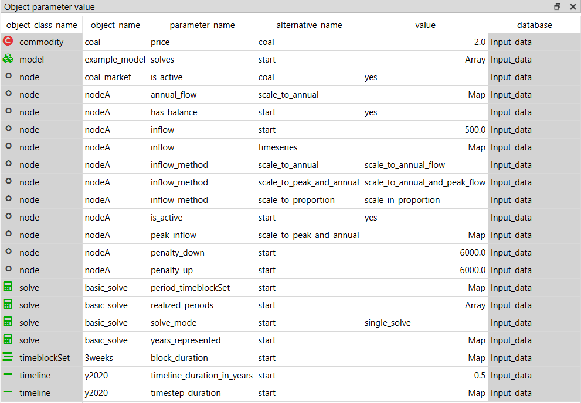
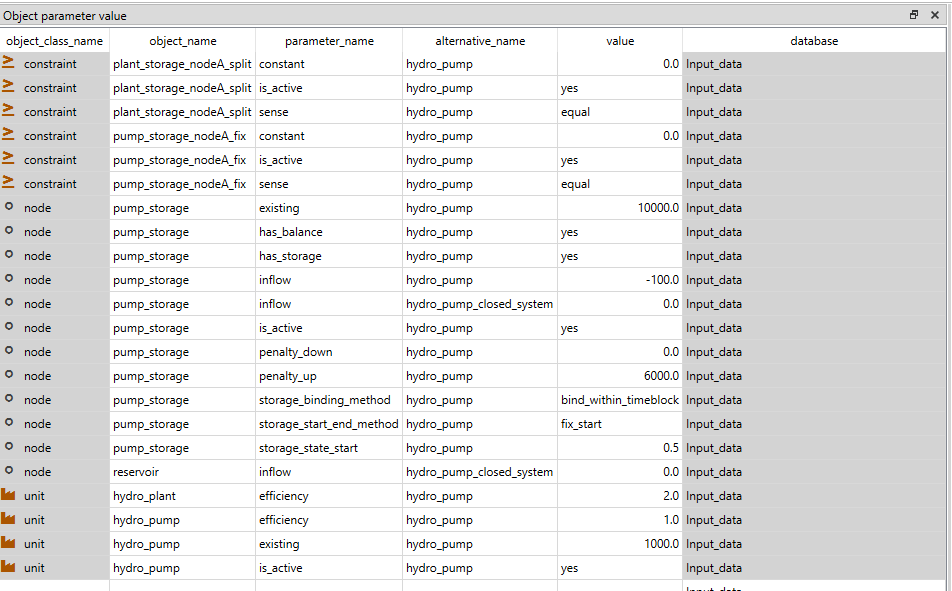
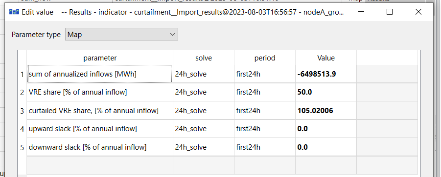
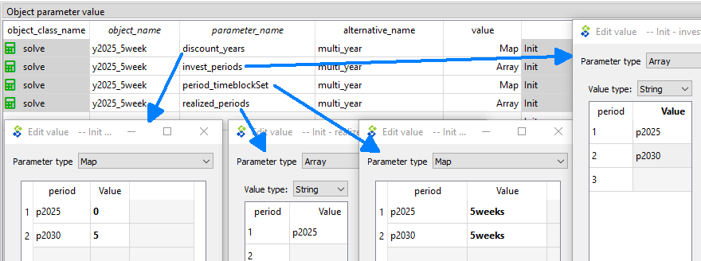
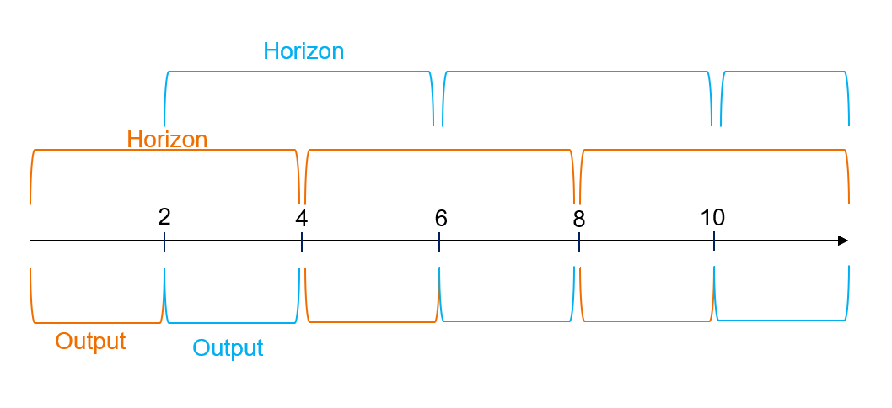
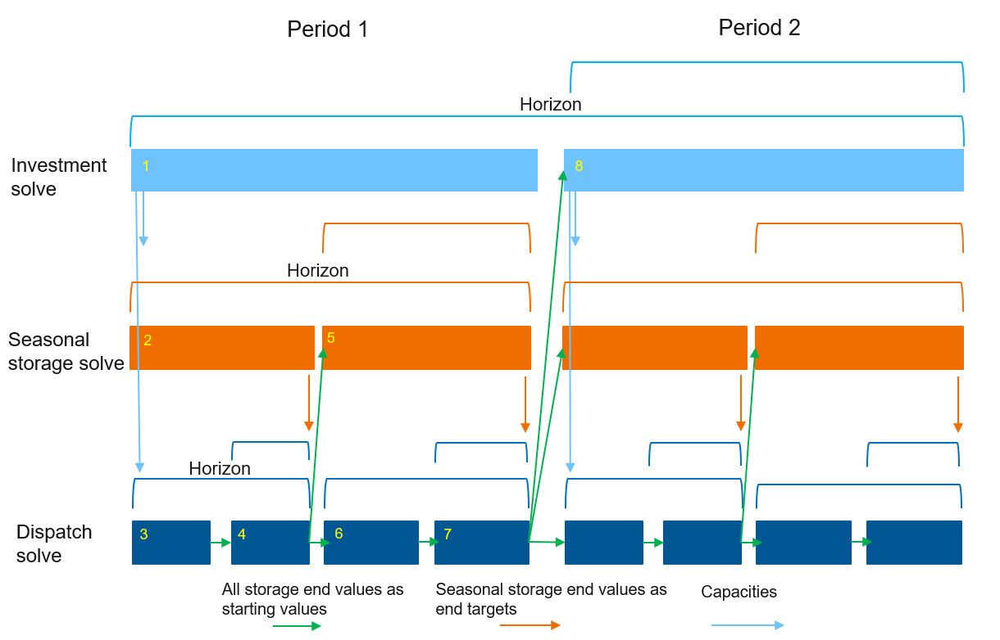
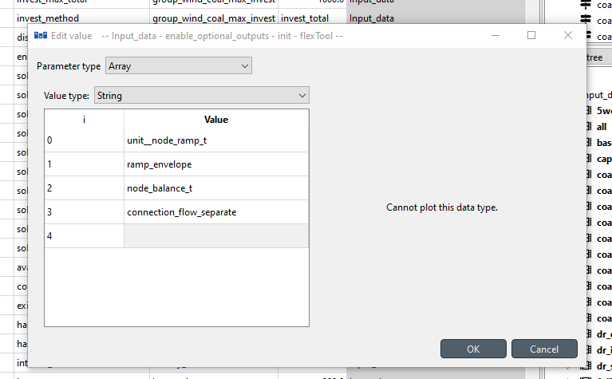

# How-to

How-to section contains examples on how to include common energy system components in your model. The examples assume that you have sufficient understanding of FlexTool basics (e.g. by doing the tutorial).
Each example will either include an example database file that is located in the 'how to examples databases' folder or the example is included in the init.sqlite as a scenario. If the example is in its own database, you can switch to that database by selecting the 'input' data store in the workflow and then changing the database by clicking the folder icon next to the current database file path in the 'Data store properties' widget. Navigate to the 'how to example databases' folder and choose the appropriate database.

This section is divided into two parts: 

Building parts of the model:

- [How to create a PV, wind or run-of-river hydro power plant](#How-to-create-a-PV,-wind-or-run---of---river-hydro-power-plant)
- [How to connect nodes in the same energy network](#How-to-connect-nodes-in-the-same-energy-network)
- [How to set the demand in a node](#How-to-set-the-demand-in-a-node)
- [How to add a storage unit (battery)](#How-to-add-a-storage-unit-(battery))
- [How to make investments (storage/unit)](#how-to-make-investments-storageunit)
- [How to create combined heat and power (CHP)](#how-to-create-combined-heat-and-power-chp)
- [How to create a hydro reservoir](#how-to-create-a-hydro-reservoir)
- [How to create a hydro pump storage](#how-to-create-a-hydro-pump-storage)
- [How to add a minimum load, start-up and ramp](#how-to-add-a-minimum-load-start-up-and-ramp)
- [How to add CO2 emissions, costs and limits](#how-to-add-co2-emissions-costs-and-limits)
- [How to create a non-synchronous limit](#how-to-create-a-non-synchronous-limit)
- [How to see the VRE curtailment and VRE share results for a node](#how-to-see-the-vre-curtailment-and-vre-share-results-for-a-node)


Setting different solves:

- [How to run solves in a sequence (investment + dispatch)](#how-to-run-solves-in-a-sequence-investment--dispatch)
- [How to create a multi-year model](#how-to-create-a-multi-year-model)
- [How to use a rolling window for a dispatch model](#how-to-use-a-rolling-window-for-a-dispatch-model)
- [How to use Nested Rolling window solves (investments and long-term storage)](#how-to-use-nested-rolling-window-solves-investments-and-long-term-storage)
- [How to use CPLEX as the solver](#how-to-use-cplex-as-the-solver)

General:
-  [How to enable/disable outputs](#how-to-enabledisable-outputs)
-  [How to make the Flextool run faster](#how-to-make-the-flextool-run-faster)

## How to create a PV, wind or run-of-river hydro power plant

**(init.sqlite scenario: wind)**
***init - west - wind***

These three power plant types don't use any commodities (i.e. fuels), but are instead dependant on a timeseries profile.
To create these plants one needs an output node, an unit and a profile.

The unit only needs parameters:

- `is_active`: *yes*
- `existing`: [The maximum capacity of the plant] 
Additionally these parameters should be at their default values:
- `conversion_method`: *constant_efficiency*
- `efficiency`: 1

The `profile` object only has one parameter: `profile`. It is a timeseries map which tells what fraction of the capacity the plant can produce at each timestep.

The relationships 

- `unit__outputnode`: (plant|output node) and 
- `unit__node__profile`: (plant|output node|profile) need to be both created.

The `unit__node__profile` relationship needs a parameter `profile_method` that has three options: `upper_limit`, `lower_limit` and `exact`. It states how the profile is considered. In most cases the `upper_limit` option should be used as it allows the plant to curtail the production if there is more supply than demand. Otherwise the output node might have to use `downward_penalty` to spill energy.

The same profile can be used for multiple `unit__outputnode`s (and that is why the profile is not a unit parameter but its own entity).


## How to connect nodes in the same energy network
**(connections.sqlite)**

Typically nodes are used to maintain an energy balance and therefore they are used to represent a location with demand or a storage. The nodes can pass energy to each other through a connection entity. This is often an electricity connection but it can be any form of energy (or matter)  moving between two nodes. To create a connection one needs:

- two `nodes` 
- `connection`
- relationship `connection__node__node` to tie these three together.

The connection needs the parameters:

- `is_active`: *yes*
- `existing`: The maximum capacity of the connection [MW]. Applies to both directions.
- `efficiency`: represents the losses in transferring the energy. Same in both directions.

Optional parameters:

- `is_DC`: *yes*, flag if the connection is counted as non-synchronous for the possible non-synchronous limit. If `is_DC` (direct current) is yes, then the connection is non-synchronous. More at: How-to create a non-synchronous limit
- `transfer_method`: Four options: *regular* (default), *exact*, *variable_cost_only*, *no_losses_no_variable_cost*. 

In most cases *regular* should be used. The downside of it is that it allows the flows to both directions at the same time, but the model does this only in specific circumstances when its beneficial to leak energy through the connection losses. For example, if connection capacity is 500 and efficiency 0.8, both nodes can send 500, but recive only 400 reducing the incoming energy by 100 in both nodes without any cost.
Typically the model does not want to produce extra energy as it usually has costs, but it can happen if there is a cost to curtailing energy generation from a free source or if a unit is forced to generate at some level ('e.g. using `profile_method`: 'equal'). If `non-synchronous` constraint is used with a node using this connection, use *exact* instead as *regular* connections can circumvent this limit.

*Exact* method does not allow flow in both directions at the same time, but it requires a binary variable, which will be computationally heavier (especially if the model would otherwise be fully linear). 

*Variable_cost_only* can be used when there are no losses associated with the flow. It allows costs related to the flow, but if losses are to be included, it should not be used.

The *no_losses_no_variable_cost* can be used when the connection has no losses and no variable costs accociated with the flow. It is computationally the most efficient method, as it uses only one variable for the flow (the variable becomes negative for the other direction, but this can work only when there are no losses or variable costs). It also prevents simultanoues flow to both directions.

The results of connections can be seen from the node_balance table. However, these are the results from all the connections connected to the node. If you want to have the results from an individual connection or specified connections, you can create a group of connection_nodes (`group_connection_node`) with a parameter `output_results` set to *yes*. This will produce sum_flow` results from the connection to the node. 

The example database shows a connection between a two node system where the other node has a wind power plant and the other node has a coal power plant. 


## How to set the demand in a node
**(demand.sqlite)**

The demand in a node is set with the inflow parameter. When the node is consuming energy or matter, the values should be negative and when the node is supplying energy (or matter) the values should be positive.
The inflow parameter accepts two types of data:

- Constant
- Timeseries map

If the model is using multiple periods, then the same timeseries profile is used for every period. However, the inflow can be scaled for different periods with the `inflow_method` parameter:
- `scale_to_annual_flow`: This will multiply the demand with a constant to make the summed inflow to match the `annual_flow`. This requires the node parameter `annual_flow` that is a map of periods containing the annual flow for each period. The sum of inflows is divided by the period's share of the year (hours in period /8760) before scaling (so that the annual energy demand/supply matches the `annual_flow` no matter what parts of the year are used to represent the full year). 
- `scale_in_proportion`: calculates a scaling factor by dividing `annual_flow` with the sum of time series inflow (after it has been annualized using `timeline_duration_in_years`). This does not force the demand/supply to match annual flow in case the representative periods are not representing the full year, but the time series will still be scaled to capture the proportional change in the `annual_flow` parameter. 
- `scale_to_annual_and_peak_flow`: The inflow scaled so that the peak is at the given `peak_flow` and the inflow sums to annual flow of the period. This is done by the following equation:

```
new_inflow = (peak/peak_old)*(1+c)*old_inflow-peak*c

where c = 
[(peak/peak_old)*(8760/hours_in_period)*sum(old_inflow) - annual_flow] 
/ [peak*8760 - (peak/peak_old)*(8760/hours_in_period)*sum(old_inflow)]
```

Examples of all these options are shown in the demand.sqlite.



## How to add a storage unit (battery) 

**(init.sqlite, scenario: wind_battery)**
***init - west - wind - battery***

In the ***Init*** SQLite database, there is a `scenario` *wind_battery*.
In the example, the *wind_plant* alone is not able to meet the load in all conditions, but the *battery* will help it to improve the situation.

In FlexTool, only `nodes` can have storage. `Nodes` can therefore be demand nodes, storage nodes or both. To make a storage node one the required parameters are:

- `is_active`: yes
- `has_balance`: yes
- `has_storage`: yes
- `existing`: The maximum storage size of battery as the potential energy [MWh]
- `penalty_up`: a large number to prefer not creating energy from nowhere
- `penalty_down`: a large number to prefer not creating energy from nowhere

Additional parameters:

- `self_discharge_loss` The fraction of energy loss in each hour.

Storage states can be tied to a value. For this three methods are introduced:

- `storage_start_end_method`: Fixes start and/or end state of the storage to a chosen value. This is for the start and the end of the whole model timeline (not for individual solves in case the model is rolling forward).
    -  `storage_state_start` and `storage_state_end` set these values.
- `storage_bind_method`: Forces the start and end values to be the same for the chosen  time interval (timeblock, period or solve)
- `storage_solve_horizon_method`: Fixes the state of the storage at the end of the solve horizon or sets a price for the stored energy at the end of the solve horizon
    - `storage_state_reference_value` and `storage_state_reference_price` set these values
  
Having multiple storage methods can create infeasible problems. This is why some of the combinations shouldn't (and cannot) be used at the same time. If multiple methods are used, some of them might be ignored by the method hierarchy. More information can be found from [Model Parameters: Using nodes as storages](https://irena-flextool.github.io/flextool/reference). 

Battery also needs charging and discharging capabilities. These could be presented either with a `connection` or by having a charging `unit` and a discharging `unit`. In here, we are using a `connection` called *battery_inverter*. Please note that the `efficiency` parameter of the `connection` applies to both directions, so the round-trip `efficiency` will be `efficiency` squared.

The `transfer_method` can be used by all types of connections, but in this case it is best to choose *regular*, which tries to avoid simultaneous charging and discharing, but can still do it when the model needs to dissipate energy. *exact* method would prevent that, but it would require integer variables and make the storage computationally much more expensive. Model leakage will be reported in the results (forthcoming).

The required paremeters of the connection are:

- `is_active`: yes
- `existing`: The capacity of energy transsmission [MW]
- `transfer_method`: (see above)

Additional parameters:

- `efficiency`: by default 1

Finally `connection_node_node` relationship is needed between inverter, the battery and the demand node (west). 


##  How to make investments (storage/unit) 
**(init.sqlite scenario: wind_battery_invest)**
***init - west - wind - battery - battery_invest***

Here we will use the previous battery scenario to represent the investment options in the tool.

The solve will invest only if it has an array of `invest_periods` set, telling the periods where it is allowed to make investment decisions. In a multi solve investment model (rolling investments) it can be useful to separately set `invest_realized_periods` so that the investment results get reported only from the chosen periods from each solve (in order to avoid overlapping reporting of investment decisions that are replaced by  investment decisions in later solves). Furthermore, `realized_periods` will define the solves and periods from which the dispatch results are output into results.

First, the investment parameters need to be included both for the *battery_inverter* and *battery* objects:

- `invest_method` - the modeller needs to choose between *only_invest*, *only_retire*, *invest_and_retire* or *not_allowed*
- `invest_cost` - overnight investment cost new capacity [currency/kW] for the *battery_inverter* and [currency/kWh] for the *battery*. Other one can be left empty or zero, since they will be tied together in the next phase. Here we will assume a fixed relation between kW and kWh for this battery technology, but for example flow batteries could have separate investments for storage and charging capacities.
- `interest_rate` - an interest rate [e.g. 0.05 means 5%] for the technology that is sufficient to cover capital costs. The chosen interest rate should reflect the assumption that in the model economic lifetime equals the technical lifetime.
- `lifetime` - technical lifetime of the technology to calculate investment annuity (together with the interest rate)

Additional parameters:

- `invest_max_total`: maximum investment (power [MW] or energy [MWh]) to the virtual capacity of a group of units or to the storage capacity of a group of nodes. 
    - In the same way investment limits can be set for total and period, investment and retirement, min and max
- `lifetime_method`: Model can either be forced to reinvest when the lifetime ends `reinvest_automatic` or have a choice `reinvest_choice`
- `salvage_value`: Sets the extra value that can be gained for retiring [CUR/kW]
- `fixed_cost`: Annual cost for capacity [CUR/kW]
- `retire_forced`: forces to retire at least this amount of capacity

In many cases some of the investment decisions are tied to each other. Here the battery capacity and the connection capacity of the *battery_inverter* will be tied as they are simultaneously limited by the choice of the battery technology to be invested in.
To model this, a new constraint needs to be created that ties together the storage capacity of the *battery* and the charging/discharging capacity of the *battery_inverter*. A new `constraint` object *battery_tie_kW_kWh* is created and it is given parameters `constant`, `is_active` and `sense`. Constant could be left out, since it is zero, but `is_active` must be defined in order to include the constraint in the *battery_invest* `alternative`. The `sense` of the constraint must be *equal* to enforce the kw/kWh relation.

Both *battery_inverter* and *battery* need a coefficient to tell the model how they relate to each other. The equation has the capacity variables on the left side of the equation and the constant on the right side.

```
sum_i(`constraint_capacity_coefficient` * `invested_capacity`) = `constant` 
      where i is any unit, connection or node that is part of the constraint
```

When the `constraint_capacity_coefficient` for *battery* is set at 1 and for the *battery_inverter* at -8, then the equation will force *battery_inverter* `capacity` to be 8 times smaller than the *battery* `capacity`. The negative term can be arranged to the right side of the equation, which yields:

```1 x *battery* = 8 x *battery_inverter*, which can be true only if *battery_inverter* is 1/8 of *battery*```

`constraint_capacity_coefficient` is not a parameter with a single value, but a map type parameter (index: constraint name, value: coefficient). It allows the object to participate in multiple constraints.

Finally, FlexTool can actually mix three different types of constraint coefficients: `constraint_capacity_coefficient`, `constraint_state_coefficient` and `constraint_flow_coefficient` allowing the user to create custom constraints between any types of objects in the model for the main variables in the model (*flow*, *state* as well as *invest* and *divest*). So, the equation above is in full form:

```
  + sum_i [constraint_capacity_coefficient(i) * invested_capacity]
           where i contains [node, unit, connection] belonging to the constraint
  + sum_j [constraint_flow_coefficient(j) * capacity]
           where j contains [unit--node, connection--node] belonging to the constraint
  + sum_k [constraint_state_coefficient(k) * capacity] 
           where k contains [node] belonging to the constraint
  = 
  constant

  where 'capacity' is existing capacity plus invested capacity
```


## How to create combined heat and power (CHP) 

**(init.sqlite scenario: coal_chp)**
***init - west - coal_chp - heat***

First, a new *heat* `node` is added with the necessary parameters. The `nodes` can be used for energy form of energy or matter, so the heat demand node does not differ from the electricity demand node. 

The required parameters are:

- `is_active`: yes
- `has_balance`: yes
- `inflow`: Map for the heat demand (negative) [MW]
- `penalty_up`: a large number to prefer not creating energy from nowhere
- `penalty_down`: a large number to prefer not creating energy from nowhere

The heating systems tend to have some level of storage capability, so one could also add storage parameters to the node as well, but here they are not used.

Then the *coal_chp* `unit` is made with a high `efficiency` parameter, since CHP units convert fuel energy to power and heat at high overall rates. In FlexTool, `efficiency` is a property of the unit - it demarcates at what rate the sum of inputs is converted to the sum of outputs. However, without any additional constraints, the `unit` is free to choose in what proportion to use inputs and in what proportion to use outputs. In units with only one input and output, this freedom does not exist, but in here, the *coal_chp* needs to be constrained as otherwise the unit could produce only electricity and no heat at 90% efficiency, which is not feasible. 

This CHP plant is an another example where the user defined `constraint` (see the last equation in the previous example) is used to achieve the desired behaviour. In a backpressure CHP, heat and power outputs are fixed - increase one of them, and you must also increase the other. In an extraction CHP plant the relation is more complicated - there is an allowed operating area between heat and power. Both can be represented in FlexTool, but here a backpressure example is given. An extraction plant would require two or more *greater_than* and/or *lesser_than* `constraints` to define an operating area.

Electricity and heat outputs are fixed by adding a new `constraint` *coal_chp_fix* where the heat and power co-efficients are fixed. You need to create the two relationships `unit__outputNode`, for *coal_chp--heat* and *coal_chp--west*. As can be seen in the bottom part of the figure below, the `constraint_flow_coefficient` parameter for the *coal_chp--heat* and *coal_chp--west* is set as a map value where the `constraint` name matches with the *coal_chp_fix* `constraint` object name. The values are set so that the constraint equation forces the heat output to be twice as large as the electricity output.

Create constraint  *coal_chp_fix* object with parameters:

- `is_active`: yes
- `sense`: equal
- `constant`: 0.0

Create `unit_outputNode` (coal_chp|heat):

- `constraint_flow_coefficient` : *coal_chp_fix*, -0.5

Create `unit_outputNode` (coal_chp|west):

- `constraint_flow_coefficient` : *coal_chp_fix*, 2


Again, the negative value can be turned positive by arranging it to the right side of the equality, creating this:

```
1 x *electricity* = 0.5 x *heat*, which is true only if *heat* is 2 x *electricity*
```


## How to create a hydro reservoir
**hydro_reservoir.sq**

~~~
Note! This example concerns a single reservoir hydro power plant. 
If the river system has multiple plants in a series and their operations are tied, 
then multiple nodes and units are needed to represent the system.
~~~

The objective is to create a hydro power plant with a reservoir and connect it to a demand node.

Hydro reservoir power plant requires three components:

- Reservoir `node`
- Hydro `unit`
- Output `node`

It can be useful to create a new alternative for these components to be able to include and exclude them from the scenarios.

The reservoir is made with a node as only nodes can have storage in FlexTool. The incoming water can be represented by the inflow parameter. It can be a constant or a time variant. The unit of the inflow should be the power that can be created from the quantity of the incoming water at maximum efficiency [MW]. In the same way, the existing storage capacity should be the maximum amount of stored energy that the reservoir can hold [MWh].
In this implementation of reservoir hydro power, there is an option to spill water (energy) from the storage so that it does not run through the plant. The simplest way of allowing spilling is setting the downward penalty of the node to 0. This way the energy can disappear from the storage without a cost. The quantity of spilled energy can be seen from the results as the 'downward slack' of the node.

The required parameters of the reservoir node are (node_c and node_t sheets if using Excel input data):

- `is_active`: yes
- `has_balance`: yes
- `has_storage`: yes
- `inflow`: Mapping of the incoming water as the potential power [MW]
- `existing`: The maximum size of the reservoir as the potential energy [MWh]
- `penalty_up`: a large number to prefer not creating energy from nowhere
- `penalty_down`: 0 or a large number (spilling or not)
- a `storage_method` to set the behaviour on how the storage levels should be managed - for short duration storages *bind_within_timeblock* may be best and for seasonal storages it could be best to use *bind_within_solve*. If historical storage level time series are available, it can be beneficial to use *fix_start* in the `storage_start_end_method` together with `storage_solve_horizon_method` *use_reference_value*, which will pick the storage level at the end of each solve from the time series provided as a reference (*storage_state_reference_value*).

The `unit` is connected to the *reservoir* `node` and the output `node` *nodeA* (unit_c and unit_node_c in excel):

- The `efficiency` of the unit can be set to 1 as the inflow time series are directly expressed in MWh (using piecewise linear efficiency is naturally possible).
- Set `existing` capacity [MW]
- `is_active`: yes 
- Create relations `unit__inputNode`: *hydro_plant*|*reservoir* and `unit__outputNode`: *hydro_plant*|*nodeA*.


## How to create a hydro pump storage
**(hydro_with_pump.sqlite)**

For a hydro pump storage one needs the following components:

- Demand `node` 
- hydro_plant `unit` with 
- storage `node`, 
- hydro_pump `unit` with 
- pump storage `node` 
- a source for external energy (pumped storage plant will lose energy due to charging losses)

For the demand node and the hydro plant we will use the same components as in the previous hydro_reservoir example. With the difference that both demand and hydro_plant capacities are doubled. Wind power plant will be used as a source for external energy.

First create the pump_storage. This is the downstream storage from the hydro plant. Again it should have the parameters as the reservoir:

- `is_active`: yes
- `has_balance`: yes
- `has_storage`: yes
- `existing`: The maximum size of the storage [MWh]. Note that this really represents the mass of the water and it should be converted as the potential of the energy of the reservoir-plant system. So that 1 liter of water has the same energy in both storages.
- `penalty_up`: a large number to avoid creating energy from nowhere
- `penalty_down`: 0 

In this example database, we have both a closed system and a river system. The difference is that in the closed system the inflow is zero in both reservoir and pump_storage. In river system we have the incoming water for the reservoir as in the reservoir example. In the downstream pump storage we implement a outflow as the negative inflow representing the minimum amount of water that has to flow out of the system at each timestep to not dry out the river. The `penalty_down` is set as 0 to allow it let more water go when it needs to, otherwise the storages will keep filling up if the incoming water is larger than the minimum outgoing water.

The storage level fixes should be the same in both storages (reservoir and pump storage). Here:

- `fix_start_end_method`: *fix_start*
- `storage_state_start`: 0.5
- `bind_storage_method`: *bind_with_timeblock*

This sets the starting storage levels to be 50%. The binding will also constrain the state of the storage at the end of of each timeblock to be the same as in the beginning of the timeblock.

Then create the pump unit. It only needs three parameters:

- `efficiency` = 1, The real efficiency of the pump is set elsewhere, so use 1.0 here. 
- `existing`: The wanted capacity
- `is_active`: *yes* 

Set the relationships as follows:

- `unit_outputNode` for (hydro_plant | nodeA), (hydro_plant | pump_storage ), (hydro_pump | reservoir)
- `unit_inputNode` for (hydro_plant | reservoir), (hydro_pump | pump_storage), (hydro_pump | nodeA)

Your system should look something like:


Next comes the tricky part of preserving the water and energy as both are represented as generic energy in the model. This is done by setting extra coefficents and constraints to the flows. First the hydro_plant needs to both create the energy for the demand node and pass the mass to the pump_storage. This is done by doubling the efficiency in this example to 2 and setting a extra constraint to force the output flows to both the demand node and the storage to be the same. 

For the hydro plant:

- `Efficiency`:  2 

Create a new constraint (here *plant_storage_nodeA_split*) and add the parameters:

- `is_active`: yes
- `sense`: equal
- `constant`: 0.0

And for the `unit_outputNodes`:

- (hydro_plant | nodeA) `constraint_flow_coefficient` Map: plant_storage_nodeA_split , 1
- (hydro_plant | pump_storage) `constraint_flow_coefficient` Map: plant_storage_nodeA_split , -1
- Meaning: 
```
flow to nodeA - flow to pump_storage = 0
```

As for the pump storage, we will have to make sure that the same amount of water leaves the pump_storage and enters the reservoir. Also it still should use electricity from the demand node without increasing the amount of water that is moving from storage to another. 
First to prevent the energy from the demand node from increasing the water flow, add a coefficient to the flow between the demand node and the pump.

`unit_inputNode` (hydro_pump|nodeA):
- `Coefficient`: 0 (Default is 1) 

This prevents the water amount from increasing as:
```
unit_output_flow = coeff1 * unit_input_flow1 + coeff2 * unit_input_flow2.
```
We still have to make the unit to consume electricity even though it does not affect the unit output directly. This is done by setting a new constraint to tie the flows to the pump unit from pump storage and the nodeA. Add a constraint (here *pump_storage_nodeA_fix*) the with the parameters:

- `is_active`: yes
- `sense`: equal
- `constant`: 0.0

And setting parameters for `unit_outputNode` and `unit_inputNode`:

- (hydro_pump | nodeA) `constraint_flow_coefficient` Map: plant_storage_nodeA_split , 2
- (hydro_pump | pump_storage) `constraint_flow_coefficient` Map: plant_storage_nodeA_split , -1

```
2 * flow_from_nodeA - flow_from_pump_storage = 0
```
Note that here the (`constraint_flow_coefficient ` Map: plant_storage_nodeA_split , 2) actually sets the efficiency of the pump. 
This means that here only half of the electricity used by the pump can be recovered when that amount of water is used by the hydro_plant. (Two units of energy are used to move 1 unit of water_energy)
The `constraint_flow_coefficient` for pump_input should therefore be (1/efficiency)




## How to add a minimum load, start-up and ramp
**(ramp_and_start_up.sqlite)**

Some plants cannot vary their output freely, but have some cost and limits associated with it. In this example we will add the minimum load behaviour to a *coal_plant* `unit` and add the cost and limits for starting up and ramping the plant respectively.

Minimum load requires that the unit must have an online variable in addition to flow variables and therefore a `startup_method` needs to be defined and an optional `startup_cost` can be given. The `startup_cost` is added to the total cost every time the unit is required to start-up. Here we use a value 1000 (Currency/MW started up).

The options for the `startup_method` are *no_startup*, *linear* and *binary*. *binary* would require an integer variable so *linear* is chosen. However, this means that the unit can startup partially. The minimum online will still apply, but it is the minimum of the online capacity in any given moment (*flow* >= *min_load* x *capacity* x *online*), where 0 <= *online* <= 1.

The online variable also allows to change the efficiency of the plant between the minimum and full loads. A unit with a part-load efficiency will obey the following equation:

```
  + sum_i[ input(i) * input_coefficient(i) ]
  =
  + sum_o[ output(o) * output_coefficient(o) ] * slope
  + online * section

where   slope = 1 / efficiency - section
  and section = 1 / efficiency 
                - ( 1 / efficiency - min_load / efficiency_at_min_load) / ( 1 - min_load )
```

By default, `input_coefficient` and `output_coefficient` are 1, but if there is a need to tweak their relative contributions, these coefficients allow to do so (e.g. a coal plant might have lower efficiency when using lignite than when using brown coal).

The input is required at different ouput levels is shown in the figure below, when Capacity = 100, Efficiency = 0.8, Minimum load = 0.6 and Efficiency at minimum load = 0.5.


Next we will add ramp limits. With the ramping limits, the user can force the change of a flow from a unit to be below a certain value each timestep. The ramping is an attribute of the flow. Therefore it does not require the minimum load behaviour and its parameters are added to the `unit_outputNode` relationship:

- `ramp_method`: ramp_cost, ramp_limit or both. Only ramp limit is currently implemented (August 2023).
- `ramp_speed_up`: Limit on how fast the plant can ramp up. (fraction of unit / min) ie. Value 0.01 allows the change of 60% of capacity per hour. 
- `ramp_speed_down`: Limit on how fast the plant can ramp down. (fraction of unit / min) ie. Value 0.01 allows the change of 60% of capacity per hour.
- `ramp_cost`: NOT YET IMPLEMENTED. The cost of ramping the capacity. [CUR/MW] 


## How to add CO2 emissions, costs and limits

**(init.sqlite scenario: coal_co2 )**
***init - west - coal - co2_price - co2_limit***

Carbon dioxide emissions are added to FlexTool by associating relevant `commodities` (e.g. *coal*) with a `co2_content` parameter (CO2 content per MWh of energy contained in the fuel). 
The other CO2 parameters are handeled through a group of nodes (Here *coal_price* or *coal_limit* `groups`). Therefore one needs to create a group and add all the nodes that supply these commodities to a group with a `group_node` relationship. (Here the relationship *co2_price--coal_market*)
To set a price one needs to create set the co2_method parameter to *price* (constant) and create the `co2_price` parameter with the desired value. This price is added to the price of the commodity. 

Alternatively one can set a limit on the co2 used by setting the `co2_method` parameter to *period* and setting the `co2_max_period` (periodic map) parameter. If both methods *price* and *period* are to be used, then they need to use different `groups`. The groups can include the same `nodes`.


## How to create a non-synchronous limit
**(non_sync_and_curtailment.sqlite)**
***(scenario: non_sync)***

Non-synchronous limit is a property of a `group` of nodes. It states that the non-synchronous flow to the group of nodes cannot exceed a set share of the input flows at any timestep. To demonstrate this, we have set a system with a coal plant, a wind plant and a single demand node. However, it can be done to a group of nodes with unlimited number of plants or connections connected. So, one can limit the non-synchronous share of individual nodes or of the whole system. The flows between the nodes of the group are excluded.

The non-synchronous limit is set to a `group` of nodes with one or multiple members. Note: These are set to the group with `group_node` relationship, not with `group_node_unit` relationship!

Create a group (here *nodeA_group*) and set a `group_node` relationship (nodeA_group |nodeA). Then add parameters:

- `has_non_synchronous`: yes
- `non_synchronous_limit`: 0.5
- `penalty_non_synchronous`: 4000

This forces the non-sync flow to be at max 50% of the incoming flow to the nodeA. 
The penalty should be always set as in some cases there is no other way to keep the constraint feasible (and it will be difficult to find the reason why the model does not solve). The existence of the non-synchronous penalty in your results indicates that this constraint has been violated and you should investigate the reason for this in your system. If the `penalty_non_synchronous` is lower than the `upward_penalty` of the demand `node`, the system will prefer breaking the non-sync constraint instead of the `node` balance equation. In other words, it will not curtail the production of `profile` plants if the demand is not satisfied even though it will break the non-synchronous penalty. If it is higher, the curtailment will take place instead.

When having a connection to a storage from a node with this constraint, the best practice is to add this storage node to the group as well. This excludes the flows to and from the storage in the calculation of the non-synchronous ratio. However, if you want to have these flows in the calculation, you have two options depending on if you want the flow to be synchronous or not. If it is non-synchronous, just set the connection parameter `is_DC`: yes. If it is synchronous (e.g., some flywheels), an issue arises with the *reqular* connection as it now can reduce the ratio with equal simultaneous flow in both directions. To prevent the simultaneous flow to both directions you need to set the `transfer_method`: *exact*. This will increase the solving time significantly as it will use integer variables (so, better to add the storage node to the node group with a non-synchronous limit).

Then set which plants and connections are considered non-synchronous by adding parameters:

`unit_outputNode`:
- `is_non_synchronous`: yes 

`Connection_node_node`:
- `is_DC`: yes 

Here the (wind_plant|nodeA) relation has the `is_non_synchronous` parameter and battery connection `is_DC` parameter.

A connection with `transfer_method`: *no_losses_no_variables* between a node included in a group with a non-synchronous limit and a node outside of the group is not allowed. The flow in this kind of a connection is presented with a single variable, which would not function correctly with the non-synchronous limit constraints (there is a non-linearity at zero that requires two variables). 

If you want to see the individual flows in the results you can create separate `groups` for the flows and add `group_unit_node` relations to it. To produce the flow results, the groups need the parameter.

- `output_results`: yes 

Here we have *coal_flow* `group` with `group_unit_node` relation coal_flow|coal_plant|nodeA
and *wind_flow* `group` with `group_unit_node` relation wind_flow|wind_plant|nodeA.


## How to see the VRE curtailment and VRE share results for a node
**(non_sync_and_curtailment.sqlite)**
***(scenario: curtailment)***

When the system has profile-units with the `profile_method`: upper_limit, the model can curtail the unit's flow to avoid penalties.

The curtailment could take place for several reasons:

- the supply is higher than the demand and the energy cannot be stored or transferred (further)
- non-synchronous limit
- extra flow constraints have been set
- other unit specific constraint affecting how VRE units or other units are forced to behave (ramp, start-up ...)

To see the curtailment results you need to add a `group` of nodes (`group_node` not `group_unit_node` !) with one or more members. The group then needs the parameter:

- `output_results`: yes

This produces the `group`: *indicator* result to the Results database and *group_summary* table to the excel.

These changes were done to the previous non-sync example database. 

Note: The results are the share of curtailment in relation to the inflow (demand) so it can exceed 100% as seen in the figure.




## How to run solves in a sequence (investment + dispatch)
**(init.sqlite scenario: 5weeks_invest_fullYear_dispatch_coal_wind)**

In this example, investment decisions are made using a five week sample of a year and then the dispatch is solved with the full year timeline using these investments. 

To do this you need two solves:

- Investment solve 
- Dispatch solve

Both solves should solve the *same* periods using *different* `timeblockSet` to represent these periods. This example has only one period p2020 describing a year. The investment solve uses a representative sample `timeblockSet` *5weeks* to do the investment decisions. These are then passed to the dispatch solve that uses complete timeline *fullYear*.

Investment solve requires the parameters:

- `Invest_periods`: Array of periods where investments can be made
- `realised_invest_periods`: Array of periods that are output for investment decisions
- `period_timeblockSet`: Uses the *5weeks* as the timeblock 

Note that the `realized_invest_periods` is used instead of `realized_periods`, because we want the investment solve to only output investments.
Additionally some of the units, connections or storages will need investment parameters (`invest_cost`, `lifetime`...) see [How to make investments (storage/unit)](#how-to-make-investments-storageunit)

The dispatch solve requires the parameters:

- `realized_periods`: Array of output periods
- `period_timeblockSet`: Uses the *fullYear* as the timeblock

The sequence of solves is defined by the `model` parameter `solves`. Here it is an array where the first item is an investment_solve *5weeks_only_invest* and the second is the dispatch solve *y2020_fullYear_dispatch*. This is enough for the model to know to pass the investment decisions of the period to the period of the same name in the second solve.

Note that the picture has two `model`: *solves* parameters defined one for each alternative. Only the parameter from the *5weeks_only_invest* is used as the lower alternatives in the scenario tree override the values from the higher alternatives and only one model can be run.


## How to create a multi-year model

A multi-year model is constructed from multiple periods, each presenting one year. In the example case, each year is otherwise the same, but the demand is increasing in the *west* `node`. This means that all periods can use the same timeblockset *5weeks* from the same timeline *y2020*, but one can also make separate timelines for each year, if data is available for this. The `inflow` time series are scaled to match the value in `annual_flow` that is mapped for each period. The model is using the `inflow_method` *scale_to_annual* in order to achieve this (default is *use_original* that would not perform scaling). There should also be a `discount_rate` parameter set for the `model` object *flexTool* if something else than the model default of 5% (0.05 value) is to be used.


A multi-year model could be solved at one go (multi_year_one_solve) or by rolling through several solves (multi-year) where each solve has a foresight horizon and a realisation horizon. Next we will go through both options.

### Multi year with one solve
**(init.sqlite scenario: multi_year_one_solve)**

In this example, one solve is used for all the four periods. All the four periods need to be added to the solve arrays `invest_periods` and `realized_periods`. Here the same timeblock is used for all the four periods, so only difference between them is the increasing inflow set above. The parameters that need to be added to the `solve` object:

- `years_represented` parameter is used by the model to calculate the discounting factors for the periods in the model (often future years). It should state the number of years each period will be representing. For example, a period for 2025 could represent the years 2025-2029 if its `years_represented` is set to 5. Any investments would be taking place at the start of 2025 and discounted to the beginning of 2025, but the operational costs would accrue from each year in 2025-2029 each with a different discounting factor (decreasing based on the interest rate).
- `invest_periods` the periods in which the model is allowed to make investments.
- `realized_periods` the periods that will be realized in this solve (outputs dispatch results for these periods).
- `period_timeblockset` defines the set of representative 'periods' (timeblocks in FlexTool) to be used in each FlexTool `period`.


### Multi year with rolling solves 
**(init.sqlite scenario: multi_year)**

If the solving time gets too big, there is an option to split the timeline into overlapping parts and solve them separately. This shortens the solving time as it increases exponentially as the model grows. Therefore, collection of smaller solves is faster. The drawback is that the accuracy will be affected if there are dependencies with a larger time interval than the split size. 

When dealing with investments the splitting only works if the different periods are similar, in most cases complete years. If the first solve is really windy, it would invest too much on wind which wouldn't produce enough energy in later solves and then it would need to invest again to something else. It can also be challenging to consider lifetimes. If the option of retiring is allowed, it might retire something that is needed for later solves. In this example, the periods are complete years and the only difference between periods is increased demand.

The model rolls through several solves and therefore, the `model` object *flexTool* has four values in the `solves` array. Each value represents one solve and it's position in the sequence of solves. The next figure illustrates the realization (blue) and foresight horizons (grey). The first solve will solve both the year 2020 and year 2025, but it will only output the year 2020. The next will solve both 2025 and 2030 but only output 2025.


Next figure shows the values needed to define one solve (out of the four solves in the example). Each of these need to be repeated for each solve in the model.

- `years_represented` parameter is used by the model to calculate the discounting factors for the periods in the model (often future years). It should state the number of years each period will be representing. For example, a period for 2025 could represent the years 2025-2029 if its `years_represented` is set to 5. Any investments would be taking place at the start of 2025 and discounted to the beginning of 2025, but the operational costs would accrue from each year in 2025-2029 each with a different discounting factor (decreasing based on the interest rate).
- `invest_periods` the periods in which the model is allowed to make investments. To be given for each solve.
- `realized_periods` the periods that will be realized in this solve (outputs dispatch results for these periods). To be given for each solve.
- `invest_realized_periods` parameter states the periods that will realize the investment decisions. If not stated, it will use `realized_periods`.
- `period_timeblockset` defines the set of representative 'periods' (timeblocks in FlexTool) to be used in each FlexTool `period`.

Note the the `solve_mode`: *rolling_window* is not used! This is not for investment runs (without nesting) as it rolls freely, and investments should only be made at the start of the period. This example is called 'manual rolling' later when those are discussed.

In the init.sqlite, the solve objects have solver parameters: `highs_method`, `highs_parallel` and `highs_presolve`. They only affect the speed and not the results, but usually the default values are good enough and the user should only change them if they understand how the solvers work.



## How to use a rolling window for a dispatch model

A rolling window can be used for example when a dispatch model gets too big to be solved on one go. It splits the problem into multiple consecutive smaller problems.

The rolling window solve splits the time dimension into overlapping parts and solves each one of them separately but in a sequence (and can therefore pass state information from the previous solve to the next one). For example, instead of a solving the full year in one go, you can split the year into six four-month long solves where each solve outputs only the first two months. The solves would therefore include the months:

- **Roll: Solve months -> Output months**
- 1: [1,2,3,4] -> [1,2]
- 2: [3,4,5,6] -> [3,4]
- 3: [5,6,7,8] -> [5,6]
- 4: [7,8,9,10] -> [7,8]
- 5: [9,10,11,12] ->[9,10]
- 6: [11,12] -> [11,12]



The rolling solve could be setup also manually as described in the 'How to run a multi year model' - just using shorter periods. 

However, this would be tedious if there are many solves. In a rolling window model, the user can set the `rolling_jump` and `rolling_horizon` parameters, which are expressed in hours. 

- `rolling_horizon`: sets the length of the whole solve, in hours. In previous example 4 months (2880 hours). Horizon allows the model to see bit further in the future to improve the decision making for the period that will be output.

- `rolling_jump`: sets the interval for the length of each 'jump' the model takes forward in reach roll. It is then both the interval of roll starting points and the length of the output for each roll. The `rolling_jump` must be smaller than the `rolling_horizon`. In the previous example the `rolling_jump` would be 2 months (1440 hours).

In addition, the user has the possibility to use the other parameters to set the time interval where the rolling happens:

- `rolling_start_time`: Optional (timestamp), can be used to set a different starting point for the rolling than the first timestep (default).
- `rolling_duration`: Optional (hours), the length of combined rolls. In the example, it could be set to 8640 hours which would divide evenly, or 8760 hours which means that the last roll will be shorter than the others. It is nicer to use `rolling_jump` that is divisable with the `rolling_duration` to keep rolls even. If `rolling_duration` is not set, it defaults to rolling through the whole timeline.

When using rolling window solve, you are solving the model with less information. Therefore, the results will be less optimal since the model will not have the full information at once. It is therefore important to know how this could affect the results and what things to consider when implementing a rolling window model. It will have an impact on time dependant parts of the model: for example, storages or cumulative flow constraints. If the model can see only a few months to the future, it can't see how much energy needs to be stored after that. 

Investments should not be used with this free rolling solve (`solve_mode`: *rolling_window*) as investments should only be done at the start of the periods. *Both the long-term storage and the investments can be taken into account with nested rolling solves that have a separate how-to*.

Short term storages also are operated less optimally in a rolling window model. This is not necessarily a real problem, since perfect foresight linear optimization models are 'too optimal'. They don't reflect the forecast errors present in real life. So, a rolling window model might operate a bit more *realistically* than a *single_solve* model. A *single_solve* model can consider things happening far in the future when setting the storage level at present, even though in reality that information is not available. So, the total cost of a *rolling_window* model should always be higher than the total cost from a complete *single_solve* model that has perfect information.

To set a dispatch rolling window model you need to set the object `solve` parameters:

- `solve_mode`: *rolling_window*
- `rolling_jump`: Hours, the desired length of the solve interval
- `rolling_horizon`: Hours, the desired length of each roll solve
- `rolling_duration`: (Optional) Hours, the length of the combined outputs. If not set, the whole timeline is used.
- `rolling_start`: (Optional) Hours, the starting timestep the whole solve, if not wanting to start from the beginning 

Considerations on the rolling times:

- The `rolling_jump` and `rolling_horizon` must be large enough to make the model faster. If too small intervals are used, the creation of solves and moving data from solve to another might take too much time.
- If you are not using 1-hour timesteps, preferably use multiples of the timestep you are using as the `rolling_jump` and `rolling_horizon`. The steps included in each solve are calculated by summing the step durations until they are larger or equal to the hours given. So, if multiples are not used, the rolls might not be exactly the same size.
- The model can roll over timeblock and period jumps, which might cause some issues if storage constraints are used. Using timeblock length or its multiples is therefore recommended. For example, the `rolling_jump` could be a half of a timeblock and the `rolling_horizon` whole timeblock or `rolling_jump` a timeblock and `rolling_horizon` three timeblocks. Of course, when running e.g. a full year dispatch, there is only one timeblock of 8760 hours, which makes the choices more simple.

Considerations on storage parameters:

- `storage_solve_horizon_method` *use_reference_value* or *use_reference_price* are the preferred means to bind storage values. They can be used together with the `storage_state_start_end_method`: *start*, which would then set the initial storage state. These methods bind either the storage value or the storage price at the end of *horizon* (not the end of *jump*). This allows the storage to use the part of the horizon that is not output to improve the behaviour of the storage in the part that is output (as defined by `rolling_horizon` and `rolling_jump`). 
- `bind_within_timeblock` does not work correctly if the rolls don't include whole timeblocks. Instead, it will bind the first step of the roll (whatever it is) to the end of the timeblock. Do not use in nested solves if you are not using whole timeblocks or its multiples as `rolling_jump`
- the same applies to the `bind_within_period` (but in relation to periods - do not use this unless you are `rolling_jump` is as long as a period or its multiples).
- `storage_start_end_method` can be used to set the first timestep of the first roll and/or the last timestep of the last roll (in conjunction with `storage_state_start` and `storage_state_end`).
- `bind_within_solve` binds the start state to the end state of each *roll* not the start and end of the whole model timeline. Use with caution (and probably best not to use together with `storage_solve_horizon_method` *use_reference_value*).

## How to use Nested Rolling window solves (investments and long-term storage)

The basic rolling solve can have problems in dealing with long term storage and with investments. If the model only sees a few weeks to the future, it really can't see how much energy should be stored in long term storages. Problems with investments can also be rampant: What if the first roll is really windy, so it would invest too much on wind which wouldn't produce enough energy in later rolls and then it would need to invest again to something else. How can it consider lifetimes? If the option of retiring is allowed, it might retire something that is needed for later rolls. 

Nested solve sequences can first solve the investments and long-term storage levels and pass them to the dispatch solve. Both storage solve and dispatch solve can be rolling solves. The dispatch solves can then send the end storage values to the investment and long-term storage solves as start values to reduce the error of these solves.

When to use nested solves?

- Dispatch model is takes too long to solve, but simple rolling window solve would not represent the long-term storages correctly. (Nesting without the investment solve)
- Investment model takes too long to solve, even with manual rolling [How to create a multi-year model](#How-to-create-a-multi-year-model). With nesting you can have smaller rolls for dispatch solve than the investment solve. (Nesting without the storage solve)
- Investment model takes too long and you have long term storages to consider. (Three level nesting, graph below)



However, the obvious issue is that investment and storage solves cannot be solved using the old complete solve as it wouldn't make the solve time any shorter. Therefore, we need to decrease the information for investment and storage solves as well. There are a few options for this:

1. Use lower resolution (longer timesteps). This can work quite well for a long-term storage.
2. Use representative periods from the full timeline when performing investments. There is a large body of literature and methods on how to pick the representative weeks.
3. Split the investment timeline (myopic investments) by manually creating a solve sequence for the investment solves like in: [How to create a multi-year model](#How-to-create-a-multi-year-model) section. This can be combined with the first or second option. 

Each of these have their pros and cons:

- Using the lower resolution can speed-up the model considerably, but it also means that everything that happens faster than the new timestep duration will be lost as the timestep varying parameters are averaged or summed for the new timestep. For example, consider a model with investment options to solar and storage. If the step duration is changed to 24 hours, the model won't invest in enough storage to mitigate the diurnal variation in PV. When these investments are then passed to the dispatch solve, the invested portfolio will have trouble meeting the demand.
- Using the sample can be effective if the sample is chosen well, but all the needs that are not in these samples are not included. The speed is heavily dependent on the number and size of those samples.
- Splitting the investment timeline for multi-year models can be seen as a relatively realistic approach, since investment decisions would have a lot of uncertainty in the longer time frame anyway.

The investment decisions with less information are always less optimal than with complete solves. Therefore, when they are passed to the dispatch solve, it will in some cases cause penalties in the results when the invested portfolio is not sufficient to meet the demand at all times.

The long term storage solve can be implemented using a lower resolution solve. The storage state values from the storage solves will be used to fix the storage value (or price) at the end of each dispatch solve. This means that on the last step of the roll (or the period), the storage quantity (or price) will have to match the quantity (or price) in the storage solve. The `rolling_jump` and `rolling_horizon` in the storage solve have to be longer than in the dispatch solve. You can set which storages are included as "long term storages" whose value will be transferred to the dispatch solve.

To create a nested solve sequence, you need two or three `solve` objects. Either the investment solve or the storage solve can be left out. When using nested solve sequence, the sequence is not set with the `model`: `solves` parameter. Only the topmost solve is put there. Instead, the nested levels are set by the `solve` parameter `contains_solve`: *solve_name*. The investment solve is always on the top followed by the storage solve and dispatch solve:

- *investment_solve* `solve` parameter `contains_solve`: *storage_solve_name* 
- *storage_solve* `solve` parameter `contains_solve`: *dispatch_solve_name*

To create a storage solve:

- `solve` parameter `fix_storage_period`: Array of periods where the storage values are fixed in the lower solve. Should be the same as `realized_periods` for the dispatch solve.
- `node` parameter `storage_nested_fix_method`: *fix_quantity* or *fix_price*, includes this storage to be fixed. *fix_price* requires *storage_state_reference_price* to be set.

To create an investment_solve:

- `solve` parameter `invest_periods`: Array of periods where the model can invest.
- `solve` parameter `realized_invest_periods`: Array of periods where the model will realize investment decisions to the lower solves and results.
- `solve` parameter `realized_periods`: Should not be used in this solve! You don't want the dispatch results from this solve, but from the dispatch solve.

In addition, the rolling dispatch solve should be created as in the *How to use rolling window solve for dispatch*. To set a dispatch rolling window model you need to set the object `solve` parameters:

- `solve_mode`: *rolling_window*
- `rolling_jump`: Hours, the desired length of the solve interval
- `rolling_horizon`: Hours, the desired length of each roll solve
- `rolling_duration`: (Optional) Hours, the length of the combined outputs. If not set, the whole timeline is used.
- `rolling_start`: (Optional) Hours, the starting timestep the whole solve, if not wanting to start from the beginning 
- `realized_periods`: Array of periods that are realized

The other model parameters apply to *all* of the solves. Therefore, the considerations of the storage value binding that were discussed in the [How to use a rolling window for a dispatch model](#How-to-use-a-rolling-window-for-a-dispatch-model) should be taken into account here as well.

- Storage levels can be fixed with `storage_solve_horizon_method`: *use_reference_value* or *use_reference_price*, these will fix the end of each horizon not each jump.
- `storage_start_end_method` fixes the starts and/or ends of each solve level, meaning the first step of the first roll and the last step of the last roll.
- In most cases the `bind_storage_method` should be left as *bind_forward_only*
- Do not use `bind_within_timeblock` if you are not using full timeblock or its multiples as the `rolling_jump` in the dispatch model, otherwise you might cause an infeasible problem. 
- Do not use `bind_within_period` if you are not using full periods or its multiples as the `rolling_jump` in the dispatch model, otherwise you might cause an infeasible problem. 
- Do not use `bind_within_solve`

How to create the three lower information solve types for investment and storage solves discussed above?

To create a lower resolution (longer timesteps) solve:

- Make a new `timeblockSet`, but use the same `timeline` and `block_duration` for it as with the high resolution solve
- Set `timeblockSet` parameter `new_stepduration`: Hours
- In the `solve` use this new `timeblockSet` in the `period_timeblockSet`

The model will create a new timeline for this solve with the `new_stepduration`. All the timestep map data like `inflow` or `profile` will be either summed or averaged for the new timeline. Again, the `new_stepduration` should be multiple of the old step duration. If the `block_duration` is not a multiple of the `new_stepduration` the last timestep will be shorter than the rest.


To create a sample solve with representative periods:

The tutorial contains an example of representaive periods under alternative *5weeks* where the year is represented with five sample weeks. It is done with the `timeblockSet` parameter `block_duration` where instead of choosing the whole timeline by setting the first timestep and the duration of whole timeline, you choose multiple starting points with smaller durations. The example for the *5weeks* is below.


To create an investment solve sequence, you have two options:

- Create manually a series of solves and set the `invest_periods` and `realized_invest_periods` individually for the solves. [How to create a multi-year model](#How-to-create-a-multi-year-model) has an example of this with the difference that here you use `realized_invest_periods` instead of `realized_periods` and that each of the higher level solves requires the `contains_solve` parameter. 

If you have many splits, this option can get tedious and prone to mistakes.

The other option is to use only one investment `solve` object:

- The `invest_periods` and `realized_invest_periods` should then be set with a 2D map where the first column tells the solve (you don't have to create separate `solve` objects for these) and the second column tells the period. To get a 2D map, choose the parameter type as *Map* and then right click the table and choose *Insert column after/before*. The value column does not matter. The model will generate these solves, with the periods given. Note that the solve names should match in both 2D-maps.  

You can use the same lower level solve with each the investment solves as the lower level solves will exclude the periods that are not included in either of the upper level realized periods: `realized_invest_periods` or `fix_storage_periods`. So, the lower level solve should have all the periods that it is used for in any the solves.


Note that the results of a nested rolling solve run are not fully optimal, because the information in the model is decreased. This is the price you pay for the speed. Therefore, the results should not be taken as they are, instead it is important to know how to interpret the results: What phenomena are missing? How will they affect the results? Where should extra investments go to satisfy the demand (there is a possibility to use the `capacity_margin` method to force extra investments)?

In the init.sqlite there are four example scenarios related to this:

- *multi_fullYear_battery*: The four period full year single solve, with coal, wind, battery storage with unlimited investment possibilities. Running this is still possible but takes a few minutes. This is here as a reference for the nested solves.
- *multi_fullYear_battery_nested_24h_invest_one_solve*: This has the nested structure and the investment solve is done with 24h timesteps and storage solve 6h timesteps.
- *multi_fullYear_battery_nested_sample_invest_one_solve*: This has the investment solve as 5weeks sample but all the four periods are included in the same investment solve. Nested structure with 6h storage solve timesteps.
- *multi_fullYear_battery_nested_multi_invest*: This has split the investment to four solves with each having two period 5weeks sample period horizon. Nested structure with 6h storage solve timesteps.

The 24h timestep is clearly too long as it invests too little for storage and coal. A large upward penalty ensues.

The sample one solve invest also invests too little, as the largest demand-supply ratio weeks are not in the five week sample. However, the investments are spread more accurately.

The split sample investment run produces in this case similar results as the one solve sample run. This is not always the case! Here the only difference between the periods was linearly increased demand.  


## How to use CPLEX as the solver

Using CPLEX requires that you have installed the software, have a licence for it and have added it to PATH or to the environment where you are using the FlexTool, so that the tool can find the solver.

CPLEX is used when the **solve** parameter *solver* is set to 'cplex'. The tool passes the built optimization model to the CPLEX solver and converts the solution file to a filetype suitable for CPLEX. The solver will produce two additional files to the work directory: 'cplex.log' and 'flexModel3_cplex.sol'. The former is the logfile of the solver and the latter contains the solution in the CPLEX format.

The tool uses [Interactive Optimizer](https://www.ibm.com/docs/en/icos/12.8.0.0?topic=cplex-interactive-optimizer) to pass the problem to the solver. The default command used:
  
```shell
cplex -c 'read flexModel3.mps' 'opt' 'write flexModel3_cplex.sol' 'quit'
```

Additional parameters:

- `solver_precommand` creates a text in front of the cplex call. This is useful when dealing with floating licences. The command allows to call the licence server to reserve the licence for the duration of the cplex program with a command line argument.
- `solver_arguments` is an array containing additional CPLEX solver commands

With these parameters, the command line call is:

```shell
'solver_precommand' cplex -c 'read flexModel3.mps' 'solver_command1' 'solver_command2' ... 'solver_command_last' 'opt' 'write flexModel3_cplex.sol' 'quit'
```


## How to enable/disable outputs

Some outputs need to be explicitly added in order to output them. This is to reduce the result processing time. Each optional output can be added to the `enable_optional_outputs` parameter array of the `model` object. The additional outputs are:

- *ramp_envelope* : Includes seven parameters that form the ramp room envelope (how much there is additional ramping capability in a given node). 
- *node_balance_t* : Produces detailed inflows and outflows for all the nodes for all timesteps. Mainly useful to diagnose what is wrong with the model. 
- *connection_flow_separate* : Produces the connection flows separately for both directions.



Similarly, some outputs can be disables to reduce the result processing time. To do so, add the output name to the `disable_optional_outputs` parameter array of the `model` object.  The allowed outputs to disable are:

- *unit_flow_t* : The flows from units to the nodes for each timestep.
- *connection_flow_t* : The flows between the nodes for each timestep.

These can be replaced by group outputs (e.g. all wind power plant outputs are aggregated into one).


## How to make the Flextool run faster

The list below contains potential ways to decrease the run-time of FlexTool models.

External changes (results will remain the same):

- Keep both the input database and Flextool on the same drive. If the database is on a different drive, it can slow the process. Avoid network drives.
- Try to ensure that there is sufficient memory available by closing other programs that use lot of memory. Linear optimization problems can require lot of memory.
- Use as fast computer as available. Both faster processors and more processors can decrease computation time.

Model changes (results will remain the same):

- Disable outputs that you don't need. This will speed up the result processing. See: [How to enable/disable outputs](#how-to-enabledisable-outputs)
- When using HiGHS solver: in your solve's parameters, you can set highs_presolve = on, and highs_parallel = on to speed up the optimisation. However, it can be better to turn HiGHS parallel off when executing multiple scnearios in parallel.
- Especially with MIP problems, considering using a commercial solver like CPLEX (license required). See: [How to use CPLEX as the solver](#how-to-use-cplex-as-the-solver)

Model changes (results will be affected):

- Get rid of integer variables. Mixed integer programming can increase the solving time manyfold compared to the linear version especially if commercial solver is not available. MIP parameters are:
  - `transfer_method`: *exact*, change to *reqular*
  - `startup_method`: *binary*, change to *linear*

Model changes (potentially large changes to the results --> need to understand how the particular analysis will be affected):

- Use representative periods for investment decisions. See: [How to create a multi-year model](#how-to-create-a-multi-year-model)
- Split the timeline into parts. The solving time increases exponentially with the model size. Multiple smaller solves can be faster. Splitting is best done with Rolling window solve and Nested rolling solve. See:
[How to use a rolling window for a dispatch model](#how-to-use-a-rolling-window-for-a-dispatch-model),
[How to use Nested Rolling window solves (investments and long-term storage)](#how-to-use-nested-rolling-window-solves-investments-and-long-term-storage)
- Aggregate data. Technological: Combine power plants that are using the same technology. Spatial: Combine nodes. Temporal: Use longer timesteps.
