# How-to

How-to section contains examples on how to include common energy system components in your model. The examples assume that you have sufficient understanding of FlexTool basics (e.g. by doing the tutorial).
Each example will either include an example database file that is located in the 'how to examples databases' folder or the example is included in the examples.sqlite as a scenario. If the example is in its own database, you can switch to that database by selecting the 'input' data store in the workflow and then changing the database by clicking the folder icon next to the current database file path in the 'Data store properties' widget. Navigate to the 'how to example databases' folder and choose the appropriate database.

This section is divided into two parts: 

Building parts of the model:

- [How to create basic temporal structures for your model](#how-to-create-basic-temporal-structures-for-your-model)
- [How to create a PV, wind or run-of-river hydro power plant](#how-to-create-a-pv-wind-or-run-of-river-hydro-power-plant)
- [How to connect nodes in the same energy network](#how-to-connect-nodes-in-the-same-energy-network)
- [How to set the demand in a node](#how-to-set-the-demand-in-a-node)
- [How to add a storage unit (battery)](#how-to-add-a-storage-unit-battery)
- [How to make investments (storage/unit)](#how-to-make-investments-storageunit)
- [How to create combined heat and power (CHP)](#how-to-create-combined-heat-and-power-chp)
- [How to create a hydro reservoir](#how-to-create-a-hydro-reservoir)
- [How to create a hydro pump storage](#how-to-create-a-hydro-pump-storage)
- [How to add a reserve](#how-to-add-a-reserve)
- [How to add a minimum load, start-up and ramp](#how-to-add-a-minimum-load-start-up-and-ramp)
- [How to add CO2 emissions, costs and limits](#how-to-add-co2-emissions-costs-and-limits)
- [How to create a non-synchronous limit](#how-to-create-a-non-synchronous-limit)
- [How to see the VRE curtailment and VRE share results for a node](#how-to-see-the-vre-curtailment-and-vre-share-results-for-a-node)
- [How to create a delay between two nodes](#how-to-create-a-delay-between-two-nodes)

Setting different solves:

- [How to run solves in a sequence (investment + dispatch)](#how-to-run-solves-in-a-sequence-investment-dispatch)
- [How to create a multi-year model](#how-to-create-a-multi-year-model)
- [How to use a rolling window for a dispatch model](#how-to-use-a-rolling-window-for-a-dispatch-model)
- [How to use Nested Rolling window solves (investments and long-term storage)](#how-to-use-nested-rolling-window-solves-investments-and-long-term-storage)
- [How to use stochastics (representing uncertainty)](#how-to-use-stochastics-representing-uncertainty)

General:

- [How to use CPLEX as the solver](#how-to-use-cplex-as-the-solver)
- [How to create aggregate outputs](#how-to-create-aggregate-outputs)
- [How to enable/disable outputs](#how-to-enabledisable-outputs)
- [How to make the Flextool run faster](#how-to-make-the-flextool-run-faster)
- [How to enable a fast single-solve](#how-to-enable-a-fast-single-solve)
- [How to use Lagrangian decomposition (spatial)](#how-to-use-lagrangian-decomposition-spatial)
- [How to use timeset weights (non-RP weighted timesteps)](#how-to-use-timeset-weights-non-rp-weighted-timesteps)
- [How to read the LP scaling diagnostic report](#how-to-read-the-lp-scaling-diagnostic-report)
- [How to export a partial Excel template (parameter-group picker)](#how-to-export-a-partial-excel-template-parameter-group-picker)
- [How to use representative-period clustering with scalar profiles](#how-to-use-representative-period-clustering-with-scalar-profiles)

## How to create basic temporal structures for your model
**(time_settings_only.sqlite)**

FlexTool allows to build models for different kinds of purposes and has therefore a flexible temporal structure, which requires some learning at first. To get you started, this how-to creates three different timelines: a full year, a 48h timeline and a timeline with five one-week periods to represent a full year. To be able to choose which of these are used in a given scenario, three alternatives are created: init, init_2day-test, init_5week-invest. 

The names of these alternatives hint at the intended use of each timeline. Even when you are building a large model with a long timeline, it is better to use a short 48 hour timeline for testing purposes when building the model. Using five one-week periods, i.e. "a representative periods", in an investment model is a method to reduce the model size and consequently solve time. More about that in [How to run solves in a sequence (investment + dispatch)](#how-to-run-solves-in-a-sequence-investment-dispatch)

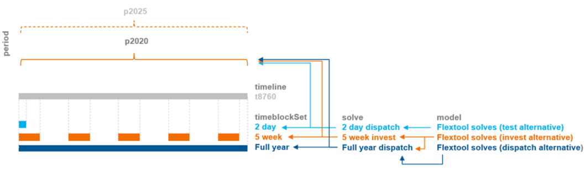

To define a temporal structure for a model instance, you need to create the following entities:

- `timeline` entity called *y2020* with a map-type parameter `timestep_duration` that defines the timeline the time series data in the model will need to use. It contains, in the first column, the name of each timestep (e.g. *t0001* or *2022-01-01-01*) and, in the second column, the length of the timestep in hours (e.g. *1.0*). The timestep names here must match the timestep names in other time series like `inflow` or `profile`. Here all of the three options use the same full year timeline i.e. timesteps from t0001 to t8760 with a step size of one hour.
- `timeset` entities called *full-year*, *2day* and *5week*. Each of them need a map-type parameter `timeset_duration` to define a timeset using a timestep name to indicate where the timeset starts and a number to define the duration of the timeset in timesteps: (*t0001*, *8760*) for the *full-year* and (*t4001* and *48.0*) for the 48h. The timeline is larger than the 48 hours, but this way the solver uses 48 hours specified. The *5week* needs five starting points
*t2521*, *t4538*, *t5041*, *t7057* and *t8233* with all having the length of *168.0*
- `timeset` needs to be connected to the timeline. This is done by adding the `timeset` parameter `timeline`. Each of the three `timesets` include the value *y2020*.
- `solve` entities called *full-year-dispatch*, *2day-dispatch* and *5week-invest*. In addition, they need the following parameters:

  - a map-type parameter `period_timeset` to define the timeset to be used by each period. Here each of the three use their `timeset` to describe the same period *p2020*. The first column of the map has the period: *p2020* and the second column the `timeset`: *full-year*, *2day* or *5week*
  - an array-type parameter `realized_periods` to define the periods that are realised from the `solve` named by the entity (the first column of an array is an index number starting with *0*, the second column contains the period to be realized in the results: *p2020* for all the solves here)
  - a parameter `solve_mode`, to be set to *single_solve* in these examples

- Finally, a `model` entity will define the solves to be included in a one model instance. They are defined in the array parameter `solves`. For these examples, the model name is *flextool* and for each `solve` the name of the `solve` should be given in the `solves` array (distinguished by the alternative): *full-year-dispatch*, *2day-dispatch* or *5week-invest*.

Be careful when choosing datatypes! Maps need to be maps not arrays. You will see a red exclamation mark if you are using the wrong datatype. (In the future, an update is coming to toolbox to ensure compliance.) 

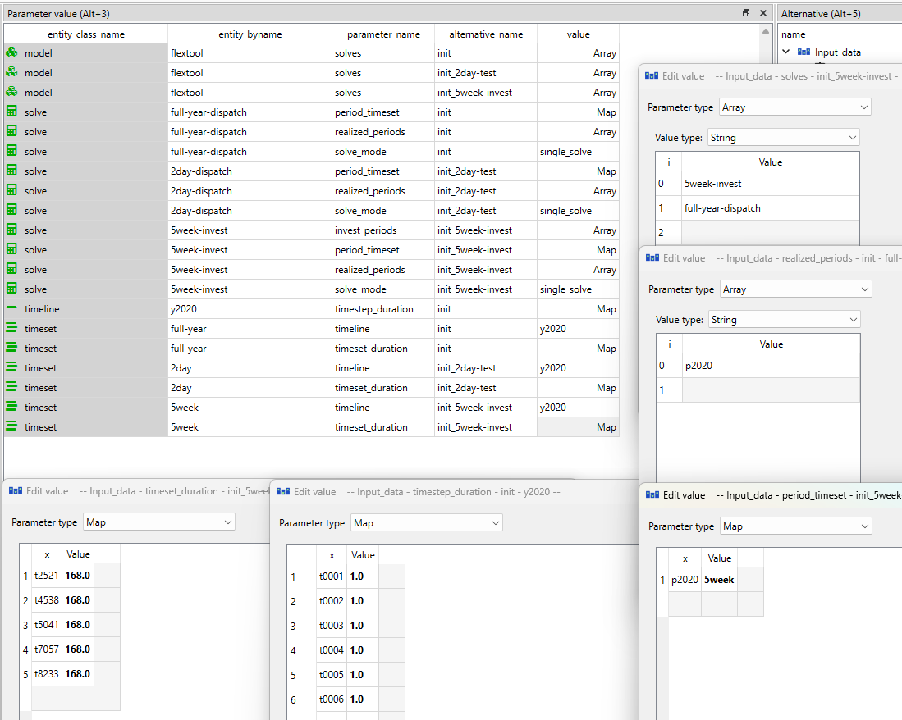

The tool includes some assumptions about the time structure, in case something is missing. These will work if there is only one option for the model to choose. The assuptions are the following:

 - If `timeset`: `timeline` is not set and only one `timeline` is defined, it is used
 - If no `timeset` is exist and only one `timeline` is defined, create a full timeline timeset
 - If `period_timeset` is defined, but no `realized_periods` or `invest_periods` exists, all periods are realized
 - If `period_timeset` does not exist and only one `timeset` exists, create `timesets` for all `realized_periods` and `invest_periods`
 - If `model`: `solves` does not exist, and only one `solve` exists, that it is used
 - If a `solve` in `model`: `solves` does not exist, create a `solve` where all `periods_available` are realized
 
## How to create a PV, wind or run-of-river hydro power plant

**(examples.sqlite scenario: wind)**
***init - west - wind***

These three power plant types don't use any commodities (i.e. fuels), but are instead dependant on a timeseries profile.
To create these plants one needs an output node, an unit and a profile.

The unit needs to be added to an alternative in the `Entity Alternative` sheet (if Toolbox 0.8, after 5/2024). 

The unit only needs parameters:

- `existing`: [The maximum capacity of the plant] 
Additionally these parameters should be at their default values:
- `conversion_method`: *constant_efficiency*
- `efficiency`: 1
- `is_active`: *yes* (if Toolbox 0.7, before 5/2024)

The `profile` entity only has one parameter: `profile`. It is a timeseries map which tells what fraction of the capacity the plant can produce at each timestep.

The other entities 

- `unit__outputnode`: (plant|output node) and 
- `unit__node__profile`: (plant|output node|profile) need to be both created.

The `unit__node__profile` entity needs a parameter `profile_method` that has three options: `upper_limit`, `lower_limit` and `exact`. It states how the profile is considered. In most cases the `upper_limit` option should be used as it allows the plant to curtail the production if there is more supply than demand. Otherwise the output node might have to use `downward_penalty` to spill energy.

The same profile can be used for multiple `unit__outputnode`s (and that is why the profile is not a unit parameter but its own entity).

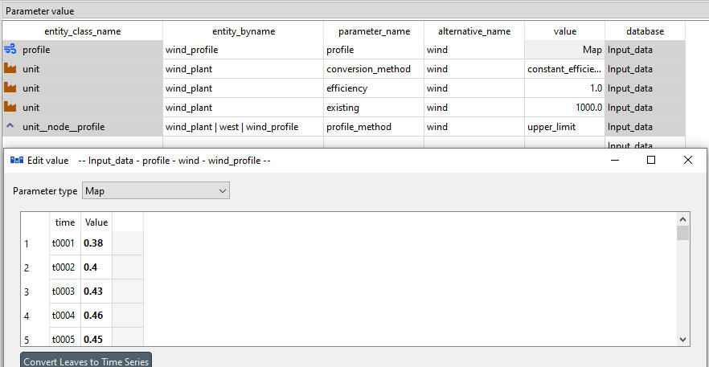

## How to connect nodes in the same energy network
**(connections.sqlite)**

Typically nodes are used to maintain an energy balance and therefore they are used to represent a location with demand or a storage. The nodes can pass energy to each other through a connection entity. This is often an electricity connection but it can be any form of energy (or matter)  moving between two nodes. To create a connection one needs:

- two `nodes` 
- `connection`
- `connection__node__node` to tie these three together.

The `connection` and `nodes` need to be added to an alternative in the `Entity Alternative` sheet (if Toolbox 0.8, after 5/2024). 

The connection needs parameters:

- `existing`: The maximum capacity of the connection [MW]. Applies to both directions.
- `efficiency`: represents the losses in transferring the energy. Same in both directions.
- `is_active`: *yes* (if Toolbox 0.7, before 5/2024)

Optional parameters:

- `is_DC`: *yes*, flag if the connection is counted as non-synchronous for the possible non-synchronous limit. If `is_DC` (direct current) is yes, then the connection is non-synchronous. More at: How-to create a non-synchronous limit
- `transfer_method`: Five options: *regular* (default), *exact*, *variable_cost_only*, *no_losses_no_variable_cost*, *unidirectional*.

In most cases *regular* should be used. The downside of it is that it allows the flows to both directions at the same time, but the model does this only in specific circumstances when its beneficial to leak energy through the connection losses. For example, if connection capacity is 500 and efficiency 0.8, both nodes can send 500, but recive only 400 reducing the incoming energy by 100 in both nodes without any cost.
Typically the model does not want to produce extra energy as it usually has costs, but it can happen if there is a cost to curtailing energy generation from a free source or if a unit is forced to generate at some level ('e.g. using `profile_method`: 'equal'). If `non-synchronous` constraint is used with a node using this connection, use *exact* instead as *regular* connections can circumvent this limit.

*Exact* method does not allow flow in both directions at the same time, but it requires a binary variable, which will be computationally heavier (especially if the model would otherwise be fully linear). 

*Variable_cost_only* can be used when there are no losses associated with the flow. It allows costs related to the flow, but if losses are to be included, it should not be used.

The *no_losses_no_variable_cost* can be used when the connection has no losses and no variable costs accociated with the flow. It is computationally the most efficient method, as it uses only one variable for the flow (the variable becomes negative for the other direction, but this can work only when there are no losses or variable costs). It also prevents simultanoues flow to both directions.

The *unidirectional* method restricts the flow to one direction only (from the first node to the second node in `connection__node__node`). It uses a single non-negative variable and supports `efficiency` and `other_operational_cost` in the usual way. Useful for one-way transmission such as controllable HVDC links or commodity pipelines.

A `group` can also carry a `transfer_method` that overrides the per-connection choice for every connection between its member nodes. Set it to any of the connection options above, or to `dc_power_flow_with_angles` to activate B-theta DC power flow on the subnet (which additionally needs `reactance` on each connection). See the Groups section of the reference for details.

The results of connections can be seen from the node_balance table. However, these are the results from all the connections connected to the node. If you want summary metrics for an individual connection or a collection of them, create a `group`, add the relevant `group__connection__node` members, and set `output_flowGroup_indicators: yes` on the group. This produces a flow-group summary (currently `cumulative_flow` MWh and `average_flow` MW) for the group.

The example database shows a connection between a two node system where the other node has a wind power plant and the other node has a coal power plant. 

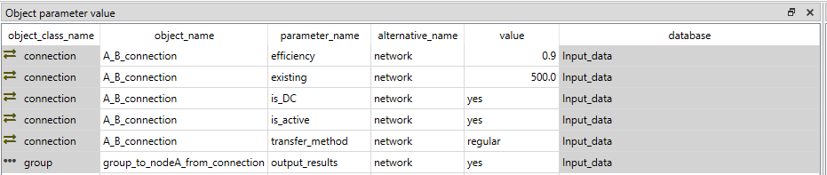

## How to set the demand in a node
**(demand.sqlite)**

The demand in a node is set with the inflow parameter. When the node is consuming energy or matter, the values should be negative and when the node is supplying energy (or matter) the values should be positive.
The inflow parameter accepts two types of data:

- Constant
- Timeseries map

If the model is using multiple periods, then the same timeseries profile is used for every period. However, the inflow can be scaled for different periods with the `inflow_method` parameter:
- `scale_to_annual_flow`: This will multiply the demand with a constant to make the summed inflow to match the `annual_flow`. This requires the node parameter `annual_flow` that is a map of periods containing the annual flow for each period. The sum of inflows is divided by the period's share of the year (hours in period /8760) before scaling (so that the annual energy demand/supply matches the `annual_flow` no matter what parts of the year are used to represent the full year). 
- `scale_in_proportion`: calculates a scaling factor by dividing `annual_flow` with the sum of time series inflow (after it has been annualized using `timeline_duration_in_years`). This does not force the demand/supply to match annual flow in case the representative periods are not representing the full year, but the time series will still be scaled to capture the proportional change in the `annual_flow` parameter. 
- `scale_to_annual_and_peak_flow`: The inflow scaled so that the peak is at the given `peak_flow` and the inflow sums to annual flow of the period. This is done by the following equation:

```
new_inflow = (peak/peak_old)*(1+c)*old_inflow-peak*c

where c = 
[(peak/peak_old)*(8760/hours_in_period)*sum(old_inflow) - annual_flow] 
/ [peak*8760 - (peak/peak_old)*(8760/hours_in_period)*sum(old_inflow)]
```

Examples of all these options are shown in the demand.sqlite.

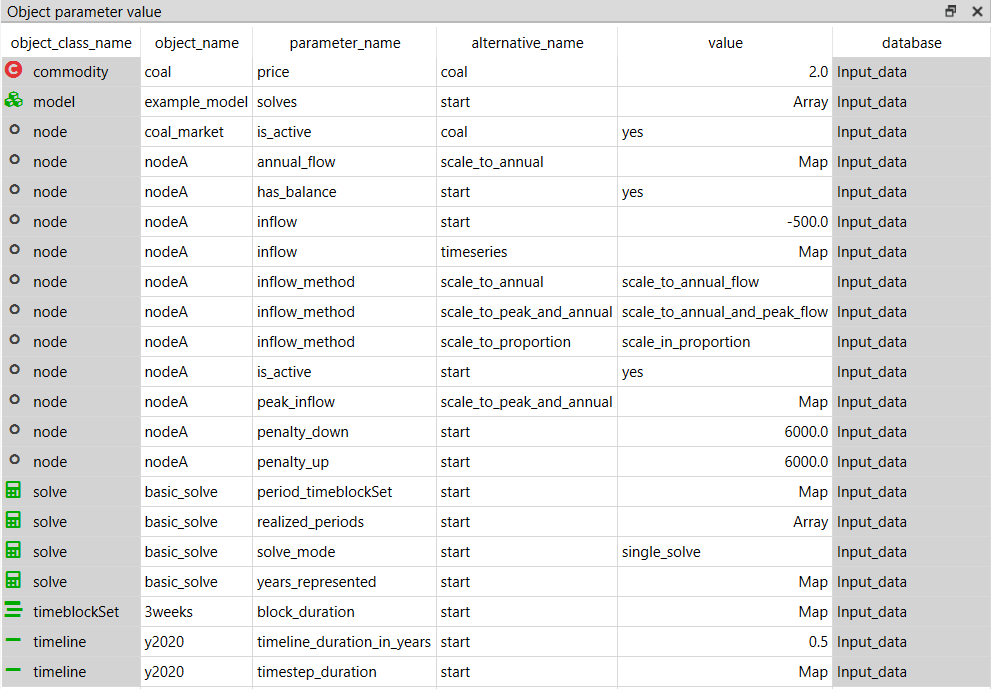

## How to add a storage unit (battery) 

**(examples.sqlite, scenario: wind_battery)**
***init - west - wind - battery***

In the ***Init*** SQLite database, there is a `scenario` *wind_battery*.
In the example, the *wind_plant* alone is not able to meet the load in all conditions, but the *battery* will help it to improve the situation.

In FlexTool, only `nodes` can have storage. `Nodes` can therefore be demand nodes, storage nodes or both. 

The `node` needs to be added to an alternative in the `Entity Alternative` sheet (if Toolbox 0.8, after 5/2024). 

To make a storage node one the required parameters are:

- `node_type`: storage
- `existing`: The maximum storage size of battery as the potential energy [MWh]
- `penalty_up`: a large number to prefer not creating energy from nowhere
- `penalty_down`: a large number to prefer not creating energy from nowhere
- `is_active`: yes (if Toolbox 0.7, before 5/2024)

Additional parameters:

- `self_discharge_loss` The fraction of energy loss in each hour.

Storage states can be tied to a value. For this three methods are introduced:

- `storage_start_end_method`: Fixes start and/or end state of the storage to a chosen value. This is for the start and the end of the whole model timeline (not for individual solves in case the model is rolling forward).
    -  `storage_state_start` and `storage_state_end` set these values.
- `storage_bind_method`: Forces the start and end values to be the same for the chosen  time interval (timeset, period or solve)
- `storage_solve_horizon_method`: Fixes the state of the storage at the end of the solve horizon or sets a price for the stored energy at the end of the solve horizon
    - `storage_state_reference_value` and `storage_state_reference_price` set these values
  
> **Note on end-of-horizon valuation.**  When
> `storage_solve_horizon_method = use_reference_price` is set, the
> `storage_state_reference_price` is applied *in the solver
> objective* (the model sees a credit for leaving energy in the
> storage at the end of the horizon).  However, this credit is
> **not** included in the calculated cost totals reported in
> `costs_discounted_*` and `summary_solve.csv` — end-of-horizon
> storage valuation has several valid interpretations (reference
> price × end state, difference between initial and final state
> priced at an average commodity price, opportunity cost, or simply
> book value) and is typically done as post-analysis rather than as
> part of the optimization cost breakdown.  If you need the credit
> as a reported line item, compute it yourself in post-processing
> from the `v_state` last-timestep values and the
> `storage_state_reference_price`.

Having multiple storage methods can create infeasible problems. This is why some of the combinations shouldn't (and cannot) be used at the same time. If multiple methods are used, some of them might be ignored by the method hierarchy. More information can be found from [Model Parameters: Using nodes as storages](https://irena-flextool.github.io/flextool/reference). 

Battery also needs charging and discharging capabilities. These could be presented either with a `connection` or by having a charging `unit` and a discharging `unit`. In here, we are using a `connection` called *battery_inverter*. Please note that the `efficiency` parameter of the `connection` applies to both directions, so the round-trip `efficiency` will be `efficiency` squared.

The `transfer_method` can be used by all types of connections, but in this case it is best to choose *regular*, which tries to avoid simultaneous charging and discharing, but can still do it when the model needs to dissipate energy. *exact* method would prevent that, but it would require integer variables and make the storage computationally much more expensive. Model leakage will be reported in the results (forthcoming).

The `connection` needs to be added to an alternative in the `Entity Alternative` sheet (if Toolbox 0.8, after 5/2024). 

The required paremeters of the connection are:

- `existing`: The capacity of energy transsmission [MW]
- `transfer_method`: (see above)
- `is_active`: yes (if Toolbox 0.7, before 5/2024)

Additional parameters:

- `efficiency`: by default 1

Finally `connection_node_node` is needed between inverter, the battery and the demand node (west). 

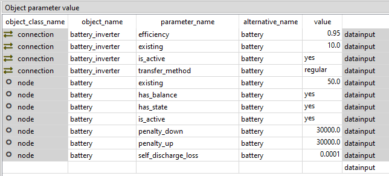

##  How to make investments (storage/unit) 
**(examples.sqlite scenario: wind_battery_invest)**
***init - west - wind - battery - battery_invest***

Here we will use the previous battery scenario to represent the investment options in the tool.

The solve will invest only if it has an array of `invest_periods` set, telling the periods where it is allowed to make investment decisions. In a multi solve investment model (rolling investments) it can be useful to separately set `invest_realized_periods` so that the investment results get reported only from the chosen periods from each solve (in order to avoid overlapping reporting of investment decisions that are replaced by  investment decisions in later solves). Furthermore, `realized_periods` will define the solves and periods from which the dispatch results are output into results.

First, the investment parameters need to be included both for the *battery_inverter* and *battery* entities:

- `invest_method` - the modeller has options to limit the investment and retirement. Options are *not_allowed*, invest, retire or invest and retire. These have the sub options of no limit *invest_no_limit*, limit the amount per period: *invest_period*, limit the total amount invested *invest_total* or limit both the total investment and the investment per period *invest_period_total*. 

  - If the investment is limited, it requires the corresponding maximum/minimum investment (power [MW] or energy [MWh]) to the virtual capacity. This can be set to individual entities or groups of entities:
    
    - `invest_max_total`
    - `invest_max_period`
    - `invest_min_total`
    - `invest_min_period`
    - `retire_max_total`
    - `retire_max_period`
    - `retire_min_total`
    - `retire_min_period`
 
- `invest_cost` - overnight investment cost new capacity [currency/kW] for the *battery_inverter* and [currency/kWh] for the *battery*. Other one can be left empty or zero, since they will be tied together in the next phase. Here we will assume a fixed relation between kW and kWh for this battery technology, but for example flow batteries could have separate investments for storage and charging capacities.
- `discount_rate` - discount rate (WACC) [e.g. 0.05 means 5%] for the technology that reflects the financing cost and risk. Should be nominal when model `inflation_rate` > 0, real when `inflation_rate` = 0.
- `lifetime` - technical lifetime of the technology to calculate investment annuity (together with the discount rate)

Additional parameters:

- `lifetime_method`: Model can either be forced to reinvest when the lifetime ends (`reinvest_automatic`), have a choice (`reinvest_choice`), or be restricted to a one-shot build that retires after its lifetime without rebuild (`no_investment` — for physical one-off additions like plant refurbishments).
- `salvage_value`: Sets the extra value that can be gained for retiring [CUR/kW]
- `fixed_cost`: Annual cost for capacity [CUR/kW]

In many cases some of the investment decisions are tied to each other. Here the battery capacity and the connection capacity of the *battery_inverter* will be tied as they are simultaneously limited by the choice of the battery technology to be invested in.

To model this, a new constraint needs to be created that ties together the storage capacity of the *battery* and the charging/discharging capacity of the *battery_inverter*. 

A new `constraint` entity *battery_tie_kW_kWh* is created and added to an alternative in the `Entity Alternative` sheet (if Toolbox 0.8, after 5/2024).

It is given parameters `constant`, `sense` and `is_active` (if Toolbox 0.7, before 5/2024). Constant could be left out, since it is zero. The `sense` of the constraint must be *equal* to enforce the kw/kWh relation.

Both *battery_inverter* and *battery* need a coefficient to tell the model how they relate to each other. The equation has the capacity variables on the left side of the equation and the constant on the right side.

```
sum_i(`constraint_invested_capacity_coeff` * `v_invest`) = `constant`
      where i is any unit, connection or node that is part of the constraint
```

When the `constraint_invested_capacity_coeff` for *battery* is set at 1 and for the *battery_inverter* at -8, then the equation will force *battery_inverter* `v_invest` to be 8 times smaller than the *battery* `v_invest`. The negative term can be arranged to the right side of the equation, which yields:

```1 x *battery* = 8 x *battery_inverter*, which can be true only if *battery_inverter* is 1/8 of *battery*```

`constraint_invested_capacity_coeff` is not a parameter with a single value, but a map type parameter (index: constraint name, value: coefficient). It allows the entity to participate in multiple constraints. (This parameter was previously named `constraint_capacity_coefficient`; migration v32 renames existing DBs automatically. The old expression summed `v_invest` once per active investment period — incorrect in multi-period models — and has been fixed to emit just the current period's `v_invest`.)

To tie cumulative, built-up capacity rather than the current period's new build, use `constraint_cumulative_pre_built_capacity_coeff`. It takes data-baseline capacity plus every `v_invest` made in periods strictly BEFORE the current one, ignoring retirements (learning-effect semantics). Paired with `constraint_invested_capacity_coeff`, it expresses period-over-period growth limits:

```
v_invest[e, d] <= growth_rate * pre_built[e, d]
```

is written as: `constraint_invested_capacity_coeff = { c: 1.0 }` and `constraint_cumulative_pre_built_capacity_coeff = { c: -growth_rate }` on entity `e`, with constraint `c` having `sense = less_than` and `constant = 0`. A 10% growth cap starting from 1000 MW of existing wind would allow 100 MW in period 1, 110 in period 2, 121 in period 3, and so on.

Finally, FlexTool can mix several types of constraint coefficients: `constraint_invested_capacity_coeff`, `constraint_cumulative_pre_built_capacity_coeff`, `constraint_state_coeff` and `constraint_flow_coeff` allowing the user to create custom constraints between any types of entities in the model for the main variables in the model (*flow*, *state* as well as *invest*). So, the equation above is in full form:

```
  + sum_i [constraint_invested_capacity_coeff(i) * v_invest]
           where i contains [node, unit, connection] belonging to the constraint
  + sum_i [constraint_cumulative_pre_built_capacity_coeff(i) * pre_built]
           where pre_built = existing baseline + Σ v_invest from earlier periods
  + sum_j [constraint_flow_coeff(j) * capacity]
           where j contains [unit--node, connection--node] belonging to the constraint
  + sum_k [constraint_state_coeff(k) * capacity]
           where k contains [node] belonging to the constraint
  =
  constant

  where 'capacity' is existing capacity plus invested capacity
```

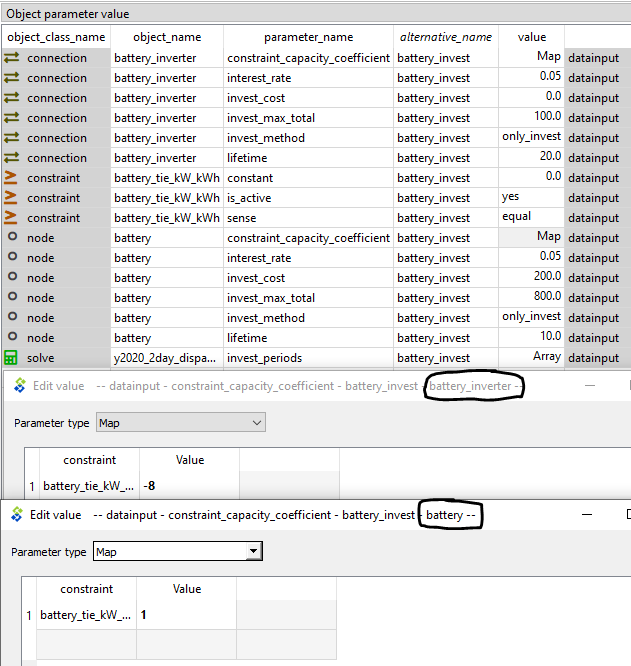

## How to create combined heat and power (CHP) 

**(examples.sqlite scenario: coal_chp)**
***init - west - coal_chp - heat***

First, a new *heat* `node` is added with the necessary parameters. The `nodes` can be used for energy form of energy or matter, so the heat demand node does not differ from the electricity demand node. 

The *heat* `node` needs to be added to an alternative in the `Entity Alternative` sheet (if Toolbox 0.8, after 5/2024). 

The required parameters are:

- `node_type`: balance
- `inflow`: Map for the heat demand (negative) [MW]
- `penalty_up`: a large number to prefer not creating energy from nowhere
- `penalty_down`: a large number to prefer not creating energy from nowhere
- `is_active`: yes (if Toolbox 0.7, before 5/2024)

The heating systems tend to have some level of storage capability, so one could also add storage parameters to the node as well, but here they are not used.

Then the *coal_chp* `unit` is made with a high `efficiency` parameter, since CHP units convert fuel energy to power and heat at high overall rates. In FlexTool, `efficiency` is a property of the unit - it demarcates at what rate the sum of inputs is converted to the sum of outputs. However, without any additional constraints, the `unit` is free to choose in what proportion to use inputs and in what proportion to use outputs. In units with only one input and output, this freedom does not exist, but in here, the *coal_chp* needs to be constrained as otherwise the unit could produce only electricity and no heat at 90% efficiency, which is not feasible. 

This CHP plant is an another example where the user defined `constraint` (see the last equation in the previous example) is used to achieve the desired behaviour. In a backpressure CHP, heat and power outputs are fixed - increase one of them, and you must also increase the other. In an extraction CHP plant the relation is more complicated - there is an allowed operating area between heat and power. Both can be represented in FlexTool, but here a backpressure example is given. An extraction plant would require two or more *greater_than* and/or *lesser_than* `constraints` to define an operating area.

For extraction CHP specifically, the three `unit__inputNode` / `unit__outputNode` coefficients interact. `conversion_flow_coeff` multiplies into the edge's contribution in the fuel balance (`conversion_indirect`) — higher coefficient means more fuel consumed per unit of that edge's output, so a premium electricity output might use `conversion_flow_coeff = 2` while a byproduct heat output uses `0.2`. `capacity_max_coeff` and `capacity_min_coeff` then set the per-edge upper and lower caps independently. A typical extraction CHP with efficiency 0.9 and elec / heat flow coefficients of 2 and 0.2 can reach pure-condensing mode (heat=0) by setting `capacity_min_coeff = 0` on the heat output, and pure-heat mode by setting `capacity_max_coeff = 1` on the heat output. Without the capacity-coefficient split, each output would be capped individually at `conversion_flow_coeff × capacity`, which prevents the model from using the full operating envelope.

Electricity and heat outputs are fixed by adding a new `constraint` *coal_chp_fix* where the heat and power co-efficients are fixed. You need to create the two entities `unit__outputNode`, for *coal_chp--heat* and *coal_chp--west*. As can be seen in the bottom part of the figure below, the `constraint_flow_coeff` parameter for the *coal_chp--heat* and *coal_chp--west* is set as a map value where the `constraint` name matches with the *coal_chp_fix* `constraint` entity name. The values are set so that the constraint equation forces the heat output to be twice as large as the electricity output.

Create constraint *coal_chp_fix*, add it to an alternative in the `Entity Alternative` sheet (if Toolbox 0.8, after 5/2024) and add parameters:

- `sense`: equal
- `constant`: 0.0
- `is_active`: yes (if Toolbox 0.7, before 5/2024)

Create `unit_outputNode` (coal_chp|heat):

- `constraint_flow_coeff` : *coal_chp_fix*, -0.5

Create `unit_outputNode` (coal_chp|west):

- `constraint_flow_coeff` : *coal_chp_fix*, 2


Again, the negative value can be turned positive by arranging it to the right side of the equality, creating this:

```
1 x *electricity* = 0.5 x *heat*, which is true only if *heat* is 2 x *electricity*
```

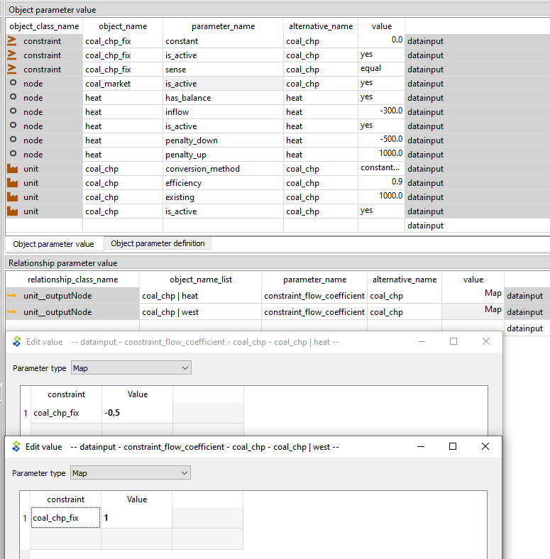

## How to create a hydro reservoir
**hydro_reservoir.sq**

### Simple hydro reseroir
***(scenario: hydro)***

The objective is to create a hydro power plant with a reservoir and connect it to a demand node.

Hydro reservoir power plant requires three components:

- Reservoir `node`
- Hydro `unit`
- Output `node`

It can be useful to create a new alternative for these components to be able to include and exclude them from the scenarios.

The reservoir is made with a node as only nodes can have storage in FlexTool. The incoming water can be represented by the inflow parameter. It can be a constant or a time variant. 

There are two ways to handle the water to electricity coefficient. In this example we store the water as volume and convert it to electricity in the unit. 
This option is better when modelling river systems with multiple reservoirs. Note that in the results, the state of the reservoir is then as volume.
For the other option of converting the volume to potential energy in the reservoir, look at the start of the 'How to create a hydro pump storage'.

In this implementation of reservoir hydro power, there is an option to spill water from the storage so that it does not run through the plant. The simplest way of allowing spilling is setting the downward penalty of the node to 0. This way the energy can disappear from the storage without a cost. The quantity of spilled water can be seen from the results as the 'downward slack' of the node.

Add the *reservoir* node to an alternative in the `Entity Alternative` sheet (if Toolbox 0.8, after 5/2024). 

The required parameters of the reservoir node are (node_c and node_t sheets if using Excel input data):

- `node_type`: storage
- `inflow`: Mapping of the incoming water as volume [m^3/h]
- `existing`: The maximum size of the reservoir [m^3]
- `penalty_up`: a larger number than with the demand node to not allow creating extra water if not enough electricity is being created
- `penalty_down`: 0 or a large number (spilling or not)
- a `storage_method` to set the behaviour on how the storage levels should be managed - for short duration storages *bind_within_timeblock* may be best and for seasonal storages it could be best to use *bind_within_solve*. If historical storage level time series are available, it can be beneficial to use *fix_start* in the `storage_start_end_method` together with `storage_solve_horizon_method` *use_reference_value*, which will pick the storage level at the end of each solve from the time series provided as a reference (*storage_state_reference_value*). See `flextool/schemas/spinedb_schema.json` for the full enumeration of `storage_binding_method` values and the silent-degrade behaviour of the `*_blended_weights` variants; DB migration v55 renamed several legacy names (e.g. `bind_within_timeset` → `bind_within_timeblock`).
- `is_active`: yes (if Toolbox 0.7, before 5/2024)

The `unit` is connected to the *reservoir* `node` and the output `node` *demand_node* (unit_c and unit_node_c in excel):

- Add the unit to an alternative in the `Entity Alternative` sheet (if Toolbox 0.8, after 5/2024).
- The `efficiency` of the plant is the coefficient of transfering an unit of volume to an unit of electricity (using piecewise linear efficiency is naturally possible), here we use 0.57. 
- Set `existing` capacity [MW]
- Create entities `unit__inputNode`: *hydro_plant*|*reservoir* and `unit__outputNode`: *hydro_plant*|*demand_node*.
- `is_active`: yes  (if Toolbox 0.7, before 5/2024)

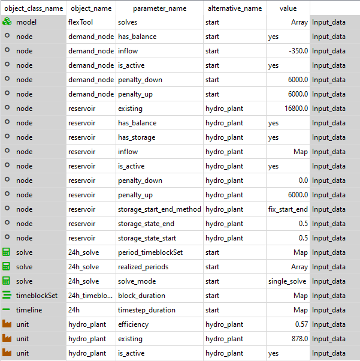

### River system with multiple reservoirs
**(scenario: hydro_with_downriver_spill_unit)**
**(scenario: river_system)**

In this example, we create a hydro system with multiple reseroirs and downriver water demand. Here the the reservoir content is represented as volume of water (m3) and the conversion factor to electricity (MWh) is expressed in the hydro power plant parameters. This could also be done the other way around where the reservoir content is expressed as energy (MWh). Especially in a cascading river system it is better to use the first approach.

The reservoir and demand node are the same as above. The `penalty_down` of the reservoir now needs to be the other than 0 as the spilled water needs to flow to the downriver node

Let's start with the downriver demand. 

The downriver node represents the requirement to pass a minimum amount of water through the plant to not dry out the river. The downriver node needs:

- To be added to an alternative in the `Entity Alternative` sheet (if Toolbox 0.8, after 5/2024).
- `node_type`: balance
- `inflow`: Minimum requirement of water flow as the potential power (Map or constant)[m^3/h]
- `penalty_up`: a large number to prefer not creating energy from nowhere
- `penalty_down`: 0, this makes the requirement to be at least the amount of water as the demand, not the equal to it
- `is_active`: yes (if Toolbox 0.7, before 5/2024)

The hydro plant unit now also needs the relation `unit_outputNode`: *hydro_plant*|*downriver* . 

The hydro plant now needs to both pass the water to downriver and the electricity to the demand node. Also, it needs to handle the water to electricity transformation as the reservoir now has volume not energy. The user needs to get the water to electricity coefficient ie. how much energy does one unit of volume create when passing the unit in this example the coefficient is 0.57. As the unit creates both the water and the electricity, the efficiency now is the sum of the two. 

- `efficiency`: 1 + coefficient

Now the unit creates enough stuff to output, but the model can still choose how it will distribute it between the two output nodes. We still need to fix the ratio of output flows. This is done with an user constraint. Here we call this constraint *hydro_split*. First, it needs to be added to an alternative in the `Entity Alternative` sheet (if Toolbox 0.8, after 5/2024).

The constraint needs parameters:

- `sense`: equal
- `constant`: 0
-  `is_active`: yes (if Toolbox 0.7, before 5/2024)

As we are fixing the output flows, the we need to add the flows with their coefficients to this constraint. This is done with the unit_outputNode parameter `constraint_flow_coeff`:

- `unit_outputNode`(*hydro_plant*|*downriver*): `constraint_flow_coeff`: Map (hydro_split| 0.57)  
- `unit_outputNode`(*hydro_plant*|*demand_node*): `constraint_flow_coeff`: Map (hydro_split| -1)

These create the constraint: 
```
-flow_to_demand_node + 0.57 flow_to_downriver = 0
```

The capacity of an unit is the sum of outputs. With the electrical capacity of 500MW and water to elecricity coefficient of 0.57 the water flow capacity is 878 (m^3). Making the total unit capacity 1378 (m^3 / MW). Now at full power, 878 units of water flow to downriver and 500MW of electricity flow to the demand node.

To add a spill option to the reservoir we need to create another unit. This is because just making extra water disappear with the `penalty_down`: 0, will not transfer this water to the downriver node to fulfil its needs. 
This spill unit has to be in entities:
- `unit_inputNode` (*spill_unit*|*reservoir*)
- `unit_outputNode` (*spill_unit*|*downriver*)

It needs to be added to an alternative in the `Entity Alternative` sheet (if Toolbox 0.8, after 5/2024).

And parameters:

- `efficiency`: 1
- `existing`: A large enough number to not be a limit
-  `is_active`: yes (if Toolbox 0.7, before 5/2024)

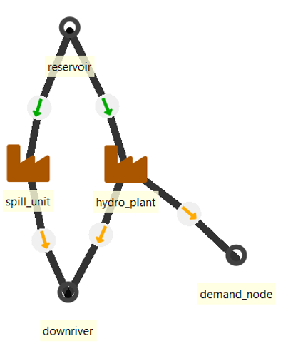

The database also includes an example of a river system with two additional reservoirs and plants. Both of them flow to the reservoir already made in this how to. These two are created the exact same way as above, but with just different values and the relation `unit_outputNode`: (hydro_plant_2| reservoir) and `unit_outputNode`: (hydro_plant_3| reservoir).

In principle you can create as large river systems as you want, but each reservoir adds extra computational burden. Think about the possibility to combine the reservoirs and plants in the system and what information you lose with this approximation.

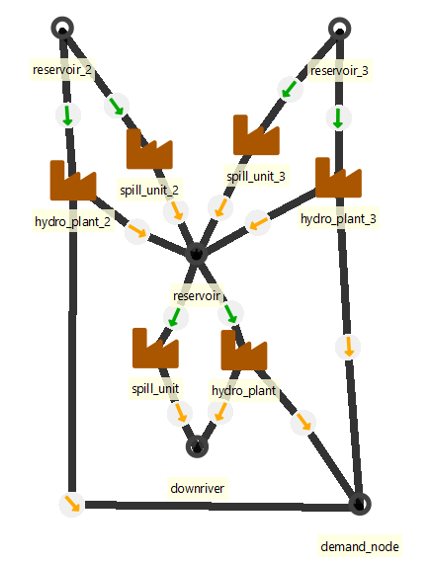

## How to create a hydro pump storage
**(hydro_with_pump.sqlite)**

For a hydro pump storage one needs the following components:

- Demand `node` 
- hydro_plant `unit` with 
- storage `node`, 
- hydro_pump `unit` with 
- pump storage `node` 
- a source for external energy (pumped storage plant will lose energy due to charging losses). Wind power plant will be used as a source for external energy.

There are two ways to handle the water to electricity coefficient. Here, we convert the reservoir capacity and inflow to potential energy. 
The unit of the inflow should be the power that can be created from the quantity of the incoming water at maximum efficiency [MW]. In the same way, the existing storage capacity should be the maximum amount of stored energy that the reservoir can hold [MWh].
In this implementation of reservoir hydro power, there is an option to spill water (energy) from the storage so that it does not run through the plant. The simplest way of allowing spilling is setting the downward penalty of the node to 0. This way the energy can disappear from the storage without a cost. The quantity of spilled energy can be seen from the results as the 'downward slack' of the node.

The *reservoir* `node` needs to be added to an alternative in the `Entity Alternative` sheet (if Toolbox 0.8, after 5/2024).

The required parameters of the reservoir node are (node_c and node_t sheets if using Excel input data):

- `node_type`: storage
- `inflow`: Mapping of the incoming water as the potential power [MW]
- `existing`: The maximum size of the reservoir as the potential energy [MWh]
- `penalty_up`: a large number to prefer not creating energy from nowhere
- `penalty_down`: 0 or a large number (spilling or not)
- a `storage_method` to set the behaviour on how the storage levels should be managed - for short duration storages *bind_within_timeblock* may be best and for seasonal storages it could be best to use *bind_within_solve*. If historical storage level time series are available, it can be beneficial to use *fix_start* in the `storage_start_end_method` together with `storage_solve_horizon_method` *use_reference_value*, which will pick the storage level at the end of each solve from the time series provided as a reference (*storage_state_reference_value*). See `flextool/schemas/spinedb_schema.json` for the full enumeration of `storage_binding_method` values and the silent-degrade behaviour of the `*_blended_weights` variants; DB migration v55 renamed several legacy names (e.g. `bind_within_timeset` → `bind_within_timeblock`).
- `is_active`: yes (if Toolbox 0.7, before 5/2024)

The `unit` is connected to the *reservoir* `node` and the output `node` *nodeA* (unit_c and unit_node_c in excel):

- It needs to be added to an alternative in the `Entity Alternative` sheet (if Toolbox 0.8, after 5/2024).
- The `efficiency` of the unit can be set to 1 as the inflow time series are directly expressed in MWh (using piecewise linear efficiency is naturally possible).
- Set `existing` capacity [MW]
- `is_active`: yes (if Toolbox 0.7, before 5/2024)
- Create entities `unit__inputNode`: *hydro_plant*|*reservoir* and `unit__outputNode`: *hydro_plant*|*nodeA*.

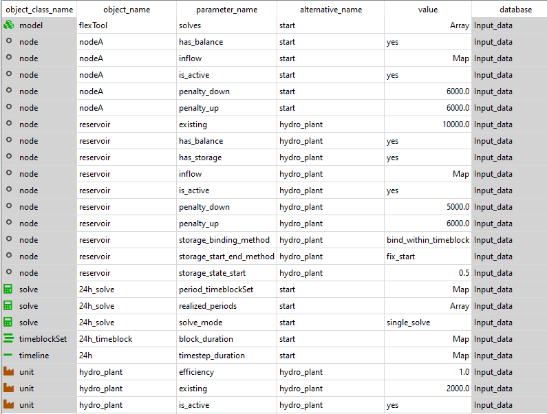

Next create the pump_storage. This is the downstream storage from the hydro plant. Again it should be added to an alternative in the `Entity Alternative` sheet (if Toolbox 0.8, after 5/2024) and have same the parameters as the reservoir:

- `node_type`: storage
- `existing`: The maximum size of the storage [MWh]. Note that this really represents the mass of the water and it should be converted as the potential of the energy of the reservoir-plant system. So that 1 liter of water has the same energy in both storages.
- `penalty_up`: a large number to avoid creating energy from nowhere
- `penalty_down`: 0
- `is_active`: yes (if Toolbox 0.7, before 5/2024)

In this example database, we have both a closed system and a river system. The difference is that in the closed system the inflow is zero in both reservoir and pump_storage. In river system we have the incoming water for the reservoir as in the reservoir example. In the downstream pump storage, we implement an outflow as the negative inflow representing the minimum amount of water that has to flow out of the system at each timestep to not dry out the river. The `penalty_down` is set as 0 to allow it let more water go when it needs to, otherwise the storages will keep filling up if the incoming water is larger than the minimum outgoing water.

The storage level fixes should be the same in both storages (reservoir and pump storage). Here:

- `fix_start_end_method`: *fix_start*
- `storage_state_start`: 0.5
- `bind_storage_method`: *bind_with_timeset*

This sets the starting storage levels to be 50%. The binding will also constrain the state of the storage at the end of of each timeset to be the same as in the beginning of the timeset.

Then create the pump unit and add it to an alternative in the `Entity Alternative` sheet (if Toolbox 0.8, after 5/2024). 

It only needs three parameters:

- `efficiency` = 1, The real efficiency of the pump is set elsewhere, so use 1.0 here. 
- `existing`: The wanted capacity
- `is_active`: *yes* (if Toolbox 0.7, before 5/2024)

Set the entities as follows:

- `unit_outputNode` for (hydro_plant | nodeA), (hydro_plant | pump_storage ), (hydro_pump | reservoir)
- `unit_inputNode` for (hydro_plant | reservoir), (hydro_pump | pump_storage), (hydro_pump | nodeA)

Your system should look something like:

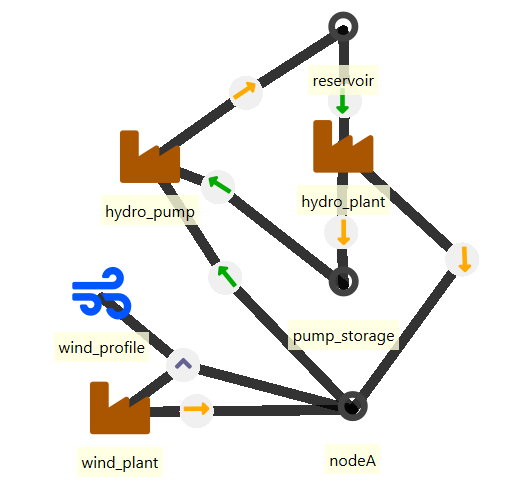

Next comes the tricky part of preserving the water and energy as both are represented as generic energy in the model. This is done by setting extra coefficents and constraints to the flows. First the hydro_plant needs to both create the energy for the demand node and pass the mass to the pump_storage. This is done by doubling the efficiency in this example to 2 and setting a extra constraint to force the output flows to both the demand node and the storage to be the same. 

For the hydro plant:

- `Efficiency`:  2 

Create a new constraint (here *plant_storage_nodeA_split*), add it to an alternative in the `Entity Alternative` sheet (if Toolbox 0.8, after 5/2024) and add the parameters:

- `sense`: equal
- `constant`: 0.0
- `is_active`: yes (if Toolbox 0.7, before 5/2024)

And for the `unit_outputNodes`:

- (hydro_plant | nodeA) `constraint_flow_coeff` Map: plant_storage_nodeA_split , 1
- (hydro_plant | pump_storage) `constraint_flow_coeff` Map: plant_storage_nodeA_split , -1
- Meaning: 
```
flow to nodeA - flow to pump_storage = 0
```

As for the pump storage, we will have to make sure that the same amount of water leaves the pump_storage and enters the reservoir. Also it still should use electricity from the demand node without increasing the amount of water that is moving from storage to another. 
First to prevent the energy from the demand node from increasing the water flow, add a coefficient to the flow between the demand node and the pump.

`unit_inputNode` (hydro_pump|nodeA):
- `Coefficient`: 0 (Default is 1) 

This prevents the water amount from increasing as:
```
unit_output_flow = coeff1 * unit_input_flow1 + coeff2 * unit_input_flow2.
```
We still have to make the unit to consume electricity even though it does not affect the unit output directly. This is done by setting a new constraint to tie the flows to the pump unit from pump storage and the nodeA. Add a constraint (here *pump_storage_nodeA_fix*), add it to an alternative in the `Entity Alternative` sheet (if Toolbox 0.8, after 5/2024) , and add the parameters:

- `sense`: equal
- `constant`: 0.0
- `is_active`: yes (if Toolbox 0.7, before 5/2024)

And setting parameters for `unit_inputNode`:

- (hydro_pump | nodeA) `constraint_flow_coeff` Map: *pump_storage_nodeA_fix* , 2
- (hydro_pump | pump_storage) `constraint_flow_coeff` Map: *pump_storage_nodeA_fix* , -1

```
2 * flow_from_nodeA - flow_from_pump_storage = 0
```
Note that here the (`constraint_flow_coeff ` Map: plant_storage_nodeA_split , 2) actually sets the efficiency of the pump. 
This means that here only half of the electricity used by the pump can be recovered when that amount of water is used by the hydro_plant. (Two units of energy are used to move 1 unit of water_energy)
The `constraint_flow_coeff` for pump_input should therefore be (1/efficiency)

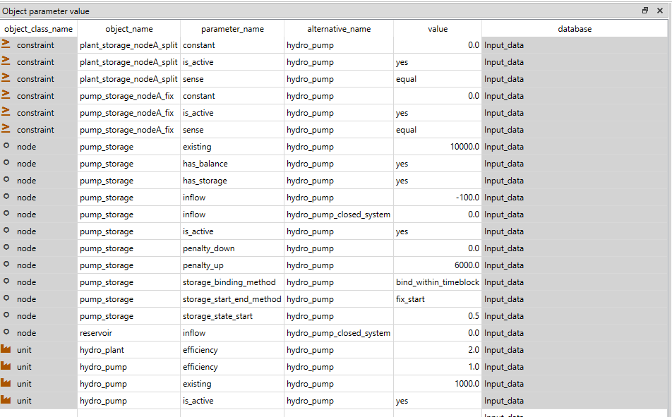
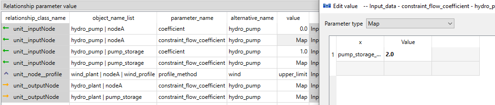

## How to add a reserve
**(examples.sqlite: scenario network_coal_wind_reserve)**

In FlexTool, reserves are defined for a group of nodes. If there is a need to have a reserve requirement for a single node, it needs its own group. Therefore, when creating a reserve, the first step is to add a new `group` (e.g. *electricity*) with all member nodes (e.g. *west*, *east* and *north*) using the `group__node` entity. Then, a new reserve categories can be added (e.g. *primary*) to the `reserve` entity. 
Finally, make sure there are *up* and *down* entities in the `UpDown' entity. These are hard-coded names in FlexTool and need to be used when creating reserves.

Next, the reserve requirement will be defined. An entity between the `reserve__upDown__group` class (e.g. *primary--up--electricity*) allows to define the reserve parameters `reserve_method`, `reservation` (i.e. the amount of reserve) and `penalty_reserve` (i.e. the penalty cost in case of lack of reserve). For example, a constant of 10 MW could be used. Even though the name of the `reserve_method` is *timeseries_only*, it can also accept a constant value - it's an exogenous reserve requirement whereas the other two reserve methods are endogenous. Dynamic reserve method calculates the reserve requirement from generation and loads according to user defined factors (`increase_reserve_ratio`). Largest failure method will force enough reserve to cope with a failure of the chosen unit and connection flows.

Parameters from the `reserve__upDown__unit__node` class should be used to define how different units can contribute to different reserves. Note that the entities in this class need to be added to the `Entity Alternative` sheet. Parameter `max_share` says how large share of the total capacity of the timestep (existing * efficiency * (profile)) of the unit can contribute to this reserve category (e.g. *coal_plant* may be limited by ramp constraint to provide only 1% of its capacity to an upward primary reserve.) Meanwhile, parameter `reliability` affects what portion of the reserved capacity actually contributes to the reserve (e.g. *wind_plant* may contribute only 80% of its generation to reserve due to uncertainty).

 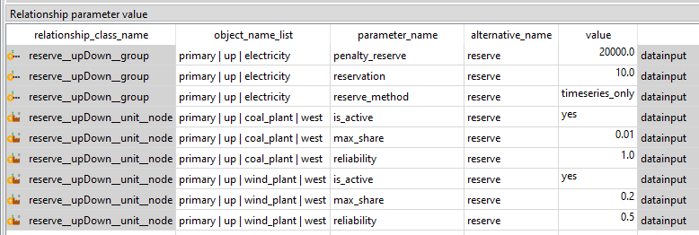


## How to add a minimum load, start-up and ramp
**(ramp_and_start_up.sqlite)**

Some plants cannot vary their output freely, but have some cost and limits associated with it. In this example we will add the minimum load behaviour to a *coal_plant* `unit` and add the cost and limits for starting up and ramping the plant respectively.

Minimum load requires that the unit must have an online variable in addition to flow variables and therefore a `startup_method` needs to be defined and an optional `startup_cost` can be given. The `startup_cost` is added to the total cost every time the unit is required to start-up. Here we use a value 1000 (Currency/MW started up).

The options for the `startup_method` are *no_startup*, *linear* and *binary*. *binary* would require an integer variable so *linear* is chosen. However, this means that the unit can startup partially. The minimum online will still apply, but it is the minimum of the online capacity in any given moment (*flow* >= *min_load* x *capacity* x *online*), where 0 <= *online* <= 1.

The online variable also allows to change the efficiency of the plant between the minimum and full loads. A unit with a part-load efficiency will obey the following equation:

```
  + sum_i[ input(i) * input_coefficient(i) ]
  =
  + sum_o[ output(o) * output_coefficient(o) ] * slope
  + online * section

where   slope = 1 / efficiency - section
  and section = 1 / efficiency 
                - ( 1 / efficiency - min_load / efficiency_at_min_load) / ( 1 - min_load )
```

By default, `input_coefficient` and `output_coefficient` are 1, but if there is a need to tweak their relative contributions, these coefficients allow to do so (e.g. a coal plant might have lower efficiency when using lignite than when using brown coal).

The input is required at different ouput levels is shown in the figure below, when Capacity = 100, Efficiency = 0.8, Minimum load = 0.6 and Efficiency at minimum load = 0.5.

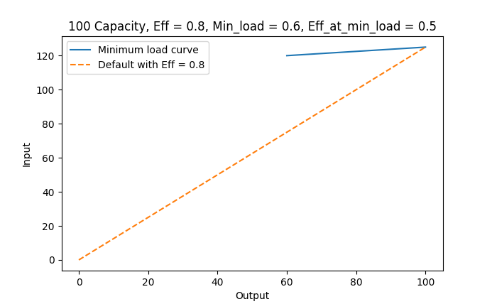

Next we will add ramp limits. With the ramping limits, the user can force the change of a flow from a unit to be below a certain value each timestep. The ramping is an attribute of the flow. Therefore it does not require the minimum load behaviour and its parameters are added to the `unit_outputNode` entity:

- `ramp_method`: ramp_cost, ramp_limit or both. Only ramp limit is currently implemented (August 2023).
- `ramp_speed_up`: Limit on how fast the plant can ramp up. (fraction of unit / min) ie. Value 0.01 allows the change of 60% of capacity per hour. 
- `ramp_speed_down`: Limit on how fast the plant can ramp down. (fraction of unit / min) ie. Value 0.01 allows the change of 60% of capacity per hour.
- `ramp_cost`: NOT YET IMPLEMENTED. The cost of ramping the capacity. [CUR/MW] 

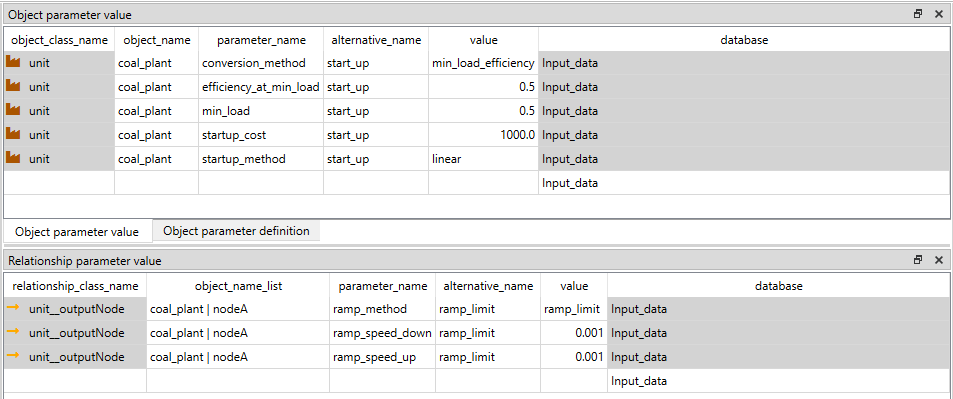

## How to add minimum uptime and downtime

Some power plants cannot be started and stopped freely due to thermal stress, safety requirements, or operational constraints. Minimum uptime forces a unit to stay online for a specified duration after starting up. Minimum downtime forces a unit to stay offline for a specified duration after shutting down.

To add minimum uptime and/or downtime constraints to a `unit`:

1. Set the `minimum_time_method` parameter on the unit:
    - *min_uptime* - only enforce minimum uptime
    - *min_downtime* - only enforce minimum downtime
    - *both* - enforce both constraints
    - *none* - no minimum time constraints (default)

2. Set the duration parameters (in hours):
    - `min_uptime` - e.g. 8 for an 8-hour minimum online time
    - `min_downtime` - e.g. 4 for a 4-hour minimum offline time

Setting `minimum_time_method` to anything other than *none* will automatically activate online variables for the unit (at least linear startup), even if `startup_method` is not explicitly defined. This means you do not need to separately set `startup_method` to *linear* or *binary*, although you can if you also want startup costs or binary commitment.

The minimum time constraints work with variable timestep durations. The constraint checks that the cumulative duration of consecutive online (or offline) timesteps meets the minimum requirement, rather than simply counting timesteps.

When using rolling window solves, ensure that the solve horizon overlap is at least as long as the longest `min_uptime` or `min_downtime` value. A warning will be issued if this condition is not met.

If the unit also has ramp limits (`ramp_speed_up`, `ramp_speed_down`), the model will additionally tighten the maximum output in the startup and pre-shutdown timesteps based on how fast the unit can ramp within one timestep. Without ramp limits, the unit can reach full output immediately after starting.

## How to add CO2 emissions, costs and limits

**(examples.sqlite scenario: coal_co2 )**
***init - west - coal - co2_price - co2_limit***

Carbon dioxide emissions are added to FlexTool by associating relevant `commodities` (e.g. *coal*) with a `co2_content` parameter (CO2 content (tons per MWh) of energy contained in the fuel). 
The other CO2 parameters are handeled through a group of nodes (Here *coal_price* or *coal_limit* `groups`). Therefore one needs to create a group and add all the nodes that supply these commodities (eg. coal_market) to a group with a `group_node` entity. (Here the entity *co2_price--coal_market*)
To set a price one needs to create set the co2_method parameter to *price* (constant) and create the `co2_price` parameter with the desired value. This price is added to the price of the commodity. 

Alternatively one can set a limit on the co2 used by setting the `co2_method` parameter to *period* or *total* and setting the `co2_max_period` (periodic map [tCO2]) parameter or `co2_max_total` (constant [tCO2]) parameter. 

There methods can be combined by setting the `co2_method` to *price_period*, *price_total*, *period_total* or *price_period_total*.


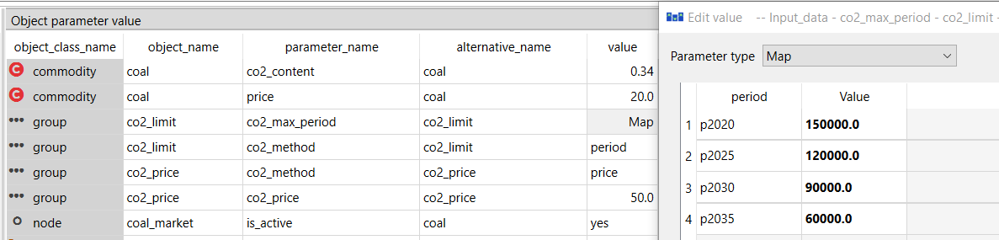

## How to create a non-synchronous limit
**(non_sync_and_curtailment.sqlite)**
***(scenario: non_sync)***

Non-synchronous limit is a property of a `group` of nodes. It states that the non-synchronous flow to the group of nodes cannot exceed a set share of the input flows at any timestep. To demonstrate this, we have set a system with a coal plant, a wind plant and a single demand node. However, it can be done to a group of nodes with unlimited number of plants or connections connected. So, one can limit the non-synchronous share of individual nodes or of the whole system. The flows between the nodes of the group are excluded.

The non-synchronous limit is set to a `group` of nodes with one or multiple members. Note: These are set to the group with `group_node` entity, not with `group_node_unit` entity!

Create a group (here *nodeA_group*) and set a `group_node` entity (nodeA_group |nodeA). Then add parameters:

- `has_non_synchronous`: yes
- `non_synchronous_limit`: 0.5
- `penalty_non_synchronous`: 4000

This forces the non-sync flow to be at max 50% of the incoming flow to the nodeA. 
The penalty should be always set as in some cases there is no other way to keep the constraint feasible (and it will be difficult to find the reason why the model does not solve). The existence of the non-synchronous penalty in your results indicates that this constraint has been violated and you should investigate the reason for this in your system. If the `penalty_non_synchronous` is lower than the `upward_penalty` of the demand `node`, the system will prefer breaking the non-sync constraint instead of the `node` balance equation. In other words, it will not curtail the production of `profile` plants if the demand is not satisfied even though it will break the non-synchronous penalty. If it is higher, the curtailment will take place instead.

When having a connection to a storage from a node with this constraint, the best practice is to add this storage node to the group as well. This excludes the flows to and from the storage in the calculation of the non-synchronous ratio. However, if you want to have these flows in the calculation, you have two options depending on if you want the flow to be synchronous or not. If it is non-synchronous, just set the connection parameter `is_DC`: yes. If it is synchronous (e.g., some flywheels), an issue arises with the *reqular* connection as it now can reduce the ratio with equal simultaneous flow in both directions. To prevent the simultaneous flow to both directions you need to set the `transfer_method`: *exact*. This will increase the solving time significantly as it will use integer variables (so, better to add the storage node to the node group with a non-synchronous limit).

Then set which plants and connections are considered non-synchronous by adding parameters:

`unit_outputNode`:
- `is_non_synchronous`: yes 

`Connection_node_node`:
- `is_DC`: yes 

Here the (wind_plant|nodeA) relation has the `is_non_synchronous` parameter and battery connection `is_DC` parameter.

A connection with `transfer_method`: *no_losses_no_variables* between a node included in a group with a non-synchronous limit and a node outside of the group is not allowed. The flow in this kind of a connection is presented with a single variable, which would not function correctly with the non-synchronous limit constraints (there is a non-linearity at zero that requires two variables). 

If you want summary metrics per flow in the results, create a separate `group` for each flow (or collection of flows) and add `group__unit__node` entities to it. The group needs the parameter:

- `output_flowGroup_indicators`: yes 

This emits a flow-group summary table (currently `cumulative_flow` MWh and `average_flow` MW, with more metrics to come) for the members. It is summary output — for per-timestep decomposition of a node's flows, use `output_nodeGroup_dispatch` on a `group__node` group instead (see "How to create aggregate outputs").

Here we have *coal_flow* `group` with `group__unit__node` relation coal_flow|coal_plant|nodeA
and *wind_flow* `group` with `group__unit__node` relation wind_flow|wind_plant|nodeA.

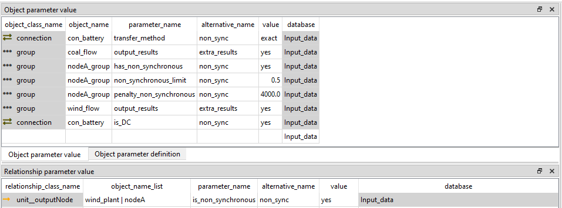

## How to see the VRE curtailment and VRE share results for a node
**(non_sync_and_curtailment.sqlite)**
***(scenario: curtailment)***

When the system has profile-units with the `profile_method`: upper_limit, the model can curtail the unit's flow to avoid penalties.

The curtailment could take place for several reasons:

- the supply is higher than the demand and the energy cannot be stored or transferred (further)
- non-synchronous limit
- extra flow constraints have been set
- other unit specific constraint affecting how VRE units or other units are forced to behave (ramp, start-up ...)

To see the curtailment results you need a `group` with `group__node` members (not `group__unit__node`!). The group then needs the parameter:

- `output_nodeGroup_indicators`: yes

This produces the node-group summary indicator metrics — loss-of-load share, VRE share, curtailment share, excess-load share and annualised inflow — written to the Results database as `group: indicator` and to Excel as the *group_summary* table. `output_nodeGroup_indicators` is the "summary" output for node groups; pair it with `output_nodeGroup_dispatch` if you also want the per-timestep decomposition of the same nodes.

These changes were done to the previous non-sync example database. 

Note: The results are the share of curtailment in relation to the inflow (demand) so it can exceed 100% as seen in the figure.

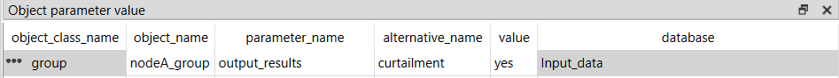

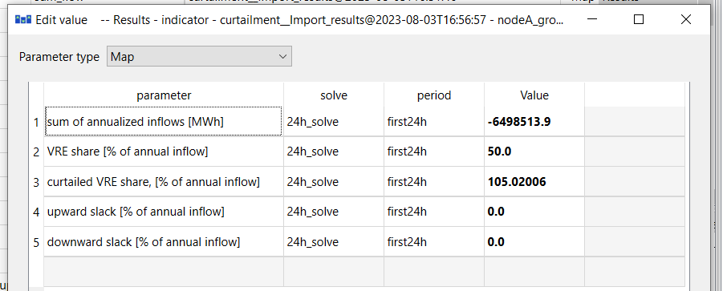

## How to create a delay between two nodes
**(examples.sqlite scenario: water_pump_delayed)**

Sometimes a flow between two nodes needs to be delayed, for example water flow in river systems can take hours between two power plants. This can be approximated using `delay` parameter available for units (and unidirectional connections). Delay can be expressed using a constant value (hours) or as a weighted map of time delays (index: time delay in hours, value: weight). Each weight indicates its share of the original flow and the weights should sum to 1. Delay requires that the time resolutions in the model are always integer multiples of these time differences.

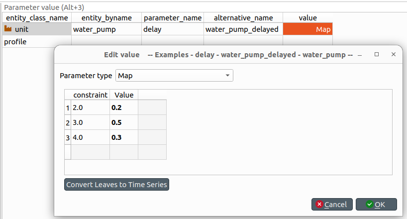

## How to run solves in a sequence (investment + dispatch)
**(examples.sqlite scenario: 5weeks_invest_fullYear_dispatch_coal_wind)**

In this example, investment decisions are made using a five week sample of a year and then the dispatch is solved with the full year timeline using these investments. 

To do this you need two solves:

- Investment solve 
- Dispatch solve

Both solves should solve the *same* periods using *different* `timeset` to represent these periods. This example has only one period p2020 describing a year. The investment solve uses a representative sample `timeset` *5weeks* to do the investment decisions. These are then passed to the dispatch solve that uses complete timeline *fullYear*.

Investment solve requires the parameters:

- `Invest_periods`: Array of periods where investments can be made
- `realised_invest_periods`: Array of periods that are output for investment decisions
- `period_timeset`: Uses the *5weeks* as the timeset 

Note that the `realized_invest_periods` is used instead of `realized_periods`, because we want the investment solve to only output investments.
Additionally some of the units, connections or storages will need investment parameters (`invest_cost`, `lifetime`...) see [How to make investments (storage/unit)](#how-to-make-investments-storageunit)

The dispatch solve requires the parameters:

- `realized_periods`: Array of output periods
- `period_timeset`: Uses the *fullYear* as the timeset

The sequence of solves is defined by the `model` parameter `solves`. Here it is an array where the first item is an investment_solve *5weeks_only_invest* and the second is the dispatch solve *y2020_fullYear_dispatch*. This is enough for the model to know to pass the investment decisions of the period to the period of the same name in the second solve.

Note that the picture has two `model`: *solves* parameters defined one for each alternative. Only the parameter from the *5weeks_only_invest* is used as the lower alternatives in the scenario tree override the values from the higher alternatives and only one model can be run.

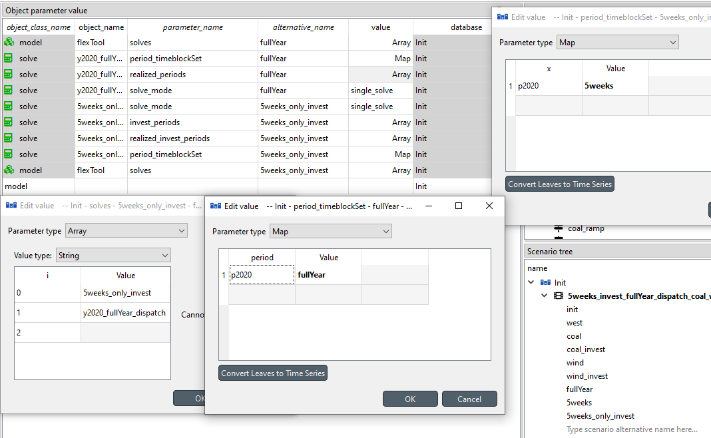

## How to create a multi-year model

A multi-year model is constructed from multiple periods, each presenting one year. In the example case, each year is otherwise the same, but the demand is increasing in the *west* `node`. This means that all periods can use the same timeset *5weeks* from the same timeline *y2020*, but one can also make separate timelines for each year, if data is available for this. The `inflow` time series are scaled to match the value in `annual_flow` that is mapped for each period. The model is using the `inflow_method` *scale_to_annual* in order to achieve this (default is *use_original* that would not perform scaling). There should also be an `inflation_rate` parameter set for the `model` entity *flexTool* if something else than the model default of 0 is to be used (set to expected inflation when inputs are in nominal terms).

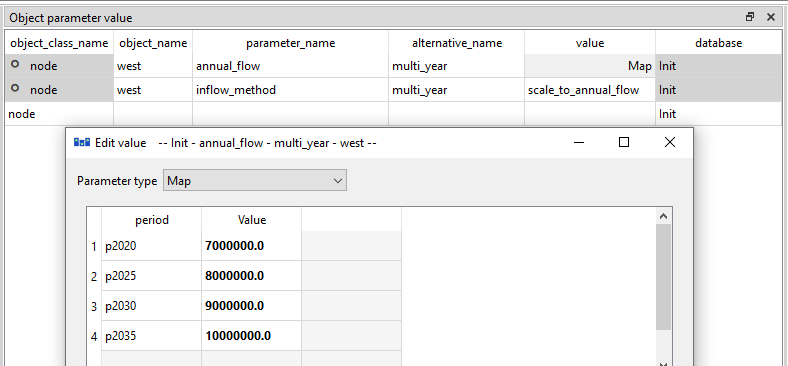

A multi-year model could be solved at one go (multi_year_one_solve) or by rolling through several solves (multi-year) where each solve has a foresight horizon and a realisation horizon. Next we will go through both options.

### Multi year with one solve
**(examples.sqlite scenario: multi_year_one_solve)**

In this example, one solve is used for all the four periods. All the four periods need to be added to the solve arrays `invest_periods` and `realized_periods`. Here the same timeset is used for all the four periods, so only difference between them is the increasing inflow set above. The parameters that need to be added to the `solve` entity:

- `years_represented` parameter is used by the model to calculate the discounting factors for the periods in the model (often future years). It should state the number of years each period will be representing. For example, a period for 2025 could represent the years 2025-2029 if its `years_represented` is set to 5. Any investments would be taking place at the start of 2025 and discounted to the beginning of 2025, but the operational costs would accrue from each year in 2025-2029 each with a different discounting factor (decreasing based on the interest rate).
- `invest_periods` the periods in which the model is allowed to make investments.
- `realized_periods` the periods that will be realized in this solve (outputs dispatch results for these periods).
- `period_timeset` defines the set of representative 'periods' (timesets in FlexTool) to be used in each FlexTool `period`.

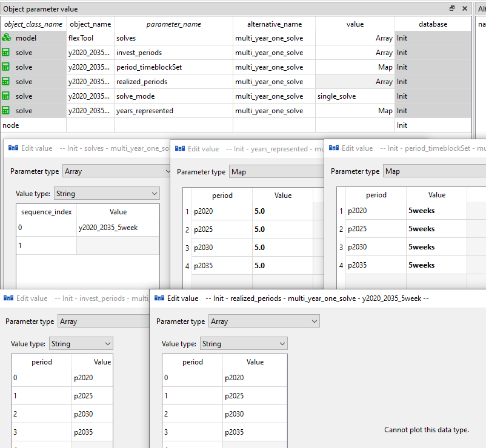

### Multi year with rolling solves 
**(examples.sqlite scenario: multi_year)**

If the solving time gets too big, there is an option to split the timeline into overlapping parts and solve them separately. This shortens the solving time as it increases exponentially as the model grows. Therefore, collection of smaller solves is faster. The drawback is that the accuracy will be affected if there are dependencies with a larger time interval than the split size. 

When dealing with investments the splitting only works if the different periods are similar, in most cases complete years. If the first solve is really windy, it would invest too much on wind which wouldn't produce enough energy in later solves and then it would need to invest again to something else. It can also be challenging to consider lifetimes. If the option of retiring is allowed, it might retire something that is needed for later solves. In this example, the periods are complete years and the only difference between periods is increased demand.

The model rolls through several solves and therefore, the `model` entity *flexTool* has four values in the `solves` array. Each value represents one solve and it's position in the sequence of solves. The next figure illustrates the realization (blue) and foresight horizons (grey). The first solve will solve both the year 2020 and year 2025, but it will only output the year 2020. The next will solve both 2025 and 2030 but only output 2025.

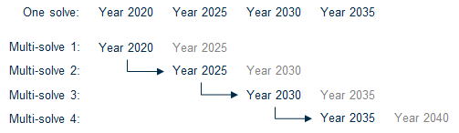

Next figure shows the values needed to define one solve (out of the four solves in the example). Each of these need to be repeated for each solve in the model.

- `years_represented` parameter is used by the model to calculate the discounting factors for the periods in the model (often future years). It should state the number of years each period will be representing. For example, a period for 2025 could represent the years 2025-2029 if its `years_represented` is set to 5. Any investments would be taking place at the start of 2025 and discounted to the beginning of 2025, but the operational costs would accrue from each year in 2025-2029 each with a different discounting factor (decreasing based on the interest rate).
- `invest_periods` the periods in which the model is allowed to make investments. To be given for each solve.
- `realized_periods` the periods that will be realized in this solve (outputs dispatch results for these periods). To be given for each solve.
- `invest_realized_periods` parameter states the periods that will realize the investment decisions. If not stated, it will use `realized_periods`.
- `period_timeset` defines the set of representative 'periods' (timesets in FlexTool) to be used in each FlexTool `period`.

Note the the `solve_mode`: *rolling_window* is not used! This is not for investment runs (without nesting) as it rolls freely, and investments should only be made at the start of the period. This example is called 'manual rolling' later when those are discussed.

In the examples.sqlite, the solve entities have solver parameters: `highs_method`, `highs_parallel` and `highs_presolve`. They only affect the speed and not the results, but usually the default values are good enough and the user should only change them if they understand how the solvers work.

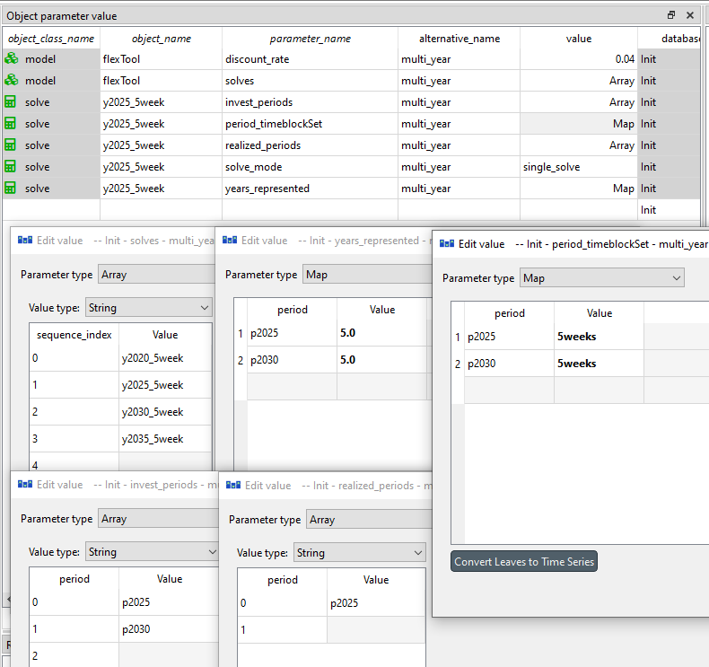

## How to use a rolling window for a dispatch model

A rolling window can be used for example when a dispatch model gets too big to be solved on one go. It splits the problem into multiple consecutive smaller problems.

The rolling window solve splits the time dimension into overlapping parts and solves each one of them separately but in a sequence (and can therefore pass state information from the previous solve to the next one). For example, instead of a solving the full year in one go, you can split the year into six four-month long solves where each solve outputs only the first two months. The solves would therefore include the months:

- **Roll: Solve months -> Output months**
- 1: [1,2,3,4] -> [1,2]
- 2: [3,4,5,6] -> [3,4]
- 3: [5,6,7,8] -> [5,6]
- 4: [7,8,9,10] -> [7,8]
- 5: [9,10,11,12] ->[9,10]
- 6: [11,12] -> [11,12]

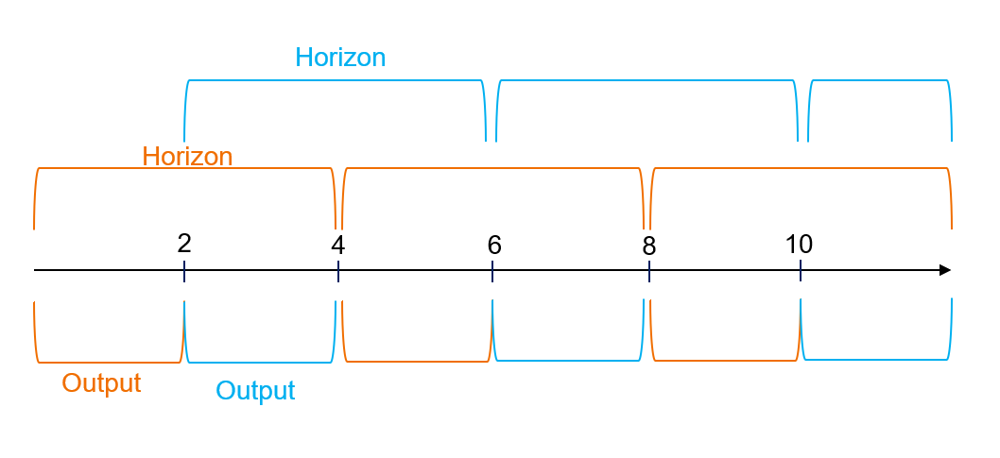

The rolling solve could be setup also manually as described in the 'How to run a multi year model' - just using shorter periods. 

However, this would be tedious if there are many solves. In a rolling window model, the user can set the `rolling_jump` and `rolling_horizon` parameters, which are expressed in hours. 

- `rolling_horizon`: sets the length of the whole solve, in hours. In previous example 4 months (2880 hours). Horizon allows the model to see bit further in the future to improve the decision making for the period that will be output.

- `rolling_jump`: sets the interval for the length of each 'jump' the model takes forward in reach roll. It is then both the interval of roll starting points and the length of the output for each roll. The `rolling_jump` must be smaller than the `rolling_horizon`. In the previous example the `rolling_jump` would be 2 months (1440 hours).

In addition, the user can set the duration for how long the model will roll:

- `rolling_duration`: Optional (hours), the length of combined rolls. In the example, it could be set to 8640 hours which would divide evenly, or 8760 hours which means that the last roll will be shorter than the others. It is nicer to use `rolling_jump` that is divisable with the `rolling_duration` to keep rolls even. If `rolling_duration` is not set, it defaults to rolling through the whole timeline.

When using rolling window solve, you are solving the model with less information. Therefore, the results will be less optimal since the model will not have the full information at once. It is therefore important to know how this could affect the results and what things to consider when implementing a rolling window model. It will have an impact on time dependant parts of the model: for example, storages or cumulative flow constraints. If the model can see only a few months to the future, it can't see how much energy needs to be stored after that. 

Investments should not be used with this free rolling solve (`solve_mode`: *rolling_window*) as investments should only be done at the start of the periods. *Both the long-term storage and the investments can be taken into account with nested rolling solves that have a separate how-to*.

Short term storages also are operated less optimally in a rolling window model. There is a positive side to this as well, since perfect foresight linear optimization models are 'too optimal'. They don't reflect the forecast errors present in real life. So, a rolling window model might operate a bit more *realistically* than a *single_solve* model. A *single_solve* model can consider things happening far in the future when setting the storage level at present, even though in reality that information is not available. So, the total cost of a *rolling_window* model should always be higher than the total cost from a complete *single_solve* model that has perfect information.

To set a dispatch rolling window model you need to set the entity `solve` parameters:

- `solve_mode`: *rolling_window*
- `rolling_jump`: Hours, the desired length of the solve interval
- `rolling_horizon`: Hours, the desired length of each roll solve
- `rolling_duration`: (Optional) Hours, the length of the combined outputs. If not set, the whole timeline is used.

Considerations on the rolling times:

- The `rolling_jump` and `rolling_horizon` must be large enough to make the model faster. If too small intervals are used, the creation of solves and moving data from solve to another might take too much time.
- If you are not using 1-hour timesteps, preferably use multiples of the timestep you are using as the `rolling_jump` and `rolling_horizon`. The steps included in each solve are calculated by summing the step durations until they are larger or equal to the hours given. So, if multiples are not used, the rolls might not be exactly the same size.
- The model can roll over timeset and period jumps, which might cause some issues if storage constraints are used. Using timeset length or its multiples is therefore recommended. For example, the `rolling_jump` could be a half of a timeset and the `rolling_horizon` whole timeset or `rolling_jump` a timeset and `rolling_horizon` three timesets. Of course, when running e.g. a full year dispatch, there is only one timeset of 8760 hours, which makes the choices more simple.

Considerations on storage parameters:

- `storage_solve_horizon_method` *use_reference_value* or *use_reference_price* are the preferred means to bind storage values. They can be used together with the `storage_state_start_end_method`: *start*, which would then set the initial storage state. These methods bind either the storage value or the storage price at the end of *horizon* (not the end of *jump*). This allows the storage to use the part of the horizon that is not output to improve the behaviour of the storage in the part that is output (as defined by `rolling_horizon` and `rolling_jump`). 
- `bind_within_timeblock` does not work correctly if the rolls don't include whole timeblocks. Instead, it will bind the first step of the roll (whatever it is) to the end of the timeblock. Do not use in nested solves if you are not using whole timeblocks or its multiples as `rolling_jump`
- the same applies to the `bind_within_period` (but in relation to periods - do not use this unless you are `rolling_jump` is as long as a period or its multiples).
- `storage_start_end_method` can be used to set the first timestep of the first roll and/or the last timestep of the last roll (in conjunction with `storage_state_start` and `storage_state_end`).
- `bind_within_solve` binds the start state to the end state of each *roll* not the start and end of the whole model timeline. Use with caution (and probably best not to use together with `storage_solve_horizon_method` *use_reference_value*).

## How to use Nested Rolling window solves (investments and long-term storage)

The basic rolling solve can have problems in dealing with long term storage and with investments. If the model only sees a few weeks to the future, it really can't see how much energy should be stored in long term storages. Problems with investments can also be serious: If the first roll is really windy, the model would overinvest in wind power that is not profitable in the later rolls. Similarly, if the model is allowed to retire capacity, it might retire something that is actually needed in the later rolls. 

Nested solve sequences can first solve the investments and long-term storage levels and pass them to the dispatch solve. Both storage solve and dispatch solve can be rolling solves. The dispatch solves can then send the end storage values to the investment and long-term storage solves as start values to reduce the error of these solves.

When to use nested solves?

- Dispatch model is taking too long to solve, but simple rolling window solve would not represent the long-term storages correctly. (Nesting without the investment solve)
- Investment model takes too long to solve, even with manual rolling [How to create a multi-year model](#how-to-create-a-multi-year-model). With nesting you can have smaller rolls for dispatch solve than the investment solve. (Nesting without the storage solve)
- Investment model takes too long and you have long term storages to consider. (Three level nesting, graph below)

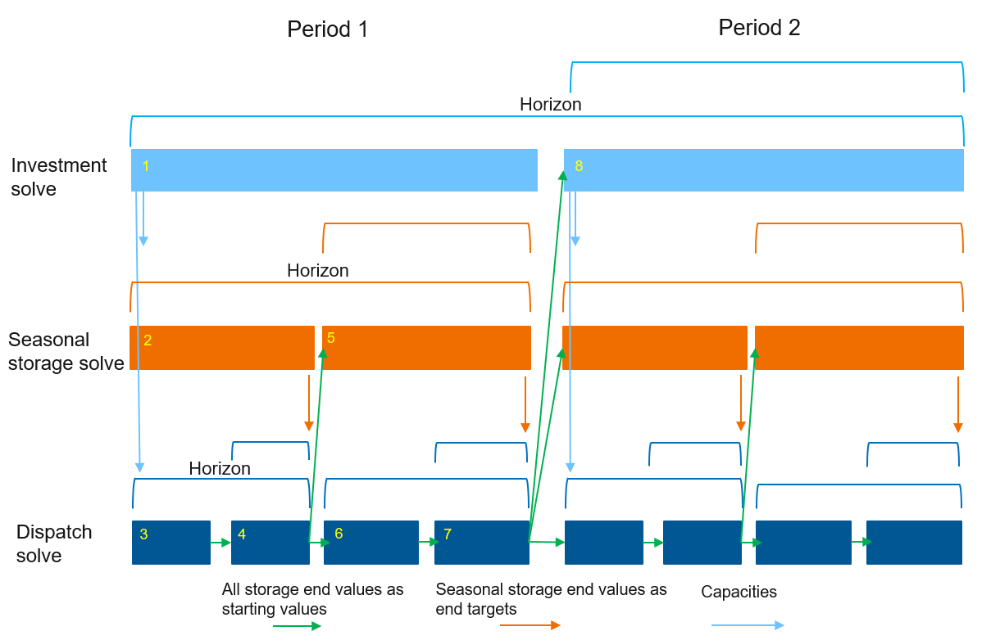

However, the obvious issue is that investment and storage solves cannot be solved using the old complete solve as it wouldn't make the solve time any shorter. Therefore, we need to decrease the information for investment and storage solves as well. There are a few options for this:

1. Use lower resolution (longer timesteps). This can work quite well for a long-term storage.
2. Use representative periods from the full timeline when performing investments. There is a large body of literature and methods on how to pick the representative weeks.
3. Split the investment timeline (myopic investments) by manually creating a solve sequence for the investment solves like in: [How to create a multi-year model](#how-to-create-a-multi-year-model) section. This can be combined with the first or second option. 

Each of these have their pros and cons:

- Using the lower resolution can speed-up the model considerably, but it also means that everything that happens faster than the new timestep duration will be lost as the timestep varying parameters are averaged or summed for the new timestep. For example, consider a model with investment options to solar and storage. If the step duration is changed to 24 hours, the model won't invest in enough storage to mitigate the diurnal variation in PV. When these investments are then passed to the dispatch solve, the invested portfolio will have trouble meeting the demand.
- Using the sample can be effective if the sample is chosen well, but all the needs that are not in these samples are not included. The speed is heavily dependent on the number and size of those samples.
- Splitting the investment timeline for multi-year models can be seen as a relatively realistic approach, since investment decisions would have a lot of uncertainty in the longer time frame anyway.

The investment decisions with less information are always less optimal than with complete solves. Therefore, when they are passed to the dispatch solve, it will in some cases cause penalties in the results when the invested portfolio is not sufficient to meet the demand at all times.

The long term storage solve can be implemented using a lower resolution solve. The storage state behaviour from the storage solve is used as a target for the dispatch solve. There are three options for doing this: 
- *fix_quantity* creates a constraint that forces the end storage state to be the same as in the storage solve at this timestep.
- *fix_usage* does the same but not taking into account the inflow or slacks. Forces the summed usage of the storage during the dispatch solve to be the same as during the same time span in the storage solve. This avoids infeasibilities when modelling inflow stochastics in comparison to the *fix_quantity*.
- *fix_price* takes the dual marginal price from the storage solve at the end timestep of the dispatch solve and uses it in the objective function to give a value to the stored energy at the end of the horizon. 

The `rolling_jump` and `rolling_horizon` in the storage solve have to be longer than in the dispatch solve. You can set which storages are included as "long term storages" whose value will be transferred to the dispatch solve.

To create a nested solve sequence, you need two or three `solve` entities. Either the investment solve or the storage solve can be left out. When using nested solve sequence, the sequence is not set with the `model`: `solves` parameter. Only the topmost solve is put there. Instead, the nested levels are set by the `solve` parameter `contains_solve`: *solve_name*. The investment solve is always on the top followed by the storage solve and dispatch solve:

- *investment_solve* `solve` parameter `contains_solve`: *storage_solve_name* 
- *storage_solve* `solve` parameter `contains_solve`: *dispatch_solve_name*

To create a storage solve:

- `solve` parameter `fix_storage_period`: Array of periods where the storage values are fixed in the lower solve. Should be the same as `realized_periods` for the dispatch solve.
- `node` parameter `storage_nested_fix_method`: *fix_quantity*, *fix_price* or *fix_usage*

To create an investment_solve:

- `solve` parameter `invest_periods`: Array of periods where the model can invest.
- `solve` parameter `realized_invest_periods`: Array of periods where the model will realize investment decisions to the lower solves and results.
- `solve` parameter `realized_periods`: Should not be used in this solve! You don't want the dispatch results from this solve, but from the dispatch solve.

In addition, the rolling dispatch solve should be created as in the *How to use rolling window solve for dispatch*. To set a dispatch rolling window model you need to set the entity `solve` parameters:

- `solve_mode`: *rolling_window*
- `rolling_jump`: Hours, the desired length of the solve interval
- `rolling_horizon`: Hours, the desired length of each roll solve
- `rolling_duration`: (Optional) Hours, the length of the combined outputs. If not set, the whole timeline is used.
- `realized_periods`: Array of periods that are realized

The other model parameters apply to *all* of the solves. Therefore, the considerations of the storage value binding that were discussed in the [How to use a rolling window for a dispatch model](#how-to-use-a-rolling-window-for-a-dispatch-model) should be taken into account here as well.

- Storage levels can be fixed with `storage_solve_horizon_method`: *use_reference_value* or *use_reference_price*, these will fix the end of each horizon not each jump.
- `storage_start_end_method` fixes the starts and/or ends of each solve level, meaning the first step of the first roll and the last step of the last roll.
- In most cases the `bind_storage_method` should be left as *bind_forward_only*
- Do not use `bind_within_timeblock` if you are not using full timeblock or its multiples as the `rolling_jump` in the dispatch model, otherwise you might cause an infeasible problem. 
- Do not use `bind_within_period` if you are not using full periods or its multiples as the `rolling_jump` in the dispatch model, otherwise you might cause an infeasible problem. 
- Do not use `bind_within_solve`

The recommended storage parameters with nested solves are:
- `storage_start_end_method`: *fix_start*
- `storage_solve_horizon_method`: *fix_quantity*
- `storage_state_start` and `storage_state_reference_value`: use the same value

This way the start and end states of the system are the same. Each end of the horizon (not the output) has that value as well, which keeps the model from emptying the storages at the end of the roll. In the dispatch solve, the fixed storage value from the storage solve overrides the horizon end value if a conflict exist. 

How to create the three lower information solve types for investment and storage solves discussed above?

To create a lower resolution (longer timesteps) solve:

- Make a new `timeset`, but use the same `timeline` and `timeset_duration` for it as with the high resolution solve
- In the `solve` use this new `timeset` in the `period_timeset`
- Set `solve` parameter `new_stepduration`: Hours

The model will create a new timeline for this solve with the `new_stepduration`. All the timestep map data like `inflow` or `profile` will be either summed or averaged for the new timeline. Again, the `new_stepduration` should be multiple of the old step duration. If the `timeset_duration` is not a multiple of the `new_stepduration` the last timestep will be shorter than the rest.
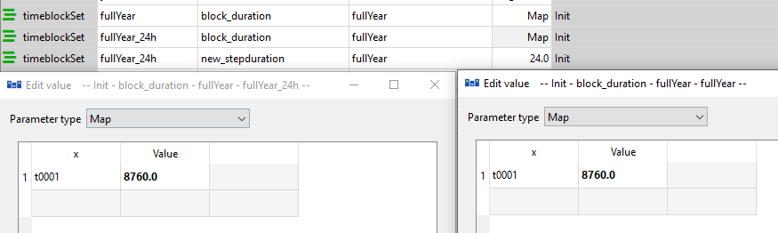

Note that if the last timestep of the dispatch horizon is not in the storage solve timeline, it will use the last available timestep to fix the storage. This can happen at the end of the timeline when the dispatch solve with a lower step size can fit an extra step after the last time step of the storage solve.
Other reason might be that both dispatch and storage solves are aggregated with the `new_stepduration`. In that case, it is usually best to use values for the `new_stepduration` that are dividable.  

To create a sample solve with representative periods:

The tutorial contains an example of representaive periods under alternative *5weeks* where the year is represented with five sample weeks. It is done with the `timeset` parameter `timeset_duration` where instead of choosing the whole timeline by setting the first timestep and the duration of whole timeline, you choose multiple starting points with smaller durations. The example for the *5weeks* is below.

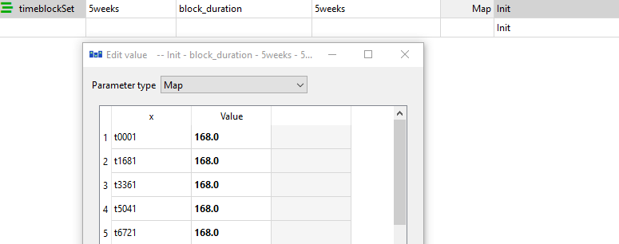

To create an investment solve sequence, you have two options:

- Create manually a series of solves and set the `invest_periods` and `realized_invest_periods` individually for the solves. [How to create a multi-year model](#how-to-create-a-multi-year-model) has an example of this with the difference that here you use `realized_invest_periods` instead of `realized_periods` and that each of the higher level solves requires the `contains_solve` parameter. 

If you have many splits, this option can get tedious and prone to mistakes.

The other option is to use only one investment `solve` entity:

- The `invest_periods` and `realized_invest_periods` should then be set with a 2D map where the first column tells the solve (you don't have to create separate `solve` entities for these) and the second column tells the period. To get a 2D map, choose the parameter type as *Map* and then right click the table and choose *Insert column after/before*. The value column does not matter. The model will generate these solves, with the periods given. Note that the solve names should match in both 2D-maps.  

You can use the same lower level solve with each the investment solves as the lower level solves will exclude the periods that are not included in either of the upper level realized periods: `realized_invest_periods` or `fix_storage_periods`. So, the lower level solve should have all the periods that it is used for in any the solves.

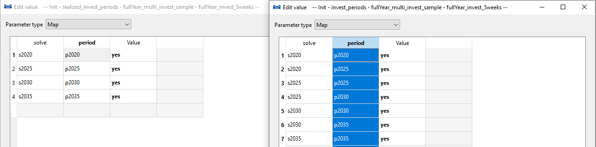


Note that the results of a nested rolling solve run are not fully optimal, because the information in the model is decreased. This is the price you pay for the speed. Therefore, the results should not be taken as they are, instead it is important to know how to interpret the results: What phenomena are missing? How will they affect the results? Where should extra investments go to satisfy the demand (there is a possibility to use the `capacity_margin` method to force extra investments)?

In the examples.sqlite there are four example scenarios related to this:

- *multi_fullYear_battery*: The four period full year single solve, with coal, wind, battery storage with unlimited investment possibilities. Running this is still possible but takes a few minutes. This is here as a reference for the nested solves.
- *multi_fullYear_battery_nested_24h_invest_one_solve*: This has the nested structure and the investment solve is done with 24h timesteps and storage solve 6h timesteps.
- *multi_fullYear_battery_nested_sample_invest_one_solve*: This has the investment solve as 5weeks sample but all the four periods are included in the same investment solve. Nested structure with 6h storage solve timesteps.
- *multi_fullYear_battery_nested_multi_invest*: This has split the investment to four solves with each having two period 5weeks sample period horizon. Nested structure with 6h storage solve timesteps.

The 24h timestep is clearly too long as it invests too little for storage and coal. A large upward penalty ensues.

The sample one solve invest also invests too little, as the largest demand-supply ratio weeks are not in the five week sample. However, the investments are spread more accurately.

The split sample investment run produces in this case similar results as the one solve sample run. This is not always the case! Here the only difference between the periods was linearly increased demand.

### Peak memory in long rolling and nested chains

The cascade keeps several solves' worth of state alive in RAM at once — the just-solved LP, the warm-start shell for the next roll, and the parked Provider state from earlier sub-solves. On continental-scale rolling or nested chains this can push peak RSS into the 10-30 GB range. Two CLI knobs help when peak RSS is the bottleneck rather than wall time:

- `--save-memory` (or `FLEXTOOL_SAVE_MEMORY=1`) — after each LP is built, drops polar-high's polars/numpy LP source, writes the LP to a temp MPS file, and solves it in a separate HiGHS subprocess (via `cmd_solve_mps`) so the solver's working set lives outside the FlexTool address space. Frees ~5–10 GB on large models at a cost of ~+90 s I/O per sub-solve. Also disables warm-LP reuse, so every sub-solve cold-rebuilds. Use when the machine OOMs, not as a default.
- `--presolve off` — HiGHS' presolve is the largest single contributor to peak RSS on highly-structured LPs (continental power grids, dense capacity-expansion). Turning it off slows the solve but can free several GB. Pair with `--save-memory` for the largest savings.

Both flags are documented in [Terminal / CLI](terminal_workflow.md). The FlexTool GUI's side menu has a **Save memory** checkbox that passes `--save-memory` through to each scenario run.

## How to use stochastics (representing uncertainty)
**(stochastics.sqlite)**

Stochastics are used to represent the uncertainty of the future in the decision making. The main idea is to represent the distribution of possible futures by discrete scenarios (branches). These are all connected to the same starting point with the realized branch. A non-anticipatory constraint forces the branches to share the decisions that affect multiple timesteps with the realized branch during the realized part of the horizon. These decisions are investments, storage usage and online status of units. The model then optimizes the system to get the minimize the total cost all the branches (weighted by their probability). Only the realized timeline of the realized branch, will be output. The realized branch can continue to the end of the horizon (and be also a forecast) or just to the end of the realized part as in the picture.

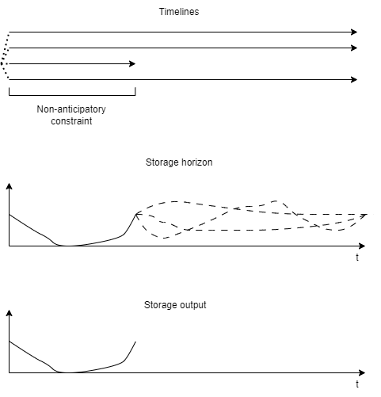

For the stochastics to have an effect on the results, the system needs parameters that change between the stochastic branches. These could be e.g. wind power generation or fuel prices. The model will then have separate variables in every branch for all the decision the model can take (e.g. invesment, storage state, online, flow). As a consequence, the realization phase will also be dependent on the things that happen in the stochastic branches - weighted by the probablity given to each branch. Only one period investment stochastic models are supported currently.

In this example, we show two ways to use stochastics: Single solve, rolling horizon. They all share the same test system that includes: 

- A demand node 
- Coal, gas and wind power plants 
- Hydro power plant with a reservoir and a downriver nodes

The demand and the downriver nodes have a constant negative inflow. Therefore, the hydro plant capacity is partly in use at all times. The varying timeseries are the wind profile and the water inflow the reservoir. The coal commodity is more expensive than the gas, so the system will try to use the reservoir water to minimize the usage of coal. This will be affected by the forecast of the wind and the forecast of the water inflow. These are the stochastic timeseries in these examples. 

You can have stochastics in multiple timeseries in the same solve, but these will have to share the branches. This means that for example if you have two wind plants with two different stochastic wind profiles with three branches (upper, mid and lower estimates) you need to think if it is best to use only three branches and put both of the upper estimates to the same 'upper' branch or should you use combinatorics to make nine branches. However, note that the tool will not do the combinatorics for you and the solving time will be heavily affected by extra branches. Consequently, the usual practice is to present all the stochastics using just e.g. three branches and consider the correlations between the stochastic parameters in the pre-processing of the input data.

Notes about the storage options with stochastics:

- The best options to use are:

  - `Storage_state_start_end_method`: fix_start or fix_start_end (and the their values)
  - `storage_solve_horizon_method`: fix_value or fix_price (and their values)

- Do not use any of the `storage_binding_methods`, they do not work correctly with stochastics (there is no unambigious end state that could circle back to the first time step). 

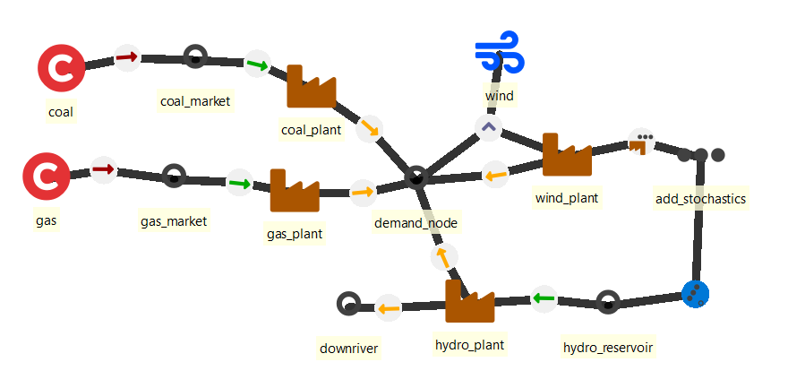

### Single solve stochastics
**(stochastics.sqlite scenario: 2_day_stochastic_dispatch)**

In this scenario, 24 hours are realized with an uncertain forecast for the next day. The timeset length is therefore 48 hours and the branching will happen at the timestep t0025. 
To set up a stochastic solve, we need three things: The stochastic branch information, the stochastic timeseries and choosing which parts of the model use stochastic timeseries.

The information about the branches are set with the *solve* parameter `stochastic_branches`. This is a 4 dimensional map. (Edit -> choose map -> right click -> add columns).
The columns are: period, branch, analysis_time (starting time of the branch), realized (yes/no) and the value is the weight of the branch. Each starting time, including the first timestep, should have one and only one realized branch. This realized branch is used for the non-stochastic parts of the model with a stochastic timeseries. In this example we have three branches: mid, upper and lower representing the three wind forecasts. The weight will influence the relative weight of each branch in the objective function (model costs). The weights are normalized, so that the total weight is always one in each timestep.

The stochastic wind timeseries are set with the same *profile* parameter `profile` but with a three dimensional map instead of the regular one dimesional map. The tool recognizes a stochastic timeseries from the dimensions of the data. The three dimensions are: branch, analysis_time and time. Here the realized part of the model (t0001-t0024) uses also the branch 'mid', which is one of the forecast branches as well. In the stochastic part, 'mid' is also set to be 'realized'. It is not actually realized (since the stochastic part is not realized), but it helps the model to choose which branch to use when there is no stochastic data available.

The parts of the model that will use stochastic data is chosen with a *group* parameter `include_stochastics`. The units, nodes and connections that are added to this group use stochastic timeseries connected to them (if available). Here we add the unit *wind_plant* to this group. There is a possiblity that to have two wind plants with the same profile, but use the stochastics on only one of them. The other would then use only the realized branch.

An option exists to output the stochastic horizons for debugging your system. This is done with the *model* parameter `output_horizon`. It will cause errors in the calculation of the cost in each solve (the costs of the unrealized branches will be included) so turn it off when you want the final results.

If you change the weights of the stochastic branches, you should see the results change.

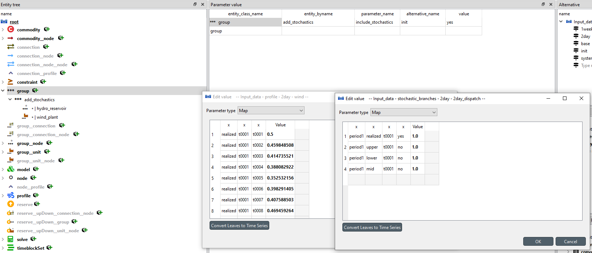

### Rolling horizon stochastics
**(stochastics.sqlite scenario: 1_week_rolling_wind)**

In this scenario we extend the previous timeline to one week and roll through it one day at a time with additional three day stochastic horizon:

*solve*: `rolling_solve_jump` = 24 and `rolling_solve_horizon` = 96. 

The stochastic data should be given so that it can serve the rolling structure: `rolling_solve_jump` dictates the duration of the realized part of each solve and the interval of forecast updates. So, for every 'analysis_time' there needs to be a time series in each stochastic branch that extends to the end of horizon (as defined by `rolling_solve_horizon`). The branches continue to the end of the horizon without branching again. The realized scenario should not typically be used as a forecast branch in a stochastic model. This is why its horizon is shorter than the others.

For the *solve* parameter `stochastic_branches` this means analysis times (t0001, t0025, t0049, t0073, t0097, t0121 and t0145)

Otherwise there is no difference to the previous example.


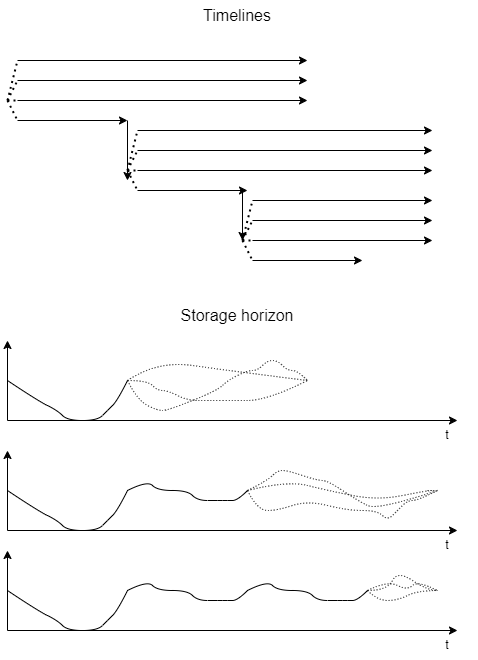

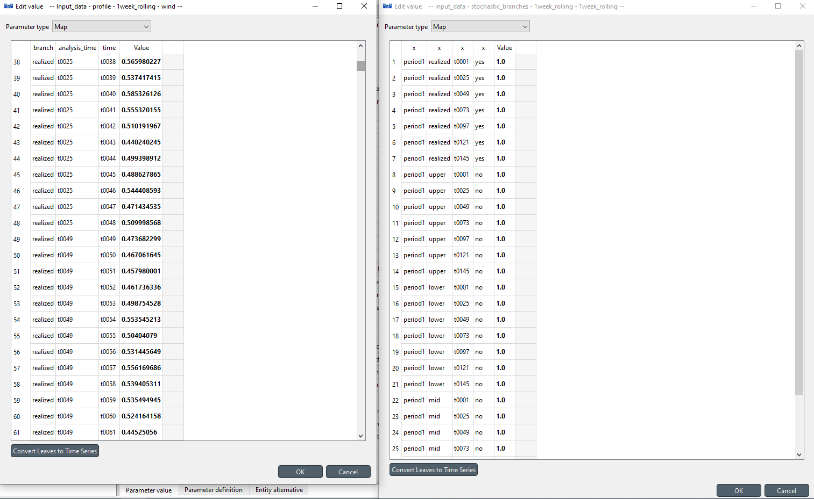

## How to use CPLEX as the solver

CPLEX remains wireable as an advanced option for licensed users. Using CPLEX requires that you have installed the software, have a licence for it and have added it to PATH or to the environment where you are using the FlexTool, so that the tool can find the solver.

CPLEX is invoked via the **solve** parameter *solver*. FlexTool now builds the LP in memory through polars + polar-high, so the on-disk MPS handoff that previous versions used is no longer the default flow — the CPLEX path passes the problem to the [Interactive Optimizer](https://www.ibm.com/docs/en/icos/12.8.0.0?topic=cplex-interactive-optimizer) and produces two additional files in the work directory: a CPLEX log file and the solution file in CPLEX format.

Additional parameters:

- `solver_precommand` creates a text in front of the cplex call. This is useful when dealing with floating licences. The command allows to call the licence server to reserve the licence for the duration of the cplex program with a command line argument.
- `solver_arguments` is an array containing additional CPLEX solver commands

<!-- TODO: expand in dev/engine_polars.md — document the exact CPLEX command line under the polars-based LP build. -->

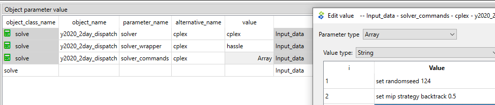

## How to create aggregate outputs

It is often desirable to output results that focus on particular aspects of the model. For example, you may want all flows going in and out of all electricity nodes, *without* the corresponding flows for other energy carriers (e.g. fuels used to produce the electricity). And if the model is large, some of those flows are easier to read when aggregated into a single column.

FlexTool splits these two concerns into two different `group` flags:

| Intent | Flag | Role | Members |
|---|---|---|---|
| Pick a set of nodes and get a per-timestep *decomposition* of every flow crossing them (one column per contributing process/connection) | `output_nodeGroup_dispatch: yes` | the *decomposition* — produces `group_flow_t` | `group__node` |
| Re-bucket a set of flows so they appear as a single aggregated column inside somebody else's dispatch output | `flow_aggregator: yes` | a *marker* — no output on its own | `group__unit__node` or `group__connection__node` |

Together they work like this: `output_nodeGroup_dispatch` builds the dispatch table for its node group; while doing so it inspects every flow touching those nodes, and if any of those flows are in another group that has `flow_aggregator: yes`, their columns are collapsed into a single column named after the aggregator group. `flow_aggregator` groups never produce any output of their own — they only reshape a dispatch table that somebody else is producing.

Concretely, to build a focused dispatch view for a collection of nodes:

- create or re-use a `group` (e.g. *electricity*)
- set the group's parameter **output_nodeGroup_dispatch** to *yes*
- add the relevant nodes via `group__node` (e.g. *electricity__west*)

Then, to collapse a collection of flows inside that dispatch view:

- create or re-use a *separate* `group` (e.g. *all_VRE*)
- set the group's parameter **flow_aggregator** to *yes*
- add the flows via `group__unit__node` or `group__connection__node` (e.g. *all_VRE__wind1__west*)

(Contrast with `output_flowGroup_indicators`, which produces a per-period *summary* — `cumulative_flow`, `average_flow` — for a flow group and does not interact with the dispatch table.)

"How to database" (**aggregate_output.sqlite**) aggregates results for the *nodeA* and *nodeB*. Both of the nodes have a wind power plant and nodeA has a coal power plant. The demand is divided to the electricity, heat and irrigation needs. This means that, besides an internal demand (**inflow**), both nodes output to the heat node while *nodeA* also outputs to the irrigation node. Additionally the nodes are connected to each other and the *node_country_y1*. The *nodeA* is connected to the *node_country_x1* and *nodeB* is connected to the *node_country_x2*. 

For the sake of the example, we are only interested in the *nodeA* and *nodeB*. Therefore, `group` *focus_nodes* is created and the nodes are added to it with `group__node` entities. To simplify the results, the flows from the two wind plants are aggregated as one. Same applies to the heat pumps. This is done by creating the `group`s *wind_aggregated* and *heat_aggregated*. The flows are added to each group with `group__unit__node`. 

Note that here the `node` has to be either *nodeA* or *nodeB*, not the heat node. The aggregator group only collapses columns whose node is inside the dispatch group's node set — e.g. *wind_aggregated__wind_plant_1__nodeA* is collapsed because *nodeA* is in *focus_nodes*. A `group__unit__node` row whose node is outside the dispatch group's nodes is simply ignored for that dispatch table.

Connections are simplified by creating groups *connections_country_x* and *connections_country_y* and adding the relevant connections with `group__connection__node`. Again the `node` must be *nodeA* or *nodeB* to be collapsed in the dispatch output.

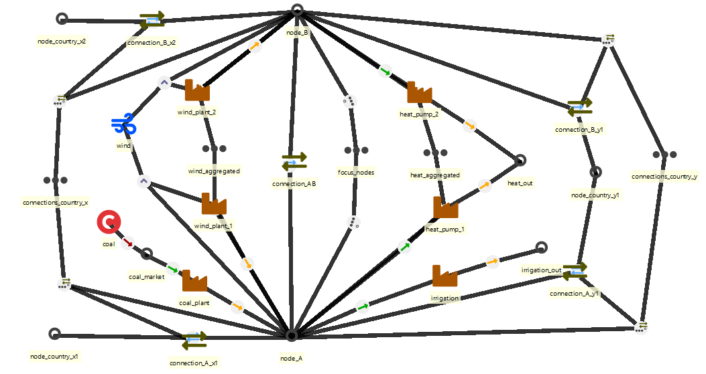

The *focus_nodes* group needs `output_nodeGroup_dispatch: yes` and the unit and connection groups need `flow_aggregator: yes`. 

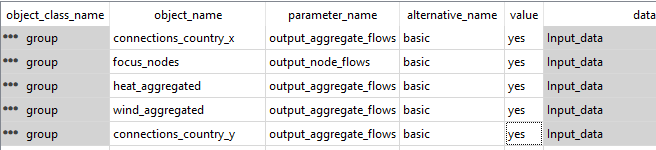

The resulting table has the flows to the *focus_nodes* group from units and connections. Additionally, the internal losses of the group are calculated. These are the flows between the nodes of the group and the storage losses. Here the losses come from the connection between *nodeA* and *nodeB*. Possible slacks to balance the nodes are included too.

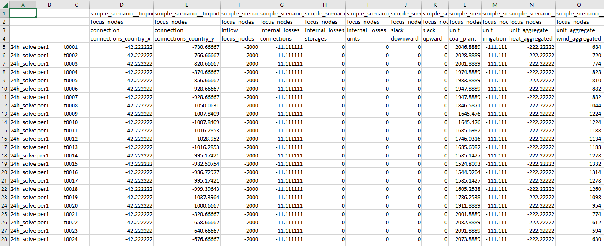

## How to enable/disable outputs

Some of the outputs are optional. Some of these optional outputs are output by default while some are not (see below). Removing outputs speeds up the post-processing of results. The user can enable/disable them by changing the following parameters of the `model` entity:

- `output_node_balance_t`: Default: yes. Produces detailed inflows and outflows for all the nodes for all timesteps. Mainly useful to diagnose what is wrong with the model. 
- `output_connection__node__node_flow_t`: Default: yes. The flows between the nodes for each timestep.
- `output_unit__node_flow_t`: Default, yes. The flows from units to the nodes for each timestep.
- `output_ramp_envelope`: Default, no. Includes seven parameters that form the ramp room envelope. Shows the actual ramp as well as different levels of available ramping  capability in a given node - for both directions, upward and downward. The first level includes ramproom in all the units, except VRE. The second level adds ramping room in VRE units (typically only downward, unless they have been curtailed. Finally, the last level adds potential ramping capability in the connections, which reflects only the ramproom in the connections themselves - the units/nodes behind the connection may or may not have capability to provide that ramp. (Parameter node_ramp_t)
- `output_connection_flow_separate`: Default, no. Produces the connection flows separately for both directions.
- `output_unit__node_ramp_t`: Default, no. Produces the ramps of individual units for all timesteps.
- `output_horizon`: Outputs the timesteps of the horizon outside the realized timesteps. Useful when constructing a stochastic model.

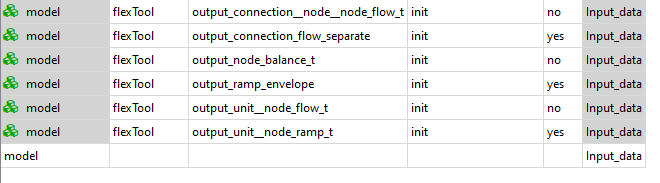


## How to make the Flextool run faster

The list below contains potential ways to decrease the run-time of FlexTool models.

External changes (results will remain the same):

- Keep both the input database and Flextool on the same drive. If the database is on a different drive, it can slow the process. Avoid network drives.
- Try to ensure that there is sufficient memory available by closing other programs that use lot of memory. Linear optimization problems can require lot of memory.
- Use as fast computer as available. Both faster processors and more processors can decrease computation time.

Model changes (results will remain the same):

- Disable outputs that you don't need. This will speed up the result processing. See: [How to enable/disable outputs](#how-to-enabledisable-outputs)
- When using HiGHS solver: in your solve's parameters, you can set highs_presolve = on, and highs_parallel = on to speed up the optimisation. However, it can be better to turn HiGHS parallel off when executing multiple scnearios in parallel.
- Especially with MIP problems, considering using a commercial solver like CPLEX (license required). See: [How to use CPLEX as the solver](#how-to-use-cplex-as-the-solver)

Model changes (results will be affected):

- Get rid of integer variables. Mixed integer programming can increase the solving time manyfold compared to the linear version especially if commercial solver is not available. MIP parameters are:
  - `transfer_method`: *exact*, change to *reqular*
  - `startup_method`: *binary*, change to *linear*

- **Set `virtual_unitsize` to the actual sub-unit size of the modeled plant when `startup_method = binary`.**  If you do not set it, FlexTool uses the full `existing` capacity as the commitment granularity — every on/off decision moves the entire plant at once.  For a large plant (say 1000 MW), that granularity is usually too coarse for the MIP to close to a useful tolerance in reasonable time: a realistic 3-day 3-representative-period UC problem with ~1 GW whole-unit commitment may run up against solver time limits at several percent MIP gap, while the same plant modelled with `virtual_unitsize` matching its real sub-units (e.g. five × 200 MW boilers → `virtual_unitsize = 200`) closes to < 0.2 % in about a minute.  **`virtual_unitsize` is not a free tuning knob** — picking an arbitrarily small value (say 50 MW for a plant with no 50 MW sub-units) would let the solver commit fractions that don't physically exist, mis-representing minimum load and startup behavior.  Choose the value that reflects the actual physical unit granularity of the modeled entity (e.g. individual boilers / turbines / strings).  The clustered unit-commitment approach (Palmintier & Webster 2012) is just this: represent each real sub-unit as one unit in the integer count.  When the modeled entity is inherently a single indivisible plant, `virtual_unitsize` should equal `existing` — and you may have to accept that the MIP is slow, use `startup_method = linear`, or aggregate differently.

Model changes (potentially large changes to the results --> need to understand how the particular analysis will be affected):

- Use representative periods for investment decisions. See: [How to create a multi-year model](#how-to-create-a-multi-year-model)
- Split the timeline into parts. The solving time increases exponentially with the model size. Multiple smaller solves can be faster. Splitting is best done with Rolling window solve and Nested rolling solve. See:
[How to use a rolling window for a dispatch model](#how-to-use-a-rolling-window-for-a-dispatch-model),
[How to use Nested Rolling window solves (investments and long-term storage)](#how-to-use-nested-rolling-window-solves-investments-and-long-term-storage)
- Aggregate data. Technological: Combine power plants that are using the same technology. Spatial: Combine nodes. Temporal: Use longer timesteps.

## How to enable a fast single-solve

For small, simple workloads FlexTool offers an experimental fast path that bypasses the full preprocessing / `write_input` phase and reads the inputs straight from the Spine DB. It is selected with the `--fast-single-solve` flag on the FlexTool runner. Use it only when **all** of the following hold:

- exactly one `solve` (no chained solves, no rolling window, no nested solves)
- `solve_mode` is *single_solve*
- no stochastic branches
- no Lagrangian decomposition
- the scenario name is supplied via `--scenario-name` (the fast path does not auto-pick a scenario)

The flag is dispatched in `flextool/cli/cmd_run_flextool.py` and the source-only loader lives in `flextool/engine_polars/_fast_load.py`. The loader builds the `FlexData` stub directly from `SpineDbReader` via the same override chain the slow path uses, and feeds it straight into the in-memory LP build. There is no support-CSV materialisation in the work folder.

```bash
python -m flextool.cli.cmd_run_flextool \
    sqlite:///input_data.sqlite \
    --scenario-name my_scenario \
    --fast-single-solve
```

!!! note "Single-threaded and non-production"
    The fast path runs single-threaded and is marked experimental. Any input that the override chain cannot fully populate raises a `FastLoadError` with the missing field — the loader does not silently fall back. If you hit one, drop the flag and use the regular path; the slow path remains the canonical driver for everything except trivial fixtures.

## How to use Lagrangian decomposition (spatial)

Large systems that naturally split into regions (e.g. an interconnected pan-continental network where each country's internal grid is cheap but the joint solve is large) can be solved with a spatial Lagrangian decomposition. The coordinator builds one HiGHS instance per region via `LagrangianProblem`, prices the cross-region pipeline flows with a damped subgradient on λ, and returns the primal-averaged solution once the tail-averaged imbalance is below tolerance.

Set up the regions in the database:

- create one `group` per region, list its `node` members via `group__node`
- set the group parameter `decomposition_method` to *lagrangian_region* on each region group
- declare at least two such region groups in the active scenario

See the `group.decomposition_method` parameter in [Reference](reference.md) and the algorithm write-up in [dev/decomposition.md](dev/decomposition.md).

Then run the solve with `--decomposition lagrangian`:

```bash
python -m flextool.cli.cmd_run_flextool \
    sqlite:///input_data.sqlite \
    --scenario-name multi_region \
    --decomposition lagrangian \
    --lagrangian-alpha 0.1 \
    --lagrangian-max-iter 80 \
    --lagrangian-tolerance 1.0
```

The CLI surface is defined in `flextool/cli/cmd_run_flextool.py` and the coordinator in `flextool/engine_polars/_lagrangian.py`. `--lagrangian-alpha` is the base step size (per-iteration step is `α / √k`), `--lagrangian-max-iter` caps the outer loop, and `--lagrangian-tolerance` is the primal-units imbalance threshold for declaring convergence. Use this when the per-region solve is cheap but the monolithic solve is expensive; if the regions are tightly coupled (i.e. cross-region flows dominate the dispatch) the subgradient loop may need many iterations and a monolithic solve is usually better.

## How to use timeset weights (non-RP weighted timesteps)

`timeset.timeset_weights` lets each timestep within a `timeset` carry a custom weight that is applied to the cost and slack terms in the objective. The typical use case is a coarse, OSeMOSYS-style timeslice structure where some timesteps cover more year-hours than others (wet vs. dry season, peak vs. off-peak day-types) — `timeset_duration` already controls how long each step is, but `timeset_weights` is what scales the *contribution to the annual cost* when those slices are uneven.

The parameter is a flat Map on the `timeset` entity: index is the timestep name, value is a float. Weights are normalised per period to sum to 1 and then re-scaled by the number of active timesteps, so uniform input reproduces weight = 1 per step (the default behaviour) and the absolute magnitude of the weights does not matter — only the relative shape does. Decoder lives in `flextool/engine_polars/_timeline.py` (`_decode_timeset_weights`) and the per-period normalisation is documented under `TimelineConfig.timeset_weights` in the same file. See also the `timeset_weights` entry in [Reference](reference.md).

!!! note "Mutually exclusive: timeset_weights and representative_period_weights"
    A single `timeset` may carry **either** `timeset_weights` (per-step weights for non-RP timeslice models) **or** `representative_period_weights` (per-period weights for RP-clustered models), not both. The runner errors out if both are set on the same timeset.

## How to read the LP scaling diagnostic report

Every solve runs the auto-scaling pipeline before handing the LP to the solver and writes a single audit artefact into `solve_data/`:

- `autoscale_<solve>.yaml` — YAML audit (Layer 1 ranges, Layer 2 per-quantity-type plan, Layer 3 `user_bound_scale` + escape-tier plan)

A 1-line console verdict is also printed after each solve. The YAML covers (in order):

- **Layer 1** — matrix / cost / bound / RHS log10 ranges and the cross-group max-ratio that gates whether Layers 2/3 fire
- **Layer 2** — per-quantity-type power-of-2 column scalers (energy, capacity, monetary, …) with post-Layer-2 ranges
- **Layer 3** — the `user_bound_scale` exponent HiGHS receives and any escape-valve folding

Auto-scaling never changes the LP optimum: every variable and constraint is unscaled back to the user's units before the solution is written out. The audit is purely diagnostic. Read it when:

- the solver runs slowly or hits its time limit
- HiGHS reports numerical trouble (ill-conditioning warnings, suspect infeasibility)
- you are about to file a bug — attaching the YAML saves a round-trip
- you are tuning a freshly-converted model and want to spot unit-mix mistakes early
- a non-optimal hint pointed you at a poorly-scaled LP — the YAML shows which layer (or which quantity type) could not compress the spread

The autoscale package lives at `flextool/engine_polars/autoscale/` (`_ranges.py` / `_layer2.py` / `_layer3.py` / `_report.py`). For the user-facing guide and tuning tips, see [dev/scaling.md](dev/scaling.md).

## How to export a partial Excel template (parameter-group picker)

When you only need a subset of the parameter universe — say, a small dispatch sandbox without investments or stochastics — you can export an Excel template restricted to selected parameter groups instead of the full reference template. The CLI supports this via the `--groups` flag on the export-to-tabular command:

```bash
python -m flextool.cli.cmd_export_to_tabular \
    sqlite:///input_data.sqlite \
    partial_template.xlsx \
    --groups "vre,storage,reserves"
```

The flag takes a comma-separated list of `parameter_group` names. Parameters outside the listed groups are dropped, and sheets with no surviving parameter columns are removed unless they are explicitly listed in `always_include_with_groups` in `flextool/export_to_tabular/export_settings.yaml`.

The following groups are **always kept** regardless of the `--groups` selection (declared as `required_groups` in `export_settings.yaml`):

- `timeline`
- `model`
- `solve_basics`
- `basics`

These provide the structural backbone of any FlexTool model. Implementation: `flextool/cli/cmd_export_to_tabular.py` and `flextool/export_to_tabular/sheet_config.py`. The FlexTool GUI exposes the same picker under the "Add empty FlexTool input Excel" action (3.32.0). See also [Excel interface](excel_interface.md) for the Excel-as-input workflow.

## How to use representative-period clustering with scalar profiles

The representative-period preprocessor in `flextool/representative_periods/preprocess.py` builds its clustering matrix from time-varying `profile` and `node.inflow` series. Constant-valued (scalar) profiles and inflows are now dropped from the clustering input on the way in — a constant series has zero variance, contributes no information to the period-similarity distance, and was previously causing per-character iteration crashes when `params_to_dict` returned the scalar as a string. The preprocessor prints a one-line note such as `Skipping 3 scalar profile(s) and 1 scalar inflow(s) — clustering only considers time-varying series.` so you can see exactly how many series were filtered out. There is nothing to configure: scalar profiles and inflows are still used by the model as constants, they just no longer participate in choosing the representative periods.
