[Install](https://github.com/irena-flextool/flextool/tree/master#irena-flextool) | [Tutorial](https://irena-flextool.github.io/flextool) | [Results](https://irena-flextool.github.io/flextool/results) | [Reference](https://irena-flextool.github.io/flextool/reference) | [Data structure](https://irena-flextool.github.io/flextool/spine_database) | [Spine Toolbox interface](https://irena-flextool.github.io/flextool/spine_toolbox) | [Browser-interface](https://irena-flextool.github.io/flextool/browser_interface)


# IRENA FlexTool tutorial

IRENA FlexTool is an energy systems optimisation model developed for power and energy systems with high shares of wind and solar power. It can be used to find cost-effective sources of flexibility across the energy system to mitigate the increasing variability arising from the power systems. It can perform multi-year capacity expansion as well as unit commitment and economic dispatch in a user-defined sequence of solves. The aim has been to make it fast to learn and easy to use while including lot of functionality especially in the time scales relevant for investment planning and operational scheduling of energy systems.

The instructions for installing IRENA FlexTool are [here](https://github.com/irena-flextool/flextool/tree/master#irena-flextool).

This user guide will build a small system step-by-step. It assumes you will be using Spine Toolbox as the front-end. If you are using the IRENA FlexTool web-interface, the instructions still apply, but the example figures in this tutorial will not be as helpful. IRENA FlexTool concepts are explained in more depth at this [page](https://irena-flextool.github.io/flextool/reference). 

The small system is also available in the FlexTool repository (***Init*** SQLite database) and can be opened with the Spine Toolbox database editor. However, the default workflow for IRENA FlexTool executes the scenarios from the ***Input data*** database. It is empty by default, so you need to copy the contents of the ***Init*** database to the ***Input data*** database when you wish to run the scenarios in this tutorial. To copy the data, one needs to execute the ***Initialize*** workflow item: select the item, press ***Execute selected*** from the toolbar. The data will be also copied, along with running the model, if the whole workflow is executed using ***Execute project***. More information on how to set-up and use the Spine Toolbox front-end in [here](https://irena-flextool.github.io/flextool/irena-flextool-workflow-shortly-explained).

- [Building a small test system](#building-a-small-test-system)
  - [1st step - a node with no units](#1st-step---a-node-with-no-units)
  - [2nd step - add a coal unit](#2nd-step---add-a-coal-unit)
  - [3rd step - add a wind power plant](#3rd-step---add-a-wind-power-plant)
  - [4th step - add a network](#4th-step---add-a-network)
  - [5th step - add a reserve](#5th-step---add-a-reserve)
- [More functionality](#more-functionality)
  - [Adding a storage unit (battery)](#adding-a-storage-unit-battery)
  - [Adding battery investment capabilities](#adding-battery-investment-capabilities)
  - [Minimum load example](#minimum-load-example)
  - [Adding CO2 emissions and costs](#adding-co2-emissions-and-costs)
  - [Full year model](#full-year-model)
  - [A system with coal, wind, network, battery and CO2 over a full year](#a-system-with-coal-wind-network-battery-and-co2-over-a-full-year)

# Building a small test system

This tutorial can be used in couple of different ways - the best way depends on your familiarity with energy system modelling. 

First, **all users who are not familiar with the way FlexTool manages data using Spine Toolbox functionalities**, should read the [page on Spine Toolbox workflow](https://irena-flextool.github.io/flextool/spine_toolbox) and the [section on Spine Toolbox data structures](https://irena-flextool.github.io/flextool/spine_database).

**If you are new to energy system modelling**, it is probably best to try to build the test system yourself while following the tutorial. This will take time and you will have to look up many data items from the ***Init*** database, but it will also force you to learn the concepts. You can also copy-paste data from the ***Init*** database to the ***Input data*** database when writing the data becomes too tedious. Before you start, it can be a good idea to to check the [Essential objects for defining a power/energy system](https://irena-flextool.github.io/flextool/reference) from the beginning of the FlexTool reference page to get an initial understanding of the concepts that will then grow as you learn more. 

If you have already run the whole workflow, then the ***Input_data*** database will be populated and you will need to delete the data before starting to build from scratch. This can be done by selecting all `alternatives` in the Database Editor, removing them (right click) and committing changes (ctrl-enter) - or with the 'purge' tool from the Database Editor menu.

**If you have experience in using other types of energy system models** - or perhaps older versions of FlexTool - it can be sufficient to follow the tutorial while also browsing the ***Init*** database using the database editor. Finding the entity classes, entities, and parameter values in the actual database will assist in the learning process. The concept [reference](https://irena-flextool.github.io/flextool/reference) page can also be useful.

Finally, **if you are a really experienced modeller**, it can be enough to check the reference section starting from [Essential objects for defining a power/energy system](https://irena-flextool.github.io/flextool/reference). 

## 1st step - a node with no units

You should have the FlexTool project open in the Spine Toolbox. Then, open the ***Input data*** database by double-clicking it in the Spine Toolbox workflow.

The test system is built using `alternatives`. 
- Each step will add a new `alternative`, and the data it contains, on top of the previous ones. 
- The first `alternative` will be called *west* to hold the data for the first `node`in the model.
- The alternative is added in the 'Alternative/Scenario tree' widget of the 'Spine Database Editor', see figure below.

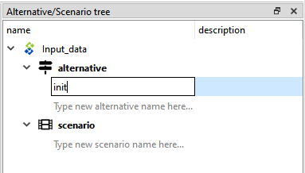

Next step is to add an object for the first `node` that will be called *west*. 
- Right-click on the `node` object class in the object tree to select 'Add objects'. 
- Use the dialog to add the *west* `node` and click ok. See the figures below.
- Later other objects will need to be added in the same manner - as well as relationships between objects.

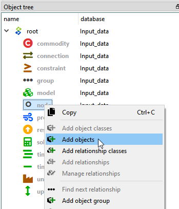 
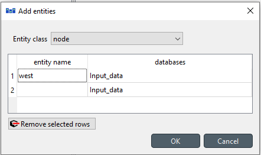

The newly minted *west* `node` will now need parameter data.
- First it needs an `inflow` parameter with negative values to indicate negative inflow, i.e. demand. The `inflow` timeseries are given as a map-type parameter where the first column contains the names of the timesteps and the second column contains the inflow parameter value for that timestep. 
- There are no electriciy generating units and the demand cannot be met by ordinary means. The model will therefore use the upward slack variable and accept the `penalty_up` cost associated with it. Also downward `penalty_down` is defined although the model is not using it at this stage. 
- The *west* `node` needs to have a parameter called `is_active` with value *yes*. This chooses the *west* `node` and all its parameters to be sent to the model. 
- All parameters here should be part of the *west* `alternative` - they will be used whenever a `scenario` includes the *west* `alternative`. 

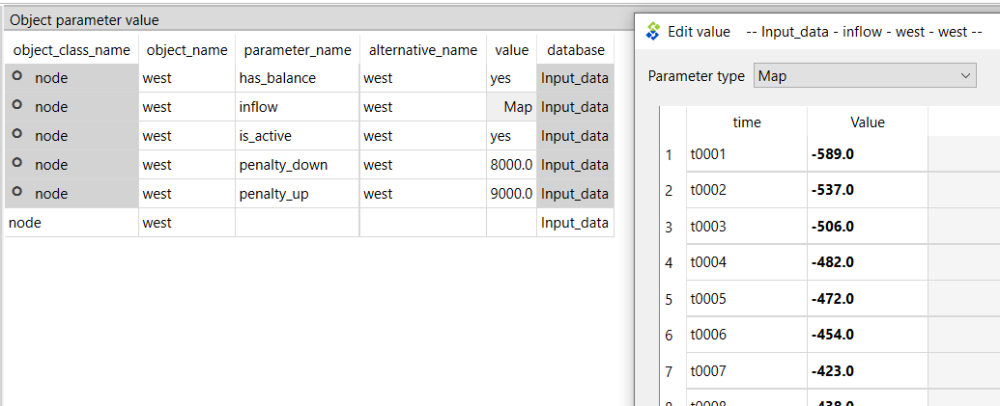

The model will also need parameters that define the model structure for time related issues. FlexTool time structure offers a lot of flexibility, but it is also bit complex to learn at first. At this stage not everything needs to be understood - the time structures will be explained in more detail later. 

First, make a new `alternative` called *init* to keep all the model structure related data separate from the data on physical objects. All parameter data that will be added next, should go into the *init* `alternative`.

Then, to get the model to run, these are needed:
- `timeline` object called *y2020* with a map-type parameter `timestep_duration` that defines the timeline the time series data in the model will need to use. It contains the name of each timestep in the first column (e.g. *t0001* or *2022-01-01-01*) and the length of the timestep in hours (e.g. *1.0*) in the second column. The timestep names in the previously given `inflow` time series should match these timestep names - and any other timestep names in later time series.
- `timeblockset` object called *2day* with a map-type parameter `block_duration` to define a time block using a timestep name to indicate where the timeblock starts and a number to define the duration of the timeblock in timesteps (e.g. *t0001* and *1.0*).
- `timeblockset` *2day and `timeline` *y2020* need to have `timeblockset__timeline` relationship *2day*, *y2020*. Right-click on the `timeblockset__timeline` relationship class to 'Add relationships...'.
- `solve` object called *y2020_2day_dispatch* 
  - with a map-type parameter `period_timeblockSet` to define the what timeblockset each period in the model should use (in this example: `period` *y2020* in the first column of the map links to the `timeblockset` object *2day* in the second column of the map)
  - with an array-type parameter `realised_periods` to define the periods that are realised from the `solve` named by the object (in this example: first column of the array is the index number *1* and the second column contains the period to be realized in the results: *y2020*)
- Finally, the model will be a sequence of solves as defined by the `model` object. In this case *flexTool* `model` object contains just one solve *y2020_2day_dispatch* inside the array-type parameter.

The new objects, relationships and parameters have now been staged. Even though it looks like they are in the database, they really are not - they need to be **committed** first. This can be done from the menu of the Database Editor (there is a *commit* command) or by pressing *ctrl-enter*. One should write an informative commit message about the changes that have been made. All commits, and the data they have affected, can be seen later from the *history* menu item.

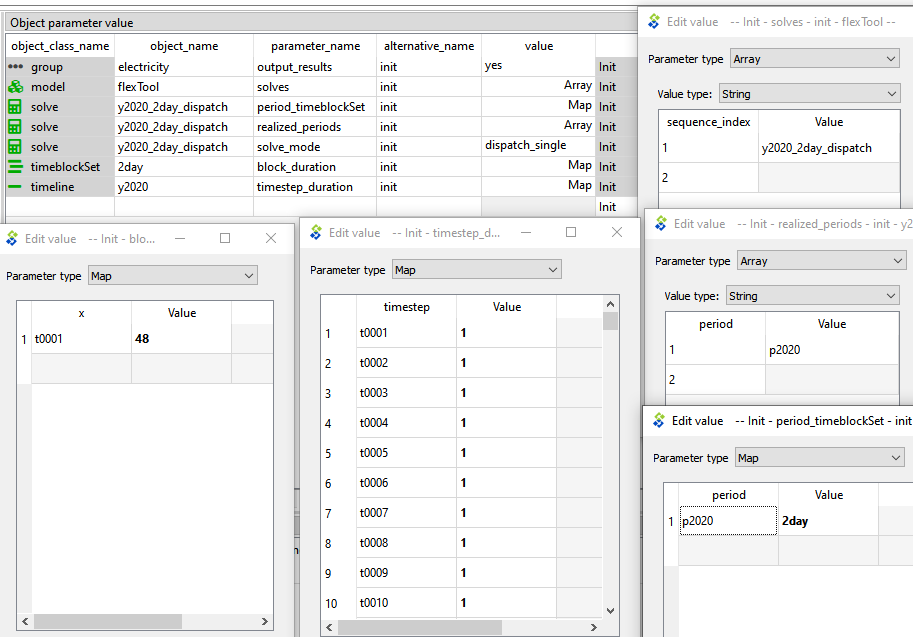

## Interlude - creating a scenario and running the model

Even though the model is very simple and will not do anything interesting, it can be executed. However, first there needs to be a scenario to be executed. Scenarios are created from `alternatives` in the Alternative/Scenario tree widget of the Database Editor. In the figure below, a `scenario` called *base* is created that should contain `alternatives` *west* and *init* in order to have both a node and a model structure included in the model. The new `scenario` must also be **committed**, before it can be used. A new scenario should be added after each step in the tutorial process. 

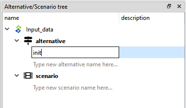

Once the scenario has been committed to the database, it becomes available in the Spine Toolbox workflow. One can select scenarios to be executed from the arrow that leaves the ***Input data*** database. At this point, there will be only the *base* `scenario` available and should be selected. There is also a tool filter with *FlexTool3* pre-selected. This selection needs to be present when running scenarios (it is used to filter the `is_active` entities into the scenario).


Next, we want to run three tools: ***Export_to_CSV*** (that will make input files suitable for FlexTool), ***FlexTool3*** (which is a Python script that calls the FlexTool model generator for each solve) and ***Import_results*** (which will take output files from FlexTool and drop their contents to the ***Results*** database with a particular `alternative` name. First, select the tools (select with left click while ctrl is pressed or draw an area with ctrl pressed, see figure below). Then, press ***Execute_selected*** from the menu bar. The three items should be executed and if all goes well, then green check marks appear on each of the tool once it has finished. You can explore the outputs of each item by selecting the item and looking at the ***Console*** widget window.

 
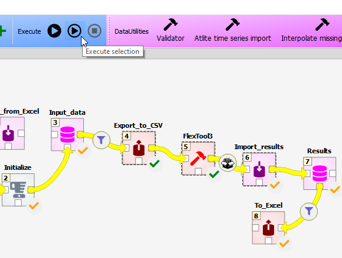

It is now possible to explore model results for the *base* `scenario` using either the ***Results*** database or the Excel file that can be exported by executing the ***To_Excel*** exporter tool. When doing that, no scenarios should be selected so that the tool will create one Excel file with data from all the alternatives that are in the results database (which will make more sense once there are more scenario results). The generated Excel file can be found by selecting the ***To_Excel*** tool and clicking on the folder icon on top-right of the ***Link properties*** widget window.

## 2nd step - add a coal unit

In the second step, a coal unit is added. 
- The first thing is to add a new `alternative` *coal* so that all new data added in this step will become part of the *coal* `alternative`.
- Then one needs to add the objects:
  - `unit` *coal_plant*
  - `node` *coal_market* 
  - `commodity` *coal*
- And relationships:
  - `unit__inputNode` *coal_plant, coal_market* to indicate that the *coal_plant* is using inputs from the *coal_market*
  - `unit__outputNode` *coal_plant, west* to indicate that the *coal_plant* will output electricity to the *west* node
  - `commodity__node` *coal, coal_market*
- *coal_plant* needs the following parameters (all set for the *coal* alternative): 
  - `efficiency` (e.g. 0.4 for 40% efficiency)
  - `existing` to indicate the existing capacity in the coal_plant (e.g. 500 MW)
  - `is_active` set to *yes* to include the *coal_plant* in the model
- *coal* `commodity` needs just one parameter for `price` (e.g. 50 €/MWh of fuel)
- *coal_market* `node` needs to have `is_active` set to *yes* 
- All these new parameters should be now part of the *coal* `alternative`. A `scenario` with the *init* `node` and the *coal_plant* `unit` is then built by including both *init* and *coal* `alternatives` in the *coal* `scenario`.

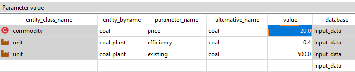

To see how the results change due to the coal power plant, make a new scenario *coal* that has the `alternatives` *init*, *west* and *coal*. Run the ***Export_to_CSV***, ***FlexTool3*** and ***Import_results*** to get the results to the ***Results*** database. If you start to get too many result `alternatives` in the ***Results*** database (e.g. if you happen to run the same scenario multiple times), you can delete old ones by removing the unwanted `alternatives` (right-click on the `alternative`) and then **committing** the database.

## 3rd step - add a wind power plant

Next, a wind power plant is added. 
- Add a new `alternative` *wind*
- Add objects:
  - `unit` *wind_plant*
  - `profile` *wind_profile* since *wind_plant* does not require a commodity, but instead uses a profile to limit the generation to the available wind.
- Add relationships:
  - `unit__node__profile` *wind_plant, west, wind_profile*
  - `unit__outputNode` *wind_plant, west*
- *wind_plant* needs the following parameters (all set for the *wind* alternative):
  - `conversion_method` to choose a method for the conversion process (in this case *constant_efficiency*)
  - `efficiency` for *wind_plant* should be set to 1
  - `existing` capacity can be set to 500 MW
  - `is_active` set to *yes* to include the *wind_plant* in the model
- *wind_profile* needs the the parameter `profile` with a map of values where each time step gets the maximum available capacity factor for that time step (see figure). 
- *wind_plant, west, wind_profile* relationship needs a parameter `profile_method` with the choice *upper_limit* selected. This means that the *wind_plant* must generate at or below its capacity factor.

Remember to **commit**, execute and have a look at the results (there should be no more penalty values used, since the coal and wind plant can together meet the demand in all hours.

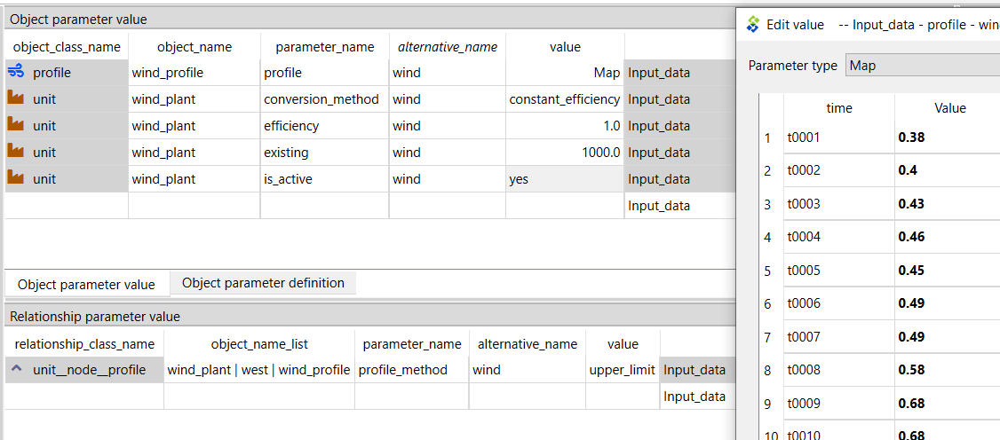

## 4th step - add a network

 A *network* `alternative` introduces 
 - two new `nodes` (*east* and *north*) 
 - three new `connections` between `nodes` (*east_north*, *west_east* and *west_north*). 
  
The new nodes are kept simple: 
- they have a `has_balance` parameter set to *yes* (to force the node to maintain an energy balance)
- they have a constant negative `inflow` (i.e. demand)
- penalty values for violating their energy balance

The *north* `node` has the lowest upward penalty, so the model will prefer to use that whenever the *coal* and *wind* units cannot meet all the demand. Sometimes the `existing` capacity of the new `connections` will not be sufficient to carry all the needed power, since both generators are producing to the *west* `node`. **Commit**, execute and explore.

 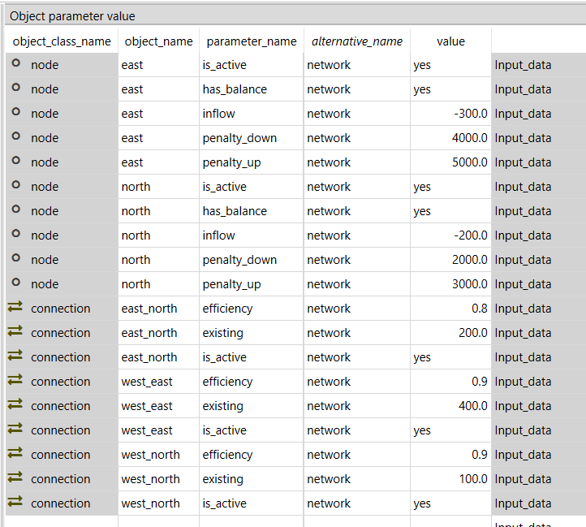

## 5th step - add a reserve

Reserve requirement is defined for a group of nodes. Therefore, the first step is to add a new `group` called *electricity* with *west*, *east* and *north* as its members using the `group__node` relationship class. Then, a new reserve category called *primary* is added to the `reserve` object class. 

A relationship between *primary--up--electricity* in the `reserve__upDown__group` class allows to define the reserve parameters `reserve_method`, `reservation` and `penalty_reserve`. In this case the reserve requirement will be a constant even though the `reserve_method` is *timeseries_only*. The other alternative is dynamic reserves where the model calculates the reserve requirement from generation and loads according to user defined factors (`increase_reserve_ratio`). 

Parameters from the `reserve__upDown__unit__node` class will be used to define how different units can contribute to different reserves. Parameter `max_share` says how large share of the total capacity of the unit can contribute to this reserve category (e.g. *coal_plant*, in this example, has ramping restrictions and can only provide 1% of it's capacity to this upward primary reserve. Meanwhile, parameter `reliability` affects what portion of the reserved capacity actually contributes to the reserve (e.g. in this contrived example, *wind_plant* must reduce output by 20 MW to provide 10 MW of reserve). 

**Commit**, execute and explore how the reserve requirements affect the model results.

 

# More functionality

## Adding a storage unit (battery)

***init - wind - battery***

In the ***Init*** SQLite database, there is a `scenario` *wind_battery* - the *wind_plant* alone is not able to meet the load in all conditions, but the *battery* will help it to improve the situation.

In FlexTool, only `nodes` can have storage. This means that `existing` capacity and all investment parameters for `nodes` refer to the amount of storage the `node` can have. In this example, a *battery* `node` is established to describe the storage properties of the *battery* (e.g. `existing` capacity and `self_discharge_loss` in each hour). 

Battery also needs charging and discharging capabilities. These could be presented either with a `connection` or by having a charging `unit` and a discarging `unit`. In here, we are using a `connection` called *batter_inverter*, since its more easy to prevent simultaneous charging and discharging that way (although, in a linear model, this cannot be fully prevented since that requires an integer variable). Please note that the `efficiency` parameter of the `connection` applies to both directions, so the round-trip `efficiency` will be `efficiency` squared.

The `transfer_method` can be used by all types of connections, but in this case it is best to choose *regular*, which tries to avoid simultaneous charging and discharing, but can still do it when the model needs to dissipate energy. *exact* method would prevent that, but it would require integer variables and make the storage computationally much more expensive. Model leakage will be reported in the results (forthcoming).


##  Adding battery investment capabilities 

***init - wind - battery - battery_invest***

To make the *wind_battery* `scenario` more interesting, an option to invest in *battery* and *battery_inverter* is added. It also demonstrates how FlexTool can have more complicated constraints that the user defines through data. 

First, the investment parameters need to be included both for the *battery_inverter* and *battery* objects:

- `invest_method` - the modeller needs to choose between *only_invest*, *only_retire*, *invest_and_retire* or *not_allowed*
- `invest_cost` - overnight investment cost new capacity [currency/kW] for the *battery_inverter* and [currency/kWh] for the *battery*. Other one can be left empty or zero, since they will be tied together in the next phase. Here we will assume a fixed relation between kW and kWh for this battery technology, but for example flow batteries could have separate investments for storage and charging capacities.
- `invest_max_total` - maximum investment (power [MW] or energy [MWh]) to the virtual capacity of a group of units or to the storage capacity of a group of nodes. This should not be empty or zero, since then the model cannot invest in the technology.
- `interest_rate` - an interest rate [e.g. 0.05 means 5%] for the technology that is sufficient to cover capital costs assuming that the economic lifetime equals the technical lifetime
- `lifetime` - technical lifetime of the technology to calculate investment annuity (together with interest rate)

Second, a new constraint needs to be created that ties together the storage capacity of the *battery* and the charging/discharging capacity of the *battery_inverter*. A new `constraint` object *battery_tie_kW_kWh* is created and it is given parameters `constant`, `is_active` and `sense`. Constant could be left out, since it is zero, but `is_active` must be defined in order to include the constraint in the *battery_invest* `alternative`. The `sense` of the constraint must be *equal* to enforce the kw/kWh relation.

Third, both *battery_inverter* and *battery* need a coefficient to tell the model how they relate to each other. The equation has the capacity variables on the left side of the equation and the constant on the right side.

```
sum_i(`constraint_capacity_coefficient` * `invested_capacity`) = `constant` 
      where i is any unit, connection or node that is part of the constraint
```

When the `constraint_capacity_coefficient` for *battery* is set at 1 and for the *battery_inverter* at -8, then the equation will force *battery_inverter* `capacity`to be 8 times smaller than the *battery* `capacity`. The negative term can be seen to move to the right side of the equation, which yields:

```1 x *battery* = 8 x *battery_inverter*, which can be true only if *battery_inverter* is 1/8 of *battery*```

`constraint_capacity_coefficient` is not a parameter with a single value, but a map type parameter (index: constraint name, value: coefficient). It allows the object to participate in multiple constraints.

Finally, FlexTool can actually mix three different types of constraint coefficients: `constraint_capacity_coefficient`, `constraint_state_coefficient` and `constraint_flow_coefficient` allowing the user to create custom constraints between any types of objects in the model for the main variables in the model (*flow*, *state* as well as *invest* and *divest*). So, the equation above is in full form:

```
  + sum_i [constraint_capacity_coefficient(i) * invested_capacity]
           where i contains [node, unit, connection] belonging to the constraint
  + sum_j [constraint_flow_coefficient(j) * invested_capacity]
           where j contains [unit--node, connection--node] belonging to the constraint
  + sum_k [constraint_state_coefficient(k) * invested_capacity] 
           where k contains [node] belonging to the constraint
  = 
  constant
```

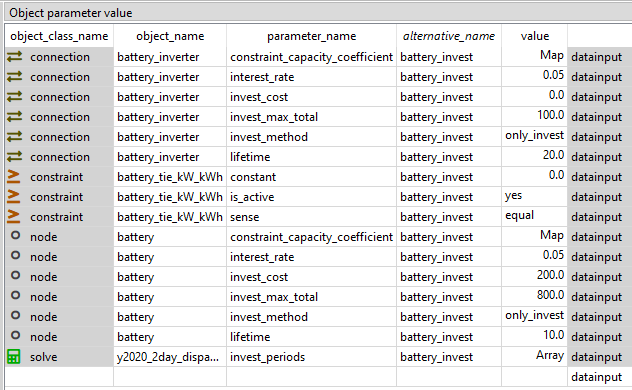

## Combined heat and power (CHP) example

***init - coal_chp - heat***

This CHP plant is an another example where the user defined `constraint` (see the last equation in the previous example) is used to achieve derised behaviour. In a backpressure CHP, heat and power outputs are fixed - increase one of them, and you must also increase the other. In an extraction CHP plant the relation is more complicated - there is an allowed operating area between heat and power. Both can be depicted in FlexTool, but here a backpressure example is given. An extraction plant would require two or more *greater_than* and/or *lesser_than* `constraints` to define an operating area.

First, a new *heat* `node` is added and it is given the necessary parameters. Then the *coal_chp* `unit` is made with a high `efficiency` parameter, since CHP units convert fuel energy to power and heat at high overall rates. In FlexTool, `efficiency` is a property of the unit - it demarcates at what rate the sum of inputs is converted to the sum of outputs. However, without any additional constraints, the `unit` is free to choose in what proportion to use inputs and in which proportion to use outputs. In units with only one input and output, this freedom does not exist, but in here, the *coal_chp* needs to be constrained as otherwise the unit could produce electricity at 90% efficiency, which is not feasible. 

This is done by adding a new `constraint` *coal_chp_fix* where the heat and power co-efficients are fixed. As can be seen in the bottom part of the figure below, the `constraint_flow_coefficient` parameter for the *coal_chp--heat* and *coal_chp--west* is set as a map value where the `constraint` name matches with the *coal_chp_fix* `constraint` object name. The values are set so that the constraint equation forces the heat output to be twice as large as the electricity output. Again, the negative value moves the other variable to the right side of the equality, creating this:

```1 x *electricity* = 0.5 x *heat*, which is true only if *heat* is 2 x *electricity*```

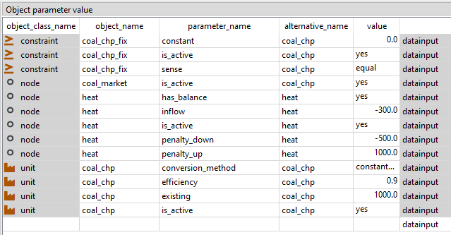

## Minimum load example

***init - coal - coal_min_load***

The next example is more simple. It adds a minimum load behavior to the *coal_plant* `unit`. Minimum load requires that the unit must have an online variable in addition to flow variables and therefore a `startup_method` needs to be defined and an optional `startup_cost` can be given. The options are *no_startup*, *linear* and *binary*. *binary* would require an integer variable so *linear* is chosen. However, this means that the unit can startup partially. The minimum online will still apply, but it is the minimum of the online capacity in any given moment (*flow* >= *min_load* x *capacity_online*).

The online variable also allows to change the efficiency of the plant between the minimum and full loads. An unit with a part-load efficiency will obey the following equation:

```
  + sum_i[ input(i) * input_coefficient(i) ]
  =
  + sum_o[ output(o) * output_coefficient(o) ] * slope
  + online * section

where   slope = 1 / efficiency - section
  and section = 1 / efficiency 
                - ( 1 / efficiency - 1 / efficiency_at_min_load) / ( 1 - efficiency_at_min_load )
```

By default, `input_coefficient` and `output_coefficient` are 1, but if there is a need to tweak their relative contributions, these coefficients allow to do so (e.g. a coal plant might have lower efficieny when using lignite than when using brown coal).

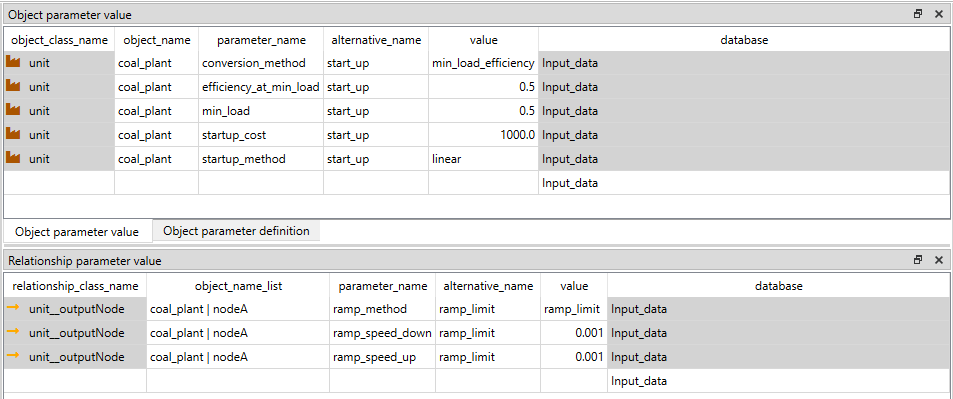

## Adding CO2 emissions and costs

***init - coal - co2***

Carbon dioxide emissions are added to FlexTool by associating relevant `commodities` (e.g. *coal*) with a `co2_content` parameter (CO2 content per MWh of energy contained in the fuel). To set a price for the CO2, the nodes that use those commodities will need to be linked to a `group` of `nodes` that set the `co2_price` (currency / CO2 ton). Therefore, in addition to what is visible in the figure below, a relationship *co2_price--coal_market* must be established so that the model knows to point the `CO2_price` to the `commodity` used from the *coal_market* `node` based on the `co2_content` of the *coal* `commodity`.

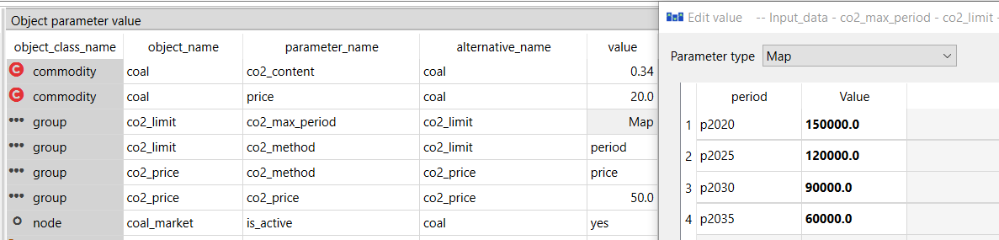

## Full year model

***init - fullYear***

So far the model has been using only two days to keep it fast to run. This example extends the model horizon to a full year. To do so, a new `solve` object *y2020_fullYear_dispatch* is added. Each `solve` object needs to know what `periods` it will contain and what `periods` it will realize (print out results). `solve_mode` does not do anything at present, but will be used when FlexTool can be set to do automatic rolling window optimization (at present, it needs to be set manually using multiple solves). The key difference here is that the `period_timeblockSet` parameter points the *p2020* period to a timeblockSet definition that covers the full year instead of the two days used before.

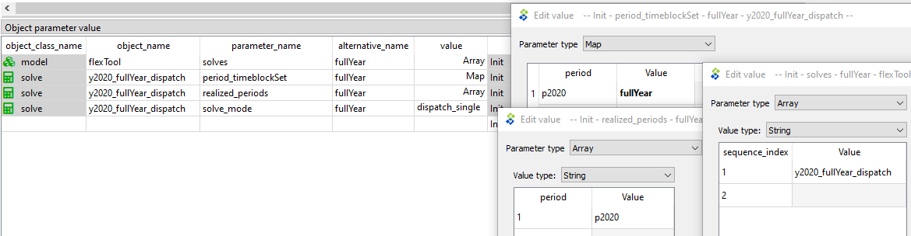

## A system with coal, wind, network, battery and CO2 over a full year

***init - coal - wind - network - battery - co2 - fullYear***

The final example shows a system many of the previous examples have been put into one model and run for one year. The graph below shows the physical objects in the example.

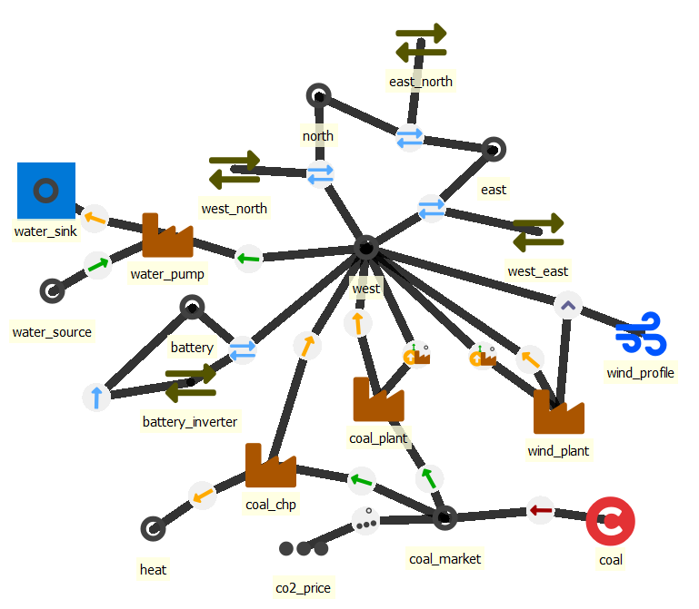
