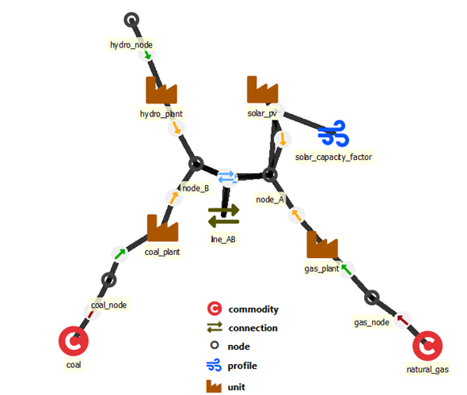
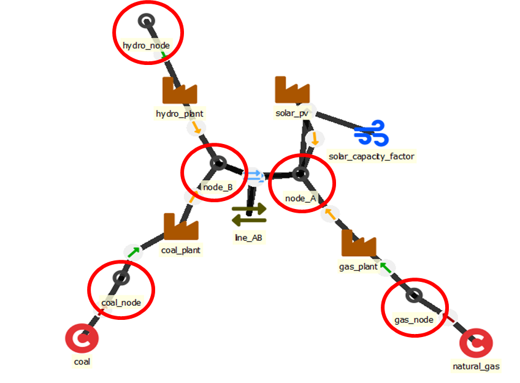
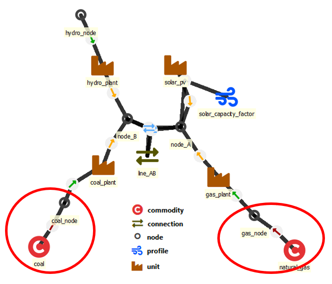

[Install](https://github.com/irena-flextool/flextool/tree/master#irena-flextool) | [Tutorial](https://irena-flextool.github.io/flextool) | [Results](https://irena-flextool.github.io/flextool/results) | [Reference](https://irena-flextool.github.io/flextool/reference) | [Data structure](https://irena-flextool.github.io/flextool/spine_database) | [Spine Toolbox interface](https://irena-flextool.github.io/flextool/spine_toolbox) | [Browser-interface](https://irena-flextool.github.io/flextool/browser_interface)

- [Essential objects for defining a power/energy system](#essential-objects-for-defining-a-powerenergy-system)
- [How to define model properties](#how-to-define-model-properties)
- [Additional objects for further functionality](#additional-objects-for-further-functionality)
- [Nodes](#nodes)
- [Units](#units)
- [Connections](#connections)
- [Commodities](#commodities)
- [Profiles](#profiles)
- [Groups](#groups)

# Essential objects for defining a power/energy system

- [**node**](#nodes): maintain a balance between generation, consumption, transfers and storage state changes (nodes can also represent storages)
- [**unit**](#units): power plants or other conversion devices that take one or more inputs and turn them into one or more outputs
- [**connection**](#connections): transmission lines or other transfer connections between nodes
- [**commodity**](#commodities): fuels or other commodities that are either purchased or sold at a price outside of the model scope
- [**profile**](#profiles): timeseries that can be used to constraint the behaviour of units, connections or storages

See below for more detailed explanations.

# How to define model properties

## Timesteps and periods

FlexTool has two different kinds of time varying parameters. The first one represents a regular timeline based on timesteps. The duration of each timestep can be defined by the user. There can be multiple timelines in the database - the user needs to define which timeline to use (and what parts of the timeline should be used, as will be explained later). The timestep names in the timeline are defined by the user - they can be abstract like 't0001' or follow a datetime format of choice. However, the timestep names between different timelines must remain unique.

The second time varying dimension is `period`, which is typically used to depict assumptions about the future. One model can include multiple `solves` that the model will solve in sequence (to allow multi-stage modelling). Each solve can include multiple `periods` (so that the user can change parameter values for different parts of the future).

A parameter of particular type can be either constant/time-varying or constant/period-based. For example `inflow` is either a constant or time-varying, but it cannot be period-based.

## Timeblocksets

Timeblocks pick one or more sections from the `timeline` to form a `timeblockset`. Each timeblock defines a start and a duration. The aim of timeblocksets is to allow the modeller to create models with represeantive periods often used in the investment planning.

## Definitions

- **model**: model defines the sequence of solves to be performed (e.g. first an investment solve and then a dispatch solve)
  - *solves*: sequence of solves in the model represented with an array of solve names.
- **solve**: each solve is built from an array of periods (e.g. one period for 2025 and another for 2030). Periods use timeblocksets to connect with a timeline.
  - *period_timeblockset*: map of periods with associated timeblocks that will be included in the solve. Index: period name, value: timeblockSet name.
  - *realized_periods*: these are the periods the model will 'realize' - i.e., what periods will be reported in the results from this solve
  - *invest_periods*: array of periods where investements are allowed in this solve (applies only to objects that can be invested in)
  - *discount_years*: how far in the future each period is from the start of this solve (in years). Index: period, value: years.
  - *solver*: choice of solver (a list of possible values)
  - *solve_mode*: a single shot or a rolling solve (not functional yet, always a single shot)
- **timeblockset**: timeblocksets are sets of timeblocks with a start (from timeline) and a duration (number of time steps)
  - *block_duration* a map with index *timestep_name* that starts the timeblock and value that defines the duration of the block (how many timesteps)
- **timeline**: continuous timeline with a user-defined duration for each timestep. Timelines are used by time series data.
  - *timestep_duration*: a map with *timestep_name* as an index and *duration* as a value.
  - *timeline_duration_in_years* Total duration of the timeline in years. Used to relate operational part of the model with the annualized part of the model.
- **timeblockset__timeline**: defines which timeline object particular timeblockset is using.

# Additional objects for further functionality
- **group**: include multiple objects in a group to define common constraints (e.g. minimum VRE share)
- **reserve**: to define reserves for power systems
- **constraint**: to create user defined constraints between flow, state, and capacity variables (for nodes, units and connections)

# Nodes

## Defining how the node functions

These parameters will define how the node will behave and use the data it is given (available choices are marked in *italics*):

- **'name'** - unique name identifier (case sensitive)
- **'is_active'** - is the model/node/unit active in a specific scenario: *yes* (if not defined, then not active)
- **'has_balance'** - does the node maintain a balance for inputs and outputs: *yes* (if not defined, then balance is not maintained)
- **'has_state'** - does the node represent a storage and therefore have a state: *yes* (if not defined, then no storage)
- **'invest_method'** - choice of investment method
    - *only_invest* 
    - *only_retire* 
    - *invest_and_retire* 
    - *not_allowed* 
- **'inflow_method'** - choice how to treat inflow time series
    - *use_original* - does not scale the original time series (no value defaults here)
    - *no_inflow* - ignores any inserted inflow time series
    - *scale_to_annual_flow* - will scale the time series to match the `annual_flow` so that the sum of inflow is multiplied by 8760/`hours_in_solve`
    - *scale_in_proprotion* - calculates a scaling factor by dividing `annual_flow` with the sum of time series inflow (after it has been annualized using `timeline_duration_in_years`)

## Data for nodes

Input data is set with the following parameters:

- **'inflow'** - inflow into the node (negative is outflow). Constant or time series.
- **'annual_flow'** - annual flow in energy units (always positive, the sign of inflow defines in/out). Constant or period.
- **'existing'** - existing storage capacity (requires `has_state`). Constant.
- **'invest_cost'** - investment cost for new storage capacity. Constant or period.
- **'invest_max_total'** - maximum investment over all solves. Constant.
- **'lifetime'** - life time of the storage unit represented by the node. Constant or period.
- **'interest_rate'** - interest rate for investments. Constant or period.
- **'fixed_cost'** - annual fixed cost for storage. Constat or period.
- **'penalty_up'** - penalty cost for decreasing consumption in the node with a slack variable. Constant or time.
- **'penalty_down'** - penalty cost for increasing consumption in the node with a slack variable. Constant or time.

## Using nodes as storages

FlexTool manages storages through nodes. A regular node maintains an energy/material balance between all inputs and outputs (`has_balance` set to *yes*). A storage node includes an additional state variable, which means that the node can also use charging and discharging of the storage while maintaining the energy balance. A storage node is created by setting `has_storage` to *yes* and by adding storage capacity using the `existing` parameter and/or by letting the model invest in storage capacity (`invest_method`, `invest_cost`, `invest_max_period`, `invest_max_total` and `invest_forced` parameters).

Since FlexTool allows different temporal structures (multi-periods, rolling optimization, etc.) there needs to be ways to define how the storages behave when the model timeline is not fully consequtive. By default, storages are forced to match start level to the end level within timeblocks. This is an acceptable setting for small storages that do not carry meaningful amounts of energy between longer time periods in the model.

There are three methods associated with storage start and end values: `storage_binding_method`, `storage_start_end_method` and `storage_solve_horizon_method`. 
- The most simple one of these is the `storage_start_end_method` and it overrides the other methods, since it forces the start and/or the end state of the storage to a predefined value based on the proportional parameters `storage_state_start` and `storage_state_end` (proportional means that the parameter needs to be set between 0-1 and will be scaled by the storage capacity in the model). These two parameters affect only the first and the last timesteps of the entire model (even when the model has more than one solve).
- `storage_binding_method` states how the storage should behave over discontinuities in the model timeline. Model timeline can have jumps for three different reasons: timeblocks, periods, and solves. If `storage_binding_method` is *bind_within_timeblock*, then the storage has to match the state of the storage between the beginning and the end of each timeblock. In effect, **storage_state_at_start_of_timeblock** equals **storage_state_at_end_of_timeblock** plus **charging** minus **discharging** minus **self_discharge_loss** at the last timestep. Similarly, *bind_within_period* will force the start and end between periods, but it will treat the jumps between timeblocks as continuous from the storage perspective (the storage will continue from where it was at the end of the previous timeblock). *bind_within_solve* does effectively the same when there are multiple periods within one solve. *bind_within_model* (NOT IMPLEMENTED 23.11.2022) will extend the continuity to multiple solves and force the end state of the storage at the end of the last solve to match the beginning state of the storage at the start of the first solve. Finally, *bind_forward_only* will force continuity in the storage state over the whole model without forcing the end state to match the beginning state.
- `storage_solve_horizon_method` is meant for models that roll forward between solves and have an overlapping temporal window between those solves (e.g. a model with 36 hour horizon rolls forward 24 hours at each solve - those 12 last hours will be overwritten by the next solve). In these cases, the end state of the storage will be replaced by the next solve, but it can be valuable to have some guidance for the end level of storage, since it will affect storage behaviour. There are three methods: *free* is the default and will simply let the model choose where the storage state ends (usually the storage will be emptied, since it would have no monetary value). *use_reference_value* will use the value set by `storage_state_reference_value` to force the end state in each solve to match the reference value. *use_reference_price* will give monetary value for the storage content at the end of the solve horizon set by the `storage_state_reference_price` parameter - the model is free to choose how much it stores at the end of horizon based on this monetary value.

# Units

Units convert energy (or matter) from one form to another (e.g. open cycle gas turbine), but the can also have multiple inputs and/or outputs (e.g. combined heat and power plant). The input nodes are defined with the relationship `unit--inputNode` while the output nodes are defined through the relationship `unit--outputNode`.

## Defining how the unit functions

- `is_active` to state the alternative where the unit becomes active
- 'conversion_method' to define the way unit converts inputs to outputs 
- `startup_method` defines how the start-up mechanism is modelled
- `minimum_time_method` - not functional at the moment

## Main data items for units

- Capacity: `existing` (and the investment and retirement parameters below)
- Technical: `efficiency`, `min_load`, `efficiency_at_min_load`, `inertia_constant`
- Economic: `variable_cost`, `startup_cost`, `fixed_cost` (fuel cost comes through the use of fuel commodities)

## Investment parameters (for capacity expansion)

- investment/retirement method
- invest_cost, interest_rate, lifetime, invest_max_total, invest_max_period
- salvage_cost, retire_max_total, retire_max_period

## Relationship of a unit to a node and determination of the type of relationship

- If the unit’s outputs are flowing into the node, the node acts as output for the unit.
- If the unit’s inputs are flowing out of the node (into the unit), the node acts as input for the unit.
- Not all units necessary have an input or an output node. E.g. VRE generators have only output nodes and their generation is driven by profiles

## Properties of unit--inputNode and unit--outputNode relationships

- Flow (from/to node) coefficient (changes the accounts for efficiency of unit)
- Variable cost of the particular flow of unit--inputNode or unit--outputNode

## Units constrained by profiles

Some generators (e.g. VRE) are not converting energy from one node to the other. Instead, their generation is determined (or limited) by a specific generation profile set by a `profile` object with a `profile_method`, thats state whether the profile forces an *upper_limit*, *lower_limit* or *equal*ity. Finally `profile`object is given a `profile` time series (or it can also be a constant).

# Connections

Connections can have an `existing` transfer capacity as well as an opportunity to invest in new capacity and retire old capacity. The functional choices of connections include the `is_active`, `transfer_method`, `invest_method`, `startup_method` as well as a choice if the tranfer connection `is_DC`. Parameters for the connection are defined in the `connection` object, but the two `nodes` it connects are defined by establishing a relationship between `connection--leftNode--rightNode`.

# Commodities

Some `nodes` can act as a source or a sink of commodities instead of forcing a balance between inputs and outputs. To make that happen, commodities must have a `price` and be connected to those `nodes` that serve (or buy) that particular `commodity` at the given `price`. In other words, `commodity` is separate from `node` so that the user can use the same `commodity` properties for multiple nodes. Commodities can also have a `co2_content`. The `commodity` and its `nodes` are connected by establishin a new relationship between the `commodity` and each of its `nodes` (e.g. *coal--coal_market*).

# Profiles

Profiles are time series of data that will be multiplied by capacity to form a constraint for a unit flow, a connection flow or a storage state. The constraint can be *upper_limit*, *lower_limit* or *fixed*.

# Groups

Groups are used to make constraints that apply to a group of nodes, units and/or connections. A group is defined by creating a group object and then creating a relationship between the group and its members. The membership relationship classes are `group__node`, `group__unit`, `group__connection`, `group__unit__node`, `group__connection__node` and `reserve__upDown__group`. The choice of group members depends on what the group is trying to achieve. For instance a group that limits investments could have a set of `units` included in the group.

## Capacity limits for nodes, units and connections

- `invest_method` - the choice of method how to limit or force investments in capacity [MW or MWh] of the group members
- `invest_max_total` - [MW or MWh] Maximum investment to the virtual capacity of a group of units or to the storage capacity of a group of nodes. Total over all solves.
- `invest_max_period` - [MW or MWh] Maximum investment per period to the virtual capacity of a group of units or to the storage capacity of a group of nodes.
- `invest_min_total` - [MW or MWh] Minimum investment to the virtual capacity of a group of units or to the storage capacity of a group of nodes. Total over all solves. 
- `invest_min_period` - [MW or MWh] Minimum investment per period to the virtual capacity of a group of units or to the storage capacity of a group of nodes.

## Cumulative and instant flow limits for `unit__node`s and `connection__node`s

- `max_cumulative_flow` - [MW] Maximum average flow, which limits the cumulative flow for a group of connection_nodes and/or unit_nodes. The average value is multiplied by the model duration to get the cumulative limit (e.g. by 8760 if a single year is modelled). Applied for each solve. Constant or period.
- `min_cumulative_flow` - [MW] Minimum average flow, which limits the cumulative flow for a group of connection_nodes and/or unit_nodes. The average value is multiplied by the model duration to get the cumulative limit (e.g. by 8760 if a single year is modelled). Applied for each solve. Constant or period.
- `max_instant_flow` - [MW] Maximum instantenous flow for the aggregated flow of all group members. Constant or period.
- `min_instant_flow` - [MW] Minimum instantenous flow for the aggregated flow of all group members. Constant or period.

## Limits for nodes

- `has_inertia` - A flag whether the group of nodes has an inertia constraint active.
- `inertia_limit` - [MWs] Minimum for synchronous inertia in the group of nodes. Constant or period.
- `penalty_inertia` - [CUR/MWs] Penalty for violating the inertia constraint. Constant or period.
- `has_non_synchronous` - A flag whether the group of nodes has the non-synchronous share constraint active.
- `non_synchronous_limit` - [share, e.g. 0.8 means 80%] The maximum share of non-synchronous generation in the node group. Constant or period.
- `penalty_non_synchronous` - [CUR/MWh] Penalty for violating the non synchronous constraint. Constant or period.
- `has_capacity_margin` - A flag whether the group of nodes has a capacity margin constraint in the investment mode.
- `capacity_margin` - [MW] How much capacity a node group is required to have in addition to the peak net load in the investment time series. Used only by the investment mode. Constant or period.
- `penalty_capacity_margin` - [CUR/MWh] Penalty for violating the capacity margin constraint. Constant or period.

## Controlling outputs

Some results are output for groups of nodes. This means that instead of getting output for each node separately, nodes can be grouped and the aggregated results can be examined. For example all electricity nodes could be groupped for aggragated output.

- `output_results` - A flag to output aggregated results for the group members.