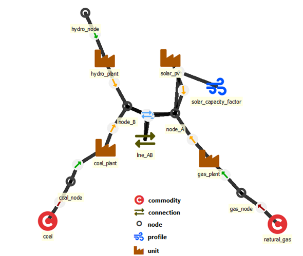
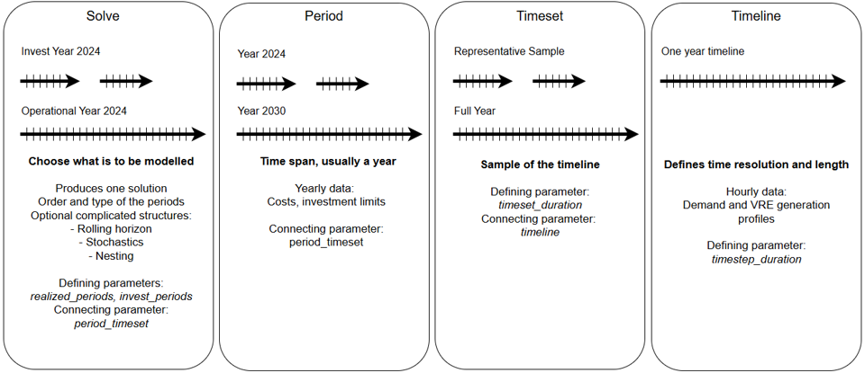
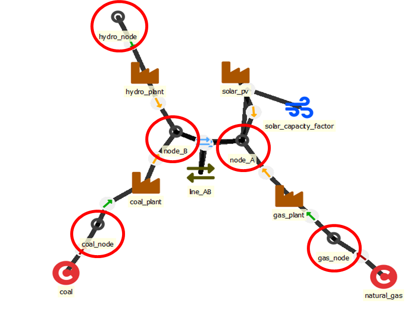
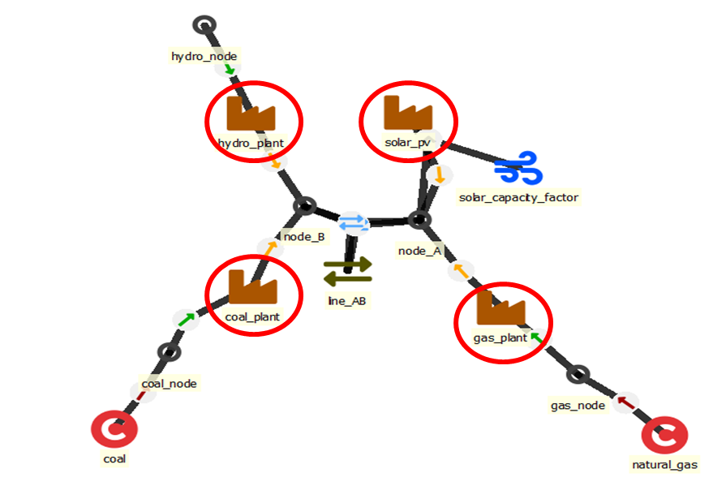
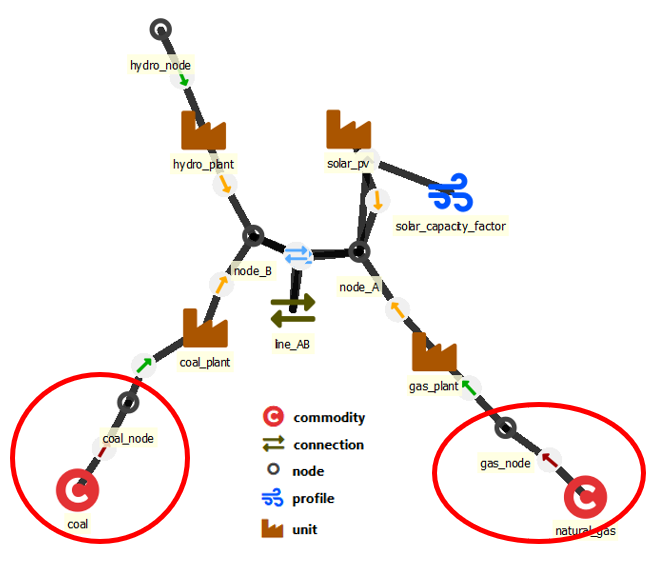

# Main entities to define a power/energy system

Elemental entities (one dimensional):

- [`node`](#nodes): maintain a balance between generation, consumption, transfers and storage state changes (nodes can also represent storages)
- [`unit`](#units): power plants or other conversion devices that take one or more inputs and turn them into one or more outputs
- [`connection`](#connections): transmission lines or other transfer connections between nodes
- [`commodity`](#commodities): fuels or other commodities that are either purchased or sold at a price outside of the model scope
- [`profile`](#units-constrained-by-profiles): timeseries that can be used to constraint the behaviour of units, connections or storages
- [`reserve`](#reserves): reserve categories to withhold capacity to cope with issues outside of model scope

Entities with two or more dimensions:

- `unit__inputNode` and `unit__outputNode`: defines the inputs, outputs and their properties for the conversion units
- `connection__node__node`: defines which nodes a connection will connect
- `unit__node__profile` and `connection__profile`: defines a profile limit (upper, lower or fixed) for an energy flow
- `node__profile`: defines a profile limit (upper, lower, or fixed) for the storage state of the node
- `commodity__node`: defines if a node is a source or sink for a commodity
- `reserve__upDown__unit__node` and `reserve__upDown__connection__node`: reserve capacity from a source to the target node

See below for more detailed explanations.




## How to define the temporal properties of the model

### Timesteps and periods

FlexTool has two different kinds of time varying parameters. The first one represents a regular timeline based on timesteps. The duration of each timestep can be defined by the user. There can be multiple timelines in the database - the user needs to define which timeline to use (and what parts of the timeline should be used, as will be explained later). The timestep names in the timeline are defined by the user - they can be abstract like 't0001' or follow a datetime format of choice. However, the timestep names between different timelines must remain unique (usually there should be only one timeline in a database and therefore no issues).

The second time varying dimension is `period`, which is typically used to depict assumptions about the future. One model can include multiple `solves` that the model will solve in sequence (to allow multi-stage modelling). Each solve can include multiple `periods` (so that the user can change parameter values for different parts of the future).

A parameter of particular type can be either constant/time-varying or constant/period-based. For example `inflow` is either a constant or time-varying, but it cannot be period-based.

### Timesets

Timesets pick one or more sections from the `timeline` to form a `timeset`. Each timeset defines a start and a duration. The aim of timesets is to allow the modeller to create models with representative periods often used in the investment planning.



### Definitions

- `model`: model defines the sequence of solves to be performed (e.g. first an investment solve and then a dispatch solve)

  - *solves*: sequence of solves in the model represented with an array of solve names.
  - *inflation_rate*: [e.g. 0.02 for 2%] Model-wide inflation rate applied to all future costs. When inputs are in real (constant-price) terms, set to 0 (default). When inputs are in nominal terms, set to expected inflation.
  - *inflation_offset_investment*: [years] Offset from the period (often year) start to the first payment of the investment cost annuity.
  - *inflation_offset_operations*: [years] Offset from the period (often year) start to the payment of operational costs.
  - *periods_available*: (Optional) Array of periods available for the model. Use this for periods that are in the data, but are not in period_timeset.
  - *max_flow_for_unconstrained_variables*: [MW] Upper bound assigned to LP variables that have no other cap (e.g. flows on edges with `invest_method = no_limit` and no `existing` capacity). Acts as a numerical safety net to keep the LP bounded. Default is large; lower it when scaling problems appear (see [dev/scaling.md](dev/scaling.md)).
  - *debug*: Instruction set for performing model debugging and testing.
  - *version*: Database schema version. Written by the migration chain — do not edit manually.
  
- `solve`: each solve is built from an array of periods (e.g. one period for 2025 and another for 2030). Periods use timesets to connect with a timeline. Parameters are split into two parameter-group tags in the master template — `solve_basics` (knobs a typical user touches) and `solve_advanced` (rolling/nested/stochastic structures, solver options, cross-solve handoff). The split is purely cosmetic in the Spine DB editor; behaviour is identical.

  - *period_timeset*: map of periods with associated timesets that will be included in the solve. Index: period name, value: timeset name.
  - *new_stepduration*: Hours. Creates a new `timeline` from the old for this `solve` with this timestep duration. The new timeline will sum or average the other timeseries data like `profile` and `inflow` for the new timesteps. All timesets used by the solve must resolve to the same underlying timeline. See also the group-level `new_stepduration` for flex-temporal decomposition.
  - *realized_periods*: these are the periods the model will 'realize' - i.e., what periods will be reported in the results from this solve
  - *realized_invest_periods* Array of the periods that will realize the investment decisions. If this is not defined when the invest_periods exist, the realized_periods are used to realize the invests as well
  - *invest_periods*: array of periods where investements are allowed in this solve (applies only to entities that can be invested in)
  - *years_represented*: Map to indicate how many years the period represents before the next period in the solve. Used for discounting. Can be below one (multiple periods in one year). Index: period, value: years.
  - *solver*: choice of a solver. HiGHS is the default and only fully supported backend (called via the `highspy` Python bindings). CPLEX can still be wired in as an advanced option for licensed users via `solver_precommand` / `solver_arguments`; see the how-to.
  - *highs_method*: HiGHS solver method ('simplex' or 'ipm' which is interior point method). Should use 'choose' for MIP models, since 'simplex' and 'ipm' will not work.
  - *highs_parallel*: HiGHS parallelises single solves or not ('on' or 'off'). It can be better to turn HiGHS parallel off when executing multiple scnearios in parallel.
  - *highs_presolve*: HiGHS uses presolve ('on') or not ('off'). Can have a large impact on solution time when solves are large.
  - *solve_mode*: a single solve or a set of rolling optimisation windows solved in a sequence
  - *timeline_hole_multiplier*: [unitless, default 1.0] Multiplier applied to the inverse-step-duration term in the `nodeBalance_eq` for variable-step timelines. Tunes how strongly an unrepresented gap between two timesteps is amortised into the storage state equation. Leave at the default unless investigating large-step / sparse-timeline numerical issues.
  - *use_row_scaling*: Per-solve `yes`/`no` flag (default `no`) that toggles the legacy LP row-scaling family (multiplies node-balance and group-balance rows by `node_capacity_for_scaling` / `group_capacity_for_scaling` derived from connected-entity unitsizes). This is **independent** of the `autoscale/` package controlled by the `--scaling` CLI flag (env var `FLEXTOOL_SCALING`); enable both for the widest scaling coverage on composite models. See [dev/scaling.md](dev/scaling.md) for details.
  - Rolling window parameters:

    - *rolling_solve_jump*: Hours, (Required if rolling_window solve). Interval between the start points of the rolls. Also the output interval. This should be smaller than the horizon
    - *rolling_solve_horizon*: Hours, (Required if rolling_window solve). The length of the horizon of the roll. How long into the future the roll sees. For an individual roll, horizon is the solve length and jump is the output length.
    - *rolling_duration*: Hours, (Optional). Duration of rolling, if not stated, assumed to be the whole timeline of the solve

  - Nested solve sequence parameters:

    - *contains_solve*: Array of solves that are run with after this solve using the realized data of this solve. Read 'How to use Nested Rolling window solves (investments and long term storage)'
    - *fix_storage_periods*: Array of periods where this solve produces a storage-state handoff for the contained solve at the end of each listed period. The handoff carries any subset of three metrics — `fix_storage_quantity`, `fix_storage_price`, `fix_storage_usage` — selected per node by the node parameter `storage_nested_fix_method`.
  
  - Stochastic parameters:

    - *stochastic_branches*: 4D-map to set up the stochastic branches, their weights and to choose which of them are realized. See 'How to use stochastics' for more information.
  
  - For commercial solvers:

    - *solver_precommand* the commandline text in front of the call for the commercial (CPLEX) solver. For a possibility of reserving a floating licence for the duration of the solve
    - *solver_arguments* Array of additional commands passed to the commercial solver. Made for setting optimization parameters.

- `timeset`: timesets are sets of time with a start (from timeline) and a duration (number of time steps)

  - *timeset_duration* a map with index *timestep_name* that starts the timeset and value that defines the duration of the timeset (how many timesteps)
  - *timeline* The name of the timeline that the timeset uses. (String)
  - *timeset_weights*: Optional per-timestep weight map (index: timestep name, value: float) applied to cost and slack terms in the objective. Use for non-RP models where timesteps represent unequal fractions of the year — e.g. a coarse OSeMOSYS-style timeslice structure where wet-season steps cover more year-hours than dry-season ones. Weights are normalized per period to sum to 1 and then scaled by the number of active timesteps, so uniform input reproduces weight = 1 per step (the default). Must not be combined with `representative_period_weights` on the same timeset — the runner errors out if both are set.


- `timeline`: continuous timeline with a user-defined duration for each timestep. Timelines are used by time series data.

  - *timestep_duration*: a map with *timestep_name* as an index and *duration* as a value.
  - *timeline_duration_in_years* Total duration of the timeline in years. Used to relate operational part of the model with the annualized part of the model.

### Time structure assumptions

The tool includes some assumptions about the time structure, in case something parts are missing. These will work if there is only one option for the model to choose. The assuptions are the following:

 - If `timeset`: `timeline` is not set and only one `timeline` is defined, it is used
 - If no `timeset` is exist and only one `timeline` is defined, create a full timeline timeset
 - If `period_timeset` is defined, but no `realized_periods` or `invest_periods` exists, all periods are realized
 - If `period_timeset` does not exist and only one `timeset` exists, create `timesets` for all `realized_periods` and `invest_periods`
 - If `model`: `solves` does not exist, and only one `solve` exists, that it is used
 - If a `solve` in `model`: `solves` does not exist, create a `solve` where all `periods_available` are realized
 
 For example in the case above, it would have been possible to not fill the `timeset`: `timeline` as there is only one `timeline` to choose. Leaving out the `period_timeset` would result in an error as there are multiple `timesets` to choose.


## Nodes

### Defining how the node functions

These parameters will define how the node will behave and use the data it is given (available choices are marked in *italics*):

- `name` - unique name identifier (case sensitive)
- `node_type` - role of the node in the LP (default *balance*):
    - *commodity* - price-exposed source/sink with no balance constraint (fuel imports, no storage)
    - *balance* - energy balance maintained every timestep
    - *storage* - balance plus a state variable (battery, reservoir)
    - *balance_within_period* - balance aggregated over the whole period (e.g. an annual gas budget)
- `invest_method` - Choice of investment method: either *not_allowed* or then a combination of 
    - *invest* and/or *retire* 
    - investment limits for each *period* and/or for all periods (*total*) or *no_limit* 
    - *cumulative_limits* considers investments, retirements and existing together, requires `cumulative_max_capacity` and/or `cumulative_min_capacity`
- `inflow_method` - choice how to treat inflow time series
    - *use_original* - does not scale the original time series (no value defaults here)
    - *no_inflow* - ignores any inserted inflow time series
    - *scale_to_annual_flow* - will scale the time series to match the `annual_flow` so that the sum of inflow is multiplied by 8760/`hours_in_solve`
    - *scale_in_proprotion* - calculates a scaling factor by dividing `annual_flow` with the sum of time series inflow (after it has been annualized using `timeline_duration_in_years`)
	- *scale_to_annual_and_peak_flow* - scales the time series to match the 'annual_flow' target while transforming the time series to match the highest load with the 'peak_inflow'
 - `is_active` - is the model/node/unit active in a specific scenario: *yes* (if not defined, then not active).
Only exist in Toolbox 0.7, before 5/2024. It is replaced by `Entity Alternative` sheet.



### Data for nodes

Input data is set with the following parameters:

- `inflow` - [MWh] Inflow into the node (negative is outflow). Constant or time series.
- `annual_flow` - [MWh] Annual flow in energy units (always positive, the sign of inflow defines in/out). Constant or period.
- `peak_inflow` - [MWh] Highest flow for scaling the inflow. Used only with `inflow_method = scale_to_annual_and_peak_flow`.
- `existing` - [MWh] Existing storage capacity (requires `node_type=storage`). Constant or period.
- `invest_cost` - [CUR/kWh] Investment cost for new storage capacity. Constant or period.
- `salvage_value` - [CUR/kWh] Salvage value of the storage. Constant or period.
- `lifetime` - [years] Life time of the storage unit represented by the node. Constant or period.
- `discount_rate` - [e.g. 0.05 equals 5%] Discount rate for investments (WACC). Reflects the financing cost and risk for this technology. Should be nominal when model `inflation_rate` > 0, real when `inflation_rate` = 0. Constant or period.
- `invest_max_total` - [MWh] Maximum storage investment over all solves. Constant.
- `invest_max_period` - [MWh] Maximum storage investment for each period. Period.
- `invest_min_total` - [MWh] Minimum storage investment over all solves. Constant.
- `invest_min_period` - [MWh] Minimum storage investment for each period. Period.
- `cumulative_max_capacity` - [MWh] Maximum cumulative capacity (considers existing, invested and retired capacity). Constant or period.
- `cumulative_min_capacity` - [MWh] Minimum cumulative capacity (considers existing, invested and retired capacity). Constant or period.
- `fixed_cost` - [CUR/kWh] Annual fixed cost for storage. Constant or period.
- `penalty_up` - [CUR/MWh] Penalty cost for energy not served (decreasing consumption) in the node. The cost scales with both the magnitude (MW) and the duration (hours) of the violation. Default value is 10 000. Constant, Period or Time.
- `penalty_down` - [CUR/MWh] Penalty cost for excess energy (increasing consumption) in the node. The cost scales with both the magnitude (MW) and the duration (hours) of the violation. Default value is 10 000. Constant, Period or Time.
- `virtual_unitsize` - [MWh] Size of a single storage unit - used for integer investments (lumped investments). If not given, assumed from the existing storage capacity.
- `self_discharge_loss` - [e.g. 0.01 means 1% every hour] Loss of stored energy over time. Constant or time.
- `availability` - [e.g. 0.9 means 90%] Fraction of capacity available for storage. Constant or time.
- `invest_forced` - Used by the investment planner to force a specific investment volume in a given period (overrides `invest_max_period` / `invest_min_period` for that entry).
- `constraint_state_coefficient` - A map of coefficients (Index: constraint name, value: coefficient) placing the storage state variable on the left side of a user-defined `constraint`.
- `constraint_invested_capacity_coefficient` - A map of coefficients (Index: constraint name, value: coefficient) placing the current period's new-build storage capacity `v_invest[node, d]` on the left side of a user-defined `constraint`. Not multiplied by unitsize.
- `constraint_cumulative_pre_built_capacity_coefficient` - A map of coefficients (Index: constraint name, value: coefficient) placing the cumulative pre-built storage capacity at period d on the left side of a user-defined `constraint`. Not multiplied by unitsize.


### Using nodes as storages

FlexTool manages storages through nodes. A regular node maintains an energy/material balance between all inputs and outputs (`node_type=balance`). A storage node includes an additional state variable, which means that the node can also use charging and discharging of the storage while maintaining the energy balance. A storage node is created by setting `node_type=storage` and by adding storage capacity using the `existing` parameter and/or by letting the model invest in storage capacity (`invest_method`, `invest_cost`, `invest_max_period` and `invest_max_total` parameters).

Since FlexTool allows different temporal structures (multi-periods, rolling optimization, etc.) there needs to be ways to define how the storages behave when the model timeline is not fully consequtive. By default, storages are forced to match start level to the end level within timesets. This is an acceptable setting for small storages that do not carry meaningful amounts of energy between longer time periods in the model.

There are three methods associated with storage start and end values: `storage_binding_method`, `storage_start_end_method` and `storage_solve_horizon_method`. 

- The most simple one of these is the `storage_start_end_method` and it overrides the other methods, since it forces the start and/or the end state of the storage to a predefined value based on the proportional parameters `storage_state_start` and `storage_state_end` (proportional means that the parameter needs to be set between 0-1 and will be scaled by the storage capacity in the model). These two parameters affect only the first and the last timesteps of the entire model (even when the model has more than one solve).
- `storage_binding_method` chooses the cycle-closure scope for the storage state over discontinuities in the model timeline. There are seven cycle-scope methods plus one orthogonal aggregation method. See the parameter description in `flextool/schemas/spinedb_schema.json` for the canonical enumeration; in short:
    - *bind_within_timeblock* — state cycles within each timeblock (block start = block end + flows).
    - *bind_within_period* — state cycles within each FlexTool period; blocks chain inside the period.
    - *bind_within_solve* — state cycles across the whole solve horizon.
    - *bind_forward_only* (default) — state chains forward across the solve; no end-to-start closure.
    - *bind_within_solve_blended_weights*, *bind_within_period_blended_weights*, *bind_forward_only_blended_weights* — representative-period variants of the three above. They apply RP weighting on top of the same cycle scope.
    - *bind_intraperiod_blocks* — orthogonal aggregation method: state is held constant within each block and the block-total flow is balanced at the boundary (uses a different balance constraint family from the other seven).
  - Silent-degrade behaviour: any `*_blended_weights` method on a node in a solve whose active timeset has no `representative_period_weights` is automatically downgraded to the corresponding non-RP variant for that solve. The same storage entity can therefore drive an RP investment solve and a chronological dispatch solve back-to-back without changing the parameter value.
  - Migration history: DB schema v54 collapsed the previously array-valued parameter to a single scalar (priority-based reduction). v55 then renamed the three legacy members (*bind_within_timeset* → *bind_within_timeblock*, *bind_using_blended_weights* → *bind_within_solve_blended_weights*, *bind_within_model* → *bind_within_solve*) and added the two new blended-weights variants. Users updating older DBs should run `migrate_database` to pick up these renames automatically.
- `storage_solve_horizon_method` is meant for models that roll forward between solves and have an overlapping temporal window between those solves (e.g. a model with 36 hour horizon rolls forward 24 hours at each solve - those 12 last hours will be overwritten by the next solve). In these cases, the end state of the storage will be replaced by the next solve, but it can be valuable to have some guidance for the end level of storage, since it will affect storage behaviour. There are three methods: *free* is the default and will simply let the model choose where the storage state ends (usually the storage will be emptied, since it would have no monetary value). *use_reference_value* will use the value set by `storage_state_reference_value` to force the end state in each solve to match the reference value. *use_reference_price* assigns a monetary value (in CUR per energy unit, consistent with other commodity prices) to the storage content at the end of the solve horizon — only at the last `(d, t)` of each terminal period, not at every roll boundary or every period boundary — using the `storage_state_reference_price` parameter; the model is then free to choose how much it stores at the end of horizon based on this monetary value. The objective term is **negative** (`−Σ storage_state_reference_price × v_state_end × unitsize × weight_factors`), so a higher terminal state reduces the objective, offsetting the operational cost of leaving energy in storage.

  > **Note: reference-price credit is in the solver objective but
  > not in the calculated cost totals.**  The credit above influences the
  > solver's optimization but is **omitted** from the
  > `costs_discounted_d_p` / `costs_discounted_p_` parquet files and
  > the `summary_solve.csv` totals — it is an artificial endogenous
  > valuation, not a real-world cost. End-of-horizon storage valuation
  > has several valid interpretations and is typically computed as
  > post-analysis rather than as part of the reported cost breakdown.
  > If needed, compute the credit from last-timestep `v_state` values
  > and the `storage_state_reference_price` parameter yourself.

-Method hierarchy:

  1. `storage_start_end_method`
  2. `storage_binding_method`
  3. `storage_solve_horizon_method`

-Meaning:

  - The `storage_binding_method` is ignored (exeption *bind_forward_only*), if `storage_start_end_method` has the value *fix_start_end*,
  - The `storage_solve_horizon_method` *use_reference_value* is ignored, if other storage state methods are used. Only exeptions are *fix_start* or *bind_forward_only*

-Nested Parameters:

- `storage_nested_fix_method`: Sets this storage as a long-term storage whose end state at the period boundary is passed to the contained lower-level solve as a constraint. Available choices:
    - *fix_nothing* (or *no*) — no handoff for this node (default).
    - *fix_quantity* — pins the lower solve's storage state at the boundary to the parent-solved level (`v_state` equality at the last `(d, t)` of each `fix_storage_periods` entry, via `node_balance_fix_quantity_eq_lower`).
    - *fix_price* — gives the lower solve a per-MWh price tier `p_fix_storage_price` (taken from the parent solve's `v_state` dual or from `storage_state_reference_price`); the lower solve then chooses its own boundary state, paying this price for the energy it holds. Uses the same `storage_state_reference_price`-driven objective term described in the `use_reference_price` paragraph.
    - *fix_usage* — passes the *change* in storage between the solve start and the boundary (i.e. net energy charged or discharged across the dispatch window) as a less-than-or-equal cap `p_fix_storage_usage`, enforced by `node_storage_usage_fix_le`. Useful when the parent solve cares about total throughput rather than the absolute level.
  A parent solve may set any subset of the three metrics per node — the carriers are independent and each travels as its own `handoff/fix_storage_*` Provider key.


## Units

Units convert energy (or matter) from one form to another (e.g. open cycle gas turbine), but the can also have multiple inputs and/or outputs (e.g. combined heat and power plant). The input nodes are defined with the entity `unit--inputNode` while the output nodes are defined through the entity `unit--outputNode`.

### Defining how the unit functions

- 'conversion_method' to define the way unit converts inputs to outputs 
- `startup_method` - Choice of startup method. 'Linear' startup means that the unit can start partially (anything between 0 and full capacity) but will face startup cost as well as minimum load limit based on the capacity started up. 'Binary' startup means that the unit is committed in whole-unit steps — the online status is a general-integer variable in [0, capacity / unit_size], so the solver must branch on integer commitment.  The time penalty relative to linear is **not** from "binary vs integer" — FlexTool uses one general-integer variable per process per timestep in both binary and the virtual-unitsize cluster form, never N independent 0/1 plants.  The penalty comes from the **granularity** of the decision: if `unit_size` equals the full plant (say 1000 MW), every on/off flip moves 1000 MW of dispatch, the LP relaxation rounds badly, and primal heuristics struggle.  Setting `virtual_unitsize` to a smaller value (e.g. 50–200 MW) keeps the whole-unit semantics but represents the fleet as finer commitment decisions; this is the clustered-UC form and is normally essential to solve a UC model in reasonable time.  See also the [How to make the Flextool run faster](./how_to.md) note.
- `minimum_time_method` - Choice between minimum up- and downtimes: *none* (default, no constraints), *min_uptime*, *min_downtime*, *both*. When set to anything other than *none*, online variables are automatically activated (at least linear startup) even if `startup_method` is not explicitly set. This enables the unit commitment tracking needed for minimum time constraints.
- `is_active` to state the alternative where the unit becomes active. Only exist in Toolbox 0.7, before 5/2024. It is replaced by `Entity Alternative` sheet.

### Main data items for units

- Capacity: `existing`, the maximum sum of outputs flows, (and the investment and retirement parameters below). Constant or period.
- Technical: `efficiency`, `min_load`, `efficiency_at_min_load`, `min_uptime`, `min_downtime`
	- `min_uptime` - [hours] Minimum time the unit must stay online after starting up. Requires `minimum_time_method` set to *min_uptime* or *both*. The constraint uses a backward-looking formulation that accounts for variable timestep durations. In rolling window models, the solve horizon overlap should be at least as long as the longest `min_uptime`. Constant.
	- `min_downtime` - [hours] Minimum time the unit must stay offline after shutting down. Requires `minimum_time_method` set to *min_downtime* or *both*. Same considerations as `min_uptime`. Constant.
	- `min_load` - [0-1] Minimum load of the unit. Applies only if the unit has an online variable. With linear startups, it is the share of capacity started up. Constant or time. Calculated for all timesteps: 
  
      - the sum of output flows >= minimum_load * capacity


  - `availability` - [e.g. 0.9 means 90%] Fraction of capacity available for flows from/to the unit. For online units, the online variable is multiplied by the availability. Constant or time.
- Economic: `startup_cost`, `fixed_cost` (fuel cost comes through the use of fuel commodities and other variable costs are defined for flows between unit and node, see below)

### Investment parameters for capacity expansion

- `invest_method` - Choice of investment method: either *not_allowed* or then a combination of 
    - *invest* and/or *retire* 
    - investment limits for each *period* and/or for all periods (*total*) or *no_limit* 
    - *cumulative_limits* considers investments, retirements and existing together, requires `cumulative_max_capacity` and/or `cumulative_min_capacity`
- `lifetime_method` to choose how the investments behave after unit runs out of lifetime. Automatic reinvestment (reinvest_automatic - default) causes the model to keep the capacity until the end of model horizon and applies the annualized investment cost until the end of model horizon without further choice by the model. Choice of reinvestment (reinvest_choice) removes the capacity at the end of the lifetime and the model needs to decide how much new capacity is to be built. One-shot investment (no_investment) allows the model to invest freely within the first-period lifetime window (subject to the usual invest_method / invest_max_period caps) but pins v_invest to zero for any period after that window — the asset retires once and cannot be rebuilt. Use for physical one-off additions such as plant refurbishments that cannot be repeated at the same cost. If there is a need to remove the possibility to invest after lifetime, then the investment limits can be used.
- `invest_cost` - [CUR/kW] Investment cost for new capacity. Constant or period.
- `salvage_value` - [CUR/kW] Salvage value of the unit capacity. Constant or period.
- `lifetime` - [years] Lifetime of the unit. Constant or period.
- `discount_rate` - [e.g. 0.05 equals 5%] Discount rate for investments (WACC). Reflects the financing cost and risk for this technology. Should be nominal when model `inflation_rate` > 0, real when `inflation_rate` = 0. Constant or period.
- `invest_max_total` - [MW] Maximum capacity investment over all solves. Constant.
- `invest_max_period` - [MW] Maximum capacity investment for each period. Period.
- `invest_min_total` - [MW] Minimum capacity investment over all solves. Constant.
- `invest_min_period` - [MW] Minimum capacity investment for each period. Period.
- `retire_cost` - [CUR/kW] Retirement cost for new capacity. Constant or period.
- `retire_max_total` - [MW] Maximum capacity retirement over all solves. Constant.
- `retire_max_period` - [MW] Maximum capacity retirement for each period. Period.
- `retire_min_total` - [MW] Minimum capacity retirement over all solves. Constant.
- `retire_min_period` - [MW] Minimum capacity retirement for each period. Period.
- `cumulative_max_capacity` - [MW] Maximum cumulative capacity (considers existing, invested and retired capacity). Constant or period.
- `cumulative_min_capacity` - [MW] Minimum cumulative capacity (considers existing, invested and retired capacity). Constant or period.
- `fixed_cost` - [CUR/kW] Annual fixed cost for capacity. Constant or period. 
- `delay` - [hours] A time delay between the input nodes and the output nodes of the unit. Either a constant or a period value. Used when modelling process delays (e.g. heat-storage charge cycles or production lag).
- `constraint_invested_capacity_coefficient` - A map of coefficients (Index: constraint name, value: coefficient) placing this unit's current-period new-build capacity `v_invest[unit, d]` on the left side of a user-defined `constraint`. Not multiplied by unitsize.
- `constraint_cumulative_pre_built_capacity_coefficient` - A map of coefficients (Index: constraint name, value: coefficient) placing the cumulative pre-built capacity at period d (baseline plus investments in periods strictly before d, retirements ignored) on the left side of a user-defined `constraint`. Not multiplied by unitsize.
- `virtual_unitsize` - [MW] Size of a single unit — used for integer investments (lumped investments) and, in conjunction with `startup_method = binary`, for unit commitment granularity.  **Set this to the actual physical sub-unit size** (e.g. the size of one boiler, turbine, string or module inside the modeled entity).  If not given, the value of `existing` is used, which means every commitment decision moves the full plant — correct only when the modeled entity is inherently a single indivisible unit.
    - FlexTool represents unit commitment with a single general-integer variable per process per timestep, counting how many sub-units are online.  Its upper bound is `capacity / unit_size_for_commitment`, where `unit_size_for_commitment` is `virtual_unitsize` if set, otherwise the physical `existing` capacity.  So a plant with `existing = 1000` MW and `virtual_unitsize = 200` MW is literally the same MIP as a plant with `existing = 1000` MW built from five physical 200 MW units (commitment variable ∈ [0, 5]).
    - **`virtual_unitsize` is not a free tuning knob.**  Picking a value smaller than the real sub-unit size (e.g. 50 MW for a plant whose boilers are actually 200 MW) lets the solver commit fractions that don't physically exist, mis-representing minimum load, startup fuel use and minimum-uptime/downtime behavior.  Pick the value that reflects reality.  If reality genuinely is a single 1 GW boiler, accept the slower MIP or use `startup_method = linear`; see [How to make the Flextool run faster](./how_to.md) for the trade-offs.




### Discount calculations

Each asset that can be invested in should have `invest_cost`, `lifetime` and `discount_rate` parameters set and could have an optional `fixed_cost`. These are used to calculate the annuity of the investment. Annuity is used to annualize the investment cost, since FlexTool scales all costs (operational, investment and fixed) to annual level in order to make them comparable. Annuity is calculated as follows:

`invest_cost` * `discount_rate` / { 1 - [ 1 / ( 1 + `discount_rate` ) ] ^ `lifetime` } + `fixed_cost`

The next step is to consider inflation adjustment - future costs are adjusted to a common price base. There is a model-wide assumption for the `inflation_rate`. By default it is 0 (i.e. no inflation, real inputs), but it can be changed through the `inflation_rate` parameter set for the *flexTool* `model` entity. The inflation adjustment factor for every period in the model is calculated from the `inflation_rate` using the `years_represented` parameter of each `solve`, which defines how many years the period represents. Values for `years_represented` are used to calculate how many `years_from_solve_start` each year is. The formula is:

[ 1 / ( 1 + `inflation_rate` ) ] ^ `years_from_solve_start`

Operational costs are also adjusted for inflation using the same `inflation_rate`. However, with operational costs it is assumed that they take place on average at the middle of the year whereas investment costs are assumed to take place at the beginning of the year (they are available for the whole year). These can be tweaked with the `inflation_offset_investment` and `inflation_offset_operations` parameters (given in years). Please note that given this formulation, **`invest_cost` should be the overnight built cost** (as is typical in energy system modelling, the model does not assume any construction time - the financing costs of the construction period need to be included in your cost assumptions).

The model has a model horizon based on the `years_represented` parameters. The model will not include investment annuities after the model horizon (in other words, the investments are 'returned' at the end of the model horizon). Naturally also operational costs are included only until the end of the model horizon.

Finally, the retirements work similar to investments using the same `inflation_rate` and `discount_rate` parameters but with `salvage_value` as the benefit from retiring the unit.

### Entities between units and nodes 

- If the unit’s outputs are flowing into the node, the node acts as output for the unit.
- If the unit’s inputs are flowing out of the node (into the unit), the node acts as input for the unit.
- Not all units necessary have both an input and an output node. E.g. VRE generators have only output nodes and their generation is driven by profiles

### Properties of unit--inputNode and unit--outputNode entities

- `is_non_synchronous` - Chooses whether the unit is synchronously connected to this node.
- `flow_coefficient` - [factor, default 1] Fuel-equivalent energy per unit of this flow's native units. Multiplied into the flow on both sides of the node-balance equation and `conversion_indirect`: for an indirect-method unit, `Σ v_flow_source × source_flow_coef = Σ v_flow_sink × sink_flow_coef × slope + section × online`, i.e. higher coefficient = more fuel consumed per unit of this edge. Use for fuel-grade energy scaling (e.g. fuel₂ = 2 MWh per flow-unit → `flow_coefficient = 2`), CHP output weighting (a premium electricity output that costs more fuel per unit can have a higher coefficient than a byproduct heat output), or unit-of-measurement conversions. Setting `flow_coefficient = 0` removes the edge from every per-edge capacity / ramp / min-load constraint — the hydro-pass-through pattern. Constant.
- `max_capacity_coefficient` - [factor, default 1] Fraction of the unit's capacity available to this edge's upper cap. Applied in `maxToSink`, `maxFromSource`, `maxToSource` (reverse-direction 2-way), `minToSink_1var` (reverse-direction 2-way 1-var cap), and ramp-up constraints. Constant.
- `min_capacity_coefficient` - [factor, default 1] Fraction of the unit's capacity imposed as a lower cap on this edge when online — combined multiplicatively with the unit-level `min_load`. Applied in `minToSink_minload`, `minFromSource_minload`, `minToSource`, and ramp-down constraints. Set to 0 to remove the lower cap on this edge (e.g. heat output of an extraction CHP that may fall to zero in pure-condensing mode). Constant.

Typical use patterns for the three coefficients:

| case | flow | max_cap | min_cap |
|---|---|---|---|
| standard unit, 1 source + 1 sink | 1 (default) | 1 (default) | 1 (default) |
| hydro pass-through (water sink on hydro plant) | 0 | any (skipped) | any (skipped) |
| extraction CHP, electricity output (premium, costs more fuel per unit) | 2 (say) | 1 | 1 (elec must produce min_load when online) |
| extraction CHP, heat output (byproduct, cheap per unit of fuel) | 0.2 (say) | 1 (allow full-heat mode) | 0 (allow zero-heat pure-condensing mode) |
| multi-fuel input, high-energy grade (e.g. 2 MWh per flow unit) | 2 | 0.5 (= 1 / flow) to preserve per-fuel capacity cap | 0.5 |

Note that in the case of unit--outputNode the `flow_coefficient` affects *after* the capacity and the other unit constraints — it only shows up in the node balance and in the fuel/efficiency equation. The capacity caps themselves are set by `max_capacity_coefficient` and `min_capacity_coefficient`.
- `other_operational_cost` - [CUR/MWh] Other operational variable costs for energy flows. Constant, period or time. 
- `inertia_constant` - [MWs/MW] Inertia constant for a synchronously connected unit to this node. Constant.
- `ramp_method` - Choice of ramp method. 'ramp_limit' poses a limit on the speed of ramp. 'ramp_cost' poses a cost on ramping the flow (NOT FUNCTIONAL AS OF 19.3.2023).
- `ramp_cost` - [CUR/MW] Cost of ramping the unit. Constant.
- `ramp_speed_up` - [per unit / minute] Maximum ramp up speed. Constant.
- `ramp_speed_down` - [per unit / minute] Maximum ramp down speed. Constant.
- `constraint_flow_coefficient` - A map of coefficients (Index: constraint name, value: coefficient) placing this flow variable on the left side of a user-defined `constraint`. Applied per timestep to the directional flow between the unit and the node.

### Units constrained by profiles

Some generators (e.g. VRE) are not converting energy from one node to the other. Instead, their generation is determined (or limited) by a specific generation profile set by a `profile` entity with a `profile_method`, thats state whether the profile forces an *upper_limit*, *lower_limit* or *equal*ity. Finally `profile` entity is given a `profile` time series (or it can also be a constant). One needs to use `node__profile`, `unit__node__profile` or `connection__profile` to apply the profile to specific energy flow (or storage state in the case of `node__profile`).

## Connections

Connections can transfer energy between two nodes. Parameters for the connection are defined in the `connection` entity, but the two `nodes` it connects are defined by establishing an entity between `connection--leftNode--rightNode`.

### Defining how the connection functions

- `transfer_method` to define the way the connection transfers energy between the nodes
- `startup_method` where *linear* startup means that the unit can start partially (anything between 0 and full capacity) but will face startup cost as well as minimum load limit based on the capacity started up. *binary* startup means that the unit is either off or fully on, but it is computationally more demanding than linearized startups.
- `invest_method` to define investment and retirement limits: either *not_allowed* or then a combination of 
    - *invest* and/or *retire* 
    - investment limits for each *period* and/or for all periods (*total*) or *no_limit* 
    - *cumulative_limits* considers investments, retirements and existing together, requires `cumulative_max_capacity` and/or `cumulative_min_capacity`
- `lifetime_method` to choose how the investments behave after unit runs out of lifetime. Automatic reinvestment (reinvest_automatic - default) causes the model to keep the capacity until the end of model horizon and applies the annualized investment cost until the end of model horizon without further choice by the model. Choice of reinvestment (reinvest_choice) removes the capacity at the end of the lifetime and the model needs to decide how much new capacity is to be built. One-shot investment (no_investment) allows the model to invest freely within the first-period lifetime window (subject to the usual invest_method / invest_max_period caps) but pins v_invest to zero for any period after that window — the asset retires once and cannot be rebuilt. Use for physical one-off additions such as plant refurbishments that cannot be repeated at the same cost. If there is a need to remove the possibility to invest after lifetime, then the investment limits can be used.
- `is_active` to state the alternative where the connection becomes active. Only exist in Toolbox 0.7, before 5/2024. It is replaced by `Entity Alternative` sheet.

### Main data items for connections

- `existing` - [MW] Existing capacity. Constant or period.
- `efficiency` - [factor, typically between 0-1] Efficiency of a connection. Constant or time.
- `delay` - [hours] A time delay between the input node and the output node of the connection. Works only with `transfer_method = no_losses_no_variable_cost`.
- `startup_cost` - [CUR/MW] Cost of starting up one MW of virtual capacity (used when `startup_method` activates online variables on the connection).
- `reactance` - [p.u.] Per-unit reactance of the transmission line. Used for DC power flow when the enclosing `group__node` has `transfer_method = dc_power_flow_with_angles`.
- `constraint_invested_capacity_coefficient` - A map of coefficients (Index: constraint name, value: coefficient) placing the current period's new-build capacity `v_invest[e, d]` on the left side of the user-defined constraint. Not multiplied by unitsize. Renamed from `constraint_capacity_coefficient`; the old expression summed `v_invest` once per active investment period, giving incorrect results in multi-period models — this one emits just `v_invest[e, d]`.
- `constraint_cumulative_pre_built_capacity_coefficient` - A map of coefficients (Index: constraint name, value: coefficient) placing the cumulative pre-built capacity at period d — data baseline plus every `v_invest` made in periods strictly BEFORE d, retirements ignored — on the left side of the user-defined constraint. Enables learning-effect and period-over-period growth limits (pair with `constraint_invested_capacity_coefficient` on the same constraint). Not multiplied by unitsize.
- `other_operational_cost` - [CUR/MWh] Other operational variable cost for trasferring over the connection. Constant, period or time.
- `fixed_cost` - [CUR/kW] Annual fixed cost. Constant or period.
- `invest_cost` - [CUR/kW] Investment cost for new 'virtual' capacity. Constant or period.
- `discount_rate` - [e.g. 0.05 equals 5%] Discount rate for investments (WACC). Reflects the financing cost and risk for this technology. Should be nominal when model `inflation_rate` > 0, real when `inflation_rate` = 0. Constant or period.
- `lifetime` - [years] Used to calculate annuity together with discount rate. Constant or period.
- other investment parameters: `invest_max_total`, `invest_max_period`, `invest_min_total`, `invest_min_period`, `salvage_value`
- `is_DC` - A flag whether the connection is DC (the flow will not be counted as synchronous if there is a *non_synchronous_limit*). Default false.
- `virtual_unitsize` - [MW] Size of single connection - used for integer (lumped) investments.
- `availability` - [e.g. 0.9 means 90%] Fraction of capacity available for connection flows. Constant or time.

### Investment parameters for connections

These are the same as for units, see [here](#investment-parameters-for-capacity-expansion)

### connection__node (per-endpoint properties)

On the membership entity between a `connection` and one of its endpoint `node`s:

- `constraint_flow_coefficient` - A map of coefficients (Index: constraint name, value: coefficient) placing this connection-to-node flow variable on the left side of a user-defined `constraint`. Applied per timestep.

## Commodities

Some `nodes` can act as a source or a sink of commodities instead of forcing a balance between inputs and outputs. To make that happen, commodities must have a `price` and be connected to those `nodes` that serve (or buy) that particular `commodity` at the given `price`. In other words, `commodity` is separate from `node` so that the user can use the same `commodity` properties for multiple nodes. Commodities can also have a `co2_content`. The `commodity` and its `nodes` are connected by establishing a new entity between the `commodity` and each of its `nodes` (e.g. *coal--coal_market*).

- `price` - [CUR/MWh or other unit] Price of the commodity. Constant, period or time.
- `co2_content` - [CO2 ton per MWh] Constant.
- `price_method` - How the commodity price enters the LP. `price` (default) treats `price` as the marginal cost of every traded MWh. `price_ladder_annual` / `price_ladder_cumulative` activate a stepped supply curve authored via the parameters below; the engine then represents commodity trade as a sum of tier variables, one per ladder step.
- `price_ladder_annual` - Stepped supply curve for `price_method = price_ladder_annual`. 2d map of (tier, period) → price/volume entries.
- `price_ladder_cumulative` - Stepped supply curve for `price_method = price_ladder_cumulative`. 2d map with rolling cumulative breakpoints.
- `unitsize` - Numeric scaling for the `v_trade` variable (analogous to `virtual_unitsize` on units). Used with the price-ladder methods to keep tier-step variables well scaled; default 1.0.



## Groups

Groups are used to make constraints that apply to a group of nodes, units and/or connections. A group is defined by creating a group entity and then creating an entity between the group and its members. The membership entity classes are `group__node`, `group__unit`, `group__connection`, `group__unit__node`, `group__connection__node` and `reserve__upDown__group`. The choice of group members depends on what the group is trying to achieve. For instance a group that limits investments could have a set of `units` included in the group.

### Capacity limits for nodes, units and connections

- `invest_method` - the choice of method how to limit or force investments in capacity [MW or MWh] of the group members
- `invest_max_total` - [MW or MWh] Maximum investment to the virtual capacity of a group of units or to the storage capacity of a group of nodes. Total over all solves.
- `invest_max_period` - [MW or MWh] Maximum investment per period to the virtual capacity of a group of units or to the storage capacity of a group of nodes.
- `invest_min_total` - [MW or MWh] Minimum investment to the virtual capacity of a group of units or to the storage capacity of a group of nodes. Total over all solves. 
- `invest_min_period` - [MW or MWh] Minimum investment per period to the virtual capacity of a group of units or to the storage capacity of a group of nodes.

### Transfer method override for connections in a group

- `transfer_method` - Overrides the `transfer_method` chosen on each individual `connection` whose both endpoints belong to this group (`group__node`). Options: *use_connection_transfer_methods* (default, no override), *no_losses_no_variable_cost*, *regular*, *exact*, *variable_cost_only*, *unidirectional*, *dc_power_flow_with_angles*. The connection-level options work exactly as in the [connection reference](#defining-how-the-connection-functions); *dc_power_flow_with_angles* activates B-theta DC power flow on the subnet and requires each member connection to have `reactance`.
- `base_MVA` - [MVA] Base power for the per-unit system used in DC power flow. Default 100. Only relevant when this group's `transfer_method = dc_power_flow_with_angles`.
- `reference_node` - Name of the reference bus node (angle fixed to zero) for DC power flow. Optional; if not set the engine picks one deterministically.
- `candidate_precapacity_to_avoid_big_m` - [MW] Small pre-existing capacity assigned to investment-candidate connections in DC power-flow subnets to avoid big-M angle constraints. Tuning parameter for numerical stability of the angle formulation.

### Cumulative and instant flow limits for `unit__node`s and `connection__node`s

- `max_cumulative_flow` - [MW] Limits the maximum cumulative flow for a group of connection_nodes and/or unit_nodes. It needs to be expressed as average flow, since the limit is multiplied by the model duration to get the cumulative limit (e.g. by 8760 if a single year is modelled). Applied for each solve. Constant or period.
- `min_cumulative_flow` - [MW] Limits the minimum cumulative flow for a group of connection_nodes and/or unit_nodes. It needs to be expressed as average flow, since the limit is multiplied by the model duration to get the cumulative limit (e.g. by 8760 if a single year is modelled). Applied for each solve. Constant or period.
- `max_instant_flow` - [MW] Maximum instantenous flow for the aggregated flow of all group members. Constant or period.
- `min_instant_flow` - [MW] Minimum instantenous flow for the aggregated flow of all group members. Constant or period.

### Limits for nodes

- `has_inertia` - A flag whether the group of nodes has an inertia constraint active.
- `inertia_limit` - [MWs] Minimum for synchronous inertia in the group of nodes. Constant or period.
- `penalty_inertia` - [CUR/MWs] Penalty for violating the inertia constraint. The cost scales with the duration of the violation. Constant or period.
- `has_non_synchronous` - A flag whether the group of nodes has the non-synchronous share constraint active.
- `non_synchronous_limit` - [share, e.g. 0.8 means 80%] The maximum share of non-synchronous generation in the node group. Constant or period.
- `penalty_non_synchronous` - [CUR/MWh] Penalty for violating the non synchronous constraint. Constant or period.
- `has_capacity_margin` - A flag whether the group of nodes has a capacity margin constraint in the investment mode.
- `capacity_margin` - [MW] How much capacity a node group is required to have in addition to the peak net load in the investment time series. Used only by the investment mode. Constant or period.
- `penalty_capacity_margin` - [CUR/kW] Penalty for violating the capacity margin constraint. Uses operational discounting (not annualized over lifetime like investment costs), so a penalty of e.g. 1000 CUR/kW is not comparable to an investment cost of 1000 CUR/kW which would be annualized to a much lower annual cost. Constant or period.
- `share_loss_of_load` - Force the upward slack of the nodes in this group to be equal or inflow (demand) weighted

### CO2 costs and limits

- `co2_method` - Choice of the CO2 method or a combination of methods: no_method, price, period, total, price_period, price_total, period_total, price_period_total.
- `co2_price` [CUR/ton] CO2 price for a group of nodes. Constant or period. A period-indexed Map may cover *more* periods than the current solve realises — extra entries are silently ignored, so the same shared CO2-price dataset can drive solves with different period subsets. If the active solve activates `co2_price` topology (a priced commodity is wired up) but no `co2_price` or `co2_content` value is supplied for a needed period, the engine logs a warning and skips the CO2 cost term for that period rather than raising an error.
- `co2_max_period` [tCO2] Annualized maximum limit for emitted CO2 in each period.
- `co2_max_total` [tCO2] Maximum limit for emitted CO2 in the whole solve.

### Stochastics

- `include_stochastics` Flag to choose if stochastic timeseries are to be used for the units/nodes/connections of this group 

### Decomposition (spatial Lagrangian)

- `decomposition_method` - Decomposition strategy to apply to this group. Currently supported: `none` (no decomposition; default) and `lagrangian_region` (the group becomes a spatial region for `--decomposition lagrangian` — the `_region` suffix emphasises that this is the *geographic* flavour, distinct from any future temporal Lagrangian variant). See [dev/decomposition.md](dev/decomposition.md) for the algorithm, gap tolerances, and the membership classes the decomposer expects.

### Flex-temporal decomposition (per-group step duration)

- `new_stepduration` - Hours. Members of this group operate at this step duration in the LP. Overrides the solve-level `new_stepduration` for the entities in this group. Enables mixed-resolution dispatch (e.g. hourly electricity on default-resolution nodes, daily hydrogen on a coarsened group). See the per-entity blocks logic in `engine_polars` for how block-aware constraints handle the mix.

### Controlling outputs

Four group-level flags drive the extra outputs computed from a `group`. Each has a specific intent and requires a matching membership class on the group; setting the flag without the right members yields an empty result (the runner will log a warning).

| You want … | Set this flag on the group | Group must contain |
|---|---|---|
| Summary metrics (loss of load, VRE share, curtailment, excess load, annualised inflow) for a collection of nodes | `output_nodeGroup_indicators: yes` | `group__node` rows |
| Summary metrics (`cumulative_flow` MWh, `average_flow` MW — more may be added) for a collection of flows | `output_flowGroup_indicators: yes` | `group__unit__node` or `group__connection__node` rows |
| A per-timestep in/out decomposition (`group_flow_t`) of a node collection, one column per contributing process/connection | `output_nodeGroup_dispatch: yes` | `group__node` rows |
| A marker that the flow members of this group should be collapsed into a single aggregated column inside any `output_nodeGroup_dispatch` output that references them (no output on its own) | `flow_aggregator: yes` | `group__unit__node` or `group__connection__node` rows |

- `output_nodeGroup_indicators` — emits aggregate indicator metrics (loss-of-load share, VRE share, curtailment share, excess-load share and annualised inflow) over the node members. Acts as a *summary* of the node group. Requires `group__node` members.
- `output_flowGroup_indicators` — emits aggregate indicator metrics for a collection of flows. The initial metric set is `cumulative_flow` (MWh over the realised horizon) and `average_flow` (MW, derived from the cumulative flow and the period hours). Acts as a *summary* of a flow group. Requires `group__unit__node` or `group__connection__node` members.
- `output_nodeGroup_dispatch` — emits the per-timestep in/out *decomposition* of the node group, with one column per contributing process or connection (units feeding the group, connections crossing its boundary, storage, slacks). Requires `group__node` members. If any of those contributing flows belong to another group that has `flow_aggregator: yes`, their columns are replaced by a single aggregated column in this dispatch table.
- `flow_aggregator` — a re-bucketing *marker* used by `output_nodeGroup_dispatch`. It produces no output file on its own; it only affects how a separate node-group dispatch table is rendered. Requires `group__unit__node` or `group__connection__node` members.

Some of the outputs are optional. They can be removed to speed up the post-processing of results. The user can enable/disable them by changing parameters of the the `model` entity:

- `output_node_balance_t`: Default: yes. Produces detailed inflows and outflows for all the nodes for all timesteps. Mainly useful to diagnose what is wrong with the model. 
- `output_connection__node__node_flow_t`: Default: yes. The flows between the nodes for each timestep.
- `output_unit__node_flow_t`: Default, yes. The flows from units to the nodes for each timestep.
- `output_ramp_envelope`: Default, no. Includes seven parameters that form the ramp room envelope. How much there is additional ramping capability in a given node. (Parameter node_ramp_t)
- `output_connection_flow_separate`: Default, no. Produces the connection flows separately for both directions.
- `output_unit__node_ramp_t`: Default, no. Produces the ramps of individual units for all timesteps.

Additionally a model level option to exclude all node, connection and unit level outputs and only leave group and model level results. This will significantly increase the speed of importing data to the result database.

- model: `exclude_entity_outputs`: Default, no. Excludes results on node, unit and connection level, but preserves group level results

A further option is to output everything from the model horizon. This changes the behaviour of a rolling model, since it would otherwise output only the realized part of the model horizon. This option will also output all variables from the stochastic branches when the model uses those. This option is useful for debugging and constructing stochastic/rolling model. Outputting the unrealized part of the model horizon will include unrealized costs in the cost calculations, so costs will be too high and this option should not be used for the final results.

- model: `output_horizon`: Default, no. Produces outputs for the model horizon after `rolling_solve_jump`.


## Reserves

The user defines reserve categories through `reserve` entity. Reserves are reservations of capacity (either upward or downward) and that capacity will not therefore be available for other use (flowing energy or commodities). There are three different ways how a reserve requirement can be calculated: timeseries, large_failure and dynamic. 

- Timeseries requires that the user provides a pre-defined time series for the amount of reserve to be procured in each time step. 
- Large_failure requires that the user defines the energy flows that could be the largest failure in the system. The highest possible failure (flow multiplied by `large_failure_ratio`) in each timestep will then set the reserve requirement for that timestep. 
- Dynamic means that there is a requirement based on user chosen energy flows - each participating flow is multipled by `increase_reserve_ratio` and then summed to form the reserve requirement. This can be useful for covering variability within timesteps. Also demand variability can be included through `increase_reserve_ratio` parameter in `reserve__upDown__group` entity.

When the same reserve category (e.g. primary upward) has more than one of these (timeseries, large_failure and dynamic) in use, then the largest requirement will apply for that timestep. If they are separated into different reserves, then they need to be fulfilled separately.

Reserve requirement is defined for groups of nodes. This means that multiple nodes can have a common reserve requirement (but it is also possible to make a group with only one node). One node can be in multiple groups and therefore subject to multiple overlapping reserve requirements. Only units can generate reserve, but connections can move reserve from one node to another (therefore, there is no impact if the nodes are in the same reserve group, but it can be useful to import reserve from outside the group).

### Reserve groups

For `reserve__upDown__group` entities:

- `reserve_method` - Choice of reserve method (`no_reserve`, `timeseries_only`, `dynamic_only`, `large_failure_only` or their combinations).
- `reservation` - [MW] Amount of reserve required. Constant or time.
- `penalty_reserve` - [CUR/MW] Penalty cost for not fulfilling the reserve requirement. Constant.
- `increase_reserve_ratio` - [factor] The reserve is increased by the sum of demands from the group members multiplied by this ratio. Constant.

### Reserve provision by units

For `reserve__upDown__unit__node` entities:

- `max_share` - [factor] Maximum ratio for the transfer of reserve from the unit to the node. Constant.
- `reliability` - [factor] The share of the reservation that is counted to reserves (sometimes reserve sources are not fully trusted). Constant.
- `increase_reserve_ratio` - [factor] The reserve requirement is increased by the flow between the unit and the node multiplied by this ratio. Constant.
- `large_failure_ratio` - [factor] Each unit using the N-1 failure method will have a separate constraint to require sufficient reserve to cover a failure of the unit generation (multiplied by this ratio). Constant.
- `is_active` - Can the unit provide this reserve. Empty indicates not allowed. Use 'yes' to indicate true. Only exist in Toolbox 0.7, before 5/2024. It is replaced by `Entity Alternative` sheet.

### Reserve transfer by connections

For `reserve__upDown__connection__node` entities:

- `max_share` - [factor] Maximum ratio for the transfer of reserve to this node. Constant.
- `reliability` - [factor] The share of the reservation that is counted to reserves (sometimes reserve sources are not fully trusted). Constant.
- `increase_reserve_ratio` - [factor] The reserve is increased by generation from this unit multiplied this ratio. Constant.
- `large_failure_ratio` - [factor] Each connection using the N-1 failure method will have a separate constraint to require sufficient reserve to cover a failure of the connection (multiplied by this ratio). Constant.
- `is_active` - Can the unit provide this reserve. Empty indicates not allowed. Use 'yes' to indicate true. Only exist in Toolbox 0.7, before 5/2024. It is replaced by `Entity Alternative` sheet.

## Parameter groups (metadata)

Spine's `parameter_definition` table carries an optional `parameter_group_name` field — a lightweight category label that the Spine DB editor uses to group related parameters visually. FlexTool historically left this field blank. Schema v43 introduced the mechanism with a narrow `Outputs` foothold, and schema v44 populates it fully: every parameter_definition row in the master template is now tagged with one of 15 groups.

The scheme has no semantic meaning to the solver — it is purely metadata consumed by the Spine DB editor and anything else that walks `parameter_group_name`. Names are lowercase snake_case (FlexTool convention). Priorities are sparse by design so future groups can slot in without renumbering.

The groups are organised in three informal tiers — **asset physics** (what the thing is and how it runs), **decision overlays** (investment, retirement, storage state, advanced dynamics, reserves, emissions, network, flow caps, user-defined constraints), and **model plumbing** (model-wide settings, solve configuration, timeline definitions, output toggles).

| Group | Priority | Colour | Purpose |
|---|---|---|---|
| `basics` | 10 | `b3cde3` | What the thing is and how it runs at steady state — default home for any parameter not clearly in a decision overlay. |
| `investment` | 20 | `fdbf6f` | Capacity expansion: invest costs, methods, cumulative bounds, lifetime, discount rate, annualised fixed costs, capacity margin. |
| `retirement` | 25 | `ffb870` | Retirement/divestment bounds and salvage value. |
| `storage` | 30 | `cab2d6` | Storage state variable, cross-solve and horizon-edge behaviour, reference price/value. |
| `tech_advanced` | 35 | `b2df8a` | Unit commitment (startup, min times), ramp rates, time delays — advanced operational dynamics. |
| `reserve` | 40 | `fb9a99` | Spinning / standing / N-1 reserve provision parameters. |
| `emission` | 45 | `ccebc5` | CO2 accounting: fuel content, group caps, prices. |
| `network` | 50 | `80b1d3` | DC power flow, inertia, non-synchronous share — network-aware modelling. |
| `flow_limit` | 55 | `fccde5` | Group-level aggregated flow caps / floors and loss-of-load share control. |
| `constraint` | 70 | `bc80bd` | User-authored linear constraints plus the coefficient parameters on other entities that couple into them. |
| `model` | 80 | `d9d9d9` | Whole-model scope, horizons, numeric framing (version, periods, inflation). |
| `solve_basics` | 85 | `bebada` | Per-solve knobs a typical user touches (solver, mode, periods, years). |
| `solve_advanced` | 87 | `9f94c6` | Per-solve internals: solver options, rolling/nested/stochastic structures, cross-solve storage handoff. |
| `timeline` | 90 | `ffed6f` | Time-structure definitions consumed by solves (timestep duration, timeset metadata). |
| `output` | 95 | `a6cee3` | Toggles that shape what the run writes to outputs. |

### Convention for new parameters

When you add a new parameter definition, also assign it a `parameter_group_name`. Use the table above to pick the group — err on the side of matching *why the user sets the parameter*, not where it is mathematically consumed (e.g. `constraint_state_coefficient` on `node` belongs to `constraint`, because the user writes it to participate in a user-defined constraint, not to configure storage).

Both the group definition and the tag are set inside the same db_migration step:

```python
db.add_update_item("parameter_group", name="my_group",
                   color="a6cee3", priority=60)
db.add_update_item("parameter_definition",
                   entity_class_name="unit",
                   name="my_param",
                   parameter_group_name="my_group")
```

The colour is a 6-digit hex string with no leading `#`. Priority controls display order in the Spine DB editor — pick a value that fits the tiered scheme above (asset physics 10–15, decision overlays 20–55, constraints 70, plumbing 80–95).

After editing the migration, run `python -m flextool.update_flextool.sync_master_json_template` to regenerate `schemas/spinedb_schema.json` — the group assignment is exported as the 6th slot of the parameter-definition tuple. The coverage pytest (`tests/test_parameter_groups_coverage.py`) fails loudly if any parameter is left ungrouped.

## Additional entities for further functionality

- `constraint`: a user-defined linear constraint between flow, state, and capacity variables on nodes, units and connections. The left-hand side is assembled by tagging the relevant entities with the matching coefficient parameter (`constraint_flow_coefficient` on `unit__inputNode` / `unit__outputNode` / `connection__node`, `constraint_state_coefficient` on `node`, `constraint_invested_capacity_coefficient` / `constraint_cumulative_pre_built_capacity_coefficient` on `node` / `unit` / `connection`); the constraint entity itself carries:

    - `sense` - The sense of the constraint: `greater_than`, `less_than`, or `equal`.
    - `constant` - A constant offset placed on the right-hand side of the constraint (typically zero). Constant or period.

