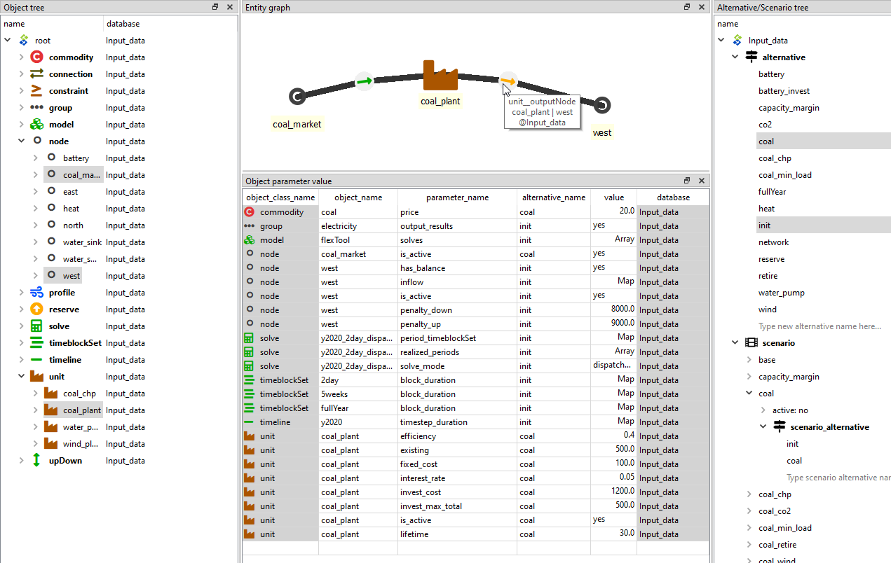

[Install](https://github.com/irena-flextool/flextool/tree/master#irena-flextool) | [Tutorial](https://irena-flextool.github.io/flextool) | [Results](https://irena-flextool.github.io/flextool/results) | [Reference](https://irena-flextool.github.io/flextool/reference) | [Data structure](https://irena-flextool.github.io/flextool/spine_database) | [Spine Toolbox interface](https://irena-flextool.github.io/flextool/spine_toolbox) | [Browser-interface](https://irena-flextool.github.io/flextool/browser_interface)

- [Data structure in Spine databases](#data-structure-in-spine-databases)
- [Database editor in brief](#database-editor-in-brief)

## Data structure in Spine databases

Spine databases use Entity-Attribute-Value with Classes and Relationships (EAV-CR). Entity classes define the categories of data. These can be one-dimensional object classes (e.g. `node` or `unit`) or multi-dimensional relationship classes formed from the object classes (e.g. `unit__node`). Spine Toolbox user can define these classes to suit their modelling needs. For FlexTool the entity classes have been pre-defined. Instead, FlexTool user needs to add the entity instances: objects and relationships that define the particular network structure to be modelled (e.g. *coal_plant* `unit` or *west* `node`). Furthermore, each entity class (object or relationship) can hold only parameters that have been defined for that particular class. Again, FlexTool user does not need to add the parameter types - the user should just add needed parameter values for the entities the user has created.

## Database editor in brief

Spine Toolbox database editor can be used to modify data and to build scenarios. 
The figure below shows an example where parameter data from two `alternatives` 
have been selected for display (in the data table). The object tree on the left 
selects two `nodes` ('coal_market' and 'west') as well as one `unit` ('coal_plant'). 
Consequently, one can use both whole classes and individual entities (members of the classes) as data filters.
The results of this filter are visualized in the graph on top. The mouse pointer is showing a relationship 
entity that connects the 'coal_plant' and its output `node` 'west'. The relationship 
entity is defined in a relationship tree, which is not visible here.

The `scenario` tree (on the right, below the `alternative` tree) shows that 
the 'coal' `scenario` is formed by taking all data from the 'init' `alternative` 
and then all data from the 'coal' `alternative`. If there would be same parameter 
defined for both `scenarios`, then the latter `alternative` would overwrite 
the first `alternative`.

Whenever data is modified, the data is staged in separate database tables (although not directly visible to user). The changes will be applied only once the user `commits` the changes and leaves a commit message to indicate what has been done. The `commit` can be done with ctrl-enter or from the database editor menu (triple bar at top-right).

The database editor menu has options for how to display the data: table view, different pivot views and a graph view. It also contains a tool to delete data (`purge`) and decrease database size by removing unused allocations (`vacuum`). You can also bring back dock windows that have been closed by the user. `History` will show the history of data changes based on the commits made by the user.

More on Spine Database editor in https://spine-toolbox.readthedocs.io/en/latest/spine_db_editor/index.html.
