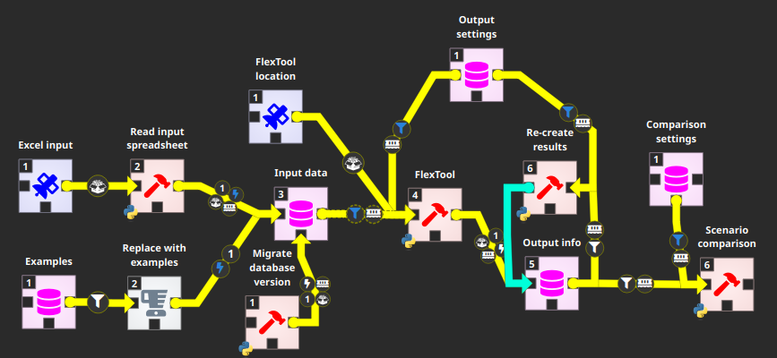

# IRENA FlexTool with Spine Toolbox

Spine Toolbox is an **alternative orchestration interface** for FlexTool. The other, simpler,
interface is the standalone [FlexTool GUI](flextool_gui_interface.md); Spine Toolbox is the
heavier path that wraps FlexTool as one node in a directed-acyclic-graph (DAG) workflow
alongside other tools and data stores. It allows not just to run FlexTool, but also to wrap it 
in more complex workflows (e.g. input data preparation or multi-tool pipeline) - when doing 
that, best to make a separate Spine Toolbox project in another folder or then freeze particular
FlexTool installation to the purpose. The default workflow is part of FlexTool repository 
and you will get merge conflicts if you edit it and then try to pull repository updates.

See [Install with Spine Toolbox](install_toolbox.md) for installation and
[Choosing an interface](interface_overview.md) for the side-by-side comparison with the
FlexTool GUI and the terminal CLI.

## When to choose Spine Toolbox

- You are combining FlexTool with **other Spine-based models** in a single workflow.
- You want a **DAG view** of pre-processing, FlexTool, and post-processing steps, with the
  scenario filter visible on each connection.
- You already use Spine Toolbox for other projects and would rather not run a second
  orchestration GUI alongside it.

For FlexTool-centric work (build scenarios, run them, inspect results in one place), the
[FlexTool GUI](flextool_gui_interface.md) is the recommended choice instead.

## Opening the FlexTool project in Toolbox

The FlexTool repository ships a complete Spine Toolbox project under the `.spinetoolbox/`
directory at the repo root. After installing FlexTool with the `[toolbox]` extra and
launching `spinetoolbox`, use **File → Open project…** and select the **FlexTool root
directory** (not a file inside it). Toolbox reads `.spinetoolbox/project.json` and
reconstructs the workflow, item positions, and connections.



The right-hand panel lists the scenarios discovered in the **Input data** database.
Ticking scenarios there decides which ones run when you execute the workflow; Toolbox can
execute several in parallel as long as the **FlexTool** item is configured to use work
directories.

## The shipped workflow

The v4 workflow has been streamlined from the v3 layout: there is **no longer an
`Export_to_csv` step**, because the v4 engine builds the LP in memory directly from the
Spine database. CSV is now an optional output renderer, not a hand-off format inside the
workflow.

The items that actually ship in `.spinetoolbox/project.json` are:

- **Input data** (Data Store) — the working `.sqlite` database that the FlexTool engine
  reads from. Double-click to open it in the [Spine database editor](spine_database.md).
  Replace the file (via the OS) or repoint the data store to use a different input
  database.
- **Examples** (Data Store) — the read-only `templates/examples.sqlite` shipped with the
  repository. Holds the example scenarios used in the user guide.
- **Replace with examples** (Merger) — copies selected example scenarios from
  **Examples** into **Input data**. The scenario filter on the connection chooses which
  ones are copied. This replaces the older `Init` / `Initialize` pair.
- **Migrate database version** (Tool) — runs the `migrate_database` specification against
  **Input data** to upgrade it to the current FlexTool DB schema version. Use it after
  pulling a new FlexTool version.
- **Excel input** (Data Connection) — points at a spreadsheet (`example_input.xlsx` by
  default) for the spreadsheet-fed flow.
- **Read input spreadsheet** (Tool) — runs the `Read tabular data` specification to import
  the contents of **Excel input** into **Input data**. See
  [Excel interface](excel_interface.md) for the file format.
- **FlexTool location** (Data Connection) — small user-local text file
  (`templates/project_folder.txt`) recording the **project folder** the run
  roots its outputs at. See [Choosing the project folder](#choosing-the-project-folder)
  below. (This replaces the older `flextool_location.txt`; you may rename the
  connection to "Project folder" in the Toolbox GUI if you like.)
- **FlexTool** (Tool) — the solve step. Runs `flextool/cli/cmd_run_flextool.py` (the same
  module as the `flextool-run` console script) as a subprocess. Receives the **Input
  data**, **Output info**, and **Output settings** database URLs as arguments.
- **Output info** (Data Store) — `output_info.sqlite`, where the FlexTool run records
  what it produced (scenario list, output locations).
- **Output settings** (Data Store) — `output_settings.sqlite`, holding render-side
  toggles consumed by **FlexTool** and **Re-create results**.
- **Re-create results** (Tool) — runs the `Process outputs` specification to rebuild
  CSV / Excel / plot renderings from the parquets without re-solving.
- **Comparison settings** (Data Store) — `comparison_settings.sqlite`, configuration for
  the scenario-comparison renderer.
- **Scenario comparison** (Tool) — runs the `scenario comparison` specification to build
  cross-scenario dispatch plots and summary tables from the parquets in **Output info**.

## How FlexTool itself runs

The **FlexTool** workflow item is a Spine Toolbox `Tool` whose specification is a thin
Python entry that calls `flextool/cli/cmd_run_flextool.py` — the same CLI command the
FlexTool GUI and the `flextool-run` console script invoke. Once it starts, no Spine
Toolbox code is in the loop:

- The engine reads inputs from the **Input data** Spine database via `SpineDBBackend`.
- Per-solve preprocessing produces polars frames in memory.
- `polar_high` assembles the LP and HiGHS solves it in-process through `highspy`.
- Solutions are written to parquet under `output_parquet/<scenario>/`, and CSV / Excel /
  PNG renderings are produced from those parquets on top.

There is **no CSV hand-off** between the workflow and the engine. The CSV files in
`solve_data/` only appear when `--debug --csv-dump` is passed, and they are not
load-bearing for anything downstream. See [Architecture](dev/architecture.md) for the
full data-flow diagram.

## Project folders and results

A Toolbox run roots **all** of its outputs — `output_parquet/`, `results.sqlite`,
plots, and the per-project `plot_settings.yaml` — at a **project folder** you
choose, instead of scattering them at the repo root. This makes the Toolbox
track a peer of the [FlexTool GUI](flextool_gui_interface.md): the GUI picks up
Toolbox-produced results, and the Toolbox can run a GUI-made project.

### Choosing the project folder

The project folder is set by editing **one line** in the user-local, gitignored
file `templates/project_folder.txt` (seeded for you by `flextool-update`):

```
projects/Rivendell
```

The path may be **absolute** or **relative to the FlexTool root**. Leave the
file **blank** (or with only comment lines) to send outputs to the FlexTool root
— the old behavior. Because the file is gitignored, editing it never dirties git,
so you switch projects simply by editing this line (and pointing the **Input
data** Data Store at that project's input database).

### Producing the results SpineDB

To get a results SpineDB at `<project>/results.sqlite`, set
`output-spinedb = true` in the **Output settings** database. Both steps honor it,
with **each scenario as a Spine *alternative***:

- The **FlexTool run** writes it directly from the live solve (the usual case —
  the full results land in the DB as the scenarios run).
- The **Re-create results** step (re)builds or augments it by **replaying the
  processed parquet — no re-solve**. Use this to add the SpineDB *afterwards*
  without re-running, or to reduce the scenario set via its alternative filter.
  Whatever else you tick in Output settings (`output-plot` / `output-excel` /
  `output-csv`) Re-create also (re)produces.

Two caveats apply to the **replay** path only:

- The two inflation / discount-factor parameters are omitted (they need the live
  solve); the native run path writes the full set.
- For a *bidirectional* connection the `(source, sink)` byname uses the parquet
  `(node_1, node_2)` geometry; one-directional connections are exact.

### Per-project plot settings

Place a `plot_settings.yaml` in the project folder
(`projects/<Name>/plot_settings.yaml`) to control plot colours and stacking
order. It is now honored automatically by both the per-scenario plots and the
comparison plots in the Toolbox track (previously the Toolbox track silently used
the bundled default).

### FlexTool GUI interoperability

Outputs under `projects/<Name>/output_parquet/<scenario>/` are discovered
automatically by the FlexTool GUI — the folder name is the result identity. A
Toolbox-produced scenario appears under "source 0" in the GUI, which is cosmetic.
Conversely, the Toolbox can run a project built in the GUI: point the **Input
data** Data Store at `projects/<Name>/input_sources/<db>.sqlite` and set
`templates/project_folder.txt` to `projects/<Name>`.

### Migration

There is **no forced migration** — existing workflows keep working, and a blank
`project_folder.txt` reproduces the old repo-root behavior. The only steps:

1. Run `flextool-update` (or `python update_flextool.py`). It seeds
   `templates/project_folder.txt` and refreshes the settings databases (which
   already carry the `output-spinedb` option).
2. **Only if** you forked or customized `.spinetoolbox/project.json`: update the
   FlexTool Tool's command argument from
   `--flextool-location <project>/templates/flextool_location.txt` to
   `--project-folder-file <project>/templates/project_folder.txt`. The legacy
   `--flextool-location` argument still works as a fallback.
3. To direct outputs into a project folder, put its path in
   `templates/project_folder.txt`. To get `results.sqlite`, set
   `output-spinedb=true` in **Output settings**.

## Customising the workflow

To experiment with workflow changes without touching the git-controlled `.spinetoolbox/`
in the FlexTool checkout, create a **new Toolbox project** in a separate folder, then use
the toolbar's **+ From file…** button to add the specifications from
`.spinetoolbox/specifications/` of your FlexTool checkout. The specifications stay in the
FlexTool repository (and update with `git pull` / `update_flextool.py`), while the new
project file lives wherever you put it.

## Limitations

- The shipped workflow is tuned for the **Spine database editor**. One can use the 
  **tabular importer** flow (imports Excel or LibreOffice that use specific format), but be 
  careful to edit only in one place. 
- The Spine Toolbox UI itself sees occasional minor graphical glitches on macOS; the
  underlying FlexTool runs are unaffected.

## See also

- [Install with Spine Toolbox](install_toolbox.md)
- [Choosing an interface](interface_overview.md) — which interface to pick
- [FlexTool GUI](flextool_gui_interface.md) — the primary interface
- [Spine database](spine_database.md) — the SQLite input format
- [Excel interface](excel_interface.md) — the parallel spreadsheet input flow
- [Terminal CLI](terminal_workflow.md) — headless / CI usage
- [Architecture](dev/architecture.md) — what runs under the hood
- [Spine Toolbox User Guide](https://spine-toolbox.readthedocs.io/en/latest/?badge=latest)
