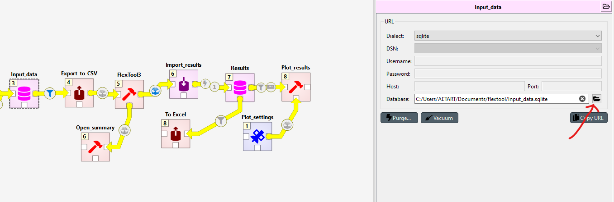
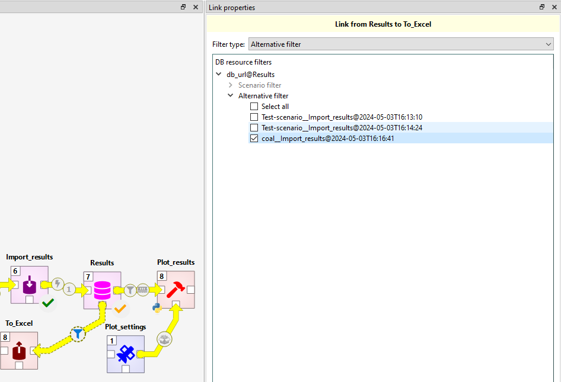
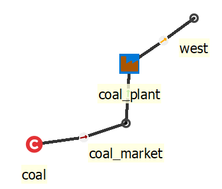

# IRENA FlexTool tutorial

The instructions for installing IRENA FlexTool are at [Interface overview](https://irena-flextool.github.io/flextool/interface_overview).

This user guide will build a small system step-by-step. It assumes you will be using Spine Toolbox as the front-end. If you are using the IRENA FlexTool web-interface, the instructions still apply, but the example figures in this tutorial will not be as helpful. IRENA FlexTool concepts are explained in more depth at [Model Parameters](https://irena-flextool.github.io/flextool/reference). 
Video tutorial for Building a small test system can be watched [here](https://youtu.be/O94zHxYcS94).

This tutorial can be used in couple of different ways - the best way depends on your familiarity with energy system modelling. 

First, **all users who are not familiar with the way FlexTool manages data using Spine Toolbox functionalities**, should read the [page on Spine Toolbox workflow](https://irena-flextool.github.io/flextool/spine_toolbox)

**If you are new to energy system modelling**, it is probably best to try to build the test system yourself while following the tutorial. This will take time and you will have to look up many data items from the ***Init*** database, but it will also force you to learn the concepts. You can also copy-paste data from the ***Init*** database to the ***Input data*** database when writing the data becomes too tedious. Before you start, it can be a good idea to to check the [Essential objects for defining a power/energy system](https://irena-flextool.github.io/flextool/reference) from the beginning of the FlexTool reference page to get an initial understanding of the concepts that will then grow as you learn more. 

**If you have experience in using other types of energy system models** - or perhaps older versions of FlexTool - it can be sufficient to follow the tutorial while also browsing the ***Init*** database using the database editor. Finding the entity classes, entities, and parameter values in the actual database will assist in the learning process. The concept [reference](https://irena-flextool.github.io/flextool/reference) page can also be useful.

Finally, **if you are a really experienced modeller**, it can be enough to check the reference section starting from [Essential objects for defining a power/energy system](https://irena-flextool.github.io/flextool/reference). 

## Building a small test system

The system contains three demand nodes, connections between them, a coal plant and a wind plant to provide the energy to the time varying demand. The system is run over a 48 hour timeline. 

The small system to be built is also directly available in the FlexTool repository (***Init*** SQLite database) and can be opened with the Spine Toolbox database editor. The default workflow for IRENA FlexTool executes the scenarios from the ***Input data*** database (and not from the ***Init*** SQLite database). The ***Input data*** database is empty by default. Therefore, if you want to use directly the contents of the ***Init*** database (instead of building the small system step-by-step), you need to copy them to the ***Input data*** database before running the scenarios in this tutorial. To copy the data, you need to execute the ***Initialize*** workflow item: select the item, press ***Execute selection*** from the toolbar.

Remark: in case you had already populated the ***Input data*** database, you need to delete the data before importing from ***Init*** SQLite database. This can be done with the 'purge' tool from the Database Editor menu: in `purge`, click on both *Select entity and value items*, and *Select scenario items* and then purge.

- [Building a small test system](#building-a-small-test-system)
  - [1st step - a node with no units](#1st-step-a-node-with-no-units)
  - [2nd step - add a coal unit](#2nd-step-add-a-coal-unit)
  - [3rd step - add a wind power plant](#3rd-step-add-a-wind-power-plant)
  - [4th step - add a network](#4th-step-add-a-network)
- [More functionality](#more-functionality)

### Choosing the database

You should have the FlexTool project open in the Spine Toolbox. For this tutorial a database *time_settings_only.sqlite* is provided in the Flextool folder. As the name suggests, it includes the basic time settings needed for running the tool. If you want to know how it is done or how to make your own time settings go to [How-to-create-basic-time-settings](https://irena-flextool.github.io/flextool/how_to#how-to-create-basic-time-settings). How to -section includes simple examples on specific parts of the system. You can explore it after the tutorial.

First make a copy of the database and name it *tutorial.sqlite*. (In the future a new project should be started by copying *time_settings_only.sqlite* or the empty database *input_data_template.sqlite*. Use copy and rename, not directly! Otherwise the progress might be lost when updating the tool, as these databases are part of the repository). Then choose it to be the Input_data:

### 1st step - a node with no units

Open the ***Input data*** database by double-clicking it in the Spine Toolbox workflow.

The test system is built using `alternatives`. Alternative is a subset of the system than one can include to a `scenario` that is optimized by Flextool. For example when adding a wind plant, all the entities related to only the wind plant should be under their own alternative, so that the wind plant can be included or excluded form the `scenario` seamlessly.

- Each step will add a new `alternative`, and the data it contains, on top of the previous ones. 
- The first `alternative` will be called *west* to hold the data for the first `node` in the model.
- The alternative is added in the 'Alternative tree' widget of the 'Spine Database Editor', see figure below.

Next step is to add an entity for the first `node` that will be called *west*. 

- Right-click on the `node` class in the entity tree to select 'Add entities'. 
- Use the dialog to add the *west* `node` and click ok. See the figures below.
- Later other entities will need to be added in the same manner.

 

Next, add the *west* node to be active in the *west* `alternative`. This can be done from the `Entity Alternative` sheet. `Entity Alternative` chooses if the entity is part of the alternative or not. (If you are in 0.7 Toolbox, last update before 5/2024, this does not exist. Instead, use parameter `is_active`: yes)

Then, add parameter data to the newly minted *west* `node`:
*west* node represents the demand in a part of the system.

- First add an `inflow` parameter with negative values to indicate negative inflow, i.e. demand. The `inflow` timeseries are given as a map-type parameter where the first column contains the names of the timesteps and the second column contains the inflow parameter value for that timestep. This is tedious to do by hand, so you can also copy-paste this from the init database.
- There are no electricity generating units and the demand cannot be met by ordinary means. The model will therefore use the upward slack variable and accept the `penalty_up` cost associated with it. This represents the cost of not fulfilling the demand. Also downward `penalty_down` is defined although the model is not using it at this stage. Here values of 9000 and 8000 are used respectively. By default the model uses the value 10 000 for these. Therefore, it is not mandatory to set them, but sometimes these values need to be changed, so understanding how they work is nessesary.
- Penalties and slack variables are tools of linear optimization. They ensure that the problem is feasable at all timesteps even when the in-out-balance of the nodes is violated. If no real penalty values are known, one should just use large enough numbers, so that the system won't prefer penalty to energy production. In the results, you can see at which timesteps the penalties are used.
- The parameter `has_balance` is related to this and should be set to *yes*. It forces the node to have a balance on inflow and outflow. If the demand is not fulfilled, balance is forced by the slack variable that will "create" the energy with the penalty associated with it. 
- All parameters here should be part of the *west* `alternative` (column alternative_name) - they will be used whenever a `scenario` includes the *west* `alternative`. The difference between parameter `alternative` and `Entity Alternative` is that the former includes only that specific parameter and the latter includes the entity itself.

The new entities and parameters have now been staged. Even though it looks like they are in the database, they really are not - they need to be **committed** first. This can be done from the menu of the Database Editor (there is a *commit* command) or by pressing *ctrl-enter*. One should write an informative commit message about the changes that have been made. All commits, and the data they have affected, can be seen later from the *history* menu item.

### Interlude - creating a scenario and running the model

Even though the model is very simple and will not do anything interesting, it can be executed. It is first necessary to create the scenario to be executed. Scenarios are created from `alternatives` in the Scenario tree widget of the Database Editor. In the figure below, a `scenario` called *Test-scenario* is created that should contain `alternatives` *west*, *init* and *init_2day-test* in order to have both a node and a model structure included in the model. The new `scenario` must also be **committed**, before it can be used. A new scenario should be added after each step in the tutorial process. 

Note that the order of the alternatives matters if there are conflicts between the alternatives. The alternatives lower down override the alternatives higher up on the list. In this example the *init* alternative has a full-year timeblock, but because the *init_2day-test* is lower in the scenario tree, the tool uses its `model`-*flextool*: solves parameter which points to the solve to be included in the model (*2day-dispatch*) and only it will be solved.

Same logic will apply if you would add a parameter `inflow` with a value -100 to the *west* node in the alternative `init`. The model would use that instead of the previously set timeseries, because the `init` alternative is lower down in the alternative list of the scenario.

Once the scenario has been committed to the database, it becomes available in the Spine Toolbox workflow. One can select scenarios to be executed from the arrow that leaves the ***Input data*** database. At this point, there will be only the *Test-scenario* available and should be selected. There is also a tool filter with *FlexTool3* pre-selected. This selection needs to be present when running scenarios (it is used to filter the `is_active` entities into the scenario).

Next, we want to run three tools: ***Export_to_CSV*** (that will make input files suitable for FlexTool), ***FlexTool3*** (which is a Python script that calls the FlexTool model generator for each solve) and ***Import_results*** (which will take output files from FlexTool and drop their contents to the ***Results*** database with a particular `alternative` name). First, select the three tools (select with left click while ctrl is pressed or draw an area with ctrl pressed, see figure below). Then, press ***Execute selection*** from the menu bar. The three items should be executed and if all goes well, then green check marks appear on each of the tool once it has finished. You can explore the outputs of each item by selecting the item and looking at the ***Console*** widget window.

 

It is now possible to explore model results for the *Test-scenario* using either the ***Results*** database or the Excel file that can be exported by executing the ***To_Excel*** exporter tool. When doing that, no scenarios should be selected so that the tool will create one Excel file with data from all the alternatives that are in the results database (which will make more sense once there are more scenario results). The generated Excel file can be found by selecting the ***To_Excel*** tool and clicking on the folder icon on top-right of the ***Link properties*** widget window.

By running the `Open_summary` tool, a quick summary csv file will open. This supports only runs with one scenario.

### 2nd step - add a coal unit

In the second step, a coal unit is added. 

- The first thing is to add a new `alternative` *coal* so that all new data added in this step will become part of the *coal* `alternative`.

- Then one needs to add the entities:

  - `unit` *coal_plant*
  - `node` *coal_market* 
  - `commodity` *coal*

The `unit` *coal_plant* and the `node` *coal_market* need to be added to the *coal* alternative from the `Entity Alternative` sheet.

You might be wondering why `commodity` does not need to be added to the `Entity Alternative`. The direct reason is that it is active by default. This can be assumed, since it does not matter if a commodity is in a model, but it is not used. It will be used only if the node using the commodity is included in the model.

- Add entities:

  - `unit__inputNode` *coal_plant, coal_market* to indicate that the *coal_plant* is using inputs from the *coal_market*
  - `unit__outputNode` *coal_plant, west* to indicate that the *coal_plant* will output electricity to the *west* node
  - `commodity__node` *coal, coal_market*

- *coal_plant* needs the following parameters (all set for the *coal* alternative): 

  - `efficiency` (e.g. 0.4 for 40% efficiency)
  - `existing` to indicate the existing capacity in the coal_plant (e.g. 500 MW)

- *coal* `commodity` needs just one parameter for `price` (e.g. 20 €/MWh of fuel)
- All these new parameters should be now part of the *coal* `alternative`. 

To see how the results change due to the coal power plant, make a new scenario *coal* that has the `alternatives` *init*, *init_2day-test*, *west* and *coal*. Run the ***Export_to_CSV***, ***FlexTool3*** and ***Import_results*** to get the results to the ***Results*** database. If you start to get too many result `alternatives` in the ***Results*** database (e.g. if you happen to run the same scenario multiple times), you can delete old ones by removing the unwanted `alternatives` (right-click on the `alternative`) and then **committing** the database.

If you now want to only export the results of the *coal* run to excel, you can do this by choosing the Alternative filter and choosing the run you want to export.

### Interlude - visualizing the system in a graph
In Spine Toolbox, it is possible to visualize your system in a graph, which will show all entities, and how they are related to each other.
To open this visualization mode, open the ***Input data*** database. In the top right corner, click on the menu. Select ***Graph*** in the *View* section.
You may visualize all entities by selecting *root* in the *Entity tree*, or choose specifically the entities you want to display by selecting them in the *Entity tree* (maintain ctrl to select multiple entities).

### 3rd step - add a wind power plant

Next, a wind power plant is added.

- Add a new `alternative` *wind*
- Add entities:

  - `unit` *wind_plant*
  - `profile` *wind_profile* since *wind_plant* does not require a commodity, but instead uses a profile to limit the generation to the available wind.
    
  - `unit__node__profile` *wind_plant, west, wind_profile*
  - `unit__outputNode` *wind_plant, west*

- Add the `unit` *wind_plant* to the *wind* `Entity Alternative`. Again, the `profile` does not need to be added, because it active by default and is only part of the model if connected by a `unit__node__profile` or `node_profile`.

- *wind_plant* needs the following parameters (all set for the *wind* alternative):

  - `conversion_method` to choose a method for the conversion process (in this case *constant_efficiency*)
  - `efficiency` for *wind_plant* should be set to 1.
  - `existing` capacity can be set to 1000 MW

- *wind_profile* needs the the parameter `profile` with a map of values where each time step gets the maximum available capacity factor for that time step (see figure). Again, you can copy this from the init database.
- *wind_plant, west, wind_profile* entity needs a parameter `profile_method` with the choice *upper_limit* selected. This means that the *wind_plant* must generate at or below its capacity factor.

You can now create a new scenario *wind*,  that has the `alternatives` *init*, *west*, *coal* and *wind*.
Remember to **commit**, execute and have a look at the results (there should be no more penalty values used, since the coal and wind plant can together meet the demand in all hours).

### 4th step - add a network

 A *network* `alternative` introduces 

 - two new `nodes` (*east* and *north*) 
 - three new `connections` between `nodes` (*east_north*, *west_east* and *west_north*). 

- All new `nodes` and `connections` are added to the `Entity Alternative` *network*

The new nodes are kept simple: 

- they have a `has_balance` parameter set to *yes* (to force the node to maintain an energy balance)
- they have a constant negative `inflow` (i.e. demand)
- penalty values for violating their energy balance

The three connections have the following parameters:

- they have a `existing` parameter to indicate the existing interconnection capacity between the nodes
- they have a `efficiency` parameter  (e.g. 0.9 for 90% efficiency).

It is also necessary to create the entities `connection__node__node` for *east_north | east | north*, *west_north | west | north* and *west_east | west | east*.

The *north* `node` has the lowest upward penalty, so the model will prefer to use that whenever the *coal* and *wind* units cannot meet all the demand. Sometimes the `existing` capacity of the new `connections` will not be sufficient to carry all the needed power, since both generators are producing to the *west* `node`. **Commit**, execute and explore.

 

### More functionality

Now you have learned how to create a small model. Remember that you can change which database is used as the *Input_data* by clicking the tool icon. You can make a copy of the *Results* database if you want to keep them. The database can also be purged from previous results with the 'purge' tool from the Database Editor menu: in `purge`, click on both *Select entity and value items*, and *Select scenario items* and then purge. Purging by itself will not reduce the file size, you will have to `Vacuum` it to do this.

More instructions on how to create individual parts of the model can be found in the [How to](https://irena-flextool.github.io/flextool/how_to) section.

You can also look and play with the ready scenarios from the init database. Purge *Input_data* and *Initialize* it to copy the init database to it. Purging is done the same way as above: This can be done with the 'purge' tool from the Database Editor menu: in `purge`, click on both *Select entity and value items*, and *Select scenario items* and then purge. Then select the initialize tool and run it to copy the init.sqlite to the input_data.sqlite.
