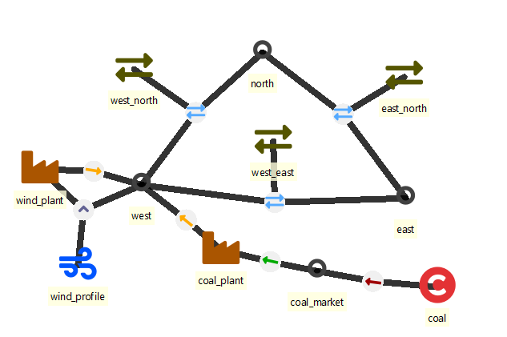
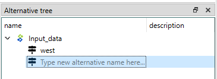
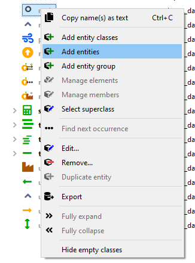
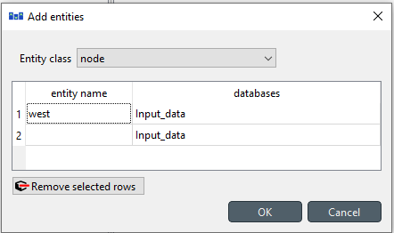
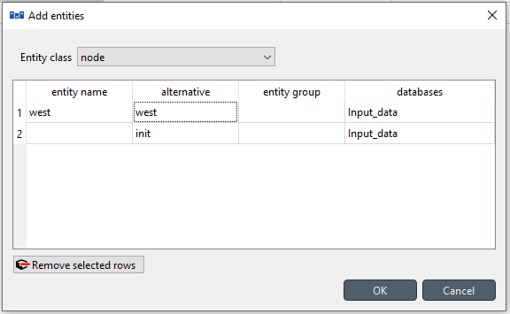
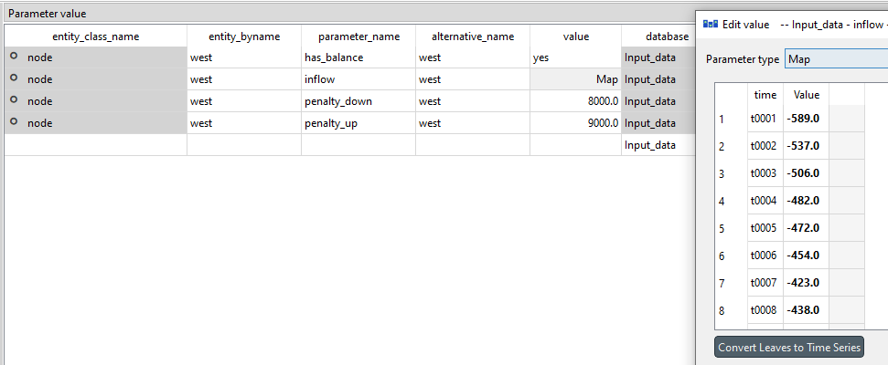
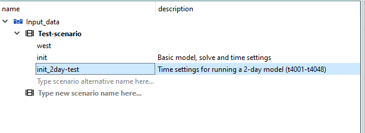
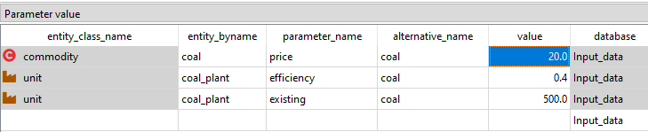
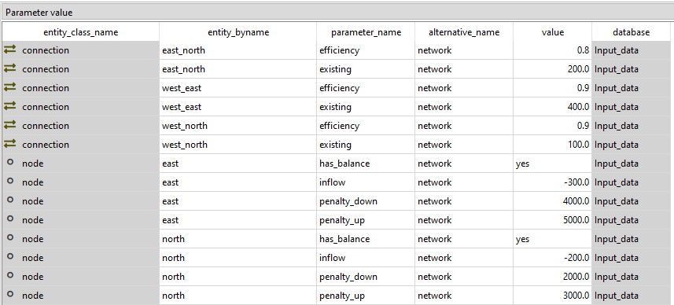

# IRENA FlexTool tutorial

This tutorial walks you through building a small Coal + Wind power system from scratch over a 48-hour timeline. You will create one node at a time, add generation, connect a small transmission network, and watch each change move the dispatch and the slack penalties. Allow roughly 30–45 minutes the first time through. The tutorial assumes the **FlexTool GUI** is already installed — if not, follow [Install with FlexTool GUI](install_gui.md) first.

!!! tip "Alternative execution interface: Spine Toolbox"
    If you prefer the Spine Toolbox workflow editor — typically for integrating FlexTool with other models, or for building custom input / output processing steps — the same Coal + Wind example can be built there. See [Spine Toolbox](spine_toolbox.md) and [Install with Spine Toolbox](install_toolbox.md).

!!! tip "Alternative data editor: Excel / LibreOffice"
    The model data shown in the screenshots below is edited in the **Spine database editor**, which the FlexTool GUI launches when you double-click an input source. If you would rather edit in a spreadsheet, export an Excel template, edit it, and re-import. See [Excel as input/output](excel_interface.md). The modelling concepts in this tutorial are identical regardless of the editor.

!!! note "Just want to see the finished version?"
    The same Coal + Wind scenarios are pre-built in `templates/examples.sqlite`. Add that file as an input source in a fresh project and you can run every scenario in this tutorial without building anything by hand. Building it step-by-step is the recommended way to learn the concepts.

## What you're building

A three-node electricity system with a coal plant, a wind plant, and three interconnections, dispatched over a two-day timeline:



The model grows one **alternative** at a time. Each alternative is a self-contained piece of data — the first node, the coal plant, the wind plant, the three-node network — and scenarios are assembled by stacking alternatives on top of each other. That way every step can be run on its own and compared to the previous one.

## Setting up the project

1. **Launch the FlexTool GUI** from the FlexTool installation directory:

    ```
    python -m flextool.gui
    ```

2. **Create a new project.** From the **Project** menu choose *New project*, name it `tutorial`, and pick a location. The GUI creates `projects/tutorial/` with an empty `input_sources/` folder and a `settings.yaml`.

3. **Add the seed input source.** Click **Add** in the **Input sources** panel and pick `templates/time_settings_only.sqlite` from the FlexTool repository. The GUI copies the file into your project's `input_sources/` (migrating it to the current schema version if needed) and renames it to whatever you typed in the dialog — `tutorial.sqlite` is a good name. This seed database already contains the basic time settings (`init` and `init_2day-test` alternatives) that every FlexTool model needs. See [How to create basic time settings](how_to.md) if you want to know how those were built.

4. **Open the input source in the Spine database editor.** Double-click the `tutorial.sqlite` row in **Input sources** (or select it and press **Edit**). The Spine database editor opens in its own window — that is where the rest of the modelling steps happen.

!!! warning "Always commit before running"
    The Spine database editor stages changes locally until you **commit** them with **Ctrl-Enter** (or *Session → Commit…* from the menu). Until you commit, the FlexTool GUI sees the previous, uncommitted state. Every step below ends with a commit reminder for this reason.

## Step 1 — A node with no units

The first alternative holds nothing but a single demand node. Running it on its own forces the model to fall back on slack variables, which is a useful sanity check: it shows what happens when there is no way to meet demand.

### Add the alternative

In the **Alternative tree** widget of the Spine database editor, add a new alternative called *west*. Every entity and parameter added in this step will live under this alternative, so it can be combined into scenarios cleanly later on.



### Add the entity

Right-click the `node` class in the **Entity tree** and choose **Add entities**. Name the new node *west* and click **OK**.




Open the **Entity Alternative** sheet and activate *west* in the *west* alternative. `Entity Alternative` decides whether an entity is part of a given alternative; parameter rows have their own `alternative_name` column and are independent.



### Add parameters

Set the following parameters on the *west* node, all under the *west* alternative:

- `inflow` — a map of negative values, one per timestep, representing demand. Map-type parameters take a column of timestep names and a column of values. Typing 48 rows by hand is tedious, so the easiest way is to copy the column from `templates/examples.sqlite` (opened as a second input source) and paste it into your *west* node.
- `penalty_up` — e.g. `9000`. Cost of unmet upward demand. If nothing else can meet demand, the model "creates" energy at this price using an upward slack variable.
- `penalty_down` — e.g. `8000`. Cost of unabsorbed downward energy.
- `node_type` — *balance*. Forces the node to maintain an energy balance at every timestep. This is the default, so it can be left blank.

Penalties and slack variables keep the LP feasible at every timestep even when supply and demand do not match. They default to `10000` if not set; you change them only when you have real values, or when you want one node to be preferred over another for last-resort balancing (Step 4 uses this).



Commit with **Ctrl-Enter** and write an informative commit message. Until you commit, the staged changes are invisible to the FlexTool GUI.

### Execute and inspect

Back in the FlexTool GUI:

1. The **Available scenarios** panel rescans `tutorial.sqlite` automatically when you commit, but if it does not, press the **Refresh** button on the **Input sources** panel.
2. You need a scenario to execute. Switch to the Spine database editor's **Scenario tree** and create a scenario *Test-scenario* that includes the alternatives *init*, *init_2day-test*, and *west*, in that order. Commit.

    

3. In **Available scenarios**, check *Test-scenario* and click **Add checked scenarios to the execution list** (or press **F9**).
4. Press **Execute** in the **Execution jobs** panel. The job appears in the queue and produces a parquet result tree under `output_parquet/Test-scenario/` when it finishes.
5. Press **Results viewer** under **Output actions** to inspect dispatch and slack. With no generators present, you should see the upward slack variable taking the full demand at penalty cost.

!!! info "Alternative order matters"
    Lower alternatives override higher ones if they touch the same parameter. *Test-scenario* uses *init_2day-test* below *init*, so the 2-day timeset wins over *init*'s full-year timeset — only 48 hours are solved.

## Step 2 — Add a coal unit

Add a coal power plant feeding the *west* node from a fuel commodity.

### Alternative and entities

Add a new alternative *coal*. Then add the following entities (all under *coal* in **Entity Alternative**, except `commodity` which is active by default):

- `unit` *coal_plant*
- `node` *coal_market*
- `commodity` *coal*
- `unit__inputNode` *coal_plant, coal_market* — the coal plant draws from the coal market.
- `unit__outputNode` *coal_plant, west* — and outputs electricity to *west*.
- `commodity__node` *coal, coal_market* — links the *coal* commodity to its market node.

### Parameters

On *coal_plant* (all under *coal*):

- `efficiency` = `0.4` — 40 % thermal efficiency.
- `existing` = `500` — 500 MW of existing capacity.

On the *coal* commodity:

- `price` = `20` — €/MWh of fuel.



Commit with **Ctrl-Enter**.

### Execute and inspect

In the Spine database editor, create a new scenario *coal* with alternatives *init*, *init_2day-test*, *west*, *coal* (in that order), and commit. In the FlexTool GUI:

1. Check *coal* in **Available scenarios**, **Add checked** to the queue, and **Execute**.
2. Open the **Result viewer** and switch to comparison view (press **X**) to compare *Test-scenario* and *coal* side by side. The coal scenario should show the coal plant doing most of the work and the upward slack falling sharply.

## Step 3 — Add a wind plant

Wind generation is modelled as a unit whose maximum output follows a time-varying profile instead of consuming a fuel.

### Alternative and entities

Add alternative *wind*, then:

- `unit` *wind_plant*
- `profile` *wind_profile* — time-varying capacity factor (no commodity).
- `unit__node__profile` *wind_plant, west, wind_profile* — binds the profile to this unit and node.
- `unit__outputNode` *wind_plant, west*

Add *wind_plant* to **Entity Alternative** under *wind*. `profile` is active by default and is only used when bound through `unit__node__profile` (or `node_profile`).

### Parameters

On *wind_plant* (under *wind*):

- `conversion_method` = *constant_efficiency*.
- `efficiency` = `1`.
- `existing` = `1000` — 1000 MW of installed capacity.

On *wind_profile*:

- `profile` — a map of hourly capacity factors (0–1). Copy this from `templates/examples.sqlite` the same way you copied the `inflow` map.

On the *wind_plant, west, wind_profile* relationship:

- `profile_method` = *upper_limit*. The wind plant generates at or below the available capacity factor every hour.


Commit with **Ctrl-Enter**.

### Execute and inspect

Create a scenario *wind* with alternatives *init*, *init_2day-test*, *west*, *coal*, *wind*. Commit, then in the FlexTool GUI check *wind*, queue it, and execute. With both coal and wind feeding *west*, the upward slack should be zero across all 48 hours — demand is fully met. In the Result viewer, compare *coal* against *wind* to see the wind output displacing coal during high-wind hours.

## Step 4 — Connect a three-node network

The final alternative widens the model from one demand node to three, joined by three transmission connections of different capacities.

### Alternative and entities

Add alternative *network*. Then add:

- `node` *east*
- `node` *north*
- `connection` *east_north*
- `connection` *west_east*
- `connection` *west_north*
- `connection__node__node` *east_north, east, north*
- `connection__node__node` *west_east, west, east*
- `connection__node__node` *west_north, west, north*

Activate all five new entities (two nodes + three connections) in **Entity Alternative** under *network*.

### Parameters

On *east* and *north* (under *network*):

- `node_type` = *balance* (default, can be left blank).
- `inflow` — a constant negative number (demand).
- `penalty_up`, `penalty_down` — give *north* a lower `penalty_up` than *east* and *west*. The optimiser will then prefer to shed unmet demand at *north* whenever the transmission network is not strong enough to deliver everything, which makes the comparison plots more interesting.

On each of the three connections (under *network*):

- `existing` — interconnection capacity (MW). Pick values that occasionally constrain flow.
- `efficiency` = `0.9` — 90 % transfer efficiency.



Commit with **Ctrl-Enter**.

### Execute and inspect

Create a scenario *network* with alternatives *init*, *init_2day-test*, *west*, *coal*, *wind*, *network*. Commit, queue, execute. In the Result viewer:

- Switch to comparison view and tick all four executed scenarios — *Test-scenario*, *coal*, *wind*, *network*.
- Watch the dispatch shift: with a wider network and the *north* node providing the cheapest slack, you should see the model trade off transmission limits against slack penalty at *north*.
- Use **PgUp / PgDn** to flick through plot variants (per-node, per-unit, totals).

!!! tip "Enable Auto-generate for repeated runs"
    The **Auto-generate** checkboxes in the main GUI window (Scenario plots, Comparison plots, Comparison Excel, …) run the same outputs automatically after each execution. Tick them once and every subsequent **Execute** produces a fresh set of PNGs and workbooks without further input.

## Inspecting and comparing results

The **Result viewer** reads parquet directly, so it is always live: changing scenarios or plots does not re-run anything.

- **Single-scenario view** (press **V**) — one scenario at a time. Use **↑ / ↓** to navigate plots; **← / →** cycles through variants of the current plot.
- **Comparison view** (press **X**) — Ctrl-A to select all rows, Alt-↑ / Alt-↓ to reorder. Useful for stacking *Test-scenario*, *coal*, *wind*, *network* and reading the convergence story top to bottom.

For static output:

- **Output actions → Re-plot scenarios** writes PNGs into `output_plots/<scenario>/`.
- **Output actions → Scenarios to Excel** dumps the parquet to `output_excel/<scenario>.xlsx`.
- **Output actions → Comparison to Excel** writes a cross-scenario workbook into `output_plot_comparisons/`.
- The same generators run automatically after each execution if their **Auto-generate** checkboxes are ticked.

If you want PNGs trimmed to a specific window of the timeline, open **Png settings** in the top-right of the central column and set **Start timestep** and **Duration**. The Result viewer ignores these settings — they only constrain pre-rendered PNGs.

## Cleaning up between runs

After many iterations the database accumulates committed alternatives and scenarios you no longer need. Two cleanup paths:

- **Inside the Spine database editor**: *Session → Purge…*. Tick *Select scenario items* (and *Select entity and value items* if you want a full reset), purge, then *Session → Vacuum* to actually shrink the file.
- **From the FlexTool GUI**: select an executed scenario and click **Delete selected results irrevocably** to drop its parquet plus any derived plots / Excel / CSV from disk. Input data is untouched.

## More functionality

You now have the building blocks: alternatives, scenarios, units, profiles, connections, commodities, and the FlexTool GUI's execute / inspect loop.

- [How-to recipes](how_to.md) — small focused examples (storage, investments, reserves, CHP, hydro, …).
- [Model parameters](reference.md) — every entity class and parameter, organised by topic.
- [Model outputs](results.md) — what every parquet column means.
- [Advanced concepts](advanced_concepts.md) — stochastics, representative periods, multi-year solves.
- [FlexTool GUI](flextool_gui_interface.md) — full reference for the GUI used here.
- [Spine database](spine_database.md) — the data model behind the database editor.
